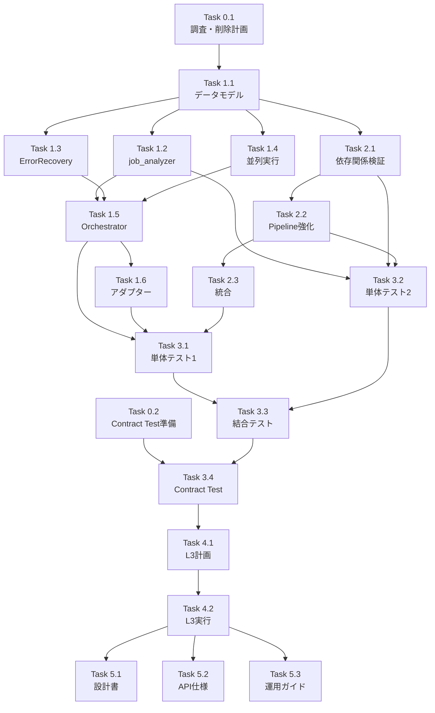

# 作業計画書: Issue #359 - jobGeneratorV2 3フェーズ統一ID方式リファクタリング

## Issue概要
**Issue番号**: #359
**サイズ**: L（大規模リファクタリング）
**作業見積**: 40-48時間
**優先度**: High
**依存Issue**:
- #342（TaskIdMapping, SkipAggregator - 本Issueで削除予定）
- #357（JSON Schema SSoT - 連携必要）
- #358（body_templateバリデーション - 活用）

**概要**: jobGeneratorV2を4フェーズから3フェーズに削減し、統一ID（task_id）による一貫したデータ管理を実現する大規模リファクタリング。

---

## 詳細タスク分解

### Phase 0: 準備・調査（4-6時間）

#### Task 0.1: 現状コードベースの調査とデッドコード特定
- 使用されていないクラス・関数の特定
- TaskIdMapping, SkipAggregatorの依存関係調査
- デッドコードパスの検出
- 削除計画の作成（依存関係を考慮した削除順序）
- **成果物**: 不要コード一覧（Excel/Markdown）

#### Task 0.2: Contract Test環境の準備
- pytest-contractsの導入
- テスト環境の設定
- サンプルContract Testの作成
- **成果物**: Contract Test設定ファイル

### Phase 1: コア実装（16-20時間）

#### Task 1.1: データモデル定義
- UnifiedTaskIdentifierクラスの実装
- TaskResult/ParallelExecutionResultクラスの実装
- PhaseError/RecoveryAction関連クラスの実装
- **ファイル**: `types.py`（新規または大幅修正）

#### Task 1.2: job_analyzerノードの実装
- TASK_BREAKDOWN + INTERFACE_DESIGNの統合
- 1回のLLM呼び出しで完結する実装
- システムプロンプトの作成
- **ファイル**: `nodes/job_analyzer.py`

#### Task 1.3: ErrorRecoveryManagerの実装
- フェーズ別エラー契約の実装
- リトライ戦略の実装
- エスカレーション機能の実装
- **ファイル**: `error_recovery.py`（新規）

#### Task 1.4: 並列実行メカニズムの実装
- `parallel_workflow_generation`関数の実装
- ParallelExecutionErrorAggregatorの実装
- セマフォによる並列度制御
- **ファイル**: `parallel_executor.py`（新規）

#### Task 1.5: JobGenerationOrchestratorのリファクタリング
- 3フェーズ構造への変更
- 904行→約300行への削減
- インデックスベースルックアップの排除
- **ファイル**: `orchestrator.py`

#### Task 1.6: アダプター層の更新
- 既存APIとの互換性維持
- 入出力形式の変換処理
- **ファイル**: `adapter.py`

### Phase 2: バリデーション実装（8-10時間）

#### Task 2.1: TaskDependencyValidatorの実装
- 循環参照の検出
- 存在しないtask_idへの参照チェック
- **ファイル**: `validators/task_dependency.py`（新規）

#### Task 2.2: ValidationPipelineの強化
- StructuralValidator
- SchemaValidator
- SemanticValidator
- **ファイル**: `validators/pipeline.py`

#### Task 2.3: バリデーションの統合
- 各フェーズへのバリデーション組み込み
- エラーハンドリングとの連携

### Phase 3: テスト実装（8-10時間）

#### Task 3.1: 単体テスト（コア機能）
- UnifiedTaskIdentifierのテスト
- ErrorRecoveryManagerのテスト
- 並列実行メカニズムのテスト
- **カバレッジ目標**: 90%以上

#### Task 3.2: 単体テスト（ノード・バリデーター）
- job_analyzerのテスト
- 各バリデーターのテスト
- **モック**: LLM呼び出しをモック化

#### Task 3.3: 結合テスト
- E2Eシナリオテスト（5種類以上）
- エラーリカバリーテスト
- 並列実行の動作確認
- **カバレッジ目標**: 50%以上

#### Task 3.4: Contract Test実装
- expertAgent ↔ graphAiServer間のContract Test
- スキーマ互換性の検証
- **ファイル**: `tests/contract/test_taskflow_contract.py`

### Phase 4: 受入テスト（L3ローカル実行）（3-4時間）【必須】

#### Task 4.1: L3受入テスト計画
- テストシナリオの作成
- 検証項目の定義
- **ファイル**: `tests/acceptance/test_issue_359_acceptance.py`

#### Task 4.2: L3受入テスト実行
- 実際のLLM APIを使用したテスト
- 5つの異なるユースケースの検証
- パフォーマンス測定（LLM呼び出し回数、実行時間）

### Phase 5: ドキュメント・移行（4時間）

#### Task 5.1: アーキテクチャ設計書作成
- 3フェーズ統一ID方式の詳細
- グラフ構造図（Mermaid）
- データフロー図
- **ファイル**: `docs/design/job-generator-v2-architecture.md`

#### Task 5.2: API仕様書更新
- Job Generator V2 APIの仕様
- リクエスト/レスポンス例
- **ファイル**: `expertAgent/docs/API_REFERENCE.md`

#### Task 5.3: 運用・開発ガイド作成
- 監視項目、トラブルシューティング
- 開発環境構築、デバッグ方法
- **ファイル**: `docs/ops/job-generator-operations.md`

---

## タスク依存関係



---

## 作業スケジュール（5-6日間想定）

### Day 1（8時間）
- **午前**: Task 0.1 - 現状調査とデッドコード特定（4h）
- **午後**: Task 0.2 - Contract Test準備（2h）、Task 1.1 - データモデル定義（2h）

### Day 2（8時間）
- **午前**: Task 1.2 - job_analyzerノード（4h）
- **午後**: Task 1.3 - ErrorRecoveryManager（4h）

### Day 3（8時間）
- **午前**: Task 1.4 - 並列実行メカニズム（4h）
- **午後**: Task 1.5 - Orchestratorリファクタリング開始（4h）

### Day 4（8時間）
- **午前**: Task 1.5 - Orchestratorリファクタリング完了（2h）、Task 1.6 - アダプター更新（2h）
- **午後**: Task 2.1-2.3 - バリデーション実装（4h）

### Day 5（8時間）
- **終日**: Task 3.1-3.4 - テスト実装（8h）

### Day 6（8時間）
- **午前**: Task 4.1-4.2 - L3受入テスト（4h）
- **午後**: Task 5.1-5.3 - ドキュメント作成（4h）

---

## チェックポイント

| タイミング | 確認事項 | 対応 |
|-----------|---------|------|
| Phase 0完了時 | 削除対象コードの影響範囲確認 | 削除計画の見直し |
| Phase 1完了時 | 3フェーズ構造の動作確認 | 結合テストで検証 |
| Phase 2完了時 | バリデーションの網羅性確認 | 追加バリデーターの検討 |
| Phase 3完了時 | カバレッジ目標達成確認 | 不足テストの追加 |
| Phase 4完了時 | 性能目標達成確認（LLM呼び出し6回） | 性能チューニング |

---

## リスクと対策

| リスク | 発生確率 | 影響 | 対策 |
|-------|---------|------|------|
| 既存機能への影響 | 中 | 高 | アダプター層での互換性維持、段階的移行 |
| 性能劣化 | 低 | 中 | 並列実行の最適化、プロファイリング実施 |
| LLM出力の品質低下 | 中 | 高 | プロンプト調整、複数モデルでのテスト |
| Contract Test失敗 | 中 | 中 | graphAiServer側との事前調整 |
| デッドコード削除の誤り | 低 | 高 | 十分な調査期間、段階的削除 |

---

## 成果物チェックリスト

### コード
- [ ] `types.py` - データモデル定義
- [ ] `nodes/job_analyzer.py` - 統合されたLLMノード
- [ ] `error_recovery.py` - エラーリカバリー管理
- [ ] `parallel_executor.py` - 並列実行メカニズム
- [ ] `orchestrator.py` - リファクタリング済み（約300行）
- [ ] `adapter.py` - 更新済みアダプター
- [ ] `validators/task_dependency.py` - 依存関係バリデーター
- [ ] `validators/pipeline.py` - 強化されたパイプライン

### テスト
- [ ] `tests/unit/test_unified_task_identifier.py`
- [ ] `tests/unit/test_error_recovery.py`
- [ ] `tests/unit/test_parallel_executor.py`
- [ ] `tests/unit/test_job_analyzer.py`
- [ ] `tests/unit/test_validators.py`
- [ ] `tests/integration/test_job_generation_e2e.py`
- [ ] `tests/contract/test_taskflow_contract.py`
- [ ] `tests/acceptance/test_issue_359_acceptance.py`

### ドキュメント
- [ ] `docs/design/job-generator-v2-architecture.md`
- [ ] `expertAgent/docs/API_REFERENCE.md`（更新）
- [ ] `expertAgent/docs/llm-prompts.md`
- [ ] `docs/ops/job-generator-operations.md`
- [ ] `expertAgent/docs/development-guide.md`（更新）
- [ ] `dev-reports/feature/issue/359/deletion-report.md`（削除コード一覧）

---

## L3受入テスト計画【必須セクション】

### テスト環境準備

```bash
# サービス起動確認
curl -sf http://localhost:8004/health && echo "✅ ExpertAgent healthy"
curl -sf http://localhost:8005/health && echo "✅ GraphAiServer healthy"
```

### テストケース1: 基本的なジョブ生成（PDFアップロード）

```bash
# 正常系テスト - PDFをGoogle Driveにアップロード
curl -s -X POST http://localhost:8004/api/v1/job-generator \
  -H "Content-Type: application/json" \
  -d '{
    "user_requirement": "PDFファイルをGoogle Driveにアップロードして完了通知をSlackに送る",
    "max_retry": 3
  }' | jq .

# 期待値:
# - status: "success"
# - task_breakdown数: 2
# - LLM呼び出し回数: 3（job_analyzer: 1回, workflow_generator: 2回）
```

### テストケース2: 複雑なワークフロー（5タスク）

```bash
# 5タスクのワークフロー生成
curl -s -X POST http://localhost:8004/api/v1/job-generator \
  -H "Content-Type: application/json" \
  -d '{
    "user_requirement": "CSVファイルを読み込んで、データを集計し、グラフを作成してレポートを生成し、メールで送信する",
    "max_retry": 3
  }' | jq .

# 期待値:
# - task_breakdown数: 5
# - LLM呼び出し回数: 6（job_analyzer: 1回, workflow_generator: 5回）
# - 並列実行による処理時間短縮（従来比50%以下）
```

### テストケース3: エラーリカバリー検証

```bash
# 意図的に複雑な要求でリトライを発生させる
curl -s -X POST http://localhost:8004/api/v1/job-generator \
  -H "Content-Type: application/json" \
  -d '{
    "user_requirement": "存在しないAPIを呼び出して結果を処理する",
    "max_retry": 5
  }' | jq .

# 期待値:
# - リトライが発生
# - ErrorRecoveryManagerが適切に動作
# - 最終的に要求緩和またはエラー終了
```

### テストケース4: Contract Test検証

```bash
# 生成されたワークフローがgraphAiServerで実行可能か検証
WORKFLOW_ID=$(curl -s -X POST http://localhost:8004/api/v1/job-generator \
  -H "Content-Type: application/json" \
  -d '{
    "user_requirement": "テキストファイルを読み込んで内容を要約する",
    "max_retry": 3
  }' | jq -r '.task_breakdown[0].workflow_id')

# GraphAiServerでの実行確認
curl -s -X POST http://localhost:8005/api/v1/taskflow/execute \
  -H "Content-Type: application/json" \
  -d "{
    \"workflow_id\": \"$WORKFLOW_ID\",
    \"inputs\": {\"file_path\": \"test.txt\"}
  }" | jq .
```

### テストケース5: パフォーマンス測定

```bash
# 実行時間とLLM呼び出し回数の測定
time curl -s -X POST http://localhost:8004/api/v1/job-generator \
  -H "Content-Type: application/json" \
  -d '{
    "user_requirement": "毎日の売上データを集計してレポートを作成し、管理者にメール送信する",
    "max_retry": 3
  }' | jq '.evaluation_result.metrics'

# Langfuseダッシュボードで確認:
# - トレース構造の確認
# - LLM呼び出し回数の確認
# - トークン使用量の確認
```

---

## Definition of Done

- [ ] Phase 0: 不要コードの削除が完了
- [ ] すべてのタスクが完了
- [ ] 単体テストカバレッジ90%以上
- [ ] 結合テストカバレッジ50%以上
- [ ] Contract Test全パス
- [ ] L3受入テスト全パス
- [ ] CI/CDグリーン（Ruff、MyPyエラーゼロ）
- [ ] コードレビュー承認
- [ ] orchestrator.pyが300行以下
- [ ] LLM呼び出し回数が6回以下（5タスクの場合）
- [ ] 実行時間が従来比50%以下
- [ ] ドキュメント作成完了
- [ ] Langfuseでトレース構造が正しく記録される

---

**作成日**: 2026年1月14日
**作成者**: Claude Opus 4.5
**Issue**: #359
**推定作業時間**: 40-48時間（5-6日）