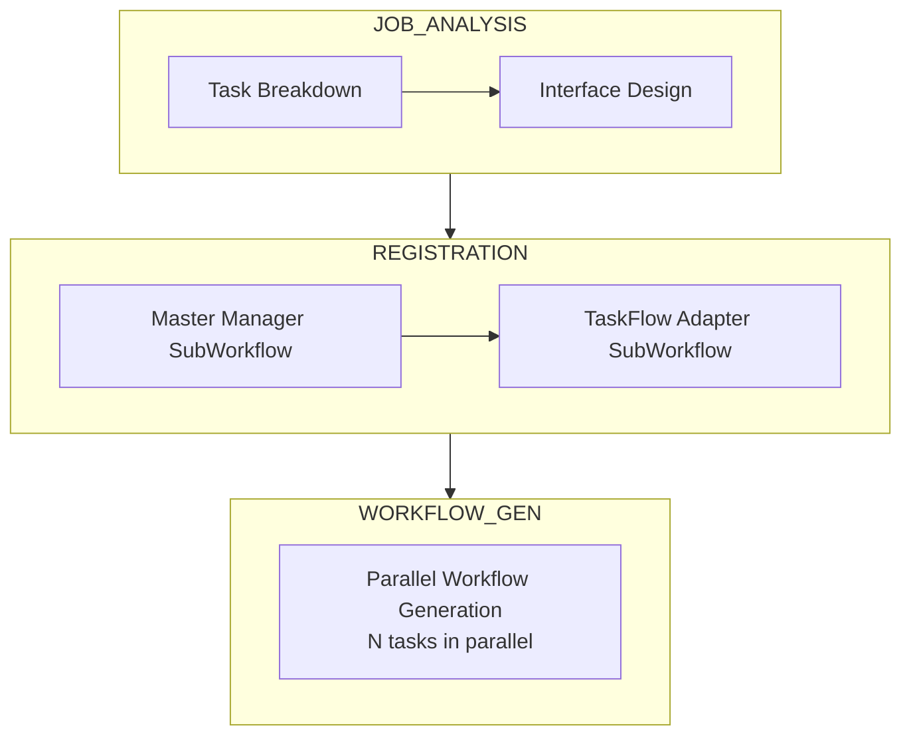
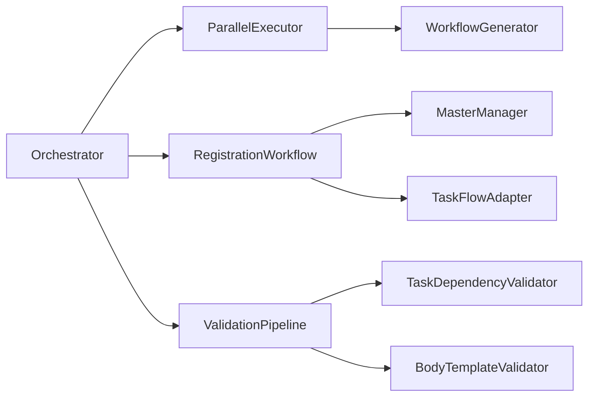
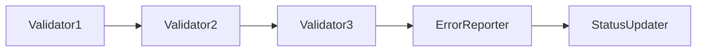
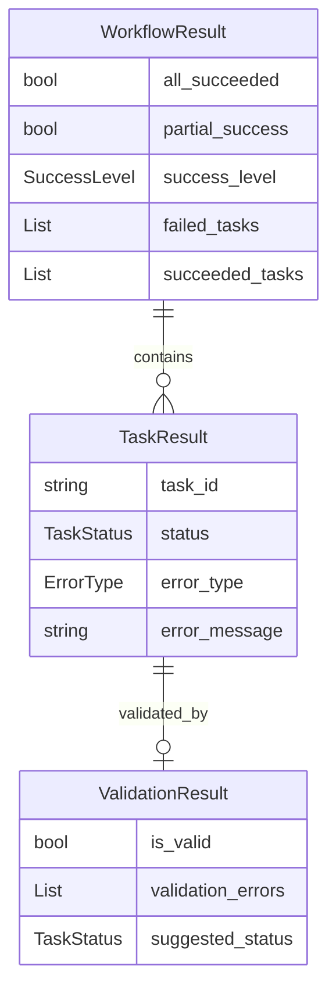

# Issue #360: 成功条件・エラー伝播の論理的整合性修正 - 設計方針書

## 1. 概要

### 1.1 背景

Issue #359でコンポーネント間論理的整合性点検を実施し、3件のCRITICAL/HIGH問題を修正したが、実際のJob Generate実行で新たなエラーが発生した。調査の結果、成功条件とエラー伝播に関する論理的整合性の問題が発見された。

### 1.2 問題の核心

現在のjobGeneratorV2では、コンポーネント間で成功条件の定義が異なっており、部分成功を全体成功として扱う箇所と、全件成功を要求する箇所が混在している。これにより、ワークフロー実行時に矛盾が発生し、予期しないエラーが発生している。

### 1.3 設計方針の目的

- 成功条件の定義を統一し、コンポーネント間の整合性を確保
- エラー伝播の仕組みを明確化し、適切なエラーハンドリングを実現
- 部分成功の扱いを一貫させ、予測可能な動作を保証

## 2. 現状のアーキテクチャ分析

### 2.1 3フェーズアーキテクチャ



### 2.2 コンポーネント間の依存関係



### 2.3 現状の問題点

| コンポーネント | 成功条件の定義 | 問題点 |
|---------------|---------------|--------|
| Orchestrator | partial_success OR all_succeeded | 1件でも成功すれば全体成功扱い |
| RegistrationWorkflow | len(updated_task_masters) > 0 | 部分成功を許容 |
| WorkflowRegistrar | len(updated_task_masters) > 0 | 部分成功を許容 |
| Orchestrator(old) | 全件完了が必須 | 新旧で成功条件が矛盾 |
| ValidationPipeline | is_valid: bool | エラーがログのみで伝播されない |

## 3. 設計パターン

### 3.1 成功条件の階層化パターン

既存のコードベースで使用されているPhaseStatusパターンを拡張し、より詳細な成功状態を定義：

```python
class SuccessLevel(Enum):
    """成功レベルの定義"""
    FULL = "full"              # 全タスク成功
    PARTIAL = "partial"        # 一部成功・一部失敗
    PARTIAL_BLOCKED = "partial_blocked"  # 一部成功・後続ブロック
    NONE = "none"             # 全失敗
```

### 3.2 エラー伝播の Chain of Responsibility パターン

現在のValidationPipelineパターンを強化し、エラーが確実に伝播される仕組みを実装：



### 3.3 部分成功の Strategy パターン

フェーズごとに異なる部分成功戦略を適用：

```python
class PartialSuccessStrategy(Protocol):
    def evaluate(self, results: List[TaskResult]) -> SuccessLevel:
        """部分成功の評価戦略"""
        ...

class StrictStrategy(PartialSuccessStrategy):
    """全件成功を要求"""

class ThresholdStrategy(PartialSuccessStrategy):
    """閾値以上の成功で部分成功とする"""

class CriticalPathStrategy(PartialSuccessStrategy):
    """クリティカルパスの成功で部分成功とする"""
```

## 4. 技術選定

| カテゴリ | 選定技術 | 選定理由 | 既存との整合性 |
|---------|---------|---------|---------------|
| エラー型定義 | 既存のErrorType enum | 拡張不要、定義の修正のみ | ✓ 完全互換 |
| 成功条件管理 | SuccessLevel enum (新規) | 既存のPhaseStatus拡張 | ✓ 既存パターンの拡張 |
| バリデーション | 既存のValidationPipeline | 伝播機能の追加のみ | ✓ インターフェース維持 |
| 状態管理 | 既存のTask.status | 値の拡張（検証失敗状態追加） | ✓ 後方互換性維持 |

## 5. データモデル設計

### 5.1 成功条件の統一モデル



### 5.2 TaskStatus の拡張

既存のTaskStatus enumに検証失敗状態を追加：

```python
class TaskStatus(str, Enum):
    # 既存
    PENDING = "PENDING"
    IN_PROGRESS = "IN_PROGRESS"
    COMPLETED = "COMPLETED"
    FAILED = "FAILED"

    # 新規追加
    VALIDATION_FAILED = "VALIDATION_FAILED"  # 検証失敗
    BLOCKED = "BLOCKED"                      # 依存関係でブロック
```

## 6. API設計

### 6.1 内部API変更

#### ValidationPipeline の強化

```python
class ValidationPipeline:
    async def validate(
        self,
        data: Any,
        context: ValidationContext,
        update_task_status: bool = True  # 新規パラメータ
    ) -> ValidationResult:
        """
        バリデーション実行

        Args:
            data: 検証対象データ
            context: 検証コンテキスト
            update_task_status: タスクステータスを更新するか

        Returns:
            ValidationResult: 検証結果（suggested_status含む）
        """
```

#### Orchestrator の成功条件統一

```python
class Orchestrator:
    def _evaluate_success(
        self,
        workflow_result: WorkflowExecutionResult,
        strategy: PartialSuccessStrategy = None
    ) -> Tuple[bool, SuccessLevel]:
        """
        成功評価の統一インターフェース

        Args:
            workflow_result: ワークフロー実行結果
            strategy: 部分成功評価戦略（省略時はフェーズごとのデフォルト）

        Returns:
            (success: bool, level: SuccessLevel)
        """
```

### 6.2 外部API（変更なし）

Job Generator APIの外部インターフェースは変更なし。内部的な成功条件の統一により、より予測可能な動作を実現。

## 7. セキュリティ設計

### 7.1 エラー情報の露出制限

- 内部エラーの詳細はログに記録し、外部APIレスポンスには汎用メッセージを返却
- 検証エラーは具体的な修正方法を含むが、内部実装の詳細は隠蔽

### 7.2 部分成功時の情報開示

- 成功したタスクと失敗したタスクを明確に区別
- 失敗理由は適切に抽象化してユーザーに提示

## 8. パフォーマンス設計

### 8.1 検証処理の最適化

- ValidationPipelineは既存の並列実行を維持
- タスクステータス更新は必要な場合のみ実行

### 8.2 エラーリトライの最適化

- ErrorTypeの正確な分類により、不要なリトライを削減
- FATAL/COMPATIBILITYエラーは即座に失敗として処理

## 9. 設計上の決定事項とトレードオフ

### 9.1 成功条件の厳格化

**決定**: RegistrationフェーズとWorkflow Generationフェーズで全件成功を要求

**理由**:
- 部分的な登録/生成は後続処理で問題を引き起こす
- 失敗したタスクの再実行が困難

**トレードオフ**:
- 一時的なエラーでも全体が失敗する → エラーリトライ機構で緩和
- 処理時間が長くなる可能性 → 並列実行で緩和

### 9.2 ValidationPipelineのエラー伝播

**決定**: 検証エラーをタスクステータスに反映

**理由**:
- 現状はログのみで、後続処理が失敗原因を把握できない
- デバッグが困難

**トレードオフ**:
- 既存のインターフェース変更 → オプショナルパラメータで後方互換性維持
- 処理の複雑化 → 責任の明確化で対応

### 9.3 ErrorType の再分類

**決定**: BodyTemplateValidatorのエラーをVALIDATIONからCOMPATIBILITYに変更

**理由**:
- 現在のVALIDATIONはリトライ可能を示唆するが、実際はFATAL
- エラータイプと実際の挙動を一致させる

**代替案との比較**:
- 新しいErrorType追加 → 既存のCOMPATIBILITYで十分
- VALIDATIONの定義変更 → 他の箇所への影響大

## 10. 実装優先度

### P0（必須 - 即時修正）

1. **workflow.py:491** - 成功条件を全件成功に修正
2. **workflow_registrar.py:436** - 同様に修正
3. **orchestrator.py:271** - 成功評価ロジックの統一

### P1（推奨 - 短期修正）

4. **orchestrator.py:252-263** - ValidationPipelineエラーの伝播
5. **master_manager.py:335-359** - ErrorTypeの修正
6. **workflow.py:349-355** - 登録例外の適切な処理

### P2（検討 - 中期改善）

7. TaskStatus拡張による詳細な状態追跡
8. PartialSuccessStrategyの実装
9. 統一エラーレポーティング機構

## 11. リスクと対策

### 11.1 後方互換性リスク

**リスク**: 成功条件の変更により、既存の動作に依存したコードが影響を受ける

**対策**:
- 段階的な移行（ログ出力→警告→エラー）
- フィーチャーフラグによる切り替え
- 十分な結合テスト

### 11.2 パフォーマンスリスク

**リスク**: 全件成功要求により、処理時間が増加

**対策**:
- タイムアウト設定の見直し
- 進捗状況の可視化
- 部分的な結果の中間保存

## 12. 参照ドキュメント

- [expertAgent API Reference](../../../expertAgent/docs/API_REFERENCE.md)
- [Job Generation Workflow Specification](../../../docs/spec/job-generation-workflow.md)
- [Service Dependencies](../../../docs/arch/service-dependencies.md)
- Issue #359: jobGeneratorV2 3-phase unified ID refactoring

## 13. まとめ

本設計方針は、jobGeneratorV2の成功条件とエラー伝播の論理的整合性を確保することを目的としている。既存のアーキテクチャとデザインパターンを尊重しながら、最小限の変更で問題を解決する方針を採用した。

実装は優先度に従って段階的に進め、各段階でテストによる検証を行う。これにより、安定性を保ちながら問題を解決することが可能となる。