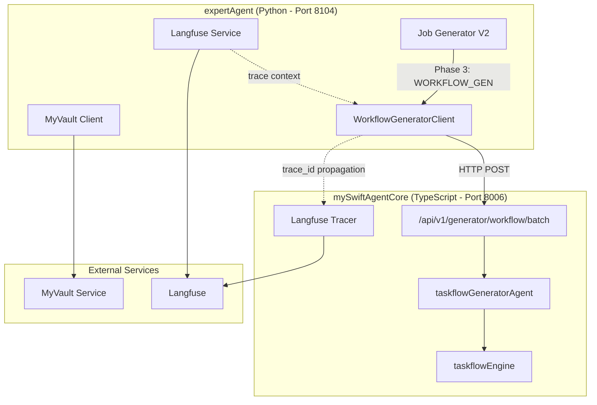

# Issue #361: 設計方針書 - expertAgent/mySwiftAgentCore連携実装

## 概要

expertAgentのjobGeneratorV2（Python）からmySwiftAgentCore（TypeScript）のワークフロー生成APIを呼び出すための連携実装を行い、旧WORKFLOW_GEN実装を削除する。

---

## 1. アーキテクチャ設計

### 1.1 システム構成図



### 1.2 レイヤー構成

| レイヤー | expertAgent | mySwiftAgentCore |
|---------|------------|------------------|
| **プレゼンテーション層** | FastAPI endpoints | Hono routes |
| **ビジネスロジック層** | JobGeneratorV2 orchestrator | taskflowGeneratorAgent |
| **インフラストラクチャ層** | WorkflowGeneratorClient (NEW) | CapabilityExecutor |
| **外部連携層** | MyVaultClient, LangfuseService | SecretManager, LangfuseTracer |

---

## 2. 技術選定

### 2.1 技術選定マトリクス

| カテゴリ | 選定技術 | 選定理由 | 既存との整合性 |
|---------|---------|---------|---------------|
| **HTTPクライアント** | httpx | expertAgent標準、context manager対応 | MyVaultClient同様のパターン |
| **非同期処理** | asyncio | Python標準、既存コードベースと整合 | 全expertAgentサービスで使用 |
| **エラーハンドリング** | 独自例外クラス | 詳細なエラー情報の伝播 | ServiceError継承パターン |
| **タイムアウト** | httpx.Timeout | 設定可能、段階的タイムアウト | MyVaultClient（10秒固定）より柔軟 |
| **リトライ** | tenacity | 高度なリトライ戦略 | 既存RetryConfigを拡張 |
| **トレーシング** | Langfuse SDK | 分散トレーシング対応 | LangfuseService利用 |

### 2.2 技術選定根拠

**httpxの採用理由**：
- expertAgent内で既に使用実績あり（MyVaultClient）
- 非同期処理をネイティブサポート
- タイムアウト、リトライの柔軟な設定
- Context managerによるリソース管理

**tenacityの採用理由**：
- 指数バックオフ、ジッター対応
- 条件付きリトライ（特定のHTTPステータスのみ）
- デコレータベースの簡潔な実装
- 既存のRetryConfigを拡張可能

---

## 3. 設計パターン

### 3.1 採用する設計パターン

| パターン | 適用箇所 | 理由 |
|----------|---------|------|
| **Repository パターン** | WorkflowGeneratorClient | API呼び出しの抽象化 |
| **Context Manager パターン** | HTTPクライアント管理 | リソースの確実な解放 |
| **Builder パターン** | リクエスト構築 | 複雑なリクエストの段階的構築 |
| **Adapter パターン** | 型変換層 | Python/TypeScript間の型マッピング |

### 3.2 既存パターンとの整合性

**MyVaultClientパターンの踏襲**：
```python
# 既存のMyVaultClientパターン
class MyVaultClient:
    def __init__(self, base_url: str, service_name: str, token: str):
        self.headers = {
            "X-Service": service_name,
            "X-Token": token,
        }
        self.client = httpx.Client(base_url=base_url, headers=self.headers, timeout=10.0)

# 新規WorkflowGeneratorClientで同様のパターンを採用
class WorkflowGeneratorClient:
    def __init__(self, base_url: str, timeout: float = 30.0):
        self.client = httpx.AsyncClient(base_url=base_url, timeout=timeout)
```

---

## 4. データモデル設計

### 4.1 リクエスト/レスポンス型定義

```python
from typing import TypedDict, Literal, Optional, Dict, List
from dataclasses import dataclass

# リクエスト型定義
@dataclass
class TaskInterface:
    input: Dict[str, str]
    output: Dict[str, str]

@dataclass
class TaskRequest:
    task_id: str
    name: str
    description: str
    interface: TaskInterface

@dataclass
class TraceContext:
    trace_id: str
    parent_span_id: Optional[str] = None

@dataclass
class GenerationOptions:
    max_concurrency: int = 10
    timeout_per_task_ms: int = 180000  # 3分
    validate_before_register: bool = True

@dataclass
class BatchWorkflowGenerationRequest:
    tasks: List[TaskRequest]
    capabilities: List[Dict[str, Any]]  # Capability型は既存のものを使用
    project_id: str
    options: Optional[GenerationOptions] = None
    trace_context: Optional[TraceContext] = None

# レスポンス型定義
class WorkflowStatus(str, Enum):
    SUCCESS = "success"
    FAILED = "failed"

# 全体ステータス（部分成功対応）
class BatchStatus(str, Enum):
    SUCCESS = "success"
    PARTIAL_SUCCESS = "partial_success"
    FAILED = "failed"

@dataclass
class WorkflowResult:
    workflow_name: str
    status: WorkflowStatus
    error: Optional[str] = None

@dataclass
class FailedTask:
    task_id: str
    error_type: str
    message: str

class RecoverySuggestion(str, Enum):
    ROLLBACK_TO_ANALYSIS = "ROLLBACK_TO_ANALYSIS"
    RELAXATION = "RELAXATION"

@dataclass
class BatchWorkflowGenerationResponse:
    """バッチワークフロー生成レスポンス（部分成功対応）"""
    status: BatchStatus  # 3値ステータス: success/partial_success/failed
    success: bool  # 後方互換性のため維持（status != 'failed'）
    workflows: Dict[str, WorkflowResult]
    failed_tasks: Optional[List[FailedTask]] = None
    recovery_suggestion: Optional[RecoverySuggestion] = None

    # 統計情報
    total_tasks: int = 0
    succeeded_tasks: int = 0
    failed_task_count: int = 0

    @classmethod
    def from_results(
        cls,
        workflows: Dict[str, WorkflowResult],
        failed_tasks: Optional[List[FailedTask]] = None,
        recovery_suggestion: Optional[RecoverySuggestion] = None
    ) -> "BatchWorkflowGenerationResponse":
        """結果からレスポンスを構築（ステータス自動計算）"""
        succeeded = sum(1 for w in workflows.values() if w.status == WorkflowStatus.SUCCESS)
        failed = len(failed_tasks) if failed_tasks else 0
        total = len(workflows) + failed

        # ステータス判定ロジック
        if failed == 0 and succeeded > 0:
            status = BatchStatus.SUCCESS
        elif succeeded > 0 and failed > 0:
            status = BatchStatus.PARTIAL_SUCCESS
        else:
            status = BatchStatus.FAILED

        return cls(
            status=status,
            success=(status != BatchStatus.FAILED),
            workflows=workflows,
            failed_tasks=failed_tasks,
            recovery_suggestion=recovery_suggestion,
            total_tasks=total,
            succeeded_tasks=succeeded,
            failed_task_count=failed,
        )
```

### 4.2 エラー型定義

```python
class WorkflowGeneratorError(ServiceError):
    """ワークフロー生成エラーの基底クラス"""
    pass

class WorkflowGeneratorTimeoutError(WorkflowGeneratorError):
    """タイムアウトエラー"""
    def __init__(self, url: str, timeout_ms: int):
        super().__init__(
            f"Request to {url} timed out after {timeout_ms}ms",
            context={"url": url, "timeout_ms": timeout_ms}
        )

class WorkflowGeneratorHTTPError(WorkflowGeneratorError):
    """HTTPエラー"""
    def __init__(self, status_code: int, message: str, details: Optional[Dict] = None):
        super().__init__(
            f"HTTP {status_code}: {message}",
            context={"status_code": status_code, "details": details}
        )

class WorkflowGeneratorValidationError(WorkflowGeneratorError):
    """バリデーションエラー"""
    pass
```

---

## 5. API設計

### 5.1 HTTPクライアント抽象化（インターフェース）

```python
from abc import ABC, abstractmethod
from typing import Protocol, TypeVar, Generic

# プロトコルによるHTTPクライアントの抽象化
class IHttpClient(Protocol):
    """HTTPクライアントインターフェース（テスト時のモック容易性向上）"""

    async def post(
        self,
        url: str,
        json: Dict[str, Any],
        headers: Optional[Dict[str, str]] = None,
        timeout: Optional[float] = None
    ) -> "HttpResponse":
        """POST リクエストを送信"""
        ...

    async def close(self) -> None:
        """リソースを解放"""
        ...

@dataclass
class HttpResponse:
    """HTTPレスポンス抽象化"""
    status_code: int
    json_data: Dict[str, Any]
    headers: Dict[str, str]
    elapsed_ms: float  # レイテンシ計測用


class HttpxClientAdapter:
    """httpxを使用したIHttpClient実装"""

    def __init__(self, base_url: str, timeout: float = 30.0):
        self._client = httpx.AsyncClient(base_url=base_url, timeout=timeout)

    async def post(
        self,
        url: str,
        json: Dict[str, Any],
        headers: Optional[Dict[str, str]] = None,
        timeout: Optional[float] = None
    ) -> HttpResponse:
        start_time = time.perf_counter()
        response = await self._client.post(
            url,
            json=json,
            headers=headers,
            timeout=timeout
        )
        elapsed_ms = (time.perf_counter() - start_time) * 1000

        return HttpResponse(
            status_code=response.status_code,
            json_data=response.json(),
            headers=dict(response.headers),
            elapsed_ms=elapsed_ms
        )

    async def close(self) -> None:
        await self._client.aclose()
```

### 5.2 メトリクス収集インターフェース

```python
from dataclasses import dataclass, field
from typing import Callable, Awaitable

@dataclass
class RequestMetrics:
    """リクエストメトリクス"""
    url: str
    method: str
    status_code: int
    latency_ms: float
    request_size_bytes: int
    response_size_bytes: int
    success: bool
    error_type: Optional[str] = None
    timestamp: datetime = field(default_factory=datetime.utcnow)


class IMetricsCollector(Protocol):
    """メトリクス収集インターフェース（将来のPrometheus連携用）"""

    def record_request(self, metrics: RequestMetrics) -> None:
        """リクエストメトリクスを記録"""
        ...

    def increment_counter(self, name: str, labels: Dict[str, str]) -> None:
        """カウンターをインクリメント"""
        ...


class NoOpMetricsCollector:
    """デフォルト実装（何もしない）"""

    def record_request(self, metrics: RequestMetrics) -> None:
        pass

    def increment_counter(self, name: str, labels: Dict[str, str]) -> None:
        pass


class LoggingMetricsCollector:
    """ログ出力によるメトリクス収集（開発/デバッグ用）"""

    def __init__(self, logger: logging.Logger):
        self._logger = logger

    def record_request(self, metrics: RequestMetrics) -> None:
        self._logger.info(
            "HTTP %s %s -> %d (%.2fms)",
            metrics.method,
            metrics.url,
            metrics.status_code,
            metrics.latency_ms,
        )

    def increment_counter(self, name: str, labels: Dict[str, str]) -> None:
        self._logger.debug("Counter %s: %s", name, labels)
```

### 5.3 サーキットブレーカー設計

```python
from enum import Enum
from dataclasses import dataclass
import asyncio

class CircuitState(Enum):
    """サーキットブレーカー状態"""
    CLOSED = "closed"       # 正常（リクエスト許可）
    OPEN = "open"           # 遮断（リクエスト拒否）
    HALF_OPEN = "half_open" # 試行中（一部リクエスト許可）


@dataclass
class CircuitBreakerConfig:
    """サーキットブレーカー設定"""
    failure_threshold: int = 5        # 連続失敗でOPENに遷移
    success_threshold: int = 3        # HALF_OPENで連続成功でCLOSEDに遷移
    timeout_seconds: float = 30.0     # OPENからHALF_OPENへの待機時間
    excluded_exceptions: tuple = ()   # サーキットブレーカー対象外の例外


class CircuitBreaker:
    """サーキットブレーカー実装"""

    def __init__(self, config: CircuitBreakerConfig = CircuitBreakerConfig()):
        self._config = config
        self._state = CircuitState.CLOSED
        self._failure_count = 0
        self._success_count = 0
        self._last_failure_time: Optional[float] = None
        self._lock = asyncio.Lock()

    @property
    def state(self) -> CircuitState:
        return self._state

    async def call(self, func: Callable[..., Awaitable[T]], *args, **kwargs) -> T:
        """サーキットブレーカーを通してfuncを呼び出す"""
        async with self._lock:
            self._check_state_transition()

            if self._state == CircuitState.OPEN:
                raise CircuitBreakerOpenError(
                    f"Circuit breaker is OPEN. Wait {self._config.timeout_seconds}s"
                )

        try:
            result = await func(*args, **kwargs)
            await self._on_success()
            return result
        except self._config.excluded_exceptions:
            raise
        except Exception as e:
            await self._on_failure()
            raise

    def _check_state_transition(self) -> None:
        """状態遷移をチェック"""
        if self._state == CircuitState.OPEN:
            if self._last_failure_time and \
               (time.time() - self._last_failure_time) >= self._config.timeout_seconds:
                self._state = CircuitState.HALF_OPEN
                self._success_count = 0

    async def _on_success(self) -> None:
        async with self._lock:
            if self._state == CircuitState.HALF_OPEN:
                self._success_count += 1
                if self._success_count >= self._config.success_threshold:
                    self._state = CircuitState.CLOSED
                    self._failure_count = 0
            else:
                self._failure_count = 0

    async def _on_failure(self) -> None:
        async with self._lock:
            self._failure_count += 1
            self._last_failure_time = time.time()
            if self._state == CircuitState.HALF_OPEN:
                self._state = CircuitState.OPEN
            elif self._failure_count >= self._config.failure_threshold:
                self._state = CircuitState.OPEN


class CircuitBreakerOpenError(WorkflowGeneratorError):
    """サーキットブレーカーがOPEN状態のエラー"""
    pass
```

### 5.4 WorkflowGeneratorClient 完全版

```python
class WorkflowGeneratorClient:
    """mySwiftAgentCoreのワークフロー生成APIクライアント（完全版）"""

    def __init__(
        self,
        base_url: str = "http://localhost:8006",
        timeout: float = 30.0,
        max_retries: int = 3,
        retry_delay: float = 1.0,
        # 認証ヘッダー拡張性対応
        auth_headers: Optional[Dict[str, str]] = None,
        # 依存性注入対応
        http_client: Optional[IHttpClient] = None,
        metrics_collector: Optional[IMetricsCollector] = None,
        circuit_breaker: Optional[CircuitBreaker] = None,
    ):
        """
        Args:
            base_url: mySwiftAgentCoreのベースURL
            timeout: リクエストタイムアウト（秒）
            max_retries: 最大リトライ回数
            retry_delay: リトライ間隔（秒）
            auth_headers: 認証用ヘッダー（将来のAPIキー/mTLS対応）
            http_client: HTTPクライアント（テスト時のモック注入用）
            metrics_collector: メトリクス収集（Prometheus連携用）
            circuit_breaker: サーキットブレーカー（障害時の自動遮断用）
        """
        self.base_url = base_url
        self.timeout = timeout
        self.max_retries = max_retries
        self.retry_delay = retry_delay
        self.auth_headers = auth_headers or {}

        # 依存性注入（デフォルト実装を提供）
        self._http_client = http_client
        self._own_client = http_client is None  # 自前で作成したかどうか
        self._metrics = metrics_collector or NoOpMetricsCollector()
        self._circuit_breaker = circuit_breaker or CircuitBreaker()

    async def __aenter__(self) -> "WorkflowGeneratorClient":
        """非同期コンテキストマネージャー開始"""
        if self._own_client:
            self._http_client = HttpxClientAdapter(
                base_url=self.base_url,
                timeout=self.timeout
            )
        return self

    async def __aexit__(self, exc_type, exc_val, exc_tb):
        """非同期コンテキストマネージャー終了"""
        if self._own_client and self._http_client:
            await self._http_client.close()

    async def generate_workflows(
        self,
        tasks: List[TaskDefinition],
        capabilities: List[Capability],
        project_id: str,
        trace_id: Optional[str] = None,
        parent_span_id: Optional[str] = None,
        options: Optional[GenerationOptions] = None
    ) -> BatchWorkflowGenerationResponse:
        """
        mySwiftAgentCoreのワークフロー生成APIを呼び出す

        Args:
            tasks: 生成対象のタスク定義リスト
            capabilities: 利用可能なCapabilityリスト
            project_id: プロジェクトID
            trace_id: Langfuseトレース用ID
            parent_span_id: 親スパンID
            options: 生成オプション

        Returns:
            BatchWorkflowGenerationResponse: 生成結果

        Raises:
            WorkflowGeneratorTimeoutError: タイムアウト時
            WorkflowGeneratorHTTPError: HTTPエラー時
            WorkflowGeneratorValidationError: バリデーションエラー時
            CircuitBreakerOpenError: サーキットブレーカーがOPEN状態時
        """
        # サーキットブレーカーを通して実行
        return await self._circuit_breaker.call(
            self._execute_request,
            tasks=tasks,
            capabilities=capabilities,
            project_id=project_id,
            trace_id=trace_id,
            parent_span_id=parent_span_id,
            options=options,
        )

    @retry(
        stop=stop_after_attempt(3),
        wait=wait_exponential(multiplier=1, min=1, max=10),
        retry=retry_if_exception_type((httpx.TimeoutException, httpx.NetworkError)),
        reraise=True
    )
    async def _execute_request(
        self,
        tasks: List[TaskDefinition],
        capabilities: List[Capability],
        project_id: str,
        trace_id: Optional[str] = None,
        parent_span_id: Optional[str] = None,
        options: Optional[GenerationOptions] = None
    ) -> BatchWorkflowGenerationResponse:
        """実際のHTTPリクエストを実行（リトライ対象）"""
        url = "/api/v1/generator/workflow/batch"

        # リクエストボディ構築
        request_body = self._build_request_body(
            tasks, capabilities, project_id, trace_id, parent_span_id, options
        )

        # ヘッダー構築（認証ヘッダー + トレースヘッダー）
        headers = {
            "Content-Type": "application/json",
            **self.auth_headers,
        }
        if trace_id:
            headers["X-Trace-Id"] = trace_id
        if parent_span_id:
            headers["X-Parent-Span-Id"] = parent_span_id

        try:
            response = await self._http_client.post(
                url=url,
                json=request_body,
                headers=headers,
            )

            # メトリクス記録
            self._metrics.record_request(RequestMetrics(
                url=url,
                method="POST",
                status_code=response.status_code,
                latency_ms=response.elapsed_ms,
                request_size_bytes=len(json.dumps(request_body)),
                response_size_bytes=len(json.dumps(response.json_data)),
                success=200 <= response.status_code < 300,
            ))

            return self._parse_response(response)

        except httpx.TimeoutException as e:
            self._metrics.increment_counter(
                "workflow_generator_timeout_total",
                {"url": url}
            )
            raise WorkflowGeneratorTimeoutError(url, int(self.timeout * 1000))
        except httpx.HTTPStatusError as e:
            raise WorkflowGeneratorHTTPError(
                e.response.status_code,
                str(e),
                details={"url": url}
            )

    def _build_request_body(self, ...):
        """リクエストボディを構築"""
        # 実装詳細は実装時に記載
        pass

    def _parse_response(self, response: HttpResponse) -> BatchWorkflowGenerationResponse:
        """レスポンスをパース"""
        # 実装詳細は実装時に記載
        pass
```

### 5.5 エンドポイント設計

**呼び出し先API**:
```
POST /api/v1/generator/workflow/batch
Content-Type: application/json
```

**ヘッダー**:
- `Content-Type: application/json`
- `X-Trace-Id: {trace_id}` （Langfuseトレース用、オプション）
- `X-Parent-Span-Id: {parent_span_id}` （親スパンID、オプション）

---

## 6. セキュリティ設計

### 6.1 認証方式

**サービス間通信**:
- mySwiftAgentCoreは内部サービスのため、現状認証なし
- 将来的にはサービス間認証（mTLS or APIキー）を検討

### 6.2 データ保護

**機密情報の扱い**:
- Capabilityのシークレット情報はMyVault経由で取得
- ログ出力時はシークレット情報をマスク
- エラーレスポンスにシークレットを含めない

---

## 7. パフォーマンス設計

### 7.1 タイムアウト戦略

| タイムアウト種別 | 値 | 用途 |
|----------------|---|------|
| **接続タイムアウト** | 5秒 | TCP接続確立 |
| **読み取りタイムアウト** | 30秒 | レスポンス受信 |
| **全体タイムアウト** | 180秒 | タスクごとの生成完了 |

### 7.2 並行処理とリトライ

**並行処理**:
- mySwiftAgentCore側で並行生成（max_concurrency設定）
- クライアント側は単一リクエストで複数タスクを送信

**リトライ戦略**:
```python
@retry(
    stop=stop_after_attempt(3),
    wait=wait_exponential(multiplier=1, min=1, max=10),
    retry=retry_if_exception_type((httpx.TimeoutException, httpx.NetworkError)),
    reraise=True
)
async def _send_request(self, ...):
    # リトライ可能なネットワークエラーのみリトライ
    # 4xx系エラーはリトライしない
```

### 7.3 キャッシング

- ワークフロー生成結果はmySwiftAgentCore側でメモリ登録
- クライアント側でのキャッシュは実装しない（生成は冪等でない）

---

## 8. 設計上の決定事項とトレードオフ

### 8.1 採用した設計と理由

| 決定事項 | 理由 | トレードオフ |
|---------|------|------------|
| **httpxの採用** | expertAgent標準、非同期サポート | aiohttp等の選択肢を排除 |
| **単一エンドポイント呼び出し** | シンプルな実装、エラーハンドリング容易 | 個別タスクの細かな制御不可 |
| **Context Managerパターン** | リソースの確実な解放 | with文が必須になる |
| **型ヒント重視** | 型安全性、IDE支援 | 実行時の柔軟性低下 |

### 8.2 代替案との比較

**HTTPクライアント選択肢**:

| ライブラリ | メリット | デメリット | 採用/不採用 |
|-----------|---------|-----------|------------|
| **httpx** | 非同期対応、既存利用 | - | ✅ 採用 |
| aiohttp | 高性能、WebSocket対応 | 学習コスト | ❌ |
| requests | シンプル、安定 | 非同期非対応 | ❌ |

**エラーハンドリング方式**:

| 方式 | メリット | デメリット | 採用/不採用 |
|-----|---------|-----------|------------|
| **例外ベース** | Pythonic、既存と統一 | - | ✅ 採用 |
| Result型 | 明示的エラー処理 | Python非標準 | ❌ |

### 8.3 想定されるリスクと対策

| リスク | 影響度 | 発生確率 | 対策 |
|--------|--------|----------|------|
| **mySwiftAgentCore障害** | 高 | 低 | サーキットブレーカー検討 |
| **ネットワーク分断** | 高 | 低 | リトライ機構、タイムアウト設定 |
| **大量タスクでのメモリ逼迫** | 中 | 中 | バッチサイズ制限 |
| **Langfuseトレース分断** | 低 | 中 | trace_id伝播の徹底 |

---

## 9. 移行計画

### 9.1 段階的移行

**Phase 1: 新規実装（並行稼働）**
1. WorkflowGeneratorClient実装
2. orchestrator.pyで切り替え可能に
3. 環境変数で新旧切り替え

**Phase 2: 検証と切り替え**
1. ステージング環境でA/Bテスト
2. パフォーマンス比較
3. 本番環境で段階的切り替え

**Phase 3: 旧コード削除**
1. 全環境で新実装に切り替え完了確認
2. 旧workflow_genディレクトリ削除
3. types_old.py依存解消

### 9.2 ロールバック計画

- Phase 1では環境変数で即座に旧実装に戻せる
- Phase 2では機能フラグで制御
- Phase 3実行前に完全バックアップ

---

## 10. 参照ドキュメント

### 10.1 参照した既存実装

- `/expertAgent/core/myvault_client.py` - HTTPクライアントパターン
- `/expertAgent/app/services/langfuse_service.py` - トレーシング実装
- `/expertAgent/app/exceptions/service_exceptions.py` - 例外階層
- `/mySwiftAgentCore/src/api/routes/generator.ts` - API仕様
- `/mySwiftAgentCore/src/taskflowGeneratorAgent/types/` - 型定義

### 10.2 関連Issue

- #359: 3フェーズ統一ID方式（設計基盤）
- #360: 成功条件・エラー伝播修正
- #383: TaskFlow生成・実行の安定化（受入テスト完了）

---

## 11. 実装チェックリスト

### Phase 1実装時の確認事項

- [ ] WorkflowGeneratorClientの単体テスト（カバレッジ90%以上）
- [ ] 非同期コンテキストマネージャーの動作確認
- [ ] タイムアウト処理の動作確認
- [ ] リトライ機構の動作確認
- [ ] Langfuseトレースの連続性確認
- [ ] エラーレスポンスの適切な変換

### 品質基準

- [ ] 型ヒントの完全性（mypy通過）
- [ ] docstringの記載
- [ ] ログ出力（デバッグ可能性）
- [ ] エラーメッセージの明確性

---

## 12. 今後の拡張性

### 12.1 将来的な機能追加

- **ストリーミングレスポンス**: 長時間処理の進捗通知
- **WebSocket通信**: リアルタイム進捗更新
- **バルクヘッド**: リソース分離による安定性向上
- **メトリクス収集**: Prometheus連携

### 12.2 スケーラビリティ

- 接続プーリングによる効率化
- HTTP/2対応による多重化
- サービスメッシュ統合（Istio等）

---

*作成日: 2025-01-20*
*作成者: Claude (Anthropic)*