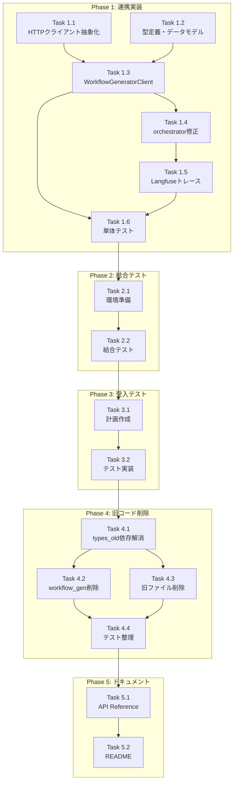

# Issue #361: 作業計画書

## Issue: feat(expertAgent): mySwiftAgentCore連携実装と旧WORKFLOW_GENコード削除
**Issue番号**: #361
**サイズ**: L（大規模）
**作業見積**: 40時間（5人日）
**優先度**: High
**依存Issue**: なし（#359, #360, #383は完了済み）

---

## 1. 詳細タスク分解

### Phase 1: 連携実装（実装・単体テスト）

#### Task 1.1: HTTPクライアント抽象化層実装
**所要時間**: 4時間
**作業内容**:
- `expertAgent/aiagent/clients/interfaces/http_client.py` 作成
  - IHttpClient Protocol定義
  - HttpResponse データクラス定義
  - HttpxClientAdapter実装
- `expertAgent/aiagent/clients/interfaces/metrics.py` 作成
  - IMetricsCollector Protocol定義
  - RequestMetrics データクラス定義
  - NoOpMetricsCollector実装
  - LoggingMetricsCollector実装
- `expertAgent/aiagent/clients/interfaces/circuit_breaker.py` 作成
  - CircuitState Enum定義
  - CircuitBreakerConfig定義
  - CircuitBreaker実装

#### Task 1.2: 型定義とデータモデル
**所要時間**: 3時間
**作業内容**:
- `expertAgent/aiagent/clients/types/workflow_generator.py` 作成
  - BatchStatus Enum（success/partial_success/failed）
  - WorkflowStatus Enum
  - TaskInterface, TaskRequest データクラス
  - TraceContext, GenerationOptions データクラス
  - BatchWorkflowGenerationResponse データクラス（from_results含む）
- エラー型定義
  - WorkflowGeneratorError基底クラス
  - WorkflowGeneratorTimeoutError
  - WorkflowGeneratorHTTPError
  - WorkflowGeneratorValidationError
  - CircuitBreakerOpenError

#### Task 1.3: WorkflowGeneratorClient本体実装
**所要時間**: 5時間
**作業内容**:
- `expertAgent/aiagent/clients/workflow_generator_client.py` 作成
  - __init__（認証ヘッダー、依存性注入対応）
  - 非同期コンテキストマネージャー実装
  - generate_workflows() メインメソッド
  - _execute_request() （リトライデコレータ付き）
  - _build_request_body() （リクエスト構築）
  - _parse_response() （レスポンスパース、部分成功対応）
  - メトリクス記録の統合
  - サーキットブレーカーの統合

#### Task 1.4: orchestrator.py修正
**所要時間**: 3時間
**作業内容**:
- `_execute_workflow_gen()` メソッドの修正
  - parallel_workflow_generation呼び出しを置換
  - WorkflowGeneratorClientインスタンス化
  - エラーハンドリングの調整
  - recovery_suggestion処理の実装
- 環境変数による新旧切り替え機能（移行期間用）
  - `USE_MYSWIFTAGENT_CORE_WORKFLOW_GEN` フラグ

#### Task 1.5: Langfuseトレース連携実装
**所要時間**: 2時間
**作業内容**:
- orchestrator.py でのtrace_id/parent_span_id伝播
- WorkflowGeneratorClientでのヘッダー設定
- トレース継続性の確保

#### Task 1.6: 単体テスト作成
**所要時間**: 6時間
**作業内容**:
- `tests/unit/test_clients/test_workflow_generator_client.py`
  - 正常系テスト（成功、部分成功）
  - 異常系テスト（タイムアウト、HTTPエラー）
  - リトライ動作テスト
  - サーキットブレーカー動作テスト
  - メトリクス記録テスト
  - 認証ヘッダー拡張性テスト
- `tests/unit/test_clients/test_interfaces/`
  - HTTPクライアントモックテスト
  - メトリクスコレクターテスト
  - サーキットブレーカーテスト

### Phase 2: 結合テスト

#### Task 2.1: 結合テスト環境準備
**所要時間**: 2時間
**作業内容**:
- テスト用mySwiftAgentCoreモックサーバー作成
- Docker Compose設定（テスト環境）

#### Task 2.2: 結合テスト実装
**所要時間**: 4時間
**作業内容**:
- `tests/integration/test_workflow_generator_integration.py`
  - E2E API呼び出しテスト
  - Langfuseトレース伝播テスト
  - エラー復旧シナリオテスト
  - 部分成功シナリオテスト

### Phase 3: L3受入テスト

#### Task 3.1: 受入テスト計画作成
**所要時間**: 2時間
**作業内容**:
- `dev-reports/feature/issue/361/acceptance-plan.md` 作成
- テストケース定義
- テストデータ準備

#### Task 3.2: 受入テスト実装
**所要時間**: 3時間
**作業内容**:
- `tests/acceptance/test_issue_361_acceptance.py` 作成
  - サービス起動確認
  - 実際のワークフロー生成テスト
  - E2Eシナリオテスト

### Phase 4: 旧コード削除

#### Task 4.1: types_old.py依存解消
**所要時間**: 3時間
**作業内容**:
- types.pyへの型定義移行
  - RetryState移行（context.py用）
  - PhaseStatus移行（protocols.py用）
  - RelaxationSuggestion移行（recovery.py用）
- 各ファイルのimport文修正
  - context.py
  - progress.py
  - protocols.py
  - recovery.py
- types.pyからのre-export削除

#### Task 4.2: workflow_gen削除
**所要時間**: 1時間
**作業内容**:
- `workflows/workflow_gen/` ディレクトリ削除
- 関連import文のクリーンアップ

#### Task 4.3: 旧ファイル削除
**所要時間**: 1時間
**作業内容**:
- orchestrator_old.py削除
- adapter_old.py削除
- types_old.py削除
- v3エイリアスファイル削除（4ファイル）

#### Task 4.4: テストコード整理
**所要時間**: 2時間
**作業内容**:
- 旧workflow_gen関連テスト削除
- v3エイリアス参照の修正
- カバレッジ確認と補完

### Phase 5: ドキュメント更新

#### Task 5.1: API Reference更新
**所要時間**: 1時間
**作業内容**:
- `expertAgent/docs/API_REFERENCE.md` 更新
  - WorkflowGeneratorClient追加
  - アーキテクチャ図更新

#### Task 5.2: README更新
**所要時間**: 1時間
**作業内容**:
- 設定方法の追加
- アーキテクチャの説明更新

---

## 2. タスク依存関係



---

## 3. 作業スケジュール

### Day 1（8時間）
- **AM**: Task 1.1 HTTPクライアント抽象化層（4h）
- **PM**: Task 1.2 型定義とデータモデル（3h）、Task 1.3開始（1h）

### Day 2（8時間）
- **AM**: Task 1.3 WorkflowGeneratorClient本体（4h継続）
- **PM**: Task 1.4 orchestrator.py修正（3h）、Task 1.5開始（1h）

### Day 3（8時間）
- **AM**: Task 1.5 Langfuseトレース（1h継続）、Task 1.6 単体テスト（3h）
- **PM**: Task 1.6 単体テスト（3h継続）、Task 2.1 結合テスト準備（1h）

### Day 4（8時間）
- **AM**: Task 2.1 結合テスト準備（1h継続）、Task 2.2 結合テスト（4h）
- **PM**: Task 3.1 受入計画（2h）、Task 3.2 受入テスト（1h）

### Day 5（8時間）
- **AM**: Task 3.2 受入テスト（2h継続）、Task 4.1 types_old依存解消（3h）
- **PM**: Task 4.2-4.4 旧コード削除（4h）、Task 5.1-5.2 ドキュメント（2h）

---

## 4. チェックポイント

| タイミング | 確認事項 | 対応 |
|-----------|---------|------|
| Task 1.3完了時 | WorkflowGeneratorClientの基本動作 | ローカルテスト実行 |
| Task 1.6完了時 | 単体テストカバレッジ90%以上 | カバレッジレポート確認 |
| Phase 2完了時 | 結合テスト全パス | CI/CDパイプライン確認 |
| Phase 3完了時 | 受入テスト全パス | E2E動作確認 |
| Task 4.1完了時 | import文エラーなし | mypy実行 |
| Phase 4完了時 | 全テスト通過 | pre-push-check-all.sh実行 |

---

## 5. リスクと対策

| リスク | 発生確率 | 影響 | 対策 |
|-------|---------|------|------|
| **types_old.py依存の見落とし** | 中 | 高 | grep検索で網羅的確認、段階的削除 |
| **mySwiftAgentCore API仕様変更** | 低 | 高 | API仕様の事前確認、モックテスト充実 |
| **Langfuseトレース分断** | 中 | 中 | 結合テストで徹底検証 |
| **カバレッジ低下** | 低 | 中 | 削除前にカバレッジ測定、不足分を補完 |
| **環境差異による動作不良** | 中 | 高 | Docker環境での統一テスト |

---

## 6. 成果物チェックリスト

### コード
- [ ] `expertAgent/aiagent/clients/interfaces/` ディレクトリ
  - [ ] `http_client.py`
  - [ ] `metrics.py`
  - [ ] `circuit_breaker.py`
- [ ] `expertAgent/aiagent/clients/types/` ディレクトリ
  - [ ] `workflow_generator.py`
- [ ] `expertAgent/aiagent/clients/workflow_generator_client.py`
- [ ] orchestrator.py（修正済み）

### テスト
- [ ] `tests/unit/test_clients/test_workflow_generator_client.py`
- [ ] `tests/unit/test_clients/test_interfaces/` ディレクトリ
- [ ] `tests/integration/test_workflow_generator_integration.py`
- [ ] `tests/acceptance/test_issue_361_acceptance.py`

### ドキュメント
- [ ] `expertAgent/docs/API_REFERENCE.md`（更新）
- [ ] `README.md`（更新）
- [ ] `dev-reports/feature/issue/361/acceptance-plan.md`
- [ ] `dev-reports/feature/issue/361/acceptance-result.json`

### 削除対象
- [ ] `workflows/workflow_gen/` ディレクトリ
- [ ] `types_old.py`
- [ ] `orchestrator_old.py`
- [ ] `adapter_old.py`
- [ ] v3エイリアスファイル（4ファイル）
- [ ] 旧テストコード

---

## 7. L3受入テスト計画

### 環境準備
```bash
# サービス起動
./scripts/dev-hybrid.sh stop --local-only
./scripts/dev-hybrid.sh start --local-only

# 起動確認
curl -sf http://localhost:8104/health && echo "✅ expertAgent healthy"
curl -sf http://localhost:8006/api/health && echo "✅ mySwiftAgentCore healthy"
```

### テストケース1: ワークフロー生成API呼び出し
```bash
# テスト用のタスク定義でワークフロー生成
curl -s -X POST http://localhost:8006/api/v1/generator/workflow/batch \
  -H "Content-Type: application/json" \
  -H "X-Trace-Id: test-trace-$(date +%s)" \
  -d '{
    "tasks": [{
      "task_id": "test_task_001",
      "name": "Test Task",
      "description": "Integration test task",
      "interface": {
        "input": {"keyword": "string"},
        "output": {"result": "string"}
      }
    }],
    "capabilities": [],
    "project_id": "default_project"
  }' | jq .
```

### テストケース2: E2Eワークフロー生成（expertAgent経由）
```bash
# Job Generate実行
# http://localhost:8000/projects/proj_mjbjua2z7y65wy/workbenches/wb_1766969315404_udrhx79/generate

# 手動でJob生成を実行し、Phase 3: WORKFLOW_GENが成功することを確認

# Run実行でワークフロー実行
# パラメータ: キーワード「大谷翔平の妻」、メール送信先「test@example.com」
```

### テストケース3: 部分成功シナリオ
```bash
# 複数タスクで一部失敗するケース
curl -s -X POST http://localhost:8006/api/v1/generator/workflow/batch \
  -H "Content-Type: application/json" \
  -d '{
    "tasks": [
      {
        "task_id": "valid_task",
        "name": "Valid Task",
        "description": "This should succeed",
        "interface": {"input": {}, "output": {}}
      },
      {
        "task_id": "invalid_task",
        "name": "",
        "description": "This should fail validation",
        "interface": {}
      }
    ],
    "capabilities": [],
    "project_id": "default_project"
  }' | jq '.status, .success, .succeeded_tasks, .failed_task_count'
```

### テストケース4: Langfuseトレース確認
```bash
# Langfuse UIでトレース確認
open http://localhost:3001

# expertAgent → mySwiftAgentCore のトレースが連続していることを確認
# trace_idが正しく伝播されていることを確認
```

---

## 8. Definition of Done

- [ ] すべてのタスクが完了
- [ ] 単体テストカバレッジ90%以上
- [ ] 結合テスト全パス
- [ ] L3受入テスト全パス
- [ ] CI/CDグリーン
- [ ] `./scripts/pre-push-check-all.sh` 合格
- [ ] コードレビュー承認
- [ ] ドキュメント更新完了
- [ ] 旧コード完全削除
- [ ] 環境変数による切り替え動作確認（移行期間用）

---

## 9. 注意事項

1. **段階的移行**: Phase 1完了後、環境変数で新旧切り替えを行いながら検証
2. **types_old.py削除**: 依存関係を完全に解消してから削除（Task 4.1が最重要）
3. **カバレッジ維持**: 削除前に現在のカバレッジを記録し、削除後も同等以上を維持
4. **Langfuseトレース**: expertAgent→mySwiftAgentCoreの連続性を必ず確認
5. **部分成功対応**: BatchStatus.PARTIAL_SUCCESSの適切なハンドリング

---

*作成日: 2025-01-20*
*作成者: Claude (Anthropic)*