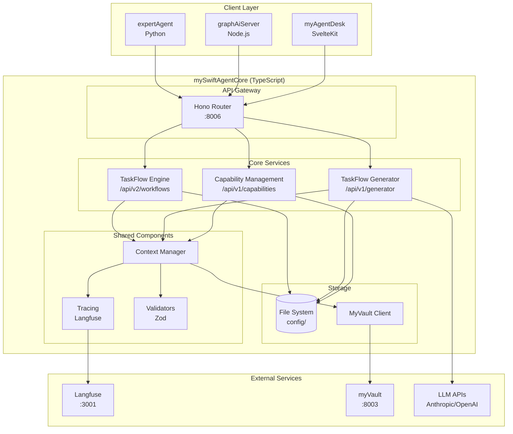
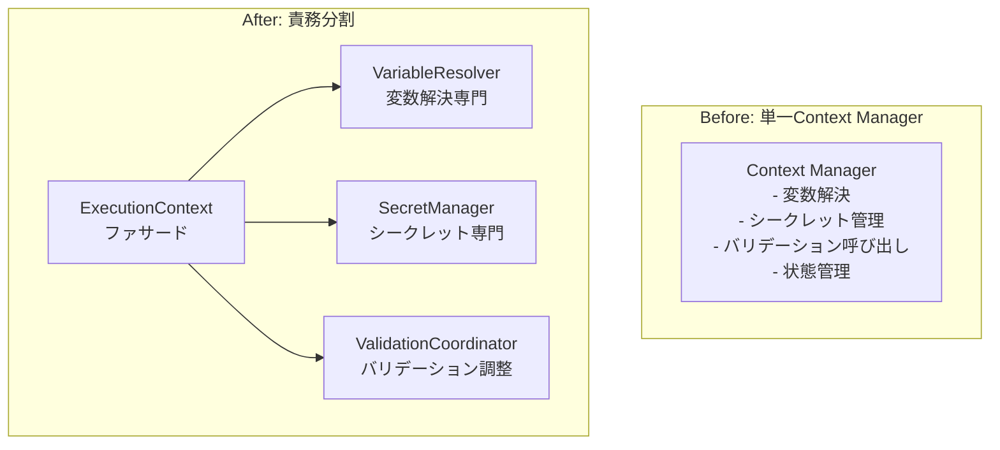
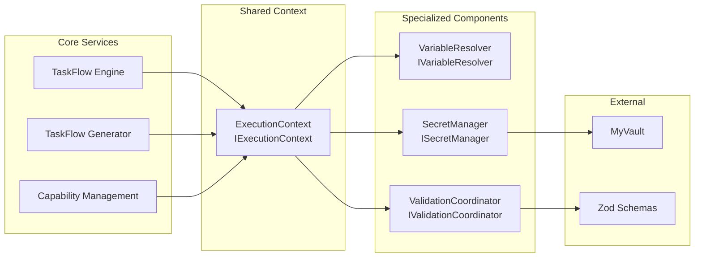
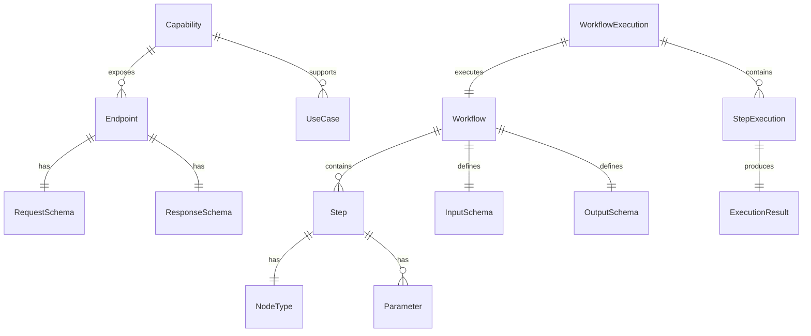

# Issue #362: mySwiftAgentCore 設計方針書

## 1. エグゼクティブサマリー

### 1.1 概要
mySwiftAgentCoreは、MySwiftAgentプラットフォームのコア機能を統合する新規TypeScriptプロジェクトです。現在分散している以下の3つのコア機能を統一的なアーキテクチャで再実装します：

1. **TaskFlowエンジン** - ワークフロー実行エンジン（graphAiServerから移植）
2. **TaskFlow生成エージェント** - ワークフロー生成ロジック（expertAgentから抽出）
3. **Capability管理** - API能力の一元管理システム（新規実装）

### 1.2 解決する課題
- **言語スタックの不一致**: Python（生成）とTypeScript（実行）の断絶
- **モジュール複雑性**: expertAgent/jobGeneratorV2の98ファイル/50ディレクトリ
- **Capability分散**: 各プロジェクトで独自管理されている能力定義

## 2. 現状分析

### 2.1 expertAgent/jobGeneratorV2の複雑性

#### 構造的問題
```
jobGeneratorV2/
├── 98個のPythonファイル
├── 50個のディレクトリ
├── 3つの並列型システム（protocols.py, types.py, types_old.py）
├── 2つのアダプタ実装（adapter.py, adapter_old.py）
├── 2つのエラー回復システム（recovery.py, error_recovery.py）
└── 13個の分散バリデータ（統一パイプライン不在）
```

#### 複雑性ホットスポット
1. **型システムの重複**: 3つの異なるErrorType定義
2. **廃止コードの残存**: task_breakdown/, interface_design/ワークフロー
3. **深いプロンプト階層**: 4レベル + 5ルールモジュール + 19 YAMLファイル
4. **検証パイプライン断片化**: 実行順序・依存関係不明確

### 2.2 graphAiServer TaskFlowエンジンの課題

#### 言語スタックによる統合障害
```
Python (expertAgent) → REST API → TypeScript (graphAiServer)
         ↓                              ↓
   Pydantic Schema                 Zod Schema
         ↓                              ↓
   TaskFlowAdapter ←─── 形式変換 ───→ workflow-parser.ts
```

#### 主要な問題
- **スキーマ二重管理**: Pydantic（Python）とZod（TypeScript）
- **型情報の損失**: REST API経由でスタックトレース消失
- **デバッグ困難**: 言語境界でのエラー原因特定が困難
- **テスト複雑性**: CIで受入テスト実行不可（APIキー必要）

### 2.3 Capability管理の分散

#### 現在の管理場所
1. **expertAgent**: `expert_agent_capabilities.yaml` (904行)
2. **jobGeneratorV2**: `available_apis.yaml` (183行)
3. **graphAiServer**: ハードコード（src/nodes/内）

## 3. アーキテクチャ設計

### 3.1 システム構成図



### 3.2 レイヤー構成

| レイヤー | 責務 | 技術 |
|---------|------|------|
| **API層** | HTTPエンドポイント、認証、ルーティング | Hono + Zod |
| **サービス層** | ビジネスロジック、ワークフロー制御 | TypeScript Classes |
| **ドメイン層** | エンティティ、値オブジェクト、ドメインルール | TypeScript Types |
| **インフラ層** | 外部サービス連携、ファイルシステム | Adapters |

### 3.3 モジュール設計

```
mySwiftAgentCore/
├── src/
│   ├── taskflowEngine/         # Issue #363
│   │   ├── executor/           # 実行エンジン（graphAiServerから移植）
│   │   │   ├── WorkflowExecutor.ts
│   │   │   ├── SequentialExecutor.ts
│   │   │   ├── ParallelExecutor.ts
│   │   │   └── ConditionalExecutor.ts
│   │   ├── validator/          # スキーマ検証
│   │   │   ├── WorkflowValidator.ts
│   │   │   └── SemanticValidator.ts
│   │   ├── storage/            # ワークフロー永続化
│   │   │   └── WorkflowStorage.ts
│   │   └── nodes/              # ノード実装
│   │       ├── BaseNode.ts
│   │       ├── ApiRestNode.ts
│   │       └── TransformNode.ts
│   │
│   ├── taskflowGeneratorAgent/ # Issue #364
│   │   ├── generator/          # 生成ロジック
│   │   │   ├── WorkflowGenerator.ts
│   │   │   └── PromptBuilder.ts
│   │   ├── llm/                # LLMクライアント
│   │   │   ├── LLMClient.ts
│   │   │   └── StructuredOutput.ts
│   │   ├── prompts/            # プロンプトテンプレート
│   │   │   └── templates/
│   │   └── validators/         # 生成後検証
│   │       └── GeneratedWorkflowValidator.ts
│   │
│   ├── capabilityManagement/   # Issue #365
│   │   ├── registry/           # Capability登録・管理
│   │   │   ├── CapabilityRegistry.ts
│   │   │   └── CapabilityValidator.ts
│   │   ├── loader/             # YAML/JSONローダー
│   │   │   └── CapabilityLoader.ts
│   │   └── api/                # クライアント向けAPI
│   │       └── CapabilityAPI.ts
│   │
│   └── shared/
│       ├── tracing/            # Langfuseトレーサー
│       │   └── Tracer.ts
│       ├── context/            # コンテキスト管理（責務分割）
│       │   ├── ExecutionContext.ts      # 実行コンテキスト（ファサード）
│       │   ├── VariableResolver.ts      # 変数解決
│       │   ├── SecretManager.ts         # シークレット管理
│       │   └── ValidationCoordinator.ts # バリデーション調整
│       ├── types/              # 共通型定義
│       │   ├── workflow.types.ts
│       │   ├── capability.types.ts
│       │   └── error.types.ts
│       └── validation/         # 共通バリデーション
│           └── schemas.ts
```

### 3.4 Context Manager責務分割設計

従来の単一Context Managerが担っていた責務を、単一責任原則（SRP）に基づいて分割する。

#### 3.4.1 責務分割の概要



#### 3.4.2 各コンポーネントの責務

| コンポーネント | 責務 | 依存先 |
|--------------|------|--------|
| **ExecutionContext** | ファサードとして統一インターフェース提供、コンポーネント間調整 | VR, SM, VC |
| **VariableResolver** | `${variable}` 形式の変数解決、参照チェーン解決、デフォルト値処理 | なし |
| **SecretManager** | MyVault連携、シークレットキャッシュ、トークンリフレッシュ | MyVaultAdapter |
| **ValidationCoordinator** | バリデーション実行順序制御、エラー集約、検証結果キャッシュ | Validators |

#### 3.4.3 インターフェース定義

```typescript
/**
 * 実行コンテキスト（ファサード）
 * 各サービスはこのインターフェースのみを使用する
 */
interface IExecutionContext {
  /** 変数解決 */
  resolve(reference: string): Promise<unknown>;

  /** シークレット取得 */
  getSecret(key: string): Promise<string>;

  /** ステップ出力の登録 */
  setStepOutput(stepId: string, output: unknown): void;

  /** ステップ出力の取得 */
  getStepOutput(stepId: string): unknown | undefined;

  /** 入力スキーマ検証 */
  validateInput(schema: IOSchema, input: unknown): ValidationResult;

  /** 出力スキーマ検証 */
  validateOutput(schema: IOSchema, output: unknown): ValidationResult;

  /** トレースID取得 */
  getTraceId(): string;
}

/**
 * 変数リゾルバー
 */
interface IVariableResolver {
  /**
   * 変数参照を解決
   * @param reference - 参照文字列（例: "${inputs.query}", "${step1.output.data}"）
   * @param context - 解決コンテキスト（inputs, outputs）
   */
  resolve(reference: string, context: ResolverContext): Promise<unknown>;

  /**
   * 参照チェーンを解決（coalesce: ${a ?? b ?? c}）
   */
  resolveChain(references: string[], context: ResolverContext): Promise<unknown>;

  /**
   * 参照が有効かチェック
   */
  isValidReference(reference: string): boolean;
}

/**
 * シークレットマネージャー
 */
interface ISecretManager {
  /**
   * シークレット取得（キャッシュ付き）
   */
  getSecret(key: string, options?: SecretOptions): Promise<string>;

  /**
   * キャッシュクリア
   */
  clearCache(): void;

  /**
   * 接続テスト
   */
  healthCheck(): Promise<boolean>;
}

/**
 * バリデーション調整
 */
interface IValidationCoordinator {
  /**
   * 入力データの検証
   */
  validateInput(schema: IOSchema, data: unknown): ValidationResult;

  /**
   * 出力データの検証
   */
  validateOutput(schema: IOSchema, data: unknown): ValidationResult;

  /**
   * ワークフロー定義の検証
   */
  validateWorkflow(workflow: WorkflowDefinition): ValidationResult;

  /**
   * セマンティック検証（参照整合性など）
   */
  validateSemantics(workflow: WorkflowDefinition): ValidationResult;
}
```

#### 3.4.4 実装クラス構造

```typescript
/**
 * ExecutionContext実装
 */
class ExecutionContext implements IExecutionContext {
  private readonly variableResolver: IVariableResolver;
  private readonly secretManager: ISecretManager;
  private readonly validationCoordinator: IValidationCoordinator;
  private readonly stepOutputs: Map<string, unknown> = new Map();
  private readonly traceId: string;

  constructor(
    private readonly inputs: Record<string, unknown>,
    deps: {
      variableResolver: IVariableResolver;
      secretManager: ISecretManager;
      validationCoordinator: IValidationCoordinator;
    }
  ) {
    this.variableResolver = deps.variableResolver;
    this.secretManager = deps.secretManager;
    this.validationCoordinator = deps.validationCoordinator;
    this.traceId = generateTraceId();
  }

  async resolve(reference: string): Promise<unknown> {
    const context: ResolverContext = {
      inputs: this.inputs,
      outputs: Object.fromEntries(this.stepOutputs),
      secrets: {
        get: (key: string) => this.secretManager.getSecret(key),
      },
    };
    return this.variableResolver.resolve(reference, context);
  }

  async getSecret(key: string): Promise<string> {
    return this.secretManager.getSecret(key);
  }

  setStepOutput(stepId: string, output: unknown): void {
    this.stepOutputs.set(stepId, output);
  }

  getStepOutput(stepId: string): unknown | undefined {
    return this.stepOutputs.get(stepId);
  }

  validateInput(schema: IOSchema, input: unknown): ValidationResult {
    return this.validationCoordinator.validateInput(schema, input);
  }

  validateOutput(schema: IOSchema, output: unknown): ValidationResult {
    return this.validationCoordinator.validateOutput(schema, output);
  }

  getTraceId(): string {
    return this.traceId;
  }
}
```

#### 3.4.5 依存関係図



#### 3.4.6 利点

1. **テスト容易性**: 各コンポーネントを独立してモック可能
2. **保守性**: 変更の影響範囲が限定的
3. **拡張性**: 新しいリゾルバーやバリデーターを追加しやすい
4. **可読性**: 責務が明確で理解しやすい

## 4. 技術選定

### 4.1 選定技術と理由

| カテゴリ | 選定技術 | 選定理由 | 既存との整合性 |
|---------|---------|---------|---------------|
| **言語** | TypeScript 5.x | 型安全性、既存graphAiServerとの共通性 | graphAiServerと統一 |
| **ランタイム** | Bun (優先) / Node.js | 高速起動、TypeScript native | 新規選定 |
| **Webフレームワーク** | Hono | 軽量、高速、TypeScript first | 新規（Express代替） |
| **LLMクライアント** | Anthropic SDK | 公式SDK、型定義完備 | expertAgentと同様 |
| **バリデーション** | Zod | 実行時検証、型推論 | graphAiServerと統一 |
| **テスト** | Vitest | 高速、ESM native | 新規（Jest代替） |
| **トレーシング** | Langfuse JS SDK | LLMオブザーバビリティ | 既存利用 |
| **ビルドツール** | tsx / esbuild | 高速ビルド | 新規選定 |

### 4.2 技術選定の根拠

#### Bun採用の理由
- TypeScript実行が高速（トランスパイル不要）
- 組み込みテストランナー
- npm互換性維持
- Node.jsフォールバック可能

#### Hono採用の理由
- Expressより3倍高速
- ミドルウェア構成がシンプル
- TypeScript型推論が優秀
- Cloudflare Workers互換（将来性）

## 5. 設計パターン

### 5.1 採用パターン

| パターン | 適用箇所 | 目的 |
|---------|---------|------|
| **Repository** | WorkflowStorage, CapabilityRegistry | データアクセス抽象化 |
| **Factory** | NodeFactory | ステップ定義からノードインスタンス生成 |
| **Strategy** | ExecutorStrategy | 実行戦略の切り替え |
| **Template Method** | BaseNode | ノード実行の共通フロー |
| **Chain of Responsibility** | ValidationPipeline | 検証チェーンの構築 |
| **Adapter** | MyVaultAdapter, LLMAdapter | 外部サービス統合 |
| **Observer** | TracingObserver | 実行イベントの監視 |

### 5.2 既存パターンとの整合性

graphAiServerで使用されているパターンを継承：
- Template Method（BaseNode）
- Factory（WorkflowParser）
- Strategy（TransformNode）

## 6. データモデル設計

### 6.1 コアエンティティ



### 6.2 主要な型定義

```typescript
// ワークフロー定義
interface WorkflowDefinition {
  workflow_name: string;
  description?: string;
  version: string;
  input_schema: IOSchema;
  output_schema: IOSchema;
  steps: Step[];
  output_mapping: Record<string, string>;
}

// Capability定義
interface Capability {
  id: string;
  name: string;
  category: 'utility' | 'ai_agent' | 'external';
  endpoints: Endpoint[];
  use_cases: string[];
  limitations?: string[];
}

// 統一エラー型
interface CoreError {
  code: ErrorCode;
  message: string;
  details?: unknown;
  recoverable: boolean;
  phase?: ExecutionPhase;
}
```

### 6.3 部分成功モデル（実行結果の詳細定義）

ワークフローの並列実行やバッチ処理において、**部分成功（partial success）** を明確に扱うための型定義を導入する。

#### 6.3.1 ワークフロー実行結果

```typescript
/**
 * ワークフロー実行結果
 * - success: 全ステップ成功
 * - partial_success: 一部ステップ成功（続行可能）
 * - failed: 全体失敗または続行不可
 */
interface WorkflowExecutionResult {
  /** 実行結果ステータス */
  status: 'success' | 'partial_success' | 'failed';

  /** 成功したステップのID一覧 */
  successful_steps: string[];

  /** 失敗したステップの詳細情報 */
  failed_steps: StepError[];

  /** 後続処理の続行可否 */
  can_continue: boolean;

  /** 部分的な結果（partial_success時に利用） */
  partial_results?: Record<string, unknown>;

  /** 実行メトリクス */
  metrics: ExecutionMetrics;

  /** トレースID（Langfuse連携） */
  trace_id: string;
}

/**
 * ステップエラー詳細
 */
interface StepError {
  /** ステップID */
  step_id: string;

  /** ステップ名 */
  step_name: string;

  /** エラーコード */
  error_code: ErrorCode;

  /** エラーメッセージ */
  message: string;

  /** リカバリー可能か */
  recoverable: boolean;

  /** 推奨されるリカバリーアクション */
  recovery_action?: RecoveryAction;

  /** エラー発生時刻 */
  occurred_at: string;
}

/**
 * リカバリーアクション
 */
type RecoveryAction =
  | 'retry'           // 同じステップを再試行
  | 'skip'            // スキップして続行
  | 'use_default'     // デフォルト値を使用して続行
  | 'abort'           // 実行中断
  | 'rollback';       // ロールバック

/**
 * 実行メトリクス
 */
interface ExecutionMetrics {
  /** 総実行時間（ms） */
  total_duration_ms: number;

  /** ステップ別実行時間 */
  step_durations: Record<string, number>;

  /** 成功率（0.0-1.0） */
  success_rate: number;

  /** リトライ回数 */
  retry_count: number;
}
```

#### 6.3.2 部分成功の判定ロジック

```typescript
/**
 * 部分成功判定の設定
 */
interface PartialSuccessConfig {
  /** 最小成功率（これ以上で partial_success） */
  min_success_rate: number;  // デフォルト: 0.5

  /** 必須ステップ（これらが失敗したら即 failed） */
  required_steps: string[];

  /** 続行可能なエラーコード */
  continuable_error_codes: ErrorCode[];
}

/**
 * 判定ロジック
 */
function determineExecutionStatus(
  results: StepResult[],
  config: PartialSuccessConfig
): WorkflowExecutionResult['status'] {
  const successCount = results.filter(r => r.success).length;
  const successRate = successCount / results.length;

  // 必須ステップの失敗チェック
  const requiredFailed = results.some(
    r => config.required_steps.includes(r.step_id) && !r.success
  );
  if (requiredFailed) return 'failed';

  // 成功率による判定
  if (successRate === 1.0) return 'success';
  if (successRate >= config.min_success_rate) return 'partial_success';
  return 'failed';
}
```

#### 6.3.3 部分成功時のレスポンス例

```json
{
  "status": "partial_success",
  "successful_steps": ["fetch_data", "transform_data"],
  "failed_steps": [
    {
      "step_id": "send_notification",
      "step_name": "通知送信",
      "error_code": "EXTERNAL_SERVICE_UNAVAILABLE",
      "message": "Slack APIがタイムアウトしました",
      "recoverable": true,
      "recovery_action": "retry",
      "occurred_at": "2025-01-15T10:30:00Z"
    }
  ],
  "can_continue": true,
  "partial_results": {
    "fetch_data": { "items": [...] },
    "transform_data": { "summary": "..." }
  },
  "metrics": {
    "total_duration_ms": 5230,
    "step_durations": {
      "fetch_data": 1200,
      "transform_data": 800,
      "send_notification": 3230
    },
    "success_rate": 0.67,
    "retry_count": 0
  },
  "trace_id": "trace_abc123"
}
```

## 7. API設計

### 7.1 エンドポイント設計

#### TaskFlow Engine API (v2)
```
POST   /api/v2/workflows/execute     # ワークフロー実行
POST   /api/v2/workflows/validate    # ワークフロー検証
GET    /api/v2/workflows/{name}      # ワークフロー取得
POST   /api/v2/workflows/register    # ワークフロー登録
DELETE /api/v2/workflows/{name}      # ワークフロー削除
```

#### TaskFlow Generator API (v1)
```
POST   /api/v1/generator/generate    # ワークフロー生成
POST   /api/v1/generator/validate    # 生成結果検証
GET    /api/v1/generator/templates   # テンプレート一覧
POST   /api/v1/generator/test        # テスト実行
```

#### Capability Management API (v1)
```
GET    /api/v1/capabilities          # 全Capability取得
GET    /api/v1/capabilities/{id}     # 個別Capability取得
POST   /api/v1/capabilities/search   # Capability検索
POST   /api/v1/capabilities/register # Capability登録
PUT    /api/v1/capabilities/{id}     # Capability更新
```

### 7.2 エラーレスポンス形式

```typescript
interface ErrorResponse {
  error: {
    code: string;
    message: string;
    details?: unknown;
    trace_id?: string;
  };
  timestamp: string;
}
```

## 8. セキュリティ設計

### 8.1 認証・認可

| 方式 | 用途 | 実装 |
|------|------|------|
| **API Token** | サービス間認証 | `X-API-Token`ヘッダー |
| **Service Token** | MyVault連携 | `X-Service` + `X-Token` |
| **Admin Token** | 管理API | `X-Admin-Token` |

### 8.2 セキュリティ対策

1. **入力検証**: Zodによる厳密なスキーマ検証
2. **SSRF防止**: URLホワイトリスト、プライベートIP拒否
3. **レート制限**: API呼び出し制限（100req/min）
4. **シークレット管理**: MyVault経由、メモリキャッシュ
5. **監査ログ**: Langfuseによる全操作トレース

### 8.3 デフォルトセキュリティ設定

#### 8.3.1 環境変数一覧

全環境変数の必須/オプション区分とセキュアなデフォルト値を明示する。

| 環境変数 | 必須 | デフォルト値 | 説明 | セキュリティ考慮事項 |
|---------|------|------------|------|---------------------|
| **NODE_ENV** | ✅ | `production` | 実行環境 | `development`では追加ログ出力 |
| **PORT** | ❌ | `8006` | サービスポート | - |
| **HOST** | ❌ | `0.0.0.0` | バインドアドレス | 本番では`127.0.0.1`推奨（リバースプロキシ前提） |
| **LOG_LEVEL** | ❌ | `info` | ログレベル | `debug`ではシークレットが露出する可能性 |

**認証関連**

| 環境変数 | 必須 | デフォルト値 | 説明 | セキュリティ考慮事項 |
|---------|------|------------|------|---------------------|
| **API_TOKEN** | ✅ | なし | サービス間認証トークン | 最低32文字、ランダム生成必須 |
| **ADMIN_TOKEN** | ✅ | なし | 管理API認証トークン | API_TOKENとは別の値を使用 |
| **MYVAULT_SERVICE_TOKEN** | ✅ | なし | MyVault連携トークン | MyVaultで発行 |
| **MYVAULT_SERVICE_NAME** | ✅ | `myswiftagentcore` | サービス識別名 | - |

**外部連携**

| 環境変数 | 必須 | デフォルト値 | 説明 | セキュリティ考慮事項 |
|---------|------|------------|------|---------------------|
| **MYVAULT_BASE_URL** | ✅ | `http://localhost:8003` | MyVault URL | 本番ではHTTPS推奨 |
| **LANGFUSE_PUBLIC_KEY** | ❌ | なし | Langfuse公開キー | トレーシング無効時は不要 |
| **LANGFUSE_SECRET_KEY** | ❌ | なし | Langfuse秘密キー | 環境変数で管理、コードに埋め込み禁止 |
| **LANGFUSE_BASE_URL** | ❌ | `http://localhost:3001` | Langfuse URL | - |
| **ANTHROPIC_API_KEY** | ❌ | なし | Anthropic APIキー | MyVault経由で取得推奨 |

**セキュリティ設定**

| 環境変数 | 必須 | デフォルト値 | 説明 | セキュリティ考慮事項 |
|---------|------|------------|------|---------------------|
| **RATE_LIMIT_PER_MINUTE** | ❌ | `100` | レート制限（req/min） | DDoS対策、低すぎると正常利用に影響 |
| **SECRET_CACHE_TTL_SEC** | ❌ | `300` | シークレットキャッシュTTL | 短すぎるとMyVault負荷増、長すぎると更新反映遅延 |
| **CORS_ALLOWED_ORIGINS** | ❌ | `*`（開発）/ なし（本番） | CORS許可オリジン | 本番では明示的に指定 |
| **ENABLE_REQUEST_LOGGING** | ❌ | `false` | リクエストボディログ | シークレット露出リスク、本番では`false` |

**SSRF防止設定**

| 環境変数 | 必須 | デフォルト値 | 説明 | セキュリティ考慮事項 |
|---------|------|------------|------|---------------------|
| **ALLOWED_URL_HOSTS** | ❌ | なし（全許可） | 許可するホスト（カンマ区切り） | 本番では明示的に指定推奨 |
| **BLOCK_PRIVATE_IPS** | ❌ | `true` | プライベートIP拒否 | 内部ネットワーク攻撃防止 |
| **REQUIRE_HTTPS** | ❌ | `true`（本番）/ `false`（開発） | HTTPS強制 | localhost以外はHTTPS必須 |

#### 8.3.2 セキュアなデフォルト設定

以下の原則に基づいてデフォルト値を設定：

1. **Fail-Safe Defaults**: セキュリティを優先したデフォルト
2. **Least Privilege**: 最小権限の原則
3. **Defense in Depth**: 多層防御

```typescript
/**
 * セキュリティ設定のデフォルト値
 */
const SECURITY_DEFAULTS = {
  // 認証
  auth: {
    tokenMinLength: 32,
    tokenHashAlgorithm: 'sha256',
    sessionTimeout: 3600_000, // 1時間
  },

  // SSRF防止
  ssrf: {
    blockPrivateIps: true,
    blockedIpRanges: [
      '10.0.0.0/8',
      '172.16.0.0/12',
      '192.168.0.0/16',
      '127.0.0.0/8',
      '169.254.0.0/16', // リンクローカル
      '::1/128',        // IPv6 localhost
      'fc00::/7',       // IPv6 プライベート
    ],
    blockedHosts: [
      'metadata.google.internal',
      '169.254.169.254', // AWS/GCP metadata
      'metadata.azure.internal',
    ],
    requireHttps: process.env.NODE_ENV === 'production',
    allowedProtocols: ['http', 'https'],
  },

  // レート制限
  rateLimit: {
    windowMs: 60_000,      // 1分
    maxRequests: 100,
    skipFailedRequests: false,
    skipSuccessfulRequests: false,
  },

  // キャッシュ
  cache: {
    secretTtlMs: 300_000,   // 5分
    workflowTtlMs: 3600_000, // 1時間
    maxCacheSize: 1000,
  },

  // ログ
  logging: {
    maskPatterns: [
      /api[_-]?key/i,
      /secret/i,
      /password/i,
      /token/i,
      /authorization/i,
    ],
    maxBodyLogLength: 1000,
    enableRequestLogging: false,
  },

  // ヘッダー
  headers: {
    'X-Content-Type-Options': 'nosniff',
    'X-Frame-Options': 'DENY',
    'X-XSS-Protection': '1; mode=block',
    'Strict-Transport-Security': 'max-age=31536000; includeSubDomains',
    'Content-Security-Policy': "default-src 'self'",
  },
} as const;
```

#### 8.3.3 環境別設定

| 設定項目 | 開発環境 | ステージング | 本番環境 |
|---------|---------|-------------|---------|
| **CORS** | `*` | 特定オリジン | 特定オリジン |
| **HTTPS強制** | ❌ | ✅ | ✅ |
| **リクエストログ** | ✅ | ❌ | ❌ |
| **詳細エラーメッセージ** | ✅ | ❌ | ❌ |
| **レート制限** | 1000/min | 100/min | 100/min |
| **プライベートIP拒否** | ❌ | ✅ | ✅ |

#### 8.3.4 設定検証（起動時チェック）

```typescript
/**
 * 起動時のセキュリティ設定検証
 */
function validateSecurityConfig(): void {
  const errors: string[] = [];
  const warnings: string[] = [];

  // 必須環境変数チェック
  const required = ['API_TOKEN', 'ADMIN_TOKEN', 'MYVAULT_SERVICE_TOKEN'];
  for (const key of required) {
    if (!process.env[key]) {
      errors.push(`必須環境変数 ${key} が設定されていません`);
    }
  }

  // トークン強度チェック
  if (process.env.API_TOKEN && process.env.API_TOKEN.length < 32) {
    errors.push('API_TOKEN は32文字以上である必要があります');
  }

  // 本番環境固有のチェック
  if (process.env.NODE_ENV === 'production') {
    if (process.env.CORS_ALLOWED_ORIGINS === '*') {
      errors.push('本番環境では CORS_ALLOWED_ORIGINS を明示的に設定してください');
    }
    if (process.env.ENABLE_REQUEST_LOGGING === 'true') {
      warnings.push('本番環境でのリクエストログはセキュリティリスクがあります');
    }
    if (!process.env.LANGFUSE_SECRET_KEY) {
      warnings.push('Langfuseが設定されていません。監査ログが記録されません');
    }
  }

  // 結果出力
  if (errors.length > 0) {
    console.error('セキュリティ設定エラー:');
    errors.forEach(e => console.error(`  ❌ ${e}`));
    process.exit(1);
  }

  if (warnings.length > 0) {
    console.warn('セキュリティ警告:');
    warnings.forEach(w => console.warn(`  ⚠️ ${w}`));
  }
}
```

#### 8.3.5 .env.example テンプレート

```bash
# =============================================================================
# mySwiftAgentCore 環境変数設定
# =============================================================================
# このファイルをコピーして .env を作成してください
# 本番環境では全ての必須項目を設定してください
# =============================================================================

# -----------------------------------------------------------------------------
# 基本設定
# -----------------------------------------------------------------------------
NODE_ENV=development          # development | staging | production
PORT=8006                     # サービスポート
HOST=0.0.0.0                  # バインドアドレス（本番では127.0.0.1推奨）
LOG_LEVEL=info                # debug | info | warn | error

# -----------------------------------------------------------------------------
# 認証設定 [必須]
# -----------------------------------------------------------------------------
# 以下のコマンドでトークンを生成:
# openssl rand -hex 32

API_TOKEN=                    # [必須] サービス間認証トークン（32文字以上）
ADMIN_TOKEN=                  # [必須] 管理API認証トークン（API_TOKENとは別の値）
MYVAULT_SERVICE_TOKEN=        # [必須] MyVault連携トークン
MYVAULT_SERVICE_NAME=myswiftagentcore

# -----------------------------------------------------------------------------
# 外部サービス連携
# -----------------------------------------------------------------------------
MYVAULT_BASE_URL=http://localhost:8003
LANGFUSE_BASE_URL=http://localhost:3001
LANGFUSE_PUBLIC_KEY=          # Langfuse公開キー（オプション）
LANGFUSE_SECRET_KEY=          # Langfuse秘密キー（オプション）

# LLM APIキーはMyVault経由で取得することを推奨
# 直接設定する場合のみ以下を使用
# ANTHROPIC_API_KEY=

# -----------------------------------------------------------------------------
# セキュリティ設定
# -----------------------------------------------------------------------------
RATE_LIMIT_PER_MINUTE=100     # レート制限（req/min）
SECRET_CACHE_TTL_SEC=300      # シークレットキャッシュTTL（秒）
CORS_ALLOWED_ORIGINS=*        # 本番では明示的に指定（例: https://app.example.com）
ENABLE_REQUEST_LOGGING=false  # リクエストボディログ（本番ではfalse）

# SSRF防止
BLOCK_PRIVATE_IPS=true        # プライベートIP拒否
REQUIRE_HTTPS=false           # 本番ではtrue
# ALLOWED_URL_HOSTS=api.example.com,api2.example.com

# -----------------------------------------------------------------------------
# パフォーマンス設定
# -----------------------------------------------------------------------------
MAX_PARALLEL_STEPS=5          # 最大並列ステップ数
WORKFLOW_TIMEOUT_MS=300000    # ワークフロー実行タイムアウト（5分）
LLM_TIMEOUT_MS=120000         # LLM呼び出しタイムアウト（2分）
```

## 9. パフォーマンス設計

### 9.1 キャッシング戦略

| 対象 | 戦略 | TTL |
|------|------|-----|
| **Capability定義** | メモリキャッシュ | 起動時ロード |
| **ワークフロー定義** | LRUキャッシュ | 1時間 |
| **MyVaultシークレット** | メモリキャッシュ | 5分 |
| **LLM結果** | なし | - |

### 9.2 並列実行

- **TaskFlow Engine**: 最大5並列ステップ実行
- **Generator**: バッチ生成対応（最大10）
- **Capability検索**: 非同期インデックス

### 9.3 タイムアウト設定

```typescript
const TIMEOUTS = {
  api_call: 30_000,      // 30秒
  llm_generation: 120_000, // 2分
  workflow_execution: 300_000, // 5分
  test_execution: 60_000,  // 1分
};
```

## 10. 移行戦略

### 10.1 段階的移行計画

#### Phase 1: TaskFlow Engine移植（Issue #363）
```
Week 1-2:
├── graphAiServer/src/engine/ をTypeScriptで再実装
├── Zodスキーマの移植
├── ノード実装の移植
└── 単体テスト作成
```

#### Phase 2: Generator Agent実装（Issue #364）
```
Week 3-4:
├── expertAgent Phase 3ロジックをTypeScriptで実装
├── LLMクライアント実装
├── プロンプトテンプレート移植
└── 統合テスト作成
```

#### Phase 3: Capability Management（Issue #365）
```
Week 5:
├── YAMLローダー実装
├── レジストリ実装
├── API実装
└── 既存定義の統合
```

### 10.2 互換性維持

1. **REST API互換性**: 既存エンドポイントをプロキシ
2. **スキーマ互換性**: v1/v2並行サポート
3. **段階的切り替え**: Feature flagによる制御

## 11. 設計上の決定事項とトレードオフ

### 11.1 TypeScript統一の選択

**選択理由**:
- TaskFlowエンジンとの言語統一
- 型安全性の確保
- スキーマ定義の一元化

**トレードオフ**:
- ❌ expertAgentとの言語差異は残る
- ❌ Python開発者の学習コスト
- ✅ スキーマ同期問題の解決
- ✅ デバッグ容易性の向上

### 11.2 単一プロセスアーキテクチャ

**選択理由**:
- デプロイ・運用の簡素化
- プロセス間通信オーバーヘッド削減
- 開発効率の向上

**トレードオフ**:
- ❌ サービス個別スケーリング不可
- ❌ 障害影響範囲が大きい
- ✅ 運用コスト削減
- ✅ 開発速度向上

### 11.3 Bunランタイムの採用

**選択理由**:
- TypeScript native実行
- 高速起動・実行
- 組み込みツールチェーン

**トレードオフ**:
- ❌ 本番実績が少ない
- ❌ エコシステムが発展途上
- ✅ 開発体験の向上
- ✅ Node.jsフォールバック可能

## 12. リスクと対策

| リスク | 影響度 | 発生可能性 | 対策 |
|--------|--------|-----------|------|
| **Bun互換性問題** | 高 | 中 | Node.jsフォールバック準備 |
| **移行期間の二重管理** | 中 | 高 | 自動同期スクリプト作成 |
| **パフォーマンス劣化** | 高 | 低 | 事前ベンチマーク実施 |
| **スキーマ不整合** | 高 | 中 | Contract Testingの実装 |

## 13. 成功指標

### 13.1 技術指標

- **レスポンスタイム**: TaskFlow実行 < 5秒（現在: 10秒）
- **並列実行**: 1000タスク並列処理可能
- **可用性**: 99.9%アップタイム
- **テストカバレッジ**: 90%以上

### 13.2 ビジネス指標

- **開発効率**: 新規ワークフロー作成時間50%削減
- **保守性**: バグ修正時間70%削減
- **統合容易性**: 新規サービス統合1日以内

## 14. 参照ドキュメント

- [service-dependencies.md](../../../../docs/arch/service-dependencies.md) - サービス間依存関係
- [Issue #348](https://github.com/MySwiftAgent/issues/348) - graphAiServer TaskFlow実装
- [Issue #359](https://github.com/MySwiftAgent/issues/359) - 3フェーズ統一ID方式
- [Issue #361](https://github.com/MySwiftAgent/issues/361) - 旧コード削除計画

## 15. 付録: 主要な設計判断

### A. なぜPythonではなくTypeScriptか？

**現状の問題**:
```
Python (Generation) → JSON → REST API → TypeScript (Execution)
    ↓                                        ↓
Pydantic                                   Zod
    ↓                                        ↓
スキーマ不整合                           実行時エラー
```

**TypeScript統一のメリット**:
1. スキーマ定義の一元化（Zod）
2. 型情報の保持
3. デバッグの容易性
4. 実行効率の向上

### B. なぜマイクロサービスではなく統合サービスか？

**検討した選択肢**:
1. 3つの個別マイクロサービス
2. 単一統合サービス（選択）
3. サーバーレス関数

**統合サービスの利点**:
- 運用の簡素化
- レイテンシ削減
- 開発効率
- リソース効率

### C. 既存コードの扱い

**方針**:
- graphAiServer: エンジン部分を移植、残りは段階的廃止
- expertAgent: インターフェースのみ維持、内部はプロキシ
- Capability: 新規実装後、既存定義をインポート

---

作成日: 2025-01-15
作成者: Claude (Anthropic)
バージョン: 1.0.0