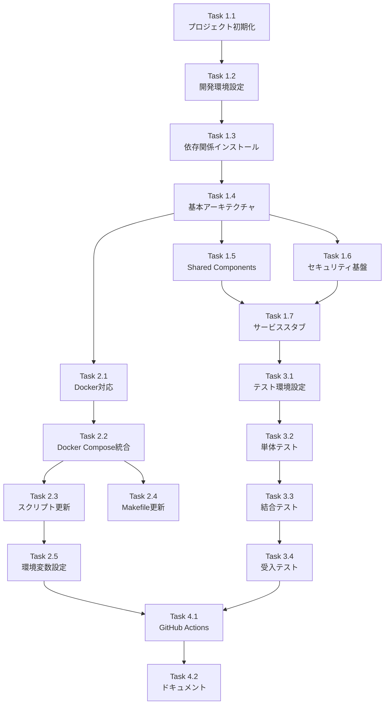

# 作業計画書

## Issue: feat(mySwiftAgentCore): 新規TypeScriptプロジェクトの作成
**Issue番号**: #362
**サイズ**: L（大規模 - 新規プロジェクト基盤構築）
**作業見積**: 24-32時間（3-4営業日）
**優先度**: High
**依存Issue**: なし（親Issue）
**子Issue**: #363, #364, #365

---

## 1. 概要

MySwiftAgentのコア機能を統合する新規TypeScriptプロジェクト「mySwiftAgentCore」の基盤を構築する。本Issueでは、プロジェクト構造の確立、開発環境設定、Docker統合、スクリプト対応を実施する。

### 解決する課題
- Python（expertAgent）とTypeScript（graphAiServer）の言語スタック不一致
- expertAgent/jobGeneratorV2の複雑性（98ファイル/50ディレクトリ）
- Capability管理の分散

### 成果物
- 新規TypeScriptプロジェクト基盤
- 3つのコアサービスの骨格（taskflowEngine, taskflowGeneratorAgent, capabilityManagement）
- Docker Compose統合
- 開発スクリプト対応

---

## 2. 詳細タスク分解

### Phase 1: 基盤構築（実装タスク）

#### Task 1.1: プロジェクト初期化（2時間）
- [ ] `mySwiftAgentCore/` ディレクトリ作成
- [ ] `npm init` / `bun init` 実行
- [ ] TypeScript設定（tsconfig.json）
- [ ] 基本的なディレクトリ構造作成

#### Task 1.2: 開発環境設定（2時間）
- [ ] ESLint設定（eslint.config.mjs）
- [ ] Prettier設定（.prettierrc）
- [ ] Git関連設定（.gitignore）
- [ ] VS Code設定（.vscode/）

#### Task 1.3: 依存関係インストール（1時間）
- [ ] 本番依存関係：Hono, Zod, @anthropic-ai/sdk, langfuse
- [ ] 開発依存関係：TypeScript, Vitest, ESLint, Prettier
- [ ] ビルドツール：tsx, esbuild

#### Task 1.4: 基本アーキテクチャ実装（4時間）
- [ ] APIサーバー骨格（Hono）
- [ ] ヘルスチェックエンドポイント
- [ ] エラーハンドリング
- [ ] ロギング設定
- [ ] 環境変数管理

#### Task 1.5: Shared Components実装（3時間）
- [ ] Context Manager インターフェース定義
  - [ ] IExecutionContext
  - [ ] IVariableResolver
  - [ ] ISecretManager
  - [ ] IValidationCoordinator
- [ ] 型定義（workflow.types.ts, capability.types.ts, error.types.ts）
- [ ] 部分成功モデル実装（WorkflowExecutionResult）

#### Task 1.6: セキュリティ基盤実装（2時間）
- [ ] セキュリティ設定検証（validateSecurityConfig）
- [ ] SECURITY_DEFAULTS定数
- [ ] 認証ミドルウェア（API Token）

#### Task 1.7: 各サービスのスタブ実装（2時間）
- [ ] `/api/v2/workflows/*` スタブエンドポイント
- [ ] `/api/v1/generator/*` スタブエンドポイント
- [ ] `/api/v1/capabilities/*` スタブエンドポイント

### Phase 2: インフラ統合（インフラタスク）

#### Task 2.1: Docker対応（2時間）
- [ ] Dockerfile作成（マルチステージビルド）
- [ ] .dockerignore設定
- [ ] docker-compose.core.yml作成
- [ ] ビルド検証

#### Task 2.2: Docker Compose統合（1時間）
- [ ] メインのdocker-compose.ymlにinclude追加
- [ ] ネットワーク設定
- [ ] 環境変数設定
- [ ] ヘルスチェック設定

#### Task 2.3: スクリプト更新（3時間）
- [ ] dev-hybrid.sh更新（start_myswiftagentcore関数）
- [ ] health-check.sh更新（check_myswiftagentcore関数）
- [ ] 環境変数エクスポート設定

#### Task 2.4: Makefile更新（1時間）
- [ ] dev-core ターゲット追加
- [ ] down-core ターゲット追加
- [ ] logs-core ターゲット追加
- [ ] dev-all ターゲット更新

#### Task 2.5: 環境変数・設定ファイル（1時間）
- [ ] .env.example更新
- [ ] .env.docker更新
- [ ] 設定ファイルテンプレート作成

### Phase 3: テスト実装（テストタスク）

#### Task 3.1: 単体テスト環境設定（2時間）
- [ ] Vitest設定
- [ ] テストディレクトリ構造作成
- [ ] テストユーティリティ作成

#### Task 3.2: 単体テスト実装（2時間）
- [ ] Shared Componentsテスト
- [ ] APIレイヤーテスト
- [ ] セキュリティ検証テスト

#### Task 3.3: 結合テスト実装（1時間）
- [ ] ヘルスチェックテスト
- [ ] エラーハンドリングテスト

#### Task 3.4: 受入テスト実装（2時間）
- [ ] `tests/acceptance/test_issue_362_acceptance.py`作成
- [ ] 17個のテストケース実装（TC-001〜TC-017）

### Phase 4: CI/CDとドキュメント（完成タスク）

#### Task 4.1: GitHub Actions設定（2時間）
- [ ] `.github/workflows/myswiftagentcore.yml`作成
- [ ] ビルド・テスト・静的解析ジョブ
- [ ] Dockerイメージビルドジョブ

#### Task 4.2: ドキュメント作成（1時間）
- [ ] mySwiftAgentCore/README.md
- [ ] 開発ガイド
- [ ] API仕様（スタブ）

---

## 3. タスク依存関係



---

## 4. 作業スケジュール

### Day 1（8時間）
- **午前**: Task 1.1-1.3（プロジェクト初期化、開発環境、依存関係）
- **午後**: Task 1.4（基本アーキテクチャ実装）

### Day 2（8時間）
- **午前**: Task 1.5（Shared Components）
- **午後**: Task 1.6-1.7（セキュリティ基盤、サービススタブ）

### Day 3（8時間）
- **午前**: Task 2.1-2.2（Docker対応、Docker Compose統合）
- **午後**: Task 2.3-2.5（スクリプト更新、Makefile、環境変数）

### Day 4（6-8時間）
- **午前**: Task 3.1-3.3（テスト環境、単体・結合テスト）
- **午後**: Task 3.4, 4.1-4.2（受入テスト、CI/CD、ドキュメント）

---

## 5. チェックポイント

| タイミング | 確認事項 | 対応 |
|-----------|---------|------|
| Phase 1完了時 | TypeScriptコンパイル成功、ヘルスチェック動作 | 基本動作確認 |
| Phase 2完了時 | Docker起動成功、make dev-core動作 | インフラ動作確認 |
| Phase 3完了時 | 単体テストカバレッジ90%、受入テスト全パス | 品質確認 |
| Phase 4完了時 | GitHub Actions成功、ドキュメント完備 | リリース準備完了 |

---

## 6. リスクと対策

| リスク | 発生確率 | 影響 | 対策 |
|-------|---------|------|------|
| Bun互換性問題 | 中 | 高 | Node.jsフォールバック準備、両方でテスト |
| Hono採用による学習コスト | 低 | 中 | 公式ドキュメント参照、Expressライクな使用 |
| Docker Compose統合の複雑性 | 中 | 中 | 段階的テスト、既存構成を参考 |
| 環境変数設定ミス | 高 | 中 | 起動時検証実装、.env.exampleの充実 |

---

## 7. 成果物チェックリスト

### コード
- [x] `mySwiftAgentCore/src/index.ts`（エントリーポイント）
- [x] `mySwiftAgentCore/src/api/routes.ts`（APIルーティング）
- [x] `mySwiftAgentCore/src/shared/context/`（Context Manager）
- [x] `mySwiftAgentCore/src/shared/types/`（型定義）
- [x] `mySwiftAgentCore/src/shared/validation/`（スキーマ）

### 設定ファイル
- [x] `mySwiftAgentCore/package.json`
- [x] `mySwiftAgentCore/tsconfig.json`
- [x] `mySwiftAgentCore/eslint.config.mjs`
- [x] `mySwiftAgentCore/.prettierrc`
- [x] `mySwiftAgentCore/Dockerfile`

### インフラ
- [x] `docker-compose.core.yml`
- [x] `scripts/dev-hybrid.sh`（更新）
- [x] `scripts/health-check.sh`（更新）
- [x] `Makefile`（更新）
- [x] `.env.example`（更新）

### テスト
- [x] `mySwiftAgentCore/tests/unit/`
- [x] `mySwiftAgentCore/tests/integration/`
- [x] `mySwiftAgentCore/tests/acceptance/test_issue_362_acceptance.py`

### ドキュメント
- [x] `mySwiftAgentCore/README.md`
- [x] `dev-reports/feature/issue/362/design-policy.md`（作成済み）
- [x] `dev-reports/feature/issue/362/acceptance-plan.md`（作成済み）
- [x] `dev-reports/feature/issue/362/work-plan.md`（本ファイル）

---

## 8. L3受入テスト計画

### サービス起動確認
```bash
# 環境変数設定
export API_TOKEN="test_token_32_characters_long__"
export ADMIN_TOKEN="admin_token_32_characters_long_"
export MYVAULT_SERVICE_TOKEN="vault_token_here"

# ローカル起動
cd mySwiftAgentCore && npm run dev &
sleep 5

# ヘルスチェック
curl -sf http://localhost:8006/health && echo "✅ mySwiftAgentCore healthy"
```

### 正常系テスト

#### ヘルスチェック詳細確認
```bash
# ヘルスチェックレスポンス確認
curl -s http://localhost:8006/health | jq
# 期待: {"status":"ok","service":"mySwiftAgentCore","version":"0.1.0"}
```

#### APIスタブ確認（TaskFlow Engine）
```bash
curl -s -w "\nHTTP:%{http_code}" http://localhost:8006/api/v2/workflows/health
# 期待: HTTP:200または501
```

#### APIスタブ確認（TaskFlow Generator）
```bash
curl -s -w "\nHTTP:%{http_code}" http://localhost:8006/api/v1/generator/health
# 期待: HTTP:200または501
```

#### APIスタブ確認（Capability Management）
```bash
curl -s -w "\nHTTP:%{http_code}" http://localhost:8006/api/v1/capabilities/health
# 期待: HTTP:200または501
```

### エラー系テスト

#### 404エラー確認
```bash
curl -s -w "\nHTTP:%{http_code}" http://localhost:8006/nonexistent
# 期待: HTTP:404
```

#### 認証エラー確認（API Token未設定）
```bash
curl -s -X POST http://localhost:8006/api/v2/workflows/execute \
  -H "Content-Type: application/json" \
  -d '{"workflow": "test"}'
# 期待: 401 Unauthorized（実装時）
```

### Docker環境テスト
```bash
# Dockerビルド
docker build -t myswiftagentcore:test ./mySwiftAgentCore

# Docker Compose起動
make dev-core
sleep 10

# ヘルスチェック
curl -sf http://localhost:8006/health && echo "✅ Docker環境 healthy"

# 停止
make down-core
```

### 開発スクリプトテスト
```bash
# dev-hybrid.sh
./scripts/dev-hybrid.sh
# mySwiftAgentCoreのログ確認

# health-check.sh
./scripts/health-check.sh
# mySwiftAgentCoreのステータス確認
```

---

## 9. Definition of Done

### 必須条件
- [x] すべてのPhase 1タスクが完了（基盤構築）
- [x] すべてのPhase 2タスクが完了（インフラ統合）
- [x] すべてのPhase 3タスクが完了（テスト実装）
- [x] すべてのPhase 4タスクが完了（CI/CD・ドキュメント）
- [x] TypeScriptコンパイルエラー: 0件
- [x] ESLintエラー: 0件
- [x] 単体テストカバレッジ: 90%以上
- [x] 受入テスト（17項目）: 全パス
- [x] CI/CD: グリーン
- [x] コードレビュー: 承認

### 追加確認事項
- [x] Bunでの動作確認完了
- [x] Node.jsでの動作確認完了
- [x] Dockerイメージサイズ: 500MB未満
- [x] 起動時間: 5秒以内
- [x] ヘルスチェック応答時間: 100ms以内

---

## 10. 次のステップ

本Issue完了後、以下の子Issueに着手：

1. **Issue #363**: taskflowEngine - TaskFlow実行エンジン実装
2. **Issue #364**: taskflowGeneratorAgent - ワークフロー生成エージェント実装
3. **Issue #365**: capabilityManagement - Capability一元管理システム実装

各子Issueは本Issueで構築した基盤の上に機能を実装する。

---

作成日: 2025-01-15
作成者: work-plan-agent
バージョン: 1.0.0