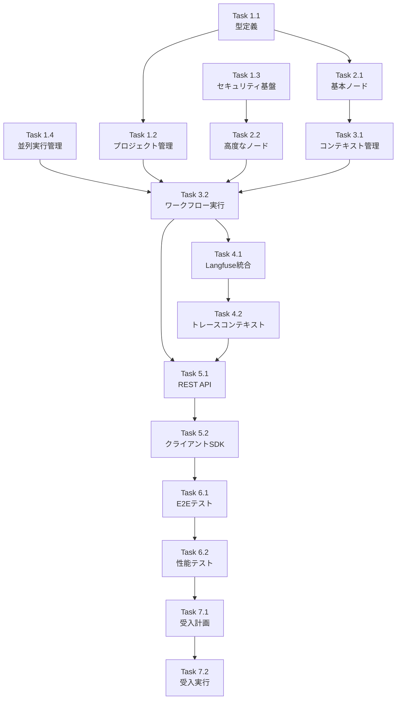

# Issue #363 作業計画書

**Issue**: #363 - feat(mySwiftAgentCore): TaskFlow実行エンジンの実装
**作成日**: 2026-01-16
**作業見積**: 48時間（6人日）
**優先度**: High
**依存Issue**: #365（CapabilityManagementのパターン参考）

---

## 1. Issue概要

graphAiServerで実装されたTaskFlow実行エンジンをTypeScriptに移植し、mySwiftAgentCoreの中核コンポーネントとして実装する。Langfuseトレーシングを統合し、プロジェクトベースのワークフロー管理を実現する。

### 主要機能
- graphAiServer互換のワークフロー実行
- プロジェクト単位のワークフロー管理
- Langfuseトレーシング統合
- セキュアなcode_jsノード実行（isolated-vm）
- 並列実行制御（p-limit）

---

## 2. 詳細タスク分解

### Phase 1: 基盤実装（16時間）

#### Task 1.1: 型定義とアダプター実装（4時間）
- [ ] `types/` ディレクトリ作成
- [ ] `TaskFlowDefinition.ts` - graphAiServer互換型定義
- [ ] `InternalWorkflowDefinition.ts` - 内部統一型定義
- [ ] `adapter/TaskFlowDefinitionAdapter.ts` - 双方向変換実装（DP-5）
- [ ] 型定義の単体テスト作成

#### Task 1.2: プロジェクト管理基盤（4時間）
- [ ] `registry/ProjectManager.ts` - プロジェクト管理
- [ ] `registry/WorkflowRegistry.ts` - ワークフロー登録・取得
- [ ] `loader/WorkflowLoader.ts` - JSONファイル読み込み
- [ ] プロジェクト管理の単体テスト作成

#### Task 1.3: セキュリティ基盤（4時間）
- [ ] `sandbox/CodeJsSandbox.ts` - isolated-vm実装（DP-6）
- [ ] `sandbox/ScriptWhitelist.ts` - ホワイトリスト管理
- [ ] `sandbox/SecurityError.ts` - セキュリティエラー定義
- [ ] `config/taskflow/scripts/whitelist.yaml` - ホワイトリスト設定
- [ ] サンドボックスの単体テスト作成

#### Task 1.4: 並列実行管理（4時間）
- [ ] `executor/ParallelExecutionManager.ts` - p-limit実装（DP-7）
- [ ] 3層制限ロジック（グローバル/ワークフロー/ノードタイプ）
- [ ] メトリクス収集機能
- [ ] 並列実行の単体テスト作成

### Phase 2: ノード実装（12時間）

#### Task 2.1: 基本ノード実装（6時間）
- [ ] `nodes/BaseNode.ts` - 共通インターフェース
- [ ] `nodes/ApiRestNode.ts` - REST API呼び出し
- [ ] `nodes/TransformNode.ts` - データ変換
- [ ] 各ノードの単体テスト作成

#### Task 2.2: 高度なノード実装（6時間）
- [ ] `nodes/CodeJsNode.ts` - JavaScriptコード実行（サンドボックス統合）
- [ ] `nodes/LlmNode.ts` - LLM呼び出し
- [ ] `nodes/ParallelNode.ts` - 並列実行ブロック
- [ ] 各ノードの単体テスト作成

### Phase 3: 実行エンジン実装（8時間）

#### Task 3.1: コンテキスト管理（2時間）
- [ ] `executor/ContextManager.ts` - 変数解決、データ管理
- [ ] 変数参照解決（`${inputs.xxx}`, `${step_id.output.xxx}`）
- [ ] コンテキストの単体テスト作成

#### Task 3.2: ワークフロー実行（4時間）
- [ ] `executor/WorkflowExecutor.ts` - メイン実行ロジック
- [ ] `executor/SequentialExecutor.ts` - 逐次実行
- [ ] `executor/ParallelExecutor.ts` - 並列実行（Manager統合）
- [ ] 実行エンジンの単体テスト作成

#### Task 3.3: スキーマ検証（2時間）
- [ ] `validator/SchemaValidator.ts` - Zod検証実装
- [ ] 入力/出力スキーマ検証
- [ ] 検証の単体テスト作成

### Phase 4: トレーシング実装（6時間）

#### Task 4.1: Langfuse統合（4時間）
- [ ] `tracer/LangfuseTracer.ts` - トレーサー実装
- [ ] `tracer/SpanBuilder.ts` - Span構築ヘルパー
- [ ] ワークフロー/ステップ/APIコールのトレース
- [ ] トレーシングの単体テスト作成

#### Task 4.2: トレースコンテキスト管理（2時間）
- [ ] 外部trace_contextの引き継ぎ
- [ ] エラー時のトレース記録
- [ ] LLM GenerationとSpanの使い分け

### Phase 5: API実装（4時間）

#### Task 5.1: REST APIエンドポイント（2時間）
- [ ] `api/handlers.ts` - リクエストハンドラー
- [ ] `api/routes.ts` - Honoルーター設定
- [ ] `POST /api/v1/taskflow/execute` - ワークフロー実行
- [ ] `GET /api/v1/taskflow/workflows` - ワークフロー一覧

#### Task 5.2: クライアントSDK（2時間）
- [ ] `client/TaskFlowClient.ts` - TypeScript SDK
- [ ] execute(), listWorkflows()メソッド
- [ ] SDKの単体テスト作成

### Phase 6: 結合テスト（4時間）

#### Task 6.1: エンドツーエンドテスト（3時間）
- [ ] 基本的なワークフロー実行テスト
- [ ] 並列実行を含むワークフローテスト
- [ ] エラーハンドリングテスト
- [ ] トレーシング統合テスト

#### Task 6.2: パフォーマンステスト（1時間）
- [ ] 並列実行数制限の動作確認
- [ ] メモリ使用量の確認
- [ ] レスポンスタイム測定

### Phase 7: 受入テスト（4時間）

#### Task 7.1: L3受入テスト計画（1時間）
- [ ] 受入テストシナリオ作成
- [ ] テストデータ準備

#### Task 7.2: L3受入テスト実行（3時間）
- [ ] 実APIを使用した受入テスト作成
- [ ] 全受入条件の検証

---

## 3. タスク依存関係



---

## 4. 作業スケジュール（6日間）

### Day 1: 基盤構築
- Morning: Task 1.1（型定義とアダプター）
- Afternoon: Task 1.2（プロジェクト管理）

### Day 2: セキュリティと並列処理
- Morning: Task 1.3（セキュリティ基盤）
- Afternoon: Task 1.4（並列実行管理）

### Day 3: ノード実装
- Morning: Task 2.1（基本ノード）
- Afternoon: Task 2.2（高度なノード）

### Day 4: 実行エンジン
- Morning: Task 3.1-3.2（コンテキストとワークフロー実行）
- Afternoon: Task 3.3（検証）、Task 4.1（Langfuse前半）

### Day 5: トレーシングとAPI
- Morning: Task 4.1-4.2（Langfuse完成）
- Afternoon: Task 5.1-5.2（API実装）

### Day 6: テストと品質保証
- Morning: Task 6.1-6.2（結合テスト）
- Afternoon: Task 7.1-7.2（受入テスト）

---

## 5. チェックポイント

| タイミング | 確認事項 | 対応 |
|-----------|---------|------|
| Task 1.4完了時 | 基盤アーキテクチャの妥当性 | 設計レビュー |
| Task 2.2完了時 | ノード実装の網羅性 | 単体テスト確認 |
| Task 3.2完了時 | ワークフロー実行の正確性 | 統合テスト実施 |
| Task 4.2完了時 | トレーシングの可視性 | Langfuseダッシュボード確認 |
| Task 6.2完了時 | 性能要件の達成 | ベンチマーク結果確認 |

---

## 6. リスクと対策

| リスク | 発生確率 | 影響 | 対策 |
|-------|---------|------|------|
| isolated-vmの互換性問題 | 中 | 高 | 代替ライブラリ（vm2等）の調査 |
| graphAiServerとの型不整合 | 中 | 中 | アダプター層での吸収、段階的移行 |
| Langfuseレイテンシ | 低 | 中 | 非同期トレース送信、バッチ処理 |
| 並列実行のデッドロック | 低 | 高 | タイムアウト設定、リソース監視 |

---

## 7. 成果物チェックリスト

### コード
- [x] `src/taskflowEngine/` 配下の全実装ファイル
- [x] 型定義（TaskFlowDefinition, InternalWorkflowDefinition）
- [x] アダプター（TaskFlowDefinitionAdapter）
- [x] セキュリティ（CodeJsSandbox, WhitelistManager）
- [x] 並列制御（ParallelExecutionManager）
- [x] ノード実装（5種類）
- [x] 実行エンジン（WorkflowExecutor）
- [x] トレーシング（LangfuseTracer）
- [x] API（handlers, routes）
- [x] クライアントSDK（TaskFlowClient）

### テスト
- [x] 単体テスト（カバレッジ90%以上）
- [x] 結合テスト
- [x] 受入テスト

### 設定ファイル
- [x] `config/taskflow/scripts/whitelist.yaml`
- [x] `config/taskflow/projects/default_project/workflows/` サンプル

### ドキュメント
- [x] API仕様書更新
- [x] SDK使用方法
- [x] ワークフロー定義ガイド

---

## 8. L3受入テスト計画

### 環境準備

```bash
# mySwiftAgentCore起動
cd mySwiftAgentCore
npm run dev

# Langfuse起動確認（docker-compose経由）
docker compose up -d langfuse
```

### 受入テストケース

#### 1. ヘルスチェック

```bash
# サービス起動確認
curl -sf http://localhost:8006/health && echo "✅ mySwiftAgentCore healthy"
```

#### 2. 基本的なワークフロー実行

```bash
# サンプルワークフロー実行
curl -s -X POST http://localhost:8006/api/v1/taskflow/execute \
  -H "Authorization: Bearer ${API_TOKEN}" \
  -H "Content-Type: application/json" \
  -d '{
    "project": "default_project",
    "workflow": "hello_world",
    "inputs": {
      "name": "TaskFlow"
    }
  }' | jq
```

#### 3. 並列実行を含むワークフロー

```bash
# 並列実行ワークフロー
curl -s -X POST http://localhost:8006/api/v1/taskflow/execute \
  -H "Authorization: Bearer ${API_TOKEN}" \
  -H "Content-Type: application/json" \
  -d '{
    "project": "default_project",
    "workflow": "parallel_api_calls",
    "inputs": {
      "user_id": "test_user_123"
    }
  }' | jq
```

#### 4. code_jsノードのセキュリティ確認

```bash
# 許可されたスクリプト実行
curl -s -X POST http://localhost:8006/api/v1/taskflow/execute \
  -H "Authorization: Bearer ${API_TOKEN}" \
  -H "Content-Type: application/json" \
  -d '{
    "project": "default_project",
    "workflow": "calculate_risk_score",
    "inputs": {
      "age": 30,
      "income": 50000
    }
  }' | jq

# 禁止されたスクリプト実行（エラー期待）
curl -s -X POST http://localhost:8006/api/v1/taskflow/execute \
  -H "Authorization: Bearer ${API_TOKEN}" \
  -H "Content-Type: application/json" \
  -d '{
    "project": "default_project",
    "workflow": "malicious_script",
    "inputs": {}
  }' | jq
```

#### 5. Langfuseトレース確認

```bash
# トレースコンテキスト付き実行
curl -s -X POST http://localhost:8006/api/v1/taskflow/execute \
  -H "Authorization: Bearer ${API_TOKEN}" \
  -H "Content-Type: application/json" \
  -d '{
    "project": "default_project",
    "workflow": "user_analysis",
    "inputs": {
      "user_id": "123"
    },
    "trace_context": {
      "trace_id": "test_trace_001",
      "parent_span_id": "parent_span_123",
      "metadata": {
        "source": "acceptance_test"
      }
    }
  }' | jq

# Langfuseダッシュボードでトレース確認
echo "Check trace at: http://localhost:3001/trace/test_trace_001"
```

#### 6. ワークフロー一覧取得

```bash
# プロジェクトのワークフロー一覧
curl -s -X GET "http://localhost:8006/api/v1/taskflow/workflows?project=default_project" \
  -H "Authorization: Bearer ${API_TOKEN}" | jq
```

#### 7. エラーハンドリング確認

```bash
# 入力検証エラー
curl -s -X POST http://localhost:8006/api/v1/taskflow/execute \
  -H "Authorization: Bearer ${API_TOKEN}" \
  -H "Content-Type: application/json" \
  -d '{
    "project": "default_project",
    "workflow": "strict_schema_workflow",
    "inputs": {
      "invalid_field": "should_be_number"
    }
  }' | jq

# 存在しないワークフロー
curl -s -X POST http://localhost:8006/api/v1/taskflow/execute \
  -H "Authorization: Bearer ${API_TOKEN}" \
  -H "Content-Type: application/json" \
  -d '{
    "project": "default_project",
    "workflow": "non_existent_workflow",
    "inputs": {}
  }' | jq
```

#### 8. SDK経由の実行（TypeScript）

```typescript
// test-sdk.ts
import { TaskFlowClient } from '@myswiftagent/core';

const client = new TaskFlowClient({
  baseUrl: 'http://localhost:8006',
  apiToken: process.env.API_TOKEN
});

// 実行テスト
const result = await client.execute({
  project: 'default_project',
  workflow: 'hello_world',
  inputs: { name: 'SDK Test' }
});

console.log('Result:', result);

// ワークフロー一覧テスト
const workflows = await client.listWorkflows('default_project');
console.log('Workflows:', workflows);
```

---

## 9. Definition of Done

- [x] すべてのタスクが完了
- [x] 単体テストカバレッジ90%以上
- [x] 結合テスト全パス
- [x] L3受入テスト全パス（8ケース）
- [x] ESLintエラー0
- [x] TypeScriptコンパイルエラー0
- [x] Langfuseトレースが正常に記録される
- [x] APIドキュメント更新完了
- [x] コードレビュー承認

---

## 10. 備考

- graphAiServerのTaskFlow仕様との互換性を最優先
- isolated-vmのNode.jsバージョン要件に注意（Node 18+推奨）
- Langfuse接続情報は環境変数で管理
- サンプルワークフローとスクリプトを同時に作成

---

**作成者**: テックリード
**承認者**: _________________
**承認日**: _________________