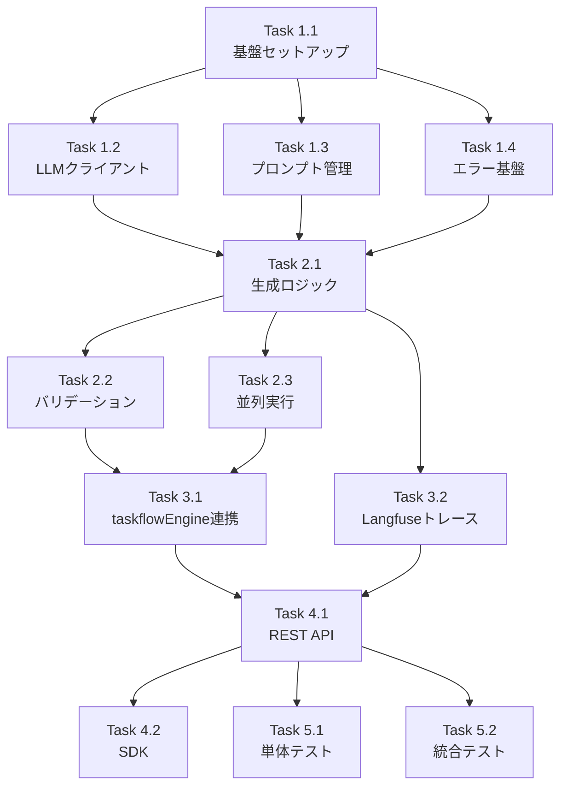

# Issue #364 作業計画書

**Issue**: #364 - feat(mySwiftAgentCore): taskflowGeneratorAgent - ワークフロー生成エージェントの実装
**Issue番号**: #364
**サイズ**: L（大規模）
**作業見積**: 24時間
**優先度**: High
**依存Issue**: #363（taskflowEngine実装）, #365（capabilityManagement）

---

## 1. Issue概要

Issue #359で設計された3フェーズ統一ID方式のPhase 3: WORKFLOW_GENをTypeScriptで新規実装する。expertAgentから分離し、HTTP API経由で呼び出される独立したサービスとして構築。

### 主要要件
- タスク定義からTaskFlow JSON生成
- Capabilityベースの動的ワークフロー生成
- expertAgentからのLangfuseトレース引き継ぎ
- 並列実行による高速化
- 3種類のリカバリー戦略実装

---

## 2. 詳細タスク分解

### Phase 1: 基盤実装（8時間）

#### Task 1.1: プロジェクト基盤セットアップ（2時間）
- ディレクトリ構造作成
- TypeScript設定
- 依存パッケージ設定（Hono, Zod, Langfuse SDK等）
- API基本構造（Honoルーター）

#### Task 1.2: LLMクライアント抽象化（3時間）
- LLMClient インターフェース定義
- AnthropicClient 実装
- OpenAIClient 実装
- GeminiClient 実装
- LLMClientFactory（MyVault統合）
- モデル切り替えテスト

#### Task 1.3: プロンプト管理システム（2時間）
- PromptBuilder クラス実装
- システムプロンプトテンプレート
- TaskFlowルール定義（GRAPHAI_WORKFLOW_GENERATION_RULES.md参照）
- Capability注入ロジック
- Few-shot examples

#### Task 1.4: エラーハンドリング基盤（1時間）
- ErrorType enum定義（OpenAPI準拠）
- RecoveryStrategy enum定義（OpenAPI準拠）
- ErrorHandler クラス
- リトライロジック（指数バックオフ）

### Phase 2: コア機能実装（8時間）

#### Task 2.1: ワークフロー生成ロジック（4時間）
- WorkflowGenerator クラス
- 単一タスク生成（generateSingle）
- プロンプト構築→LLM呼び出し→パース
- エラーハンドリング
- リトライ機能実装

#### Task 2.2: バリデーションパイプライン（2時間）
- TaskFlowValidator インターフェース
- SchemaValidator（Zodスキーマ検証）
- DependencyValidator（依存関係検証）
- VariableValidator（変数参照検証）
- CapabilityValidator（capability存在確認）
- SecurityValidator（セキュリティチェック）

#### Task 2.3: 並列実行管理（2時間）
- BatchProcessor クラス
- p-limit統合（同時実行数制御）
- Promise.allSettled実装
- 部分成功の集約ロジック
- タイムアウト制御

### Phase 3: 統合実装（4時間）

#### Task 3.1: taskflowEngine連携（2時間）
- WorkflowRegistrar クラス
- TaskFlowClient実装（#363 API呼び出し）
- TaskFlowDefinitionAdapter統合
- 登録成功/失敗ハンドリング

#### Task 3.2: Langfuseトレース統合（2時間）
- LangfuseIntegration クラス
- expertAgentからのtrace_context引き継ぎ
- WORKFLOW_GENスパン作成
- LLM Generation記録
- エラーイベント記録
- メトリクス収集

### Phase 4: API実装（2時間）

#### Task 4.1: REST APIエンドポイント（1時間）
- POST /api/v1/generator/workflow/batch
- GET /api/v1/generator/status/{trace_id}
- GET /api/v1/generator/health
- ミドルウェア（認証、ロギング）

#### Task 4.2: TypeScript SDK（1時間）
- TaskFlowGeneratorClient クラス
- 型定義（OpenAPI準拠）
- エラーハンドリング
- 使用例ドキュメント

### Phase 5: テスト実装（2時間）

#### Task 5.1: 単体テスト（1時間）
- 各コンポーネントのユニットテスト
- モック作成（LLMClient、TaskFlowClient）
- カバレッジ90%達成

#### Task 5.2: 統合テスト（1時間）
- APIエンドポイントテスト
- エラーシナリオテスト
- 並列実行テスト
- タイムアウトテスト

---

## 3. タスク依存関係



---

## 4. 作業スケジュール

### Day 1（8時間）
- **AM**: Task 1.1～1.4（基盤実装）
- **PM**: Task 2.1（ワークフロー生成ロジック）

### Day 2（8時間）
- **AM**: Task 2.2～2.3（バリデーション、並列実行）
- **PM**: Task 3.1～3.2（統合実装）

### Day 3（8時間）
- **AM**: Task 4.1～4.2（API実装）
- **PM**: Task 5.1～5.2（テスト実装）
- **最終確認**: 受入テスト準備

---

## 5. チェックポイント

| タイミング | 確認事項 | 判定基準 |
|-----------|---------|---------|
| Task 1.2完了時 | LLMクライアント動作確認 | 3プロバイダーでHello World生成成功 |
| Task 2.1完了時 | 単一ワークフロー生成確認 | サンプルタスクでTaskFlow JSON生成 |
| Task 2.3完了時 | 並列実行確認 | 5タスク同時実行で部分成功処理 |
| Task 3.1完了時 | taskflowEngine連携確認 | ワークフロー登録成功 |
| Task 3.2完了時 | Langfuseトレース確認 | ダッシュボードでトレース表示 |
| Phase 4完了時 | E2E動作確認 | expertAgentからのAPI呼び出し成功 |

---

## 6. リスクと対策

| リスク | 発生確率 | 影響度 | 対策 |
|-------|---------|--------|------|
| OpenAPI仕様の不整合 | 中 | 高 | 早期にexpertAgent側と仕様確定、モックサーバーでテスト |
| LLMレート制限 | 高 | 中 | リトライロジック実装、レート制限エラーハンドリング |
| taskflowEngine API未完成 | 中 | 高 | モックAPI作成、#363と並行開発調整 |
| Langfuseトレース引き継ぎ失敗 | 低 | 中 | trace_contextの詳細仕様確認、フォールバック実装 |
| TypeScript型定義の複雑化 | 中 | 低 | OpenAPI仕様を正とし、コード生成ツール活用 |

---

## 7. 成果物チェックリスト

### コード成果物
- [ ] `mySwiftAgentCore/src/taskflowGeneratorAgent/index.ts`
- [ ] `mySwiftAgentCore/src/taskflowGeneratorAgent/generator/WorkflowGenerator.ts`
- [ ] `mySwiftAgentCore/src/taskflowGeneratorAgent/llm/LLMClient.ts`
- [ ] `mySwiftAgentCore/src/taskflowGeneratorAgent/llm/clients/*.ts`（3ファイル）
- [ ] `mySwiftAgentCore/src/taskflowGeneratorAgent/validator/*.ts`（5ファイル）
- [ ] `mySwiftAgentCore/src/taskflowGeneratorAgent/tracing/LangfuseIntegration.ts`
- [ ] `mySwiftAgentCore/src/taskflowGeneratorAgent/api/routes.ts`
- [ ] `mySwiftAgentCore/src/taskflowGeneratorAgent/client/TaskFlowGeneratorClient.ts`

### テスト成果物
- [ ] `mySwiftAgentCore/tests/unit/taskflowGeneratorAgent/*.test.ts`（10ファイル以上）
- [ ] `mySwiftAgentCore/tests/integration/taskflowGeneratorAgent/*.test.ts`（3ファイル）
- [ ] `mySwiftAgentCore/tests/acceptance/test_issue_364_acceptance.py`

### ドキュメント成果物
- [ ] `docs/spec/api/taskflow-generator-api.yaml`（OpenAPI仕様）
- [ ] `mySwiftAgentCore/src/taskflowGeneratorAgent/README.md`
- [ ] 統合ガイド（expertAgentとの連携方法）

---

## 8. L3受入テスト計画

### 前提条件
- mySwiftAgentCore起動（`npm run dev`）
- taskflowEngine起動（#363）
- MyVault起動（APIキー管理）
- Langfuse起動（トレーシング）

### 健全性確認

```bash
# mySwiftAgentCore health check
curl -sf http://localhost:8006/api/v1/generator/health && echo "✅ Generator healthy"

# taskflowEngine health check
curl -sf http://localhost:8006/api/v1/taskflow/health && echo "✅ TaskflowEngine healthy"

# MyVault health check
curl -sf http://localhost:8103/health && echo "✅ MyVault healthy"

# Langfuse health check
curl -sf http://localhost:3001/api/public/health && echo "✅ Langfuse healthy"
```

### 正常系テスト

#### TC-001: 単一ワークフロー生成

```bash
# 単一タスクのワークフロー生成
curl -s -X POST http://localhost:8006/api/v1/generator/workflow/batch \
  -H "Content-Type: application/json" \
  -H "Authorization: Bearer ${API_TOKEN}" \
  -d '{
    "tasks": [{
      "task_id": "task_001",
      "task_master_id": "tm_001",
      "name": "ユーザー分析レポート生成",
      "description": "指定されたユーザーの行動分析レポートを生成",
      "dependencies": [],
      "interface": {
        "input": { "user_id": "string" },
        "output": { "report": "string", "score": "number" }
      }
    }],
    "capabilities": [{
      "id": "user_api",
      "name": "User API",
      "category": "api",
      "status": "available"
    }],
    "project_id": "test_project",
    "options": {
      "max_concurrency": 1,
      "validate_before_register": true
    }
  }' | jq '.'

# 期待: status 200, success: true, workflows.task_001 存在
```

#### TC-002: 並列バッチ生成

```bash
# 5タスクの並列生成
curl -s -X POST http://localhost:8006/api/v1/generator/workflow/batch \
  -H "Content-Type: application/json" \
  -H "Authorization: Bearer ${API_TOKEN}" \
  -d '{
    "tasks": [
      {"task_id": "task_001", "task_master_id": "tm_001", "name": "Task 1", ...},
      {"task_id": "task_002", "task_master_id": "tm_002", "name": "Task 2", ...},
      {"task_id": "task_003", "task_master_id": "tm_003", "name": "Task 3", ...},
      {"task_id": "task_004", "task_master_id": "tm_004", "name": "Task 4", ...},
      {"task_id": "task_005", "task_master_id": "tm_005", "name": "Task 5", ...}
    ],
    "capabilities": [...],
    "project_id": "test_project",
    "options": {
      "max_concurrency": 3,
      "timeout_per_task_ms": 30000
    }
  }' | jq '.workflows | length'

# 期待: 5タスク全て生成、並列実行確認
```

#### TC-003: Langfuseトレース引き継ぎ

```bash
# trace_context付きリクエスト
curl -s -X POST http://localhost:8006/api/v1/generator/workflow/batch \
  -H "Content-Type: application/json" \
  -H "Authorization: Bearer ${API_TOKEN}" \
  -d '{
    "tasks": [...],
    "capabilities": [...],
    "trace_context": {
      "trace_id": "job_gen_test_001",
      "parent_span_id": "registration_span_001",
      "user_id": "test_user",
      "session_id": "test_session"
    }
  }' | jq '.trace_url'

# Langfuseダッシュボードでトレース確認
open "http://localhost:3001/trace/job_gen_test_001"
```

### 異常系テスト

#### TC-004: バリデーションエラー

```bash
# 不正なタスク定義
curl -s -X POST http://localhost:8006/api/v1/generator/workflow/batch \
  -H "Content-Type: application/json" \
  -H "Authorization: Bearer ${API_TOKEN}" \
  -d '{
    "tasks": [{
      "task_id": "invalid_task",
      "name": "",
      "dependencies": ["non_existent_task"]
    }],
    "capabilities": []
  }' -w '\nHTTP_STATUS:%{http_code}'

# 期待: status 400, エラー詳細
```

#### TC-005: リトライシナリオ

```bash
# レート制限シミュレーション（大量タスク）
curl -s -X POST http://localhost:8006/api/v1/generator/workflow/batch \
  -H "Content-Type: application/json" \
  -H "Authorization: Bearer ${API_TOKEN}" \
  -d '{
    "tasks": [/* 20 tasks */],
    "options": {
      "max_concurrency": 10
    }
  }' | jq '.failed_tasks[] | select(.recovery_suggestion == "RETRY_CURRENT")'

# 期待: リトライ可能エラーの識別
```

### 外部サービス連携確認

```bash
# MyVault APIキー取得確認
curl -sf http://localhost:8103/api/v1/secrets/anthropic_api_key \
  -H "Authorization: Bearer ${MYVAULT_TOKEN}" && echo "✅ API key accessible"

# taskflowEngine登録確認
curl -sf http://localhost:8006/api/v1/taskflow/workflows?project=test_project | \
  jq '.workflows | length'

# Langfuseトレース確認
curl -sf http://localhost:3001/api/public/traces?name=WORKFLOW_GEN | \
  jq '.data | length'
```

---

## 9. Definition of Done

- [ ] 全タスク（Task 1.1～5.2）完了
- [ ] 単体テストカバレッジ90%以上
- [ ] 静的解析エラー0件（ESLint、TypeScript strict mode）
- [ ] OpenAPI仕様準拠の型定義
- [ ] expertAgentとの結合テスト成功
- [ ] taskflowEngineへの登録確認
- [ ] Langfuseでトレース表示確認
- [ ] L3受入テスト全項目パス
- [ ] CI/CDパイプライン通過
- [ ] コードレビュー承認
- [ ] APIドキュメント完成

---

**作成日**: 2026-01-16
**作成者**: Claude (Work Plan Assistant)
**対象Issue**: #364