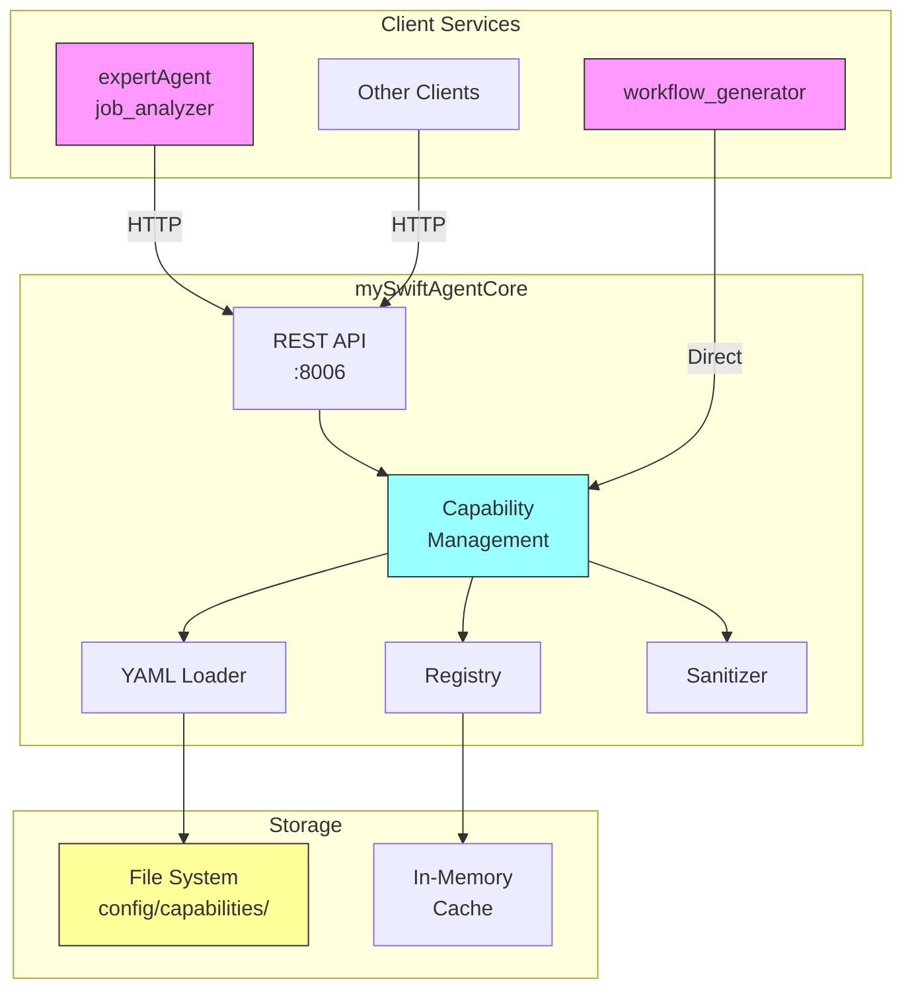
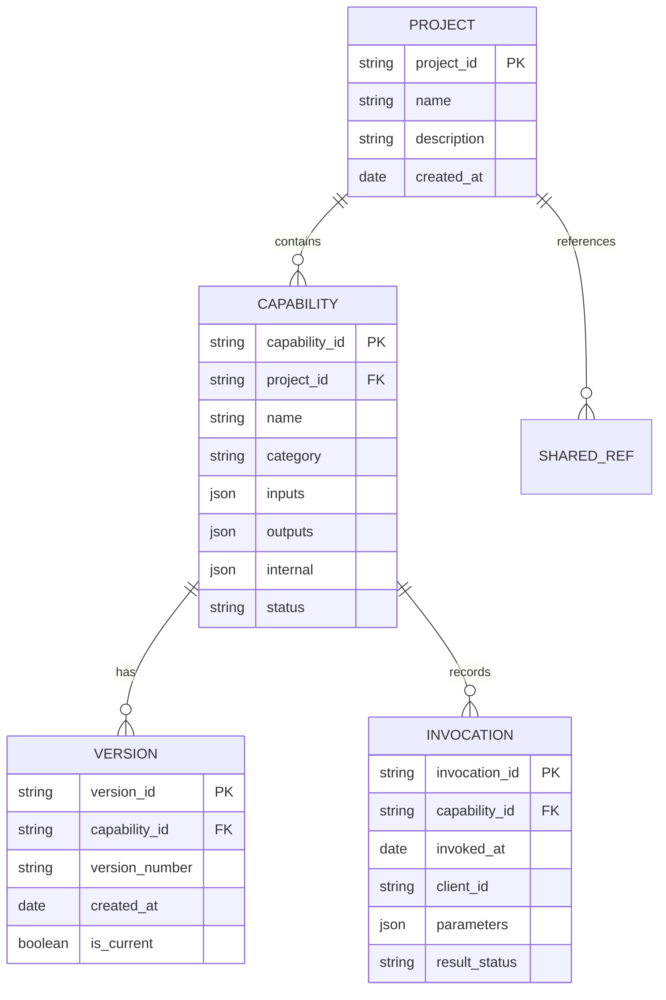

# Issue #365: Capability Management System設計方針書

## 1. 概要

mySwiftAgentCoreにおいて、プロジェクト単位でcapabilities（利用可能なAPI、ツール、機能の定義）を一元管理するシステムを実装する。現在expertAgentとgraphAiServerに散在するcapability定義を統合し、job_analyzer・workflow_generator両方から活用可能にする。

## 2. 現状分析

### 2.1 既存実装の調査結果

| 項目 | expertAgent | graphAiServer | mySwiftAgentCore |
|-----|------------|---------------|------------------|
| **capability定義** | YAMLファイル（904行） | YAMLファイル（agents定義） | 型定義のみ実装済み |
| **管理方式** | ファイルベース | ファイルベース | Map型レジストリ（スタブ） |
| **利用方法** | LLMプロンプトに埋め込み | 直接参照 | REST API（予定） |
| **内部詳細の扱い** | 全て公開 | 全て公開 | 分離機能なし |

### 2.2 課題

1. **分散管理**: capabilityがexpertAgent内のYAMLファイルに散在
2. **不整合**: job_analyzerは参照するが、workflow_generatorは未参照
3. **セキュリティ**: 内部実装詳細（APIキー参照等）が露出
4. **プロジェクト横断**: 共有・管理の仕組みが不在

## 3. アーキテクチャ設計

### 3.1 システム構成図



### 3.2 ディレクトリ構成

```
mySwiftAgentCore/
├── config/capabilities/
│   ├── default_project/         # 既存YAMLの移行先
│   │   ├── google_search.yaml
│   │   ├── gmail_send.yaml
│   │   └── index.yaml          # capabilityリスト
│   ├── project_a/              # プロジェクト固有
│   │   ├── internal_api.yaml
│   │   └── index.yaml
│   └── _shared/                # 共有capabilities
│       └── common_utils.yaml
│
└── src/capabilityManagement/
    ├── registry/
    │   ├── CapabilityRegistry.ts    # 既存実装を拡張
    │   ├── ProjectManager.ts        # プロジェクト管理
    │   └── VersionManager.ts        # バージョン管理
    ├── loader/
    │   ├── YamlLoader.ts           # YAML読込・検証
    │   ├── SchemaValidator.ts      # Zodスキーマ検証
    │   └── Sanitizer.ts            # 内部詳細の除外
    ├── api/
    │   ├── routes.ts               # APIエンドポイント
    │   ├── handlers.ts             # リクエストハンドラ
    │   └── middleware.ts           # 認証・レート制限
    └── client/
        └── CapabilityClient.ts     # 他サービス向け
```

## 4. データモデル設計

### 4.1 Capability拡張スキーマ

```yaml
# capability定義（google_search.yaml）
capability_id: google_search
name: Google検索
description: Google Custom Search APIを使用した検索
version: "1.0"
project: default_project       # プロジェクト所属
category: search              # カテゴリ（既存型定義を活用）

# 公開情報（クライアントに返却）
inputs:
  query:
    type: string
    description: 検索クエリ
    required: true
  num_results:
    type: integer
    description: 結果数
    default: 10

outputs:
  results:
    type: array
    items:
      type: object
      properties:
        title: { type: string }
        url: { type: string }
        snippet: { type: string }

# 内部実装詳細（クライアントには非公開）
_internal:
  endpoint: https://www.googleapis.com/customsearch/v1
  method: GET
  auth_type: api_key
  secret_key: GOOGLE_SEARCH_API_KEY
  headers:
    Accept: application/json
```

### 4.2 ER図



## 5. API設計

### 5.1 エンドポイント設計

既存のmySwiftAgentCore APIパターンに準拠：

| Method | Path | Description | Auth |
|--------|------|-------------|------|
| GET | `/api/v1/capabilities` | 一覧取得 | API Token |
| GET | `/api/v1/capabilities/{id}` | 詳細取得 | API Token |
| POST | `/api/v1/capabilities/search` | 検索 | API Token |
| GET | `/api/v1/capabilities/yaml` | YAML形式取得 | API Token |
| POST | `/api/v1/capabilities` | 登録 | Admin Token |
| PUT | `/api/v1/capabilities/{id}` | 更新 | Admin Token |
| DELETE | `/api/v1/capabilities/{id}` | 削除 | Admin Token |

### 5.2 リクエスト/レスポンス形式

#### 一覧取得
```http
GET /api/v1/capabilities?project=default_project&category=search
Authorization: Bearer {API_TOKEN}

Response 200:
{
  "capabilities": [
    {
      "capability_id": "google_search",
      "name": "Google検索",
      "description": "...",
      "category": "search",
      "inputs": { ... },
      "outputs": { ... }
      // _internal は含まない
    }
  ],
  "total": 1,
  "project": "default_project"
}
```

#### YAML形式取得（LLMプロンプト用）
```http
GET /api/v1/capabilities/yaml?project=default_project
Authorization: Bearer {API_TOKEN}

Response 200:
Content-Type: text/yaml

capabilities:
  - id: google_search
    name: Google検索
    description: ...
    inputs:
      - name: query
        type: string
        required: true
    outputs:
      - name: results
        type: array
```

### 5.3 エラーハンドリング

既存のエラー型を活用：

```typescript
// shared/types/error.types.ts の既存型を使用
interface ApiError {
  code: string;
  message: string;
  details?: Record<string, unknown>;
  trace_id?: string;
}

// 例：capability not found
{
  "error": {
    "code": "CAPABILITY_NOT_FOUND",
    "message": "Capability 'invalid_id' not found in project 'default_project'",
    "trace_id": "req_123456"
  }
}
```

## 6. 技術選定

既存のmySwiftAgentCore技術スタックを踏襲：

| カテゴリ | 選定技術 | 選定理由 | 既存との整合性 |
|---------|---------|---------|---------------|
| 言語 | TypeScript 5.x | 型安全性、既存コードベース | ✓ 完全一致 |
| フレームワーク | Hono | 軽量、TypeScript-first | ✓ 採用済み |
| 検証 | Zod | スキーマ検証、型推論 | ✓ 採用済み |
| YAMLパーサー | js-yaml | 標準的、TypeScript対応 | 新規（妥当） |
| テスト | Vitest | 高速、TypeScript native | ✓ 採用済み |

## 7. 設計パターン

既存実装で使用されているパターンを継承・拡張：

### 7.1 Registry パターン（既存拡張）
```typescript
// 既存のCapabilityManagementクラスを拡張
class CapabilityRegistry extends CapabilityManagement {
  private projects: Map<string, ProjectCapabilities>;

  // プロジェクト対応の新メソッド
  registerForProject(projectId: string, capability: Capability): void;
  getByProject(projectId: string, filter?: CapabilityFilter): Capability[];

  // 共有capability参照
  includeShared(projectId: string, sharedIds: string[]): void;
}
```

### 7.2 Strategy パターン（ローダー）
```typescript
interface LoaderStrategy {
  load(path: string): Promise<RawCapability[]>;
  validate(raw: unknown): CapabilityDefinition;
}

class YamlLoaderStrategy implements LoaderStrategy { }
class JsonLoaderStrategy implements LoaderStrategy { }
```

### 7.3 Facade パターン（既存ExecutionContext活用）
```typescript
// ExecutionContext経由でCapabilityManagementにアクセス
class ExecutionContext {
  // 既存
  constructor(
    private variableResolver: VariableResolver,
    private secretManager: SecretManager,
    private validationCoordinator: ValidationCoordinator,
    private capabilityManager: CapabilityRegistry  // 追加
  ) {}

  async getCapabilities(filter?: CapabilityFilter): Promise<Capability[]> {
    const projectId = this.variableResolver.resolve('${project_id}');
    return this.capabilityManager.getByProject(projectId, filter);
  }
}
```

## 8. セキュリティ設計

### 8.1 認証・認可

既存のauth.tsミドルウェアを活用：

```typescript
// 読み取り：API Token
router.get('/api/v1/capabilities', authMiddleware('api'), handler);

// 書き込み：Admin Token
router.post('/api/v1/capabilities', authMiddleware('admin'), handler);
```

### 8.2 内部詳細の保護

Sanitizerによる`_internal`セクションの除外：

```typescript
class Sanitizer {
  sanitize(capability: RawCapability): PublicCapability {
    const { _internal, ...publicData } = capability;
    return publicData as PublicCapability;
  }

  sanitizeForProject(capability: RawCapability, projectId: string): PublicCapability {
    // プロジェクト固有のフィルタリングルール適用
  }
}
```

### 8.3 シークレット管理

MyVault統合（既存SecretManager活用）：

```typescript
// _internal.secret_key の解決
const apiKey = await secretManager.get('GOOGLE_SEARCH_API_KEY');
```

## 9. パフォーマンス設計

### 9.1 キャッシング戦略

既存のキャッシュ機能を活用・拡張：

```typescript
interface CacheConfig {
  ttl: number;           // 既存：300秒
  maxSize: number;       // 新規：1000エントリ
  strategy: 'lru' | 'lfu'; // 新規：LRU推奨
}
```

### 9.2 遅延ローディング

```typescript
class ProjectCapabilities {
  private loaded = false;
  private capabilities: Map<string, Capability>;

  async ensureLoaded(): Promise<void> {
    if (!this.loaded) {
      await this.loadFromDisk();
      this.loaded = true;
    }
  }
}
```

### 9.3 バッチ処理

複数capability取得の最適化：

```typescript
// 個別取得の代わりにバッチ取得
const capabilities = await registry.getMany([
  'google_search',
  'gmail_send',
  'text_to_speech'
]);
```

## 10. 移行計画

### 10.1 既存YAML移行

Phase 1（初期実装）:

```bash
# 移行元
expertAgent/aiagent/langgraph/jobTaskGeneratorAgents/prompts/api_info/
├── google_search.yaml
├── gmail_send.yaml
└── ...

# 移行先
mySwiftAgentCore/config/capabilities/default_project/
├── google_search.yaml     # _internal セクション追加
├── gmail_send.yaml        # _internal セクション追加
└── index.yaml            # capability一覧
```

### 10.2 互換性維持

移行期間中の後方互換性：

```python
# expertAgent側のアダプター
class CapabilityAdapter:
    def __init__(self):
        self.client = CapabilityClient("http://localhost:8006")

    async def get_capabilities_yaml(self) -> str:
        # 新システムから取得
        try:
            return await self.client.get_capabilities_yaml("default_project")
        except Exception:
            # フォールバック：既存YAML読込
            return load_capabilities_from_yaml()
```

## 11. テスト戦略

既存のテスト方針（カバレッジ90%以上）に準拠：

### 11.1 単体テスト

```typescript
// CapabilityRegistry
describe('CapabilityRegistry', () => {
  test('プロジェクト単位の登録', async () => { });
  test('共有capability参照', async () => { });
  test('内部詳細の除外', async () => { });
});

// YamlLoader
describe('YamlLoader', () => {
  test('有効なYAML読込', async () => { });
  test('スキーマ検証', async () => { });
  test('不正なYAML拒否', async () => { });
});
```

### 11.2 統合テスト

```typescript
describe('Capability API Integration', () => {
  test('プロジェクト横断検索', async () => { });
  test('YAML形式エクスポート', async () => { });
  test('権限による制限', async () => { });
});
```

### 11.3 受入テスト

```typescript
describe('Issue #365 Acceptance', () => {
  test('既存YAML移行の確認', async () => { });
  test('expertAgentからの利用', async () => { });
  test('workflow_generatorからの利用', async () => { });
});
```

## 12. リスクと対策

### 12.1 技術的リスク

| リスク | 影響度 | 対策 |
|--------|--------|------|
| YAML構造の非互換性 | 高 | 段階的移行、バリデーション強化 |
| パフォーマンス劣化 | 中 | キャッシング、遅延ローディング |
| 既存システムへの影響 | 高 | アダプターパターンで分離 |

### 12.2 運用リスク

| リスク | 影響度 | 対策 |
|--------|--------|------|
| capability重複定義 | 中 | プロジェクト間バリデーション |
| バージョン不整合 | 低 | semantic versioning適用 |
| 権限管理の複雑化 | 中 | プロジェクトベース権限 |

## 13. 将来の拡張性

### 13.1 Phase 2での拡張予定

- **動的capability登録**: ランタイムでの登録・更新
- **capability合成**: 複数capabilityの組み合わせ
- **実行履歴分析**: 使用パターンの可視化

### 13.2 他Issueとの統合

- **Issue #363（TaskFlow Engine）**: capability実行エンジン
- **Issue #364（TaskFlow Generator）**: capability考慮の生成

## 14. 設計判断の根拠

### 14.1 ファイルベース管理の採用

**理由**:
- バージョン管理（Git）との親和性
- 設定の可視性と編集の容易さ
- 既存YAMLファイルの活用

**代替案（DB管理）を不採用の理由**:
- 初期実装の複雑性
- 小規模では過剰設計

### 14.2 内部詳細の分離（`_internal`）

**理由**:
- セキュリティ（APIキー等の保護）
- 抽象化（実装詳細の隠蔽）
- 将来の実装変更の容易性

### 14.3 プロジェクト単位管理

**理由**:
- マルチテナント対応
- capability名前空間の分離
- 段階的な移行の実現

## 15. 参照ドキュメント

- Issue #362: mySwiftAgentCore設計方針書
- `/mySwiftAgentCore/src/shared/types/capability.types.ts`: 型定義
- `/expertAgent/aiagent/langgraph/jobTaskGeneratorAgents/utils/config/expert_agent_capabilities.yaml`: 移行元
- `/docs/arch/service-dependencies.md`: サービス間連携

## 16. 必須改善項目対応状況

### 16.1 型定義の拡張 ✅ 完了

`mySwiftAgentCore/src/shared/types/capability.types.ts`に以下を追加：

```typescript
// 追加された型定義
export type HttpMethod = 'GET' | 'POST' | 'PUT' | 'DELETE' | 'PATCH';
export type AuthType = 'api_key' | 'bearer_token' | 'basic' | 'oauth2' | 'none';

export interface CapabilityInternal {
  endpoint?: string;
  method?: HttpMethod;
  auth_type?: AuthType;
  secret_key?: string;
  headers?: Record<string, string>;
  timeout_ms?: number;
  config?: Record<string, unknown>;
}

export interface CapabilityExtended extends Capability {
  project?: string;
  _internal?: CapabilityInternal;
}

export type RawCapability = CapabilityExtended;
export type PublicCapability = Omit<CapabilityExtended, '_internal'>;

export interface CapabilityLoadResult {
  successful: CapabilityExtended[];
  failed: Array<{ file: string; error: string; details?: unknown }>;
  totalAttempted: number;
  hasCapabilities: boolean;
}

// Zodスキーマも追加
export const CapabilityInternalSchema = z.object({ ... });
export const CapabilityExtendedSchema = CapabilitySchema.extend({ ... });
export const CapabilityLoadResultSchema = z.object({ ... });
```

### 16.2 YAMLパーサーのセキュリティ設定 ✅ 完了

`mySwiftAgentCore/src/capabilityManagement/loader/YamlLoader.ts`を新規作成：

```typescript
// セキュアなYAML読込
const parsed = yaml.load(content, {
  schema: yaml.JSON_SCHEMA,  // JSON互換の安全なスキーマ
  json: true,                // JSON互換性
  filename: fullPath,        // エラーメッセージ用
});
```

**セキュリティ対策**:
- `JSON_SCHEMA`により以下を防止:
  - JavaScript実行 (`!!js/function`)
  - Pythonオブジェクト生成 (`!!python/object`)
  - その他の危険なカスタムYAML型
- JSON互換型のみを許可（string, number, boolean, null, array, object）
- Zodスキーマによる二重検証

### 16.3 部分的失敗の明確な定義 ✅ 完了

`CapabilityLoadResult`インターフェースで明確に定義：

```typescript
interface CapabilityLoadResult {
  successful: CapabilityExtended[];  // 成功したcapability
  failed: Array<{                    // 失敗した読込
    file: string;
    error: string;
    details?: unknown;
  }>;
  totalAttempted: number;            // 試行総数
  hasCapabilities: boolean;          // 1件でも成功したか
}
```

---

**作成日**: 2026-01-16
**作成者**: Claude (Anthropic)
**レビュー**: 完了（条件付き承認 → 必須改善項目対応済み）
**更新日**: 2026-01-16