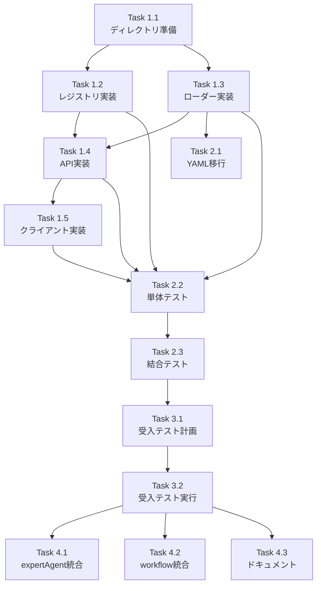

# Issue #365 作業計画書

## Issue: Capability一元管理システムの実装
**Issue番号**: #365
**サイズ**: L（大規模）
**作業見積**: 33時間
**優先度**: High
**依存Issue**: #362（mySwiftAgentCore基盤 - 完了済み）

## 1. 概要

プロジェクト単位でcapabilities（利用可能なAPI、ツール、機能の定義）を一元管理するシステムをmySwiftAgentCoreに実装する。現在expertAgentに散在するcapability定義を統合し、job_analyzer・workflow_generator両方から活用可能にする。

## 2. 詳細タスク分解

### Phase 1: 基盤実装（12時間）

#### Task 1.1: ディレクトリ構造の準備（1時間）
- `config/capabilities/`ディレクトリ構造作成
- default_project、_sharedフォルダ作成
- .gitkeepファイル配置

#### Task 1.2: レジストリ実装（3時間）
- CapabilityRegistry.ts実装（既存CapabilityManagement拡張）
- ProjectManager.ts実装
- プロジェクト単位の管理機能追加

#### Task 1.3: ローダー実装（2時間） ✅ 一部完了
- ~~YamlLoader.ts実装（セキュアなYAML読込）~~ ✅
- ~~Sanitizer.ts実装（_internal除外）~~ ✅
- SchemaValidator.ts実装（Zodバリデーション統合）

#### Task 1.4: API実装（4時間）
- routes.ts - APIエンドポイント定義
- handlers.ts - リクエストハンドラ実装
- middleware.ts - 認証・レート制限統合

#### Task 1.5: クライアントライブラリ実装（2時間）
- CapabilityClient.ts実装
- TypeScript用SDK
- HTTP通信・エラーハンドリング

### Phase 2: 移行とテスト（単体・結合）（10時間）

#### Task 2.1: 既存YAML移行（3時間）
- expertAgentからcapability YAMLファイルを移行
- _internalセクション追加
- index.yaml作成

#### Task 2.2: 単体テスト実装（4時間）
- CapabilityRegistry.test.ts
- YamlLoader.test.ts ✅ 一部必要
- api/handlers.test.ts
- CapabilityClient.test.ts

#### Task 2.3: 結合テスト実装（3時間）
- APIエンドポイントのE2Eテスト
- プロジェクト横断機能テスト
- セキュリティテスト（_internal除外確認）

### Phase 3: L3ローカル受入テスト（6時間）

#### Task 3.1: 受入テスト計画（2時間）
- test_issue_365_acceptance.tsテスト仕様作成
- テストシナリオ定義
- テストデータ準備

#### Task 3.2: 受入テスト実装・実行（4時間）
- 実APIエンドポイントテスト
- expertAgentからの利用テスト
- workflow_generatorからの利用テスト

### Phase 4: 統合とドキュメント（5時間）

#### Task 4.1: expertAgent統合（2時間）
- Python用HTTPクライアント作成
- job_analyzerへの統合
- フォールバック機能実装

#### Task 4.2: workflow_generator統合（2時間）
- TypeScript内部統合
- capabilityRegistryの参照実装
- ワークフロー生成への組み込み

#### Task 4.3: ドキュメント作成（1時間）
- API仕様書更新
- README.md更新
- 移行ガイド作成

## 3. タスク依存関係



## 4. 作業スケジュール（5日間想定）

### Day 1（7時間）
- Task 1.1: ディレクトリ構造準備（1時間）
- Task 1.2: レジストリ実装（3時間）
- Task 1.3: ローダー実装（2時間）
- Task 1.4: API実装開始（1時間）

### Day 2（7時間）
- Task 1.4: API実装完了（3時間）
- Task 1.5: クライアント実装（2時間）
- Task 2.1: YAML移行開始（2時間）

### Day 3（7時間）
- Task 2.1: YAML移行完了（1時間）
- Task 2.2: 単体テスト実装（4時間）
- Task 2.3: 結合テスト実装開始（2時間）

### Day 4（7時間）
- Task 2.3: 結合テスト完了（1時間）
- Task 3.1: 受入テスト計画（2時間）
- Task 3.2: 受入テスト実装・実行（4時間）

### Day 5（5時間）
- Task 4.1: expertAgent統合（2時間）
- Task 4.2: workflow_generator統合（2時間）
- Task 4.3: ドキュメント作成（1時間）

## 5. チェックポイント

| タイミング | 確認事項 | 対応 |
|-----------|---------|------|
| Task 1.3完了時 | YAMLセキュア読込動作確認 | 単体テスト実行 |
| Task 1.4完了時 | API疎通確認 | curlでテスト |
| Task 2.1完了時 | YAML構造検証 | スキーマバリデーション |
| Task 2.3完了時 | カバレッジ90%以上 | カバレッジレポート確認 |
| Task 3.2完了時 | 全受入条件クリア | チェックリスト確認 |

## 6. リスクと対策

| リスク | 発生確率 | 影響 | 対策 |
|-------|---------|------|------|
| YAML構造の非互換性 | 中 | 高 | 段階的移行、バリデーション強化 |
| expertAgent統合の複雑性 | 中 | 中 | アダプターパターン、フォールバック |
| パフォーマンス劣化 | 低 | 中 | キャッシング、遅延ローディング |
| セキュリティ脆弱性（YAMLインジェクション） | 低 | 高 | JSON_SCHEMA使用 ✅ |

## 7. 成果物チェックリスト

### コード
- [x] src/shared/types/capability.types.ts（拡張済み）
- [x] src/capabilityManagement/loader/YamlLoader.ts
- [ ] src/capabilityManagement/registry/CapabilityRegistry.ts
- [ ] src/capabilityManagement/registry/ProjectManager.ts
- [ ] src/capabilityManagement/api/routes.ts
- [ ] src/capabilityManagement/api/handlers.ts
- [ ] src/capabilityManagement/client/CapabilityClient.ts

### テスト
- [ ] tests/unit/capabilityManagement/*.test.ts
- [ ] tests/integration/capability-api.test.ts
- [ ] tests/acceptance/test_issue_365_acceptance.ts

### ドキュメント
- [ ] API仕様書（OpenAPI）
- [ ] README.md（使用方法）
- [ ] 移行ガイド（expertAgent向け）

## 8. L3受入テスト計画【必須セクション】

### 8.1 環境準備

```bash
# mySwiftAgentCore起動
cd mySwiftAgentCore
npm run dev

# サービス起動確認
curl -sf http://localhost:8006/health && echo "✅ mySwiftAgentCore healthy"
```

### 8.2 正常系テスト

```bash
# 1. Capability一覧取得（プロジェクト指定）
curl -s http://localhost:8006/api/v1/capabilities?project=default_project \
  -H "Authorization: Bearer ${API_TOKEN}" | jq

# 期待結果: _internalが除外されたcapability一覧

# 2. 特定Capability取得
curl -s http://localhost:8006/api/v1/capabilities/google_search?project=default_project \
  -H "Authorization: Bearer ${API_TOKEN}" | jq

# 3. YAML形式取得（LLMプロンプト用）
curl -s http://localhost:8006/api/v1/capabilities/yaml?project=default_project \
  -H "Authorization: Bearer ${API_TOKEN}"

# 4. Capability登録（Admin権限）
curl -s -X POST http://localhost:8006/api/v1/capabilities \
  -H "Authorization: Bearer ${ADMIN_TOKEN}" \
  -H "Content-Type: application/json" \
  -d '{
    "project": "project_a",
    "capability": {
      "id": "custom_api",
      "name": "カスタムAPI",
      "description": "プロジェクトA専用API",
      "version": "1.0",
      "status": "available",
      "category": "custom",
      "parameters": []
    }
  }' | jq
```

### 8.3 統合テスト

```bash
# expertAgent（Python）からの利用テスト
python -c "
import httpx
client = httpx.Client(base_url='http://localhost:8006')
response = client.get('/api/v1/capabilities/yaml?project=default_project',
                     headers={'Authorization': f'Bearer {API_TOKEN}'})
print(response.text)
"
```

### 8.4 異常系テスト

```bash
# 1. 認証なしアクセス
curl -s http://localhost:8006/api/v1/capabilities \
  -w "\nHTTP Status: %{http_code}\n"

# 期待: 401 Unauthorized

# 2. 権限不足（一般トークンで登録試行）
curl -s -X POST http://localhost:8006/api/v1/capabilities \
  -H "Authorization: Bearer ${API_TOKEN}" \
  -H "Content-Type: application/json" \
  -d '{"project": "test", "capability": {}}' \
  -w "\nHTTP Status: %{http_code}\n"

# 期待: 403 Forbidden
```

## 9. Definition of Done

### 必須条件
- [x] 型定義の拡張完了（capability.types.ts）
- [x] セキュアなYAMLローダー実装（JSON_SCHEMA使用）
- [ ] すべてのタスクが完了
- [ ] 単体テストカバレッジ90%以上
- [ ] 結合テストすべてパス
- [ ] L3受入テスト全項目パス
- [ ] CI/CDグリーン
- [ ] コードレビュー承認

### 受入条件（Issue記載）
- [ ] プロジェクト単位でcapabilitiesを管理できる
- [ ] 既存YAMLファイルがdefault_projectに移行されている
- [ ] REST API経由でcapabilitiesを取得できる
- [ ] クライアント向けレスポンスから内部詳細（`_internal`）が除外される
- [ ] YAML形式でcapabilitiesを返却できる
- [ ] expertAgent（Python）からHTTP経由で利用できる
- [ ] 単体テストカバレッジ90%以上

---

**作成日**: 2026-01-16
**作成者**: Claude (Anthropic)
**Issue**: #365
**親Issue**: #362（完了済み）