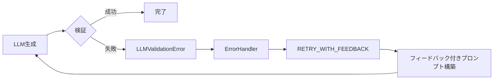
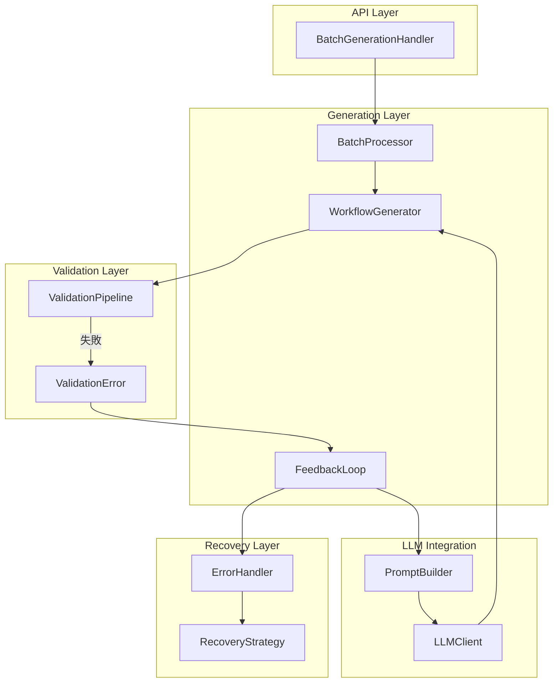
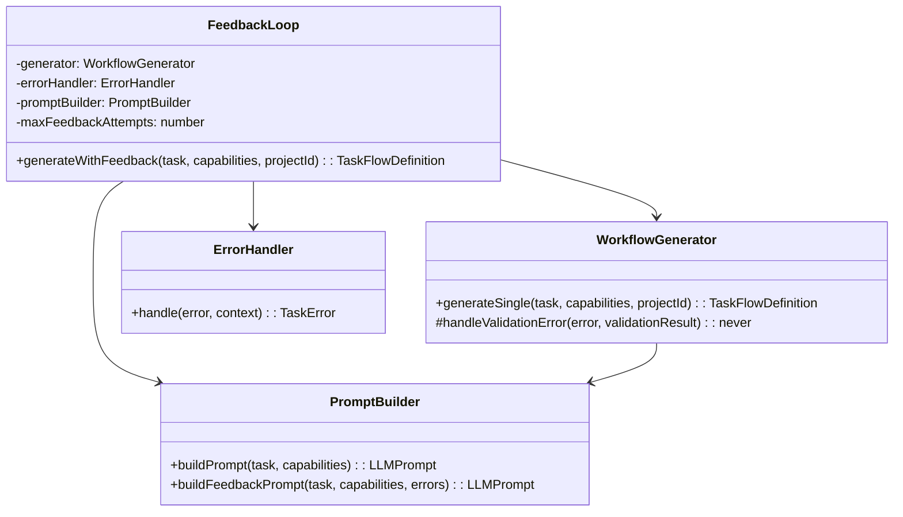
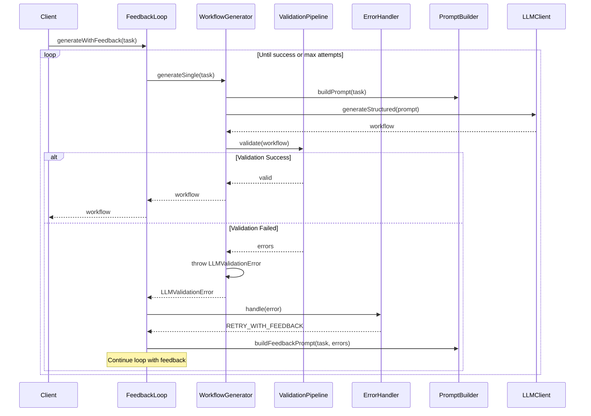

# Issue #367: RETRY_WITH_FEEDBACK フィードバックループ実装 - 設計方針書

**作成日**: 2026年1月17日
**作成者**: MySwiftAgent Architect
**対象プロジェクト**: mySwiftAgentCore
**関連Issue**: #367, #364 (親Issue)

## 1. 概要

Issue #364 で設計されたバリデーションエラーのフィードバックループを実装する。LLMが生成したワークフローが検証エラーとなった場合、エラー内容をフィードバックとして含めたプロンプトで再生成を試みる仕組みを構築する。

### 1.1 現状の問題点

1. **エラータイプの不整合**: `WorkflowGenerator` が通常の `Error` を throw するため、`ErrorHandler` が `RETRY_WITH_FEEDBACK` を提案できない
2. **ErrorHandler の未使用**: `handlers.ts` でインスタンス化されるが実際には使用されていない
3. **フィードバック機構の欠如**: `RetryStrategy` は同じプロンプトで単純リトライのみ実施

### 1.2 期待される動作



## 2. アーキテクチャ設計

### 2.1 システム構成図



### 2.2 コンポーネント責務

| コンポーネント | 責務 | 変更内容 |
|--------------|------|----------|
| **WorkflowGenerator** | ワークフロー生成の統括 | `LLMValidationError` を throw |
| **FeedbackLoop** (新規) | フィードバックループの制御 | リトライ回数管理、プロンプト再構築 |
| **ErrorHandler** | エラー分類とリカバリー戦略決定 | 既存実装を活用 |
| **PromptBuilder** | プロンプト構築 | フィードバック注入メソッド追加 |
| **BatchProcessor** | バッチ処理とエラーハンドリング | `FeedbackLoop` を使用 |

## 3. 技術選定

### 3.1 既存技術との整合性

| カテゴリ | 選定技術 | 選定理由 | 既存との整合性 |
|---------|---------|---------|---------------|
| エラー型 | `LLMValidationError` | 既存のエラー階層を活用 | ✅ 既存クラスを再利用 |
| リトライ機構 | `RetryStrategy` + 拡張 | 既存の指数バックオフを維持 | ✅ 既存パターンを拡張 |
| 状態管理 | クラスベース | 他コンポーネントと統一 | ✅ 既存パターンに準拠 |

## 4. 設計パターン

### 4.1 採用パターン



### 4.2 シーケンス図



## 5. データフロー設計

### 5.1 フィードバック情報の構造

```typescript
interface FeedbackContext {
  previousAttempt: {
    workflow: TaskFlowDefinition;
    errors: ValidationError[];
    warnings: ValidationWarning[];
  };
  attemptNumber: number;
  maxAttempts: number;
}
```

### 5.2 プロンプトへのフィードバック注入方式

```typescript
// フィードバックプロンプトの構造
{
  system: "既存のシステムプロンプト",
  user: `
タスク: ${task.description}

前回の生成結果に以下のエラーがありました:
${formatValidationErrors(errors)}

エラーを修正して再生成してください。特に以下の点に注意:
- ${getErrorSpecificGuidance(errors)}
`,
  examples: [...既存の例 + エラー修正の例]
}
```

## 6. エラーハンドリング設計

### 6.1 エラー分類の拡張

```typescript
// WorkflowGenerator での throw
if (!validationResult.isValid) {
  throw new LLMValidationError(
    `Validation failed: ${errorMessages}`,
    response.content,  // LLM の生成結果
    validationResult   // 検証結果の詳細
  );
}
```

### 6.2 リカバリーフロー

| エラータイプ | リカバリー戦略 | 実装アクション |
|-------------|---------------|----------------|
| `LLMValidationError` | `RETRY_WITH_FEEDBACK` | フィードバックループへ |
| `LLMApiError` (429) | `RETRY_CURRENT` | 既存のリトライ |
| `TimeoutError` | `RETRY_CURRENT` | 既存のリトライ |
| その他 | `MANUAL_INTERVENTION` | エラーとして返却 |

## 7. パフォーマンス設計

### 7.1 リトライ戦略

```typescript
interface FeedbackLoopConfig {
  maxFeedbackAttempts: 2;    // フィードバック付きリトライ回数
  maxTotalAttempts: 5;       // 全体の最大試行回数
  feedbackDelayMs: 2000;     // フィードバック前の待機時間
  enableParallelRetry: false; // バッチ内での並行リトライは無効
}
```

### 7.2 最適化方針

1. **早期終了**: 同じエラーが繰り返される場合は早期に終了
2. **エラーキャッシュ**: 同一タスクの同一エラーパターンを記憶
3. **段階的フィードバック**: 1回目は簡潔、2回目は詳細なフィードバック

## 8. セキュリティ設計

### 8.1 フィードバック情報の制御

- **機密情報の除外**: エラーメッセージから API キー等を除去
- **インジェクション対策**: フィードバックテキストのサニタイズ
- **情報漏洩防止**: 内部パスや実装詳細を含めない

## 9. 設計上の決定事項とトレードオフ

### 9.1 FeedbackLoop を独立コンポーネントとする理由

**採用案**: 独立した `FeedbackLoop` クラス

**理由**:
1. **単一責任原則**: `WorkflowGenerator` の責務を生成に限定
2. **テスタビリティ**: フィードバックロジックを独立してテスト可能
3. **拡張性**: 将来的に異なるフィードバック戦略を実装可能

**代替案**: `WorkflowGenerator` に直接実装
- ❌ クラスが肥大化
- ❌ フィードバックロジックとコア生成ロジックが混在

### 9.2 バッチ処理でのフィードバックリトライ

**採用案**: 各タスク個別にフィードバックリトライ

**理由**:
1. **並行性の維持**: 他のタスクの処理をブロックしない
2. **部分的成功**: 一部のタスクが改善できれば価値がある
3. **リソース効率**: 失敗タスクのみにリソースを集中

**代替案**: バッチ全体で再試行
- ❌ 成功したタスクも再生成される
- ❌ 処理時間が大幅に増加

### 9.3 最大リトライ回数の設定

**採用案**: フィードバック付き 2 回、通常リトライ含め最大 5 回

**理由**:
1. **コスト制御**: LLM API 呼び出しコストの抑制
2. **収束性**: 2 回のフィードバックで改善しない場合、追加試行の効果は低い
3. **レスポンス時間**: ユーザー体験を考慮した妥当な待機時間

## 10. 実装計画

### 10.1 フェーズ 1: 基盤整備
1. `WorkflowGenerator` で `LLMValidationError` を throw するよう修正
2. `handlers.ts` で `ErrorHandler` を実際に使用

### 10.2 フェーズ 2: フィードバックループ実装
1. `FeedbackLoop` クラスの実装
2. `PromptBuilder` にフィードバックメソッド追加
3. `BatchProcessor` との統合

### 10.3 フェーズ 3: テストと最適化
1. 単体テストの実装
2. 結合テストでのフィードバックフロー検証
3. パフォーマンスチューニング

## 11. テスト戦略

### 11.1 単体テスト

```typescript
describe('FeedbackLoop', () => {
  it('should retry with feedback on validation error');
  it('should stop after max feedback attempts');
  it('should preserve error context through retries');
  it('should generate different prompts for each attempt');
});
```

### 11.2 結合テスト

```typescript
describe('Feedback Integration', () => {
  it('should complete feedback loop through all components');
  it('should handle concurrent feedback loops in batch');
  it('should respect timeout during feedback retries');
});
```

## 12. リスクと対策

| リスク | 影響度 | 対策 |
|-------|--------|------|
| フィードバックループの無限化 | 高 | 最大試行回数の厳格な制限 |
| LLM コストの増大 | 中 | フィードバック回数の制限、早期終了 |
| レスポンス時間の増加 | 中 | タイムアウト設定、並行処理の維持 |
| 同じエラーの繰り返し | 低 | エラーパターンの記憶と早期終了 |

## 13. 参照ドキュメント

- Issue #364: taskflowGeneratorAgent の初期実装
- `/mySwiftAgentCore/src/taskflowGeneratorAgent/` - 現行実装
- `CLAUDE.md` - コード品質原則（SOLID、KISS、YAGNI、DRY）

## 14. 承認事項

本設計方針書は以下の観点で Issue #367 の要求を満たす:

- ✅ バリデーションエラー時の `LLMValidationError` 使用
- ✅ `ErrorHandler` による `RETRY_WITH_FEEDBACK` 分類
- ✅ 検証エラー内容のプロンプトへの反映
- ✅ 最大リトライ回数の管理
- ✅ 既存アーキテクチャとの整合性維持