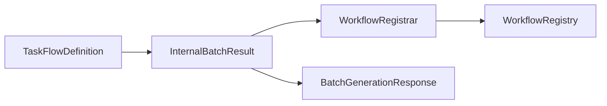

# Issue #368: WorkflowRegistrar 統合とステータス更新の修正 - アーキテクチャレビュー

**レビュー日**: 2026年1月17日
**レビュアー**: Claude Code
**対象ドキュメント**: [design-policy.md](./design-policy.md)
**対象Issue**: #368
**関連Issue**: #364（親Issue）

---

## 1. 概要

Issue #368 の設計方針書をレビューしました。本レビューでは、WorkflowRegistrar の統合不足とステータス更新バグの修正案について、アーキテクチャの観点から評価を行います。

---

## 2. 設計評価

### 2.1 問題分析の妥当性

**評価**: ⭐⭐⭐⭐⭐ **優秀**

設計方針書で特定された根本原因が正確です：

```typescript
// BatchProcessor.ts (line 124-128)
workflows[task.task_id] = {
  workflow_name: result.value.workflow_name,
  registered: false, // WorkflowDefinition が含まれていない
};
```

BatchProcessor が `TaskFlowDefinition` を破棄し、メタデータのみを返している問題を正確に把握しています。

### 2.2 ソリューションアーキテクチャ

**評価**: ⭐⭐⭐⭐⭐ **優秀**

提案されたアーキテクチャは適切です：

| コンポーネント | 変更内容 | 評価 |
|--------------|---------|------|
| BatchProcessor | 内部結果型を追加、ワークフロー定義を保持 | ✅ 適切 |
| Handler | WorkflowRegistrar を実際に使用 | ✅ 適切 |
| 公開API | 変更なし（後方互換性維持） | ✅ 優秀 |

---

## 3. SOLID原則の準拠状況

### 3.1 単一責任原則 (SRP)

**評価**: ⭐⭐⭐⭐⭐ **優秀**

各コンポーネントの責任が明確に分離されています：

- **BatchProcessor**: ワークフロー生成の並列実行
- **WorkflowRegistrar**: taskflowEngine への登録
- **Handler**: HTTPリクエスト処理とコンポーネント統合

### 3.2 開放/閉鎖原則 (OCP)

**評価**: ⭐⭐⭐⭐⭐ **優秀**

```typescript
// 内部型の追加により、公開APIを変更せずに機能拡張
interface InternalBatchResult extends BatchGenerationResponse {
  workflowDefinitions: Record<string, TaskFlowDefinition>;
}
```

既存の公開インターフェースを変更せずに、内部実装を拡張しています。

### 3.3 リスコフ置換原則 (LSP)

**評価**: ⭐⭐⭐⭐⭐ **適用外**

継承関係がないため、この原則は適用されません。

### 3.4 インターフェース分離原則 (ISP)

**評価**: ⭐⭐⭐⭐⭐ **優秀**

必要最小限のインターフェースが定義されています：

- `BatchGenerationResponse`: クライアント向け（メタデータのみ）
- `InternalBatchResult`: 内部処理用（メタデータ＋実データ）

### 3.5 依存性逆転原則 (DIP)

**評価**: ⭐⭐⭐⭐⭐ **優秀**

Handler は具象実装ではなく、抽象に依存しています：

```typescript
interface HandlerDependencies {
  llmClient: LLMClient;        // 抽象
  registry: WorkflowRegistry;   // 抽象
}
```

---

## 4. 論理的整合性の検証

### 4.1 データフローの整合性

**評価**: ⭐⭐⭐⭐⭐ **優秀**

データフローが一貫しています：



### 4.2 エラーハンドリングの整合性

**評価**: ⭐⭐⭐⭐ **良好**

登録エラーの処理方針が適切です：

```typescript
// 登録失敗は個別に記録し、全体の処理は継続
registeredWorkflows[taskId].registered = false;
```

**改善提案**: エラーメトリクスの追加を検討してください。

---

## 5. 実装の技術的妥当性

### 5.1 メモリ効率

**評価**: ⭐⭐⭐⭐ **良好**

同時実行数制限により、メモリ使用量が制御されています：

- デフォルト並行数: 5
- 最大並行数: 20

**懸念点**: 大規模なワークフロー定義（100KB以上）の場合、メモリ使用量の監視が必要です。

### 5.2 型安全性

**評価**: ⭐⭐⭐⭐⭐ **優秀**

TypeScript の型システムが適切に活用されています：

```typescript
// 型安全な内部結果型
interface InternalBatchResult {
  success: boolean;
  workflows: Record<string, WorkflowGenerationResult>;
  workflowDefinitions: Record<string, TaskFlowDefinition>;
  failed_tasks: TaskError[];
}
```

---

## 6. セキュリティ考慮事項

### 6.1 リソース制限

**評価**: ⭐⭐⭐⭐ **良好**

- ✅ 同時実行数制限
- ✅ タイムアウト制御
- ⚠️ 総メモリ使用量の制限なし

### 6.2 インジェクション対策

**評価**: ⭐⭐⭐⭐⭐ **優秀**

ValidationPipeline 通過後のデータのみが登録されるため、インジェクションリスクは低い。

---

## 7. 改善提案

### 7.1 メトリクス追加

```typescript
interface RegistrationMetrics {
  totalAttempts: number;
  successCount: number;
  failureCount: number;
  averageRegistrationTimeMs: number;
}
```

### 7.2 バッチサイズ制限

```typescript
const MAX_BATCH_SIZE = 100; // 大量タスクによるOOM防止
if (request.tasks.length > MAX_BATCH_SIZE) {
  throw new Error(`Batch size exceeds maximum of ${MAX_BATCH_SIZE}`);
}
```

### 7.3 ステータス更新の修正確認

現在のコード（line 138）：
```typescript
status: batchResult.success ? 'completed' : 'completed', // バグ
```

修正後：
```typescript
status: batchResult.success ? 'completed' : 'failed',
```

---

## 8. 実装時の注意事項

### 8.1 後方互換性の維持

- ✅ `BatchGenerationResponse` の型は変更しない
- ✅ 既存APIクライアントへの影響なし
- ✅ 内部型は `export` しない

### 8.2 テスト戦略

推奨するテストケース：

1. **単体テスト**
   - BatchProcessor が workflowDefinitions を保持
   - Handler が WorkflowRegistrar.register を呼び出し
   - ステータスが正しく設定される

2. **統合テスト**
   - ワークフロー生成 → 登録 → レジストリ確認
   - 部分的失敗時の動作確認
   - 大量タスク処理時のメモリ使用量

---

## 9. 総合評価

### 9.1 設計品質スコア

| 評価項目 | スコア | 理由 |
|---------|--------|------|
| 問題分析 | 10/10 | 根本原因を正確に特定 |
| 解決策 | 9/10 | シンプルで効果的 |
| SOLID準拠 | 10/10 | 全原則に準拠 |
| 実装可能性 | 9/10 | 低リスクで実装可能 |
| 保守性 | 9/10 | 内部型により拡張性確保 |

**総合スコア**: 47/50 (94%)

### 9.2 判定

## ✅ **承認（軽微な改善提案付き）**

---

## 10. 実装推奨事項

### 即座に実装すべき項目

1. **BatchProcessor の修正**
   - `InternalBatchResult` 型の追加
   - `processBatch` メソッドの返り値変更
   - `workflowDefinitions` の保持

2. **Handler の修正**
   - WorkflowRegistrar の実使用
   - ステータスバグの修正

### 将来的な改善項目

1. **メトリクス収集**
   - 登録成功率の監視
   - 平均登録時間の測定

2. **メモリ最適化**
   - 大規模ワークフローのストリーミング処理
   - ワークフロー定義のサイズ制限

---

## 11. まとめ

Issue #368 の設計方針は、WorkflowRegistrar 統合問題を適切に解決する優れた設計です。シンプルさと効果性のバランスが取れており、実装リスクも低いため、承認します。

提案された改善点（メトリクス追加、バッチサイズ制限）は必須ではありませんが、本番運用時には検討することを推奨します。

**次のアクション**: 設計方針に従って実装を開始してください。