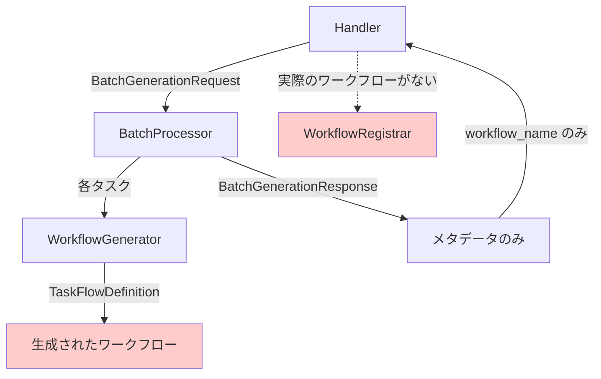
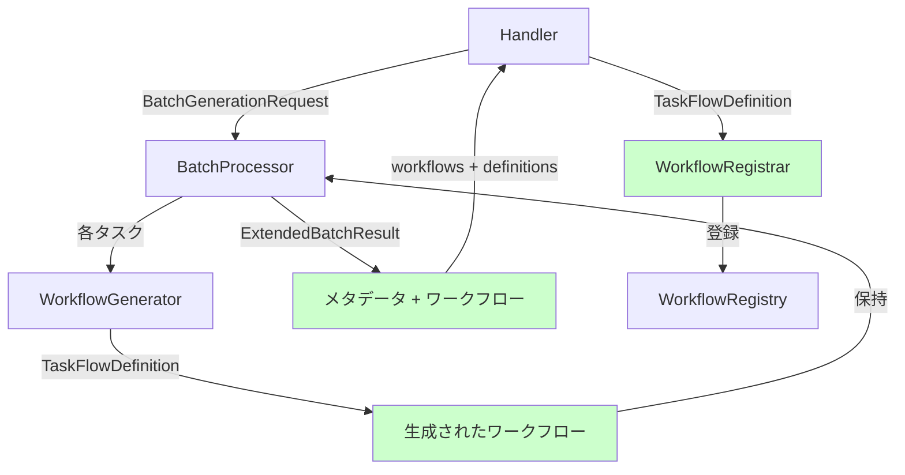

# Issue #368: WorkflowRegistrar 統合とステータス更新の修正 - 設計方針書

**作成日**: 2026年1月17日
**対象Issue**: #368
**対象プロジェクト**: mySwiftAgentCore
**関連Issue**: #364（親Issue）

---

## 1. 概要

Issue #364 で実装された `handlers.ts` において、以下の問題を修正する：

1. **WorkflowRegistrar が未使用** - インスタンス化されるが実際の登録処理が呼ばれていない
2. **ステータス更新のバグ** - 失敗時も 'completed' を返している

本設計方針書では、これらの問題を解決するためのアーキテクチャ設計と実装方針を定義する。

---

## 2. 現状分析

### 2.1 アーキテクチャの問題点

現状調査により、以下の構造的な問題が判明した：



**根本原因**: `BatchProcessor` が生成されたワークフローの**メタデータのみ**を返し、実際の `TaskFlowDefinition` を破棄している。

### 2.2 データフローの詳細

| ステージ | 入力 | 出力 | 問題 |
|---------|------|------|------|
| WorkflowGenerator | TaskGenerationRequest | TaskFlowDefinition | ✅ 正常 |
| processTask | Task | TaskFlowDefinition | ✅ 正常 |
| processBatch | Tasks[] | メタデータのみ | ❌ **ワークフローを破棄** |
| Handler | メタデータ | 登録不可能 | ❌ **実データなし** |

---

## 3. アーキテクチャ設計

### 3.1 修正後のデータフロー



### 3.2 インターフェース設計

#### 3.2.1 拡張された BatchResult（内部用）

```typescript
// BatchProcessor 内部で使用
interface ExtendedBatchResult {
  success: boolean;
  workflows: Record<string, WorkflowGenerationResult>;
  workflowDefinitions: Record<string, TaskFlowDefinition>; // 追加
  failed_tasks: TaskError[];
}
```

#### 3.2.2 processBatch メソッドの修正

```typescript
class BatchProcessor {
  async processBatch(
    request: BatchGenerationRequest
  ): Promise<ExtendedBatchResult> {
    // 実装...
  }
}
```

---

## 4. 実装設計

### 4.1 BatchProcessor の修正

**修正箇所**: `src/taskflowGeneratorAgent/generator/BatchProcessor.ts`

```typescript
// 1. 内部結果型の追加（ファイル内でのみ使用）
interface InternalBatchResult {
  success: boolean;
  workflows: Record<string, WorkflowGenerationResult>;
  workflowDefinitions: Record<string, TaskFlowDefinition>;
  failed_tasks: TaskError[];
}

// 2. processBatch メソッドの修正
async processBatch(
  request: BatchGenerationRequest
): Promise<InternalBatchResult> {
  const workflows: Record<string, WorkflowGenerationResult> = {};
  const workflowDefinitions: Record<string, TaskFlowDefinition> = {};
  const failedTasks: TaskError[] = [];

  // 処理ロジック...

  // 成功したワークフローの保存
  workflows[task.task_id] = {
    workflow_name: result.value.workflow_name,
    registered: false,
  };
  workflowDefinitions[task.task_id] = result.value; // 実際のワークフローを保持

  return {
    success: failedTasks.length === 0,
    workflows,
    workflowDefinitions,
    failed_tasks: failedTasks,
  };
}
```

### 4.2 Handler の修正

**修正箇所**: `src/taskflowGeneratorAgent/api/handlers.ts`

```typescript
// 1. WorkflowRegistrar のインスタンス化と使用
const registrar = new WorkflowRegistrar({ registry: deps.registry });

// 2. ワークフロー登録の実装
const registeredWorkflows: Record<string, WorkflowGenerationResult> = {};

for (const [taskId, metadata] of Object.entries(batchResult.workflows)) {
  registeredWorkflows[taskId] = { ...metadata };

  if (request.options?.validate_before_register !== false) {
    const workflow = batchResult.workflowDefinitions[taskId];
    if (workflow) {
      const regResult = await registrar.register(workflow, request.project_id);
      registeredWorkflows[taskId].registered = regResult.success;
      registeredWorkflows[taskId].workflow_id = regResult.workflowId;
    }
  }
}

// 3. ステータス更新の修正
status: batchResult.success ? 'completed' : 'failed',
```

---

## 5. エラーハンドリング設計

### 5.1 登録エラーの処理

```typescript
try {
  const regResult = await registrar.register(workflow, projectId);
  if (!regResult.success) {
    // 登録失敗をログに記録
    console.error(`Registration failed for ${taskId}: ${regResult.error}`);
  }
} catch (error) {
  // 登録例外をキャッチして継続
  console.error(`Registration error for ${taskId}:`, error);
  registeredWorkflows[taskId].registered = false;
}
```

### 5.2 部分的成功の扱い

- ワークフロー生成成功 → 登録失敗：`registered: false` でレスポンスに含める
- 登録エラーは個別にログ記録し、全体の処理は継続
- クライアントは `registered` フラグで登録成否を判断

---

## 6. セキュリティ設計

### 6.1 メモリ使用量の考慮

- 大量のワークフロー定義をメモリに保持することになる
- 同時処理数（`maxConcurrency`）で制限されているため、現実的な範囲内

### 6.2 データ検証

- `WorkflowRegistrar.register()` 内で再度検証は不要（既に ValidationPipeline を通過）
- 登録時の型変換（TaskFlowDefinition → InternalWorkflowDefinition）で安全性確保

---

## 7. パフォーマンス設計

### 7.1 並行処理

```
現状維持：Semaphore による同時実行数制御（デフォルト: 5）
追加考慮：登録処理も並行実行可能
```

### 7.2 メモリ効率

| アプローチ | メリット | デメリット | 採用 |
|-----------|---------|-----------|------|
| A: ワークフロー定義を保持 | シンプル、確実 | メモリ使用量増加 | ✅ |
| B: ストリーミング処理 | メモリ効率的 | 実装複雑、エラー処理困難 | ❌ |

**判断理由**: 同時処理数が制限されており、メモリ影響は限定的。シンプルさを優先。

---

## 8. 設計上の決定事項とトレードオフ

### 8.1 内部型 vs 公開型

**決定**: `InternalBatchResult` を内部型として定義

**理由**:
- 公開APIの後方互換性を保つ
- 内部実装の詳細を隠蔽
- 将来的な最適化の余地を残す

### 8.2 登録タイミング

**決定**: 生成直後ではなく、全タスク完了後に登録

**理由**:
- トランザクション的な一貫性
- エラー集約の容易さ
- クライアントへの一括レスポンス

### 8.3 エラー時の動作

**決定**: 登録エラーは個別に記録し、処理は継続

**理由**:
- 部分的成功を許容
- 1つの登録失敗で全体を失敗させない
- クライアント側で柔軟な対応が可能

---

## 9. 実装手順

1. **BatchProcessor の修正**
   - 内部結果型の定義
   - ワークフロー定義の保持
   - 返却値の拡張

2. **Handler の修正**
   - WorkflowRegistrar の proper な使用
   - 登録ロジックの実装
   - ステータスバグの修正

3. **テストの追加**
   - 登録成功ケース
   - 登録失敗ケース
   - ステータス更新の検証

---

## 10. テスト戦略

### 10.1 単体テスト

```typescript
describe('BatchProcessor', () => {
  it('should return workflow definitions along with metadata', async () => {
    const result = await processor.processBatch(request);
    expect(result.workflowDefinitions).toBeDefined();
    expect(result.workflowDefinitions[taskId]).toEqual(expectedWorkflow);
  });
});

describe('Handler', () => {
  it('should register workflows using WorkflowRegistrar', async () => {
    const registerSpy = vi.spyOn(registrar, 'register');
    await handler(context);
    expect(registerSpy).toHaveBeenCalled();
  });

  it('should return failed status when batch fails', async () => {
    // バッチ処理失敗のモック
    const response = await handler(context);
    expect(response.status).toBe('failed');
  });
});
```

### 10.2 統合テスト

- ワークフロー生成 → 登録 → レジストリ確認の一連フロー
- 部分的失敗時の動作確認

---

## 11. 制約事項

### 11.1 後方互換性

- 公開API（`BatchGenerationResponse`）の型は変更しない
- 既存クライアントへの影響なし

### 11.2 依存関係

- `WorkflowRegistry` が正しく初期化されている必要がある
- `deps.registry` が Handler に適切に注入される

---

## 12. 参照ドキュメント

- [taskflowEngine アーキテクチャ](../../taskflowEngine/README.md)
- [WorkflowRegistry 仕様](../../taskflowEngine/registry/README.md)
- Issue #364 実装資料

---

## 13. まとめ

本設計により：

1. ✅ WorkflowRegistrar が適切に使用され、生成されたワークフローが登録される
2. ✅ 登録失敗時の適切なエラーハンドリング
3. ✅ ステータス更新のバグが修正される
4. ✅ 既存APIとの後方互換性を維持

実装はシンプルさを重視し、将来の拡張性も考慮した設計となっている。