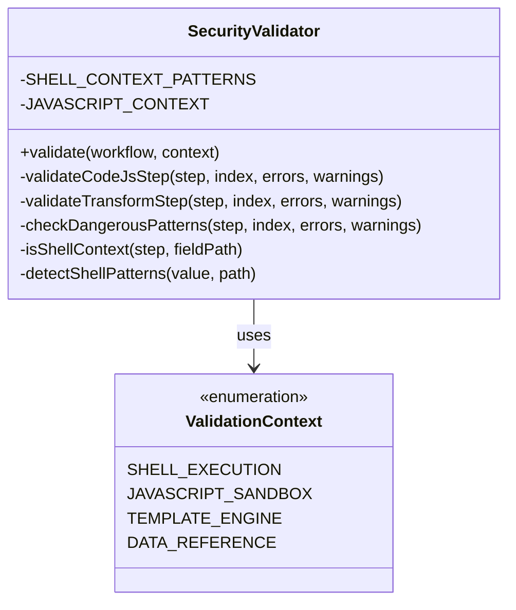
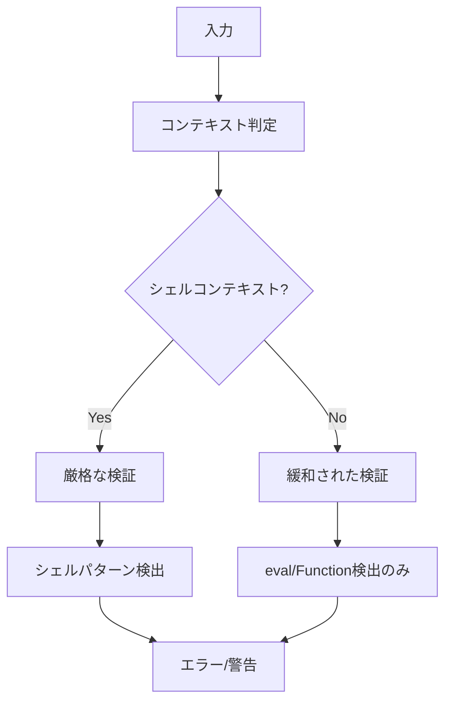

# Issue #369: SecurityValidator のバッククォート誤検出修正 - 設計方針書

**作成日**: 2026年1月17日
**対象Issue**: #369
**対象プロジェクト**: mySwiftAgentCore
**関連Issue**: #364（親Issue）

---

## 1. 概要

`SecurityValidator` のシェルインジェクション検出パターンが、JavaScript テンプレートリテラルを誤検出している問題を修正する。現在の検出パターンは全てのバッククォートを危険とみなすため、正当な JavaScript 構文を使用できない。

### 1.1 現状の問題

```typescript
// SecurityValidator.ts:16
{ pattern: /`.*`/, code: 'SHELL_INJECTION', message: 'Potential shell injection detected' },
```

このパターンは以下を区別できない：
- **シェルコマンド置換**: `` `ls -la` `` ← 本来検出すべき
- **JavaScript テンプレートリテラル**: `` `Hello ${name}` `` ← 誤検出

---

## 2. 現状調査

### 2.1 コードベース分析

#### 2.1.1 SecurityValidator の位置づけ

```
ValidationPipeline
├── SchemaValidator
├── DependencyValidator
├── VariableValidator
├── CapabilityValidator
└── SecurityValidator    ← 5番目のバリデーター
```

#### 2.1.2 現在の検出パターン

| パターン | 用途 | 検出対象 |
|---------|------|---------|
| `` /`.*`/ `` | シェルインジェクション | 全てのバッククォート |
| `/\$\(.*\)/` | コマンド置換 | `$(command)` |
| `/['"].*OR.*['"].*=.*['"]/i` | SQLインジェクション | `' OR '1'='1'` |
| `/--.*$/` | SQLコメント | `-- comment` |
| `/\.\.\//` | パストラバーサル | `../` |
| `/password/i`, `/secret/i` 等 | 機密データ | パスワード等の参照 |

#### 2.1.3 検証対象

SecurityValidator は以下の文字列値を検査：
- `step.config` の全プロパティ（再帰的）
- `step.params` の全プロパティ（再帰的）
- 特定ステップタイプ固有の検証（`code_js`, `api_rest`, `transform`）

### 2.2 taskflowGeneratorAgent のコンテキスト理解

#### 2.2.1 transform ステップの用途

調査結果から、transform ステップは主に以下の方法で使用される：

1. **Handlebars テンプレート** (`{{variable}}` 構文)
   ```json
   {
     "type": "transform",
     "config": {
       "mode": "template",
       "template": "Hello {{name}}, you have {{count}} items"
     }
   }
   ```

2. **ワークフロー パラメータ参照** (`${step.field}` 構文)
   ```json
   {
     "params": {
       "data": "${previous_step.output.result}"
     }
   }
   ```

3. **JavaScript 式評価** （現状未実装・将来的な拡張可能性）
   ```json
   {
     "type": "transform",
     "config": {
       "mode": "expression",
       "expression": "`Result: ${data.value * 2}`"
     }
   }
   ```

#### 2.2.2 セキュリティコンテキストの違い

| コンテキスト | リスク | 対策必要性 |
|-------------|--------|-----------|
| シェルコマンド実行 | 高（任意コマンド実行） | 厳格な検出必須 |
| JavaScript テンプレート | 中（サンドボックス内実行） | eval/Function 制限で十分 |
| Handlebars テンプレート | 低（テンプレートエンジン） | 基本的に安全 |

---

## 3. アーキテクチャ設計

### 3.1 解決方針

コンテキスト認識型のセキュリティ検証を実装する。ステップタイプと設定フィールドに応じて、適切な検証ルールを適用する。

### 3.2 設計原則

1. **最小権限の原則**: 各コンテキストで必要最小限の機能のみ許可
2. **明示的な許可**: 危険な操作はデフォルトで禁止、明示的に許可
3. **コンテキスト分離**: 実行環境ごとに異なるセキュリティポリシー

### 3.3 クラス設計



---

## 4. 技術選定

### 4.1 検出パターンの改善

| 方式 | メリット | デメリット | 採用 |
|------|--------|-----------|------|
| Option A: コマンドベース検出 | 具体的なコマンドを検出 | 網羅性に欠ける | ❌ |
| Option B: コンテキスト別検証 | 柔軟性が高い | 実装が複雑 | ✅ |
| Option C: ホワイトリスト方式 | 安全性が高い | 拡張性が低い | ❌ |

### 4.2 採用する実装方式

**Option B: コンテキスト別検証**を採用し、以下の改良を加える：

1. **シェルコンテキストの明確化**
   - `exec`, `spawn`, `shell` 等のフィールドでのみシェルコマンド検出
   - それ以外のコンテキストではバッククォートを許可

2. **パターンの精緻化**
   - シェルコンテキスト: 厳格な検出（バッククォート、`$()`）
   - JavaScript コンテキスト: `eval`, `Function` のみ制限
   - テンプレートコンテキスト: 基本的に制限なし

---

## 5. 実装設計

### 5.1 修正後の検出パターン

```typescript
// シェルコンテキスト用パターン（厳格）
const SHELL_CONTEXT_PATTERNS = [
  { pattern: /`.*`/, code: 'SHELL_INJECTION', message: 'Potential shell injection detected' },
  { pattern: /\$\(.*\)/, code: 'COMMAND_SUBSTITUTION', message: 'Potential command substitution detected' },
];

// 一般的な危険パターン（全コンテキスト共通）
const GENERAL_DANGEROUS_PATTERNS = [
  { pattern: /['"].*OR.*['"].*=.*['"]/i, code: 'SQL_INJECTION', message: 'Potential SQL injection pattern detected' },
  { pattern: /--.*$/, code: 'SQL_COMMENT', message: 'SQL comment detected' },
  { pattern: /\.\.\//, code: 'PATH_TRAVERSAL', message: 'Potential path traversal detected' },
  // 機密データパターンは変更なし
];
```

### 5.2 コンテキスト判定ロジック

```typescript
private isShellContext(step: TaskFlowStep, fieldPath: string): boolean {
  // 明示的にシェル実行を示すステップタイプ
  if (step.type === 'shell' || step.type === 'exec') {
    return true;
  }

  // code_js で明らかにシェル操作を含むフィールド
  if (step.type === 'code_js' && fieldPath.includes('.shell') || fieldPath.includes('.exec')) {
    return true;
  }

  // それ以外は JavaScript/テンプレートコンテキストとみなす
  return false;
}
```

### 5.3 transform ステップ専用の検証

```typescript
private validateTransformStep(
  step: TaskFlowStep,
  stepIndex: number,
  errors: ValidationError[],
  warnings: ValidationWarning[]
): void {
  const expression = step.config['expression'] as string | undefined;

  if (!expression) return;

  // JavaScript テンプレートリテラルは許可
  // ただし eval/Function は引き続き制限
  const dangerousPatterns = [
    { pattern: /eval\s*\(/, message: 'eval() in expression' },
    { pattern: /Function\s*\(/, message: 'Function constructor in expression' },
  ];

  // バッククォートの検出をスキップ
  for (const { pattern, message } of dangerousPatterns) {
    if (pattern.test(expression)) {
      errors.push({
        code: 'UNSAFE_EXPRESSION',
        message: `Step "${step.id}": ${message}`,
        path: `steps[${stepIndex}].config.expression`,
      });
    }
  }
}
```

---

## 6. セキュリティ設計

### 6.1 多層防御戦略



### 6.2 リスク評価

| シナリオ | リスク | 対策 |
|---------|--------|------|
| シェルコマンド実行 | 高 | バッククォート、`$()` を検出 |
| JavaScript 実行 | 中 | `eval`, `Function` を検出 |
| テンプレート処理 | 低 | 基本的に許可、`eval` のみ制限 |

---

## 7. パフォーマンス設計

### 7.1 最適化方針

1. **早期リターン**: コンテキスト判定で不要な検証をスキップ
2. **パターンキャッシュ**: 正規表現オブジェクトの事前コンパイル
3. **選択的検証**: ステップタイプに応じた必要最小限の検証

### 7.2 計算量

- 現状: O(n × m) （n: ステップ数、m: パターン数）
- 改善後: O(n × m') （m' < m、コンテキストに応じてパターン削減）

---

## 8. 設計上の決定事項とトレードオフ

### 8.1 バッククォート許可の判断

**決定**: transform ステップと JavaScript コンテキストでバッククォートを許可

**理由**:
- JavaScript テンプレートリテラルは正当な言語機能
- サンドボックス内実行でリスクは限定的
- `eval`/`Function` 制限で十分な保護

**トレードオフ**:
- セキュリティ: やや低下するが、他の制御で補償
- 使いやすさ: 大幅に向上

### 8.2 コンテキスト判定の実装

**決定**: ステップタイプとフィールドパスで判定

**理由**:
- 実装がシンプル
- 誤検出のリスクが低い
- 将来の拡張が容易

**代替案**:
- フィールド名の命名規則で判定 → 脆弱で保守困難
- 設定フラグで明示 → ユーザー負担が増加

---

## 9. テスト戦略

### 9.1 単体テスト

既存のテストケースに加えて：

```typescript
describe('transform step with template literals', () => {
  it('should allow JavaScript template literals in transform expressions', async () => {
    const workflow = {
      steps: [{
        id: 'transform',
        type: 'transform',
        config: {
          expression: '`Hello ${name}, your score is ${score * 2}`'
        }
      }]
    };

    const result = await validator.validate(workflow, context);
    expect(result.isValid).toBe(true);
    expect(result.errors).toHaveLength(0);
  });

  it('should still detect shell patterns in shell context', async () => {
    const workflow = {
      steps: [{
        id: 'exec',
        type: 'shell',
        config: {
          command: '`rm -rf /`'
        }
      }]
    };

    const result = await validator.validate(workflow, context);
    expect(result.isValid).toBe(false);
    expect(result.errors.some(e => e.code === 'SHELL_INJECTION')).toBe(true);
  });
});
```

### 9.2 E2Eテスト

- task_002 (Summarize Search Results) が成功することを確認
- シェルコンテキストでの検出が引き続き機能することを確認

---

## 10. 実装手順

1. **コンテキスト判定メソッドの追加**
   - `isShellContext()` メソッドを実装

2. **パターン定義の分離**
   - `SHELL_CONTEXT_PATTERNS` と `GENERAL_DANGEROUS_PATTERNS` に分割

3. **checkDangerousPatterns の修正**
   - コンテキストに応じたパターン選択

4. **validateTransformStep の修正**
   - バッククォート検出の除外

5. **テストケースの追加**
   - 正当なテンプレートリテラルの許可を確認
   - シェルコンテキストでの検出維持を確認

---

## 11. 制約事項

### 11.1 後方互換性

- 既存の検出機能は維持（シェルコンテキストで）
- API インターフェースの変更なし

### 11.2 将来の拡張性

- 新しいステップタイプ追加時のコンテキスト定義
- より高度な静的解析の可能性

---

## 12. 参照ドキュメント

- [Issue #364](../../../issues/364) - taskflowGeneratorAgent 実装（親Issue）
- `mySwiftAgentCore/src/taskflowGeneratorAgent/validator/validators/SecurityValidator.ts`
- `graphAiServer/src/nodes/transform-node.ts` - transform ノード実装

---

## 13. まとめ

本設計により：

1. ✅ JavaScript テンプレートリテラルが正当に使用可能
2. ✅ シェルコンテキストでのセキュリティは維持
3. ✅ 実装の複雑性を最小限に抑制
4. ✅ 将来の拡張に対応可能な設計

コンテキスト認識型の検証により、セキュリティと使いやすさのバランスを実現する。