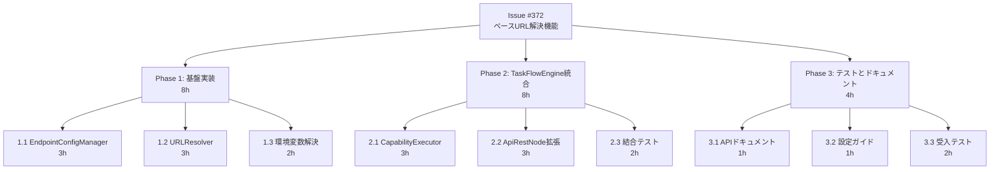
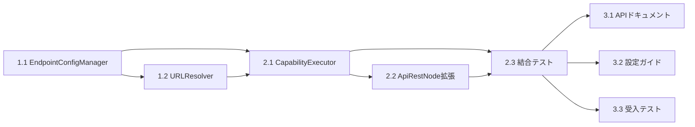

# 作業計画書：Issue #372 - TaskFlowEngine用ベースURL解決機能

## 1. 概要

### Issue情報
- **Issue番号**: #372
- **タイトル**: TaskFlowEngine用ベースURL解決機能
- **作成日**: 2025-01-17
- **担当者**: Claude Code (PM Auto-Dev)
- **ステータス**: 作業計画中

### 受入条件
1. ✅ capability の相対URLから完全なURLを構築できる
2. ✅ 環境変数でベースURLを設定できる
3. ✅ TaskFlowEngine から capability ベースのAPIを実行できる

### 技術要件
- mySwiftAgentCore の TaskFlowEngine 拡張
- 環境変数による設定のサポート（`${VAR:-default}` 形式）
- 後方互換性の維持

## 2. 作業分解構造（WBS）



## 3. 詳細タスク一覧

### Phase 1: 基盤実装（8時間）

#### 1.1 EndpointConfigManager 実装（3時間）
- **説明**: エンドポイント設定の管理コンポーネント
- **作業内容**:
  - `src/capabilityManagement/endpoint/types.ts` - インターフェース定義
  - `src/capabilityManagement/endpoint/EndpointConfigManager.ts` - クラス実装
  - `tests/unit/capabilityManagement/endpoint/EndpointConfigManager.test.ts` - 単体テスト
- **成果物**:
  - EndpointConfigManager クラス
  - 単体テスト（カバレッジ90%以上）
- **依存関係**: なし

#### 1.2 URLResolver 実装（3時間）
- **説明**: 相対URLから完全なURLを構築するコンポーネント
- **作業内容**:
  - `src/capabilityManagement/endpoint/URLResolver.ts` - クラス実装
  - エンドポイントマッチングロジック
  - `tests/unit/capabilityManagement/endpoint/URLResolver.test.ts` - 単体テスト
- **成果物**:
  - URLResolver クラス
  - 単体テスト（カバレッジ90%以上）
- **依存関係**: 1.1

#### 1.3 環境変数解決ロジック（2時間）
- **説明**: `${VAR:-default}` パターンの解析と解決
- **作業内容**:
  - 環境変数パターンの正規表現処理
  - デフォルト値の適用ロジック
  - エッジケースのテスト
- **成果物**:
  - resolveEnvVars 関数
  - 単体テスト（全パターン網羅）
- **依存関係**: なし

### Phase 2: TaskFlowEngine統合（8時間）

#### 2.1 CapabilityExecutor 実装（3時間）
- **説明**: capability ベースのAPI実行コンポーネント
- **作業内容**:
  - `src/taskflowEngine/nodes/CapabilityExecutor.ts` - クラス実装
  - CapabilityRegistry との統合
  - 認証情報の処理
  - `tests/unit/taskflowEngine/nodes/CapabilityExecutor.test.ts` - 単体テスト
- **成果物**:
  - CapabilityExecutor クラス
  - 単体テスト（カバレッジ90%以上）
- **依存関係**: 1.1, 1.2

#### 2.2 ApiRestNode 拡張（3時間）
- **説明**: capability_id によるAPI実行のサポート追加
- **作業内容**:
  - ApiRestNodeConfig インターフェース拡張
  - execute メソッドの拡張（capability_id サポート）
  - 後方互換性の確保
  - `tests/unit/taskflowEngine/nodes/ApiRestNode.test.ts` - 拡張テスト
- **成果物**:
  - 拡張された ApiRestNode
  - 単体テスト（新旧両方式のテスト）
- **依存関係**: 2.1

#### 2.3 結合テスト実装（2時間）
- **説明**: TaskFlow実行のE2Eテスト
- **作業内容**:
  - `tests/integration/taskflowEngine/capabilityExecution.test.ts` - 結合テスト
  - google_search capability の実行テスト
  - エラーハンドリングのテスト
- **成果物**:
  - 結合テストスイート
  - テストカバレッジ50%以上
- **依存関係**: 2.1, 2.2

### Phase 3: テストとドキュメント（4時間）

#### 3.1 APIドキュメント作成（1時間）
- **説明**: 新機能のAPI仕様書
- **作業内容**:
  - `docs/api/endpoint-resolution.md` - API仕様
  - インターフェース定義の文書化
  - サンプルコードの作成
- **成果物**:
  - APIドキュメント
- **依存関係**: 2.1, 2.2

#### 3.2 設定ガイド作成（1時間）
- **説明**: 設定方法とトラブルシューティング
- **作業内容**:
  - `docs/guides/capability-configuration.md` - 設定ガイド
  - 環境変数の設定例
  - トラブルシューティング手順
- **成果物**:
  - 設定ガイド
- **依存関係**: 3.1

#### 3.3 受入テスト実装・実行（2時間）
- **説明**: L3受入テストの作成と実行
- **作業内容**:
  - `tests/acceptance/test_issue_372_acceptance.py` - 受入テスト
  - 実サービスに対するAPI実行テスト
  - 環境変数設定のテスト
- **成果物**:
  - 受入テストスイート
  - テスト実行結果
- **依存関係**: 2.3

## 4. タスク依存関係



## 5. 作業スケジュール

### ガントチャート

```
タスク                      Day1  Day2  Day3  Day4  Day5
Phase 1: 基盤実装
  1.1 EndpointConfigManager  ███
  1.2 URLResolver                 ███
  1.3 環境変数解決                    ██
Phase 2: TaskFlowEngine統合
  2.1 CapabilityExecutor            ███
  2.2 ApiRestNode拡張                   ███
  2.3 結合テスト                           ██
Phase 3: テストとドキュメント
  3.1 APIドキュメント                        █
  3.2 設定ガイド                            █
  3.3 受入テスト                             ██
```

### 工数見積もり
- **総工数**: 20時間（2.5人日）
- **Phase 1**: 8時間（1人日）
- **Phase 2**: 8時間（1人日）
- **Phase 3**: 4時間（0.5人日）

## 6. リスクと対策

### 技術的リスク

| リスク | 影響度 | 発生確率 | 対策 |
|--------|--------|----------|------|
| 既存APIの互換性破壊 | 高 | 低 | 既存のurl指定を維持し、capability_idを追加オプションとする |
| 環境変数の複雑化 | 中 | 中 | 明確なデフォルト値とドキュメントを提供 |
| パフォーマンス劣化 | 低 | 低 | 設定のキャッシュ機構を実装 |

### スケジュールリスク

| リスク | 影響度 | 発生確率 | 対策 |
|--------|--------|----------|------|
| 結合テストでの問題発覚 | 高 | 中 | 早期に結合テストを作成し、継続的に実行 |
| 受入テスト環境の準備遅延 | 中 | 低 | 事前に環境構築手順を確認 |

## 7. 成果物チェックリスト

### コード成果物
- [ ] `src/capabilityManagement/endpoint/types.ts`
- [ ] `src/capabilityManagement/endpoint/EndpointConfigManager.ts`
- [ ] `src/capabilityManagement/endpoint/URLResolver.ts`
- [ ] `src/taskflowEngine/nodes/CapabilityExecutor.ts`
- [ ] `src/taskflowEngine/nodes/ApiRestNode.ts` (拡張)

### テスト成果物
- [ ] `tests/unit/capabilityManagement/endpoint/EndpointConfigManager.test.ts`
- [ ] `tests/unit/capabilityManagement/endpoint/URLResolver.test.ts`
- [ ] `tests/unit/taskflowEngine/nodes/CapabilityExecutor.test.ts`
- [ ] `tests/unit/taskflowEngine/nodes/ApiRestNode.test.ts` (拡張)
- [ ] `tests/integration/taskflowEngine/capabilityExecution.test.ts`
- [ ] `tests/acceptance/test_issue_372_acceptance.py`

### ドキュメント成果物
- [ ] `docs/api/endpoint-resolution.md`
- [ ] `docs/guides/capability-configuration.md`
- [ ] 設計方針書の更新（実装後の振り返り）

## 8. L3受入テスト計画

### テスト環境
- **必要なサービス**:
  - mySwiftAgentCore (localhost:9000)
  - expertAgent (localhost:8004)
  - myVault (localhost:8003) ※認証情報管理

### 環境変数設定
```bash
export EXPERT_AGENT_BASE_URL=http://localhost:8004
export SERPER_API_KEY=your-serper-api-key
```

### テストケース

#### TC-001: 基本的なcapability実行
```bash
# google_search capability の実行
curl -X POST http://localhost:9000/api/v1/taskflow/execute \
  -H "Content-Type: application/json" \
  -d '{
    "project": "default_project",
    "workflow": "test_capability_execution",
    "taskflow": {
      "nodes": {
        "search": {
          "type": "api_rest",
          "config": {
            "capability_id": "google_search",
            "method": "POST"
          },
          "inputs": {
            "queries": ["TypeScript best practices"],
            "num": 3
          }
        }
      },
      "edges": []
    }
  }'

# 期待結果: 200 OK
# レスポンスに search_results が含まれる
```

#### TC-002: 環境変数によるベースURL変更
```bash
# 環境変数を変更
export EXPERT_AGENT_BASE_URL=http://staging.example.com:8004

# 同じリクエストを実行
curl -X POST http://localhost:9000/api/v1/taskflow/execute \
  -H "Content-Type: application/json" \
  -d '{ ... }'

# 期待結果: staging環境へのリクエストが送信される
# (実際にはstagingがない場合は接続エラーになることを確認)
```

#### TC-003: capability_id が存在しない場合
```bash
curl -X POST http://localhost:9000/api/v1/taskflow/execute \
  -H "Content-Type: application/json" \
  -d '{
    "project": "default_project",
    "workflow": "test_invalid_capability",
    "taskflow": {
      "nodes": {
        "invalid": {
          "type": "api_rest",
          "config": {
            "capability_id": "non_existent_capability",
            "method": "POST"
          }
        }
      },
      "edges": []
    }
  }'

# 期待結果: 400 Bad Request
# エラーメッセージ: "Capability not found: non_existent_capability"
```

#### TC-004: 従来のURL指定との共存
```bash
# 従来のurl指定
curl -X POST http://localhost:9000/api/v1/taskflow/execute \
  -H "Content-Type: application/json" \
  -d '{
    "project": "default_project",
    "workflow": "test_legacy_url",
    "taskflow": {
      "nodes": {
        "legacy": {
          "type": "api_rest",
          "config": {
            "url": "https://api.example.com/test",
            "method": "GET"
          }
        }
      },
      "edges": []
    }
  }'

# 期待結果: 200 OK (またはexternal APIの実際のレスポンス)
# 従来の動作が維持されていることを確認
```

### 外部サービス連携確認
```bash
# expertAgent ヘルスチェック
curl http://localhost:8004/health

# Langfuse (使用する場合)
curl http://localhost:3001/api/public/health
```

## 9. Definition of Done

### 機能要件
- [ ] capability の相対URLから完全なURLを構築できる
- [ ] 環境変数でベースURLを設定できる
- [ ] TaskFlowEngine から capability ベースのAPIを実行できる
- [ ] 従来のURL指定方式も引き続き動作する

### 非機能要件
- [ ] 単体テストカバレッジ90%以上
- [ ] 結合テストカバレッジ50%以上
- [ ] 静的解析エラー0件（Ruff, MyPy）
- [ ] URL解決のパフォーマンスが1ms以下
- [ ] エラー時に明確なメッセージが表示される

### ドキュメント
- [ ] APIドキュメントが完成している
- [ ] 設定ガイドが完成している
- [ ] 受入テストが全て成功している
- [ ] PR descriptionに実装内容が記載されている

## 10. 実装時の注意事項

### コーディング規約
- TypeScriptの型定義を必ず行う
- エラーハンドリングは具体的なメッセージを含める
- ログ出力はdebug/info/error レベルを適切に使い分ける

### テスト方針
- 単体テストではモックを使用し、外部依存を排除
- 結合テストでは実際のcapabilityファイルを使用
- 受入テストでは実際のAPIサーバーに対してリクエストを送信

### セキュリティ考慮事項
- APIキーなどの認証情報は環境変数経由で設定
- ログ出力時に認証情報をマスキング
- HTTPSエンドポイントの使用を推奨（ドキュメントに明記）

## 11. フォローアップタスク

実装完了後に検討すべき拡張機能：

1. **複数環境対応**
   - dev/staging/prod の切り替え機能
   - プロファイル別設定

2. **高度な機能**
   - リトライ機構
   - サーキットブレーカー
   - レート制限

3. **監視・運用**
   - メトリクス収集
   - トレーシング統合
   - エラー通知

---

**作成者**: Claude Code (PM Auto-Dev)
**作成日**: 2025-01-17
**最終更新**: 2025-01-17