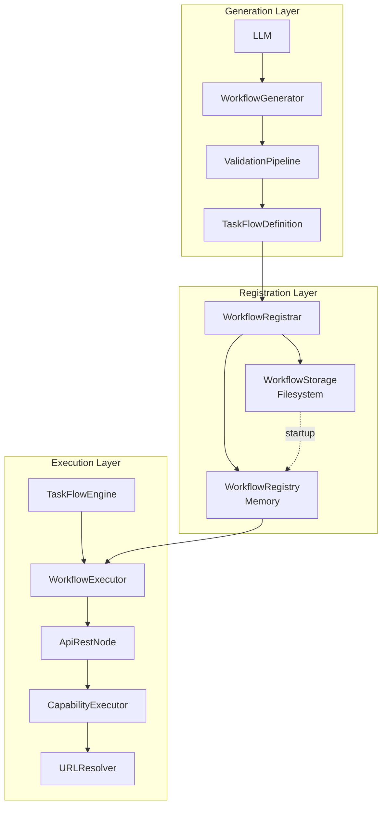
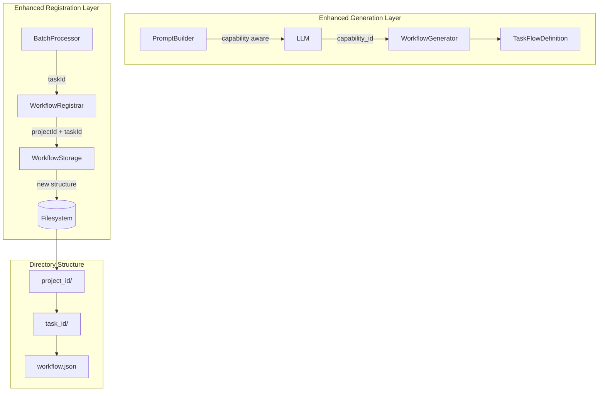
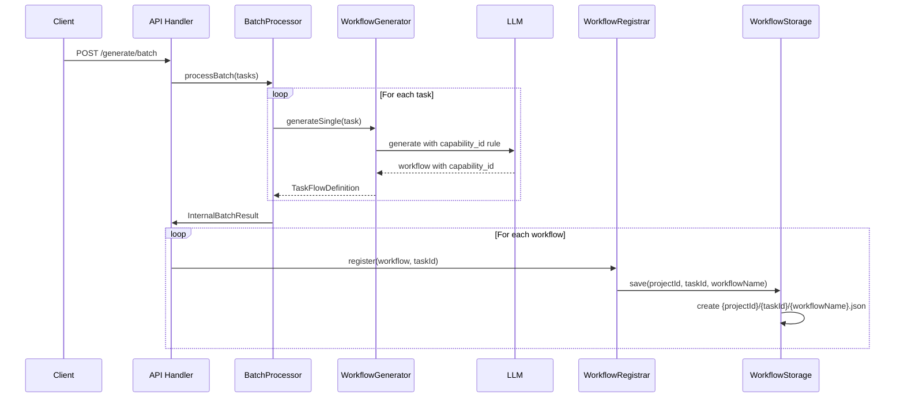
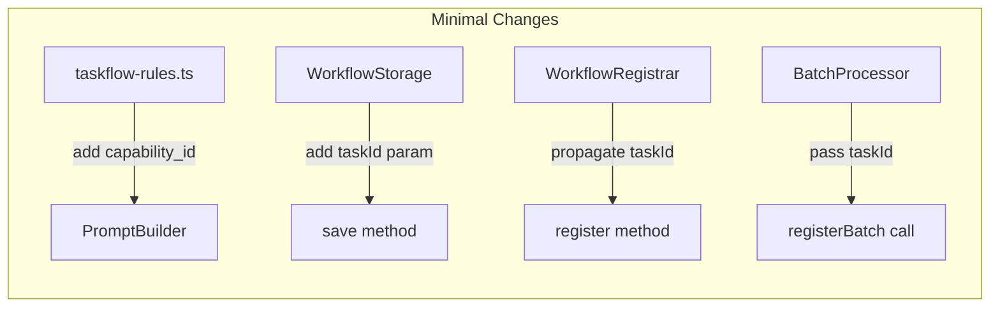

# Issue #373 設計方針書

## タイトル
feat(mySwiftAgentCore): ワークフロー生成でcapability_id使用とタスクIDディレクトリ構造対応

## 1. 概要

本設計方針書では、ワークフロー生成（taskflowGeneratorAgent）における以下の2つの機能追加について、アーキテクチャ設計と実装方針を策定します：

1. **capability_id パラメータの使用**: Issue #372で実装したURL解決機能を活用するため、api_restステップで`url`ではなく`capability_id`を使用
2. **タスクIDディレクトリ構造**: 生成されたJSONファイルを `{project_id}/{task_id}/{workflow_name}.json` の階層構造で保存

## 2. 現状分析

### 2.1 既存アーキテクチャ



### 2.2 問題点

| 層 | 現状 | 問題 |
|---|------|------|
| Generation | LLMが`url`パラメータで生成 | 相対URLのため実行時エラー |
| Storage | `{project_id}/{workflow_name}.json` | タスクのグループ化が困難 |
| Execution | capability_id対応済み（#372） | 生成側が未対応で機能未活用 |

### 2.3 参照した既存ドキュメント

- `mySwiftAgentCore/README.md` - コアモジュールアーキテクチャ
- `src/taskflowEngine/nodes/ApiRestNode.ts` - 実行側のcapability_id実装
- `src/taskflowGeneratorAgent/prompts/templates/taskflow-rules.ts` - LLMプロンプトルール
- `src/taskflowGeneratorAgent/storage/WorkflowStorage.ts` - 現在の保存構造

## 3. アーキテクチャ設計

### 3.1 システム構成



### 3.2 データフロー



## 4. 技術選定

### 4.1 実装方針

| コンポーネント | 選定技術 | 選定理由 | 既存との整合性 |
|----------------|----------|----------|----------------|
| プロンプト拡張 | 既存のTASKFLOW_RULES拡張 | LLMへの指示を最小限の変更で実現 | ✓ 既存プロンプト構造を維持 |
| インターフェース拡張 | メソッドオーバーロード | 後方互換性を保ちながら新機能追加 | ✓ 既存APIとの互換性維持 |
| ディレクトリ構造 | 階層型ファイルシステム | タスク単位の整理が容易 | ✓ 既存の平坦構造も読込可能 |

### 4.2 変更対象コンポーネント



## 5. 設計パターン

### 5.1 採用パターン

| パターン | 適用箇所 | 理由 |
|----------|----------|------|
| **Adapter Pattern** | WorkflowStorage.save() | 既存インターフェースを維持しつつ新機能追加 |
| **Strategy Pattern** | LLMプロンプト生成 | capability_idとurlの使い分けロジック |
| **Backward Compatibility** | loadAll() | 新旧両方のディレクトリ構造をサポート |

### 5.2 実装例

```typescript
// Adapter Pattern for WorkflowStorage
class WorkflowStorage {
  // 既存メソッド（後方互換性）
  async save(projectId: string, workflowId: string, workflow: TaskFlowDefinition): Promise<SaveResult>;

  // 拡張メソッド（オーバーロード）
  async save(
    projectId: string,
    workflowIdOrTaskId: string,
    workflowOrWorkflowId: TaskFlowDefinition | string,
    workflow?: TaskFlowDefinition
  ): Promise<SaveResult> {
    // 引数の数で新旧を判定
    if (arguments.length === 3) {
      // 旧形式: save(projectId, workflowId, workflow)
      return this.saveLegacy(projectId, workflowIdOrTaskId, workflowOrWorkflowId as TaskFlowDefinition);
    } else {
      // 新形式: save(projectId, taskId, workflowId, workflow)
      return this.saveWithTaskId(projectId, workflowIdOrTaskId, workflowOrWorkflowId as string, workflow!);
    }
  }
}
```

## 6. データモデル設計

### 6.1 プロンプトルール拡張

```typescript
// taskflow-rules.ts の拡張
const API_REST_RULES = `
### 1. api_rest
REST API call step for external service integration.

Config (Choose one):
- For capabilities: \`capability_id\`: Capability identifier (e.g., "google_search", "sample_agent")
- For external APIs: \`url\`: Complete URL (e.g., "https://api.external.com/endpoint")

When to use capability_id vs url:
- Use \`capability_id\` when calling MySwiftAgent capabilities (preferred)
- Use \`url\` only for external APIs not managed by MySwiftAgent

Example with capability_id:
\`\`\`json
{
  "id": "search_google",
  "type": "api_rest",
  "config": {
    "capability_id": "google_search",
    "method": "POST"
  },
  "params": {
    "body": { "query": "$input.search_query" }
  }
}
\`\`\`
`;
```

### 6.2 ディレクトリ構造

```
generated/workflows/
├── default_project/
│   ├── task_001/
│   │   ├── execute_google_search_task_001.json
│   │   └── summarize_search_results_task_001.json
│   ├── task_002/
│   │   └── send_email_task_002.json
│   └── legacy_workflow.json  # 後方互換性
└── custom_project/
    └── task_003/
        └── process_data_task_003.json
```

## 7. API設計

### 7.1 内部API変更

```typescript
// WorkflowStorage インターフェース
interface WorkflowStorage {
  // 新メソッド
  saveWithTaskId(
    projectId: string,
    taskId: string,
    workflowId: string,
    workflow: TaskFlowDefinition
  ): Promise<SaveResult>;

  // 拡張されたloadAll
  loadAll(projectId: string, options?: {
    includeTaskDirs?: boolean;  // タスクディレクトリも探索
    legacySupport?: boolean;     // レガシーファイルも読込
  }): Promise<Record<string, TaskFlowDefinition>>;
}

// WorkflowRegistrar インターフェース
interface RegistrationContext {
  projectId?: string;
  taskId?: string;  // 新規追加
}
```

### 7.2 生成されるワークフロー形式

```json
{
  "workflow_name": "execute_google_search_task_001",
  "steps": [{
    "id": "perform_search",
    "type": "api_rest",
    "config": {
      "capability_id": "google_search",  // urlではなくcapability_id
      "method": "POST"
    },
    "params": {
      "body": { "query": "$input.search_term" }
    }
  }]
}
```

## 8. セキュリティ設計

### 8.1 パス検証強化

```typescript
// PathValidator の拡張
class PathValidator {
  validate(segment: string): void {
    // 既存: projectId, workflowId の検証
    // 追加: taskId の検証（同じルール適用）
    if (segment.includes('..') || segment.includes('/')) {
      throw new PathValidationError(`Invalid path segment: ${segment}`);
    }
  }
}
```

### 8.2 capability_id 検証

- CapabilityValidator が生成時に capability_id の存在を検証
- 実行時に CapabilityExecutor が再度検証（二重チェック）

## 9. パフォーマンス設計

### 9.1 ファイルシステム最適化

```typescript
// loadAll の最適化戦略
async loadAll(projectId: string): Promise<Record<string, TaskFlowDefinition>> {
  const projectDir = path.join(this.baseDir, projectId);
  const workflows: Record<string, TaskFlowDefinition> = {};

  // 並列読み込み
  const entries = await fs.readdir(projectDir, { withFileTypes: true });
  const promises: Promise<void>[] = [];

  for (const entry of entries) {
    if (entry.isDirectory()) {
      // タスクディレクトリの処理
      promises.push(this.loadTaskDirectory(projectDir, entry.name, workflows));
    } else if (entry.isFile() && entry.name.endsWith('.json')) {
      // レガシーファイルの処理
      promises.push(this.loadWorkflowFile(projectDir, entry.name, workflows));
    }
  }

  await Promise.all(promises);
  return workflows;
}
```

### 9.2 loadAll() キャッシュ最適化【必須】

タスクディレクトリ構造導入により再帰的ディレクトリ探索が発生するため、キャッシュ機構を実装して性能劣化を防止します。

#### 9.2.1 キャッシュ設計

```typescript
/**
 * キャッシュ設定
 */
interface WorkflowCacheConfig {
  /** キャッシュの有効期限（ミリ秒）。デフォルト: 5分 */
  ttlMs?: number;
  /** キャッシュの最大エントリ数。デフォルト: 100 */
  maxEntries?: number;
  /** キャッシュを有効にするか。デフォルト: true */
  enabled?: boolean;
}

/**
 * キャッシュエントリ
 */
interface CacheEntry<T> {
  value: T;
  timestamp: number;
  hits: number;
}
```

#### 9.2.2 WorkflowStorage キャッシュ実装

```typescript
/**
 * WorkflowStorage with caching support
 */
export class WorkflowStorage {
  private readonly baseDir: string;
  private readonly pathValidator: PathValidator;

  // キャッシュ機構
  private readonly cache: Map<string, CacheEntry<Record<string, TaskFlowDefinition>>>;
  private readonly cacheConfig: Required<WorkflowCacheConfig>;

  constructor(config?: WorkflowStorageConfig) {
    this.baseDir = config?.baseDir ?? DEFAULT_BASE_DIR;
    this.pathValidator = new PathValidator();

    // キャッシュ初期化
    this.cache = new Map();
    this.cacheConfig = {
      ttlMs: config?.cache?.ttlMs ?? 5 * 60 * 1000,  // 5分
      maxEntries: config?.cache?.maxEntries ?? 100,
      enabled: config?.cache?.enabled ?? true,
    };
  }

  /**
   * キャッシュキーを生成
   */
  private getCacheKey(projectId: string, options?: LoadAllOptions): string {
    const optionsKey = options
      ? `-${options.includeTaskDirs ?? true}-${options.legacySupport ?? true}`
      : '-true-true';
    return `${projectId}${optionsKey}`;
  }

  /**
   * キャッシュからの取得を試行
   */
  private getFromCache(
    cacheKey: string
  ): Record<string, TaskFlowDefinition> | undefined {
    if (!this.cacheConfig.enabled) {
      return undefined;
    }

    const entry = this.cache.get(cacheKey);
    if (!entry) {
      return undefined;
    }

    // TTLチェック
    const now = Date.now();
    if (now - entry.timestamp > this.cacheConfig.ttlMs) {
      this.cache.delete(cacheKey);
      return undefined;
    }

    // ヒット数更新
    entry.hits++;
    return entry.value;
  }

  /**
   * キャッシュに保存
   */
  private setToCache(
    cacheKey: string,
    value: Record<string, TaskFlowDefinition>
  ): void {
    if (!this.cacheConfig.enabled) {
      return;
    }

    // 最大エントリ数チェック（LRU風の削除）
    if (this.cache.size >= this.cacheConfig.maxEntries) {
      // 最も古いエントリを削除
      let oldestKey: string | undefined;
      let oldestTime = Infinity;

      for (const [key, entry] of this.cache.entries()) {
        if (entry.timestamp < oldestTime) {
          oldestTime = entry.timestamp;
          oldestKey = key;
        }
      }

      if (oldestKey) {
        this.cache.delete(oldestKey);
      }
    }

    this.cache.set(cacheKey, {
      value,
      timestamp: Date.now(),
      hits: 0,
    });
  }

  /**
   * キャッシュを無効化
   *
   * save/delete操作時に呼び出す
   */
  invalidateCache(projectId?: string): void {
    if (projectId) {
      // 特定プロジェクトのキャッシュのみ無効化
      for (const key of this.cache.keys()) {
        if (key.startsWith(projectId)) {
          this.cache.delete(key);
        }
      }
    } else {
      // 全キャッシュクリア
      this.cache.clear();
    }
  }

  /**
   * Load all workflows for a project (with caching)
   */
  async loadAll(
    projectId: string,
    options?: LoadAllOptions
  ): Promise<Record<string, TaskFlowDefinition>> {
    // Validate path
    try {
      this.pathValidator.validate(projectId);
    } catch (e) {
      if (e instanceof PathValidationError) {
        throw new WorkflowStorageError('loadAll', e.message, e);
      }
      throw e;
    }

    // キャッシュ確認
    const cacheKey = this.getCacheKey(projectId, options);
    const cached = this.getFromCache(cacheKey);
    if (cached) {
      return cached;
    }

    // キャッシュミス：ファイルシステムから読み込み
    const workflows = await this.loadAllFromFilesystem(projectId, options);

    // キャッシュに保存
    this.setToCache(cacheKey, workflows);

    return workflows;
  }

  /**
   * ファイルシステムからの読み込み（内部メソッド）
   */
  private async loadAllFromFilesystem(
    projectId: string,
    options?: LoadAllOptions
  ): Promise<Record<string, TaskFlowDefinition>> {
    const projectDir = path.join(this.baseDir, projectId);
    const workflows: Record<string, TaskFlowDefinition> = {};
    const includeTaskDirs = options?.includeTaskDirs ?? true;
    const legacySupport = options?.legacySupport ?? true;

    try {
      const entries = await fs.readdir(projectDir, { withFileTypes: true });
      const promises: Promise<void>[] = [];

      for (const entry of entries) {
        if (entry.isDirectory() && includeTaskDirs) {
          // タスクディレクトリの処理
          promises.push(this.loadTaskDirectory(projectDir, entry.name, workflows));
        } else if (entry.isFile() && entry.name.endsWith('.json') && legacySupport) {
          // レガシーファイルの処理（平坦構造）
          promises.push(this.loadWorkflowFile(projectDir, entry.name, workflows));
        }
      }

      await Promise.all(promises);
      return workflows;
    } catch (e) {
      if (this.isNotFoundError(e)) {
        return {};
      }
      throw e;
    }
  }

  /**
   * Save workflow with cache invalidation
   */
  async save(
    projectId: string,
    workflowId: string,
    workflow: TaskFlowDefinition
  ): Promise<SaveResult>;
  async save(
    projectId: string,
    taskId: string,
    workflowId: string,
    workflow: TaskFlowDefinition
  ): Promise<SaveResult>;
  async save(
    projectId: string,
    taskIdOrWorkflowId: string,
    workflowIdOrWorkflow: string | TaskFlowDefinition,
    workflow?: TaskFlowDefinition
  ): Promise<SaveResult> {
    // キャッシュ無効化
    this.invalidateCache(projectId);

    // 既存のsaveロジック...
    // （引数の数で新旧形式を判定）
  }

  /**
   * Delete workflow with cache invalidation
   */
  async delete(projectId: string, workflowId: string): Promise<boolean>;
  async delete(projectId: string, taskId: string, workflowId: string): Promise<boolean>;
  async delete(
    projectId: string,
    taskIdOrWorkflowId: string,
    workflowId?: string
  ): Promise<boolean> {
    // キャッシュ無効化
    this.invalidateCache(projectId);

    // 既存のdeleteロジック...
  }
}
```

#### 9.2.3 設定インターフェース拡張

```typescript
/**
 * Storage configuration with cache options
 */
export interface WorkflowStorageConfig {
  baseDir?: string;
  cache?: WorkflowCacheConfig;
}

/**
 * loadAll options
 */
export interface LoadAllOptions {
  /** タスクディレクトリを探索するか（デフォルト: true） */
  includeTaskDirs?: boolean;
  /** レガシー（平坦構造）ファイルも読み込むか（デフォルト: true） */
  legacySupport?: boolean;
  /** キャッシュをバイパスするか（デフォルト: false） */
  bypassCache?: boolean;
}
```

#### 9.2.4 キャッシュ統計API（オプション）

```typescript
/**
 * キャッシュ統計情報
 */
interface CacheStats {
  size: number;
  hits: number;
  misses: number;
  hitRate: number;
}

/**
 * WorkflowStorage キャッシュ統計メソッド
 */
getCacheStats(): CacheStats {
  let totalHits = 0;
  for (const entry of this.cache.values()) {
    totalHits += entry.hits;
  }

  const misses = this.cacheStats.loadCalls - totalHits;

  return {
    size: this.cache.size,
    hits: totalHits,
    misses,
    hitRate: this.cacheStats.loadCalls > 0
      ? totalHits / this.cacheStats.loadCalls
      : 0,
  };
}
```

#### 9.2.5 キャッシュ無効化タイミング

| 操作 | キャッシュ無効化 | スコープ |
|------|----------------|---------|
| `save()` | ✅ 必須 | 対象プロジェクトのみ |
| `delete()` | ✅ 必須 | 対象プロジェクトのみ |
| `initialize()` | ✅ 必須 | 全キャッシュ |
| `loadAll()` | ❌ 不要 | - |
| `load()` | ❌ 不要 | - |

#### 9.2.6 性能目標

| メトリクス | 目標値 | 測定方法 |
|-----------|--------|---------|
| キャッシュヒット率 | 80%以上 | `getCacheStats().hitRate` |
| loadAll()レスポンス（キャッシュヒット） | < 1ms | 単体テスト |
| loadAll()レスポンス（キャッシュミス） | < 100ms（100ワークフロー） | 単体テスト |

## 10. 設計上の決定事項とトレードオフ

### 10.1 capability_id 優先の判断

| 観点 | capability_id 方式 | url 方式 |
|------|-------------------|----------|
| **メリット** | ・URLの一元管理<br>・環境別設定が容易<br>・認証情報の安全な管理 | ・外部API対応<br>・直接的で理解しやすい |
| **デメリット** | ・事前登録が必要<br>・外部APIは非対応 | ・URL変更時の影響大<br>・環境別設定が困難 |
| **採用理由** | MySwiftAgent内部APIは全てcapability化されており、統一的な管理が可能 |

### 10.2 タスクIDディレクトリ構造の判断

| 観点 | 階層構造 | 平坦構造（現状） |
|------|----------|----------------|
| **メリット** | ・タスク単位の整理<br>・関連ワークフローのグループ化<br>・大量ファイル時の性能 | ・シンプル<br>・既存コードとの互換性 |
| **デメリット** | ・ディレクトリ作成のオーバーヘッド<br>・深い階層 | ・ファイル数増加で管理困難<br>・タスクの関連性不明 |
| **採用理由** | 長期的な保守性とスケーラビリティを優先 |

### 10.3 後方互換性の維持

- 既存の平坦構造ファイルも読み込み可能
- 新規生成分のみ階層構造を適用
- マイグレーションツールは不要（段階的移行）

## 11. リスクと対策

| リスク | 影響度 | 対策 |
|--------|--------|------|
| LLMがcapability_idを正しく生成しない | 高 | ・明確なプロンプトルール<br>・ValidationPipelineでの検証<br>・具体例の提示 |
| 既存ワークフローとの非互換性 | 中 | ・loadAllで両構造サポート<br>・段階的移行 |
| ディレクトリ作成の失敗 | 低 | ・再帰的mkdir<br>・適切なエラーハンドリング |

## 12. 実装優先順位

1. **Phase 1**: プロンプトルール拡張（capability_id対応）
2. **Phase 2**: WorkflowStorage のタスクID対応
3. **Phase 2.5**: loadAll() キャッシュ最適化【必須】
4. **Phase 3**: WorkflowRegistrar → BatchProcessor の連携
5. **Phase 4**: loadAll の新構造対応（キャッシュ統合済み）
6. **Phase 5**: 統合テスト・受入テスト

### 12.1 実装タスク詳細

| タスクID | 内容 | 優先度 | 依存 |
|---------|------|--------|------|
| T1 | taskflow-rules.ts に capability_id ルールを追加 | 高 | - |
| T2 | WorkflowStorage.save() に taskId パラメータ追加 | 高 | - |
| T3 | WorkflowStorage に キャッシュ機構を実装 | **必須** | T2 |
| T4 | WorkflowStorage.loadAll() を新構造対応 | 高 | T3 |
| T5 | WorkflowRegistrar.register() に taskId 伝播 | 高 | T2 |
| T6 | BatchProcessor → WorkflowRegistrar 間の taskId 受け渡し | 高 | T5 |
| T7 | 単体テスト作成・更新（キャッシュテスト含む） | 高 | T1-T6 |
| T8 | 統合テスト作成 | 中 | T7 |
| T9 | 受入テスト作成・実行 | 中 | T8 |

## 13. 参考資料

- Issue #372: ケイパビリティAPIエンドポイントのベースURL解決機能
- Issue #364: taskflowGeneratorAgent追加
- Issue #370: ワークフロー永続化
- `docs/arch/service-dependencies.md`
- `mySwiftAgentCore/README.md`