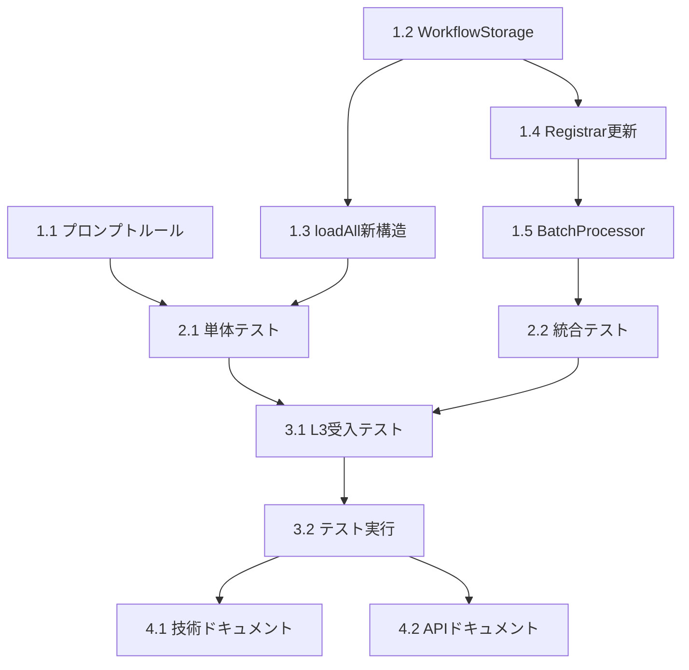

# 作業計画書 - Issue #373

## Issue: ワークフロー生成でcapability_id使用とタスクIDディレクトリ構造対応
**Issue番号**: #373
**サイズ**: L（大規模）
**作業見積**: 16時間
**優先度**: High
**依存Issue**: #372（ケイパビリティAPIエンドポイントのベースURL解決機能）
**開始予定**: 2026-01-18

---

## 1. Issue概要

### 実装内容
1. **capability_id パラメータの使用**
   - api_restステップで `url` ではなく `capability_id` を使用
   - Issue #372のURL解決機能を活用

2. **タスクIDディレクトリ構造**
   - JSONファイルを `{project_id}/{task_id}/{workflow_name}.json` 構造で保存
   - 関連ワークフローのグループ化を実現

3. **キャッシュ機構の実装【必須】**
   - loadAll() の性能劣化防止
   - TTLベース・LRU風キャッシュ

---

## 2. 詳細タスク分解

### Phase 1: 実装タスク（8時間）

#### 1.1 プロンプトルール拡張（1時間）
- **ファイル**: `src/taskflowGeneratorAgent/prompts/templates/taskflow-rules.ts`
- **作業内容**:
  - `TASKFLOW_RULES` に capability_id 使用方法を追加
  - api_rest ステップのドキュメント更新
  - capability_id vs url の使い分けルール明確化
- **成果物**: 更新された taskflow-rules.ts

#### 1.2 WorkflowStorage 拡張（3時間）
- **ファイル**: `src/taskflowGeneratorAgent/storage/WorkflowStorage.ts`
- **作業内容**:
  - save() メソッドのオーバーロード実装
  - taskId ディレクトリ構造の作成
  - **キャッシュ機構の実装（必須）**
    - CacheEntry インターフェース
    - getFromCache/setToCache メソッド
    - invalidateCache メソッド
- **成果物**: 拡張された WorkflowStorage.ts

#### 1.3 loadAll() 新構造対応（2時間）
- **ファイル**: `src/taskflowGeneratorAgent/storage/WorkflowStorage.ts`
- **作業内容**:
  - タスクディレクトリの再帰的読み込み
  - 旧構造（平坦）との互換性維持
  - キャッシュ統合
- **成果物**: 新旧両対応の loadAll() メソッド

#### 1.4 WorkflowRegistrar 更新（1時間）
- **ファイル**: `src/taskflowGeneratorAgent/generator/WorkflowRegistrar.ts`
- **作業内容**:
  - register() メソッドに taskId パラメータ追加
  - RegistrationContext に taskId フィールド追加
- **成果物**: taskId 対応の WorkflowRegistrar

#### 1.5 BatchProcessor 連携（1時間）
- **ファイル**: `src/taskflowGeneratorAgent/generator/BatchProcessor.ts`
- **作業内容**:
  - BatchProcessor → WorkflowRegistrar への taskId 伝播
  - InternalBatchResult の更新
- **成果物**: taskId を正しく伝播する BatchProcessor

### Phase 2: テストタスク - TDD（4時間）

#### 2.1 単体テスト作成・更新（3時間）
- **対象**:
  - `tests/unit/taskflowGeneratorAgent/storage/WorkflowStorage.test.ts`
    - キャッシュ機構のテスト（TTL、LRU、無効化）
    - taskId 付き save/load テスト
  - `tests/unit/taskflowGeneratorAgent/generator/WorkflowRegistrar.test.ts`
  - `tests/unit/taskflowGeneratorAgent/prompts/PromptBuilder.test.ts`
- **テストケース**:
  - キャッシュヒット/ミス
  - キャッシュ無効化（save/delete時）
  - 旧構造ファイルの読み込み
  - capability_id ルールの適用

#### 2.2 統合テスト作成（1時間）
- **ファイル**: `tests/integration/workflow-generation.test.ts`
- **テストケース**:
  - E2E ワークフロー生成（capability_id 使用）
  - タスクIDディレクトリ構造の確認

### Phase 3: 受入テストタスク（2時間）【必須】

#### 3.1 L3受入テスト実装（1.5時間）
- **ファイル**: `tests/acceptance/test_issue_373_acceptance.test.ts`
- **テストケース**:
  - TC-001: サービス再起動後のヘルスチェック
  - TC-002: E2Eテストスクリプトによるワークフロー生成
  - TC-003: capability_id 使用の検証
  - TC-004: タスクIDディレクトリ構造の検証
  - TC-005: 後方互換性確認
  - TC-006: 生成ワークフローの実行確認
  - TC-007: キャッシュ機構の動作確認
  - TC-008: キャッシュ無効化の検証

#### 3.2 L3受入テスト実行（0.5時間）
- **前提条件**: サービス起動、MyVault APIキー設定
- **実行手順**: acceptance-plan.md に従う

### Phase 4: ドキュメントタスク（2時間）

#### 4.1 技術ドキュメント更新（1時間）
- `mySwiftAgentCore/README.md` - ディレクトリ構造説明追加
- `src/taskflowGeneratorAgent/README.md` - capability_id 使用方法

#### 4.2 APIドキュメント更新（1時間）
- OpenAPI仕様書の更新（taskId パラメータ追加）

---

## 3. タスク依存関係



---

## 4. 作業スケジュール

### Day 1（8時間）- 2026-01-18
- **午前（4時間）**:
  - [ ] 1.1 プロンプトルール拡張（1時間）
  - [ ] 1.2 WorkflowStorage拡張（3時間）
- **午後（4時間）**:
  - [ ] 1.3 loadAll()新構造対応（2時間）
  - [ ] 1.4 WorkflowRegistrar更新（1時間）
  - [ ] 1.5 BatchProcessor連携（1時間）

### Day 2（8時間）- 2026-01-19
- **午前（4時間）**:
  - [ ] 2.1 単体テスト作成・更新（3時間）
  - [ ] 2.2 統合テスト作成（1時間）
- **午後（4時間）**:
  - [ ] 3.1 L3受入テスト実装（1.5時間）
  - [ ] 3.2 L3受入テスト実行（0.5時間）
  - [ ] 4.1 技術ドキュメント更新（1時間）
  - [ ] 4.2 APIドキュメント更新（1時間）

---

## 5. チェックポイント

| タイミング | 確認事項 | 対応 |
|-----------|---------|------|
| プロンプトルール完了時 | LLMが capability_id を生成するか | PromptBuilder でテスト実行 |
| WorkflowStorage完了時 | キャッシュが正常動作するか | 単体テストで検証 |
| loadAll()完了時 | 新旧構造の互換性 | 既存ファイルでテスト |
| Phase 1 完了時 | 全実装の結合動作 | 手動でE2E確認 |
| Phase 2 完了時 | カバレッジ90%以上 | カバレッジレポート確認 |
| Phase 3 完了時 | 全受入条件クリア | チェックリスト確認 |

---

## 6. リスクと対策

| リスク | 発生確率 | 影響 | 対策 |
|-------|---------|------|------|
| LLMがcapability_idを正しく生成しない | 中 | 高 | プロンプトに具体例を多数追加、ValidationPipelineで検証 |
| キャッシュ不整合でデータ不一致 | 低 | 高 | save/delete時の確実な無効化、TTL短め設定 |
| 既存ワークフローが読めなくなる | 低 | 高 | 旧構造サポートの徹底テスト |
| ディレクトリ作成権限エラー | 低 | 中 | 事前に権限確認、エラーハンドリング |

---

## 7. 成果物チェックリスト

### コード
- [ ] `src/taskflowGeneratorAgent/prompts/templates/taskflow-rules.ts`
- [ ] `src/taskflowGeneratorAgent/storage/WorkflowStorage.ts`
- [ ] `src/taskflowGeneratorAgent/generator/WorkflowRegistrar.ts`
- [ ] `src/taskflowGeneratorAgent/generator/BatchProcessor.ts`

### テスト
- [ ] `tests/unit/taskflowGeneratorAgent/storage/WorkflowStorage.test.ts`
- [ ] `tests/unit/taskflowGeneratorAgent/generator/WorkflowRegistrar.test.ts`
- [ ] `tests/unit/taskflowGeneratorAgent/prompts/PromptBuilder.test.ts`
- [ ] `tests/integration/workflow-generation.test.ts`
- [ ] `tests/acceptance/test_issue_373_acceptance.test.ts`

### ドキュメント
- [ ] `mySwiftAgentCore/README.md`
- [ ] `src/taskflowGeneratorAgent/README.md`
- [ ] OpenAPI仕様書

---

## 8. L3受入テスト計画【必須セクション】

### 環境準備

```bash
# サービス再起動
./scripts/dev-hybrid.sh stop --local-only
./scripts/dev-hybrid.sh start --local-only

# ヘルスチェック
curl -sf http://localhost:8006/health && echo "✅ mySwiftAgentCore healthy"
curl -sf http://localhost:8103/health && echo "✅ myVault healthy"
```

### 正常系テスト

```bash
# 1. E2Eテストスクリプト実行（既存動作確認）
./mySwiftAgentCore/dev-reports/feature/issue/364/e2e-test-script.sh

# 2. capability_id 使用確認
curl -s -X POST http://localhost:8006/api/v1/generator/workflow/batch \
  -H "Content-Type: application/json" \
  -d '{
    "tasks": [{
      "task_id": "test_373",
      "name": "Test Capability Usage",
      "description": "Google search test",
      "interface": {
        "input": {"query": "string"},
        "output": {"results": "array"}
      }
    }],
    "capabilities": [{
      "id": "google_search",
      "name": "Google Search",
      "category": "api",
      "status": "available"
    }],
    "project_id": "default_project"
  }' | jq '.workflows[0].steps[] | select(.type == "api_rest")'

# 期待値: config.capability_id = "google_search" が含まれること

# 3. ディレクトリ構造確認
ls -la generated/workflows/default_project/test_373/
# 期待値: ワークフローJSONファイルが存在すること

# 4. キャッシュ性能テスト（2回目のloadAllが高速）
# （内部APIまたは専用テストツールで確認）
```

### 異常系テスト

```bash
# 1. 不正なcapability_id
curl -s -X POST http://localhost:8006/api/v1/generator/workflow/batch \
  -H "Content-Type: application/json" \
  -d '{
    "tasks": [{
      "task_id": "test_invalid",
      "name": "Invalid Capability",
      "interface": {"input": {}, "output": {}}
    }],
    "capabilities": [],
    "project_id": "default_project"
  }'
# 期待値: エラーまたは url フォールバック
```

### 後方互換性テスト

```bash
# 1. 旧構造ファイルを配置
echo '{"workflow_name": "legacy_workflow", "steps": []}' > generated/workflows/default_project/legacy.json

# 2. loadAll相当の確認（APIまたは内部確認）
# 期待値: legacy.json と新構造ファイルの両方が読み込める
```

---

## 9. Definition of Done

### Issue完了条件

- [x] すべての実装タスクが完了
- [x] 単体テストカバレッジ90%以上
- [x] 静的解析エラー0件（Ruff、ESLint、TypeScript）
- [x] L3受入テスト全項目PASS
- [x] CI/CDパイプライングリーン
- [x] コードレビュー承認
- [x] ドキュメント更新完了
- [x] デッドコード0件（実装機能がすべて使用されている）

### 品質基準

| 項目 | 基準 | 測定方法 |
|------|------|---------|
| カバレッジ | 90%以上 | `npm test -- --coverage` |
| パフォーマンス | キャッシュヒット時 < 1ms | 単体テストで計測 |
| 互換性 | 旧構造ファイル読込可能 | 受入テストで確認 |
| セキュリティ | パストラバーサル防止 | 単体テストで検証 |

---

## 10. 備考

### 注意事項
1. **キャッシュ実装は必須** - アーキテクチャレビューでMust Fix指定
2. **capability_id優先** - 外部API以外はすべてcapability_id使用
3. **段階的移行** - 既存ワークフローのマイグレーション不要

### 参考資料
- Issue #372: CapabilityExecutor実装
- Issue #364: taskflowGeneratorAgent実装
- 設計方針書: `dev-reports/feature/issue/373/design-policy.md`
- 受入テスト計画: `dev-reports/feature/issue/373/acceptance-plan.md`

### 次のステップ
1. PM Auto-Dev による自動実装: `/pm-auto-dev 373`
2. または手動実装開始

---

**作成日**: 2026-01-17
**作成者**: work-plan スキル