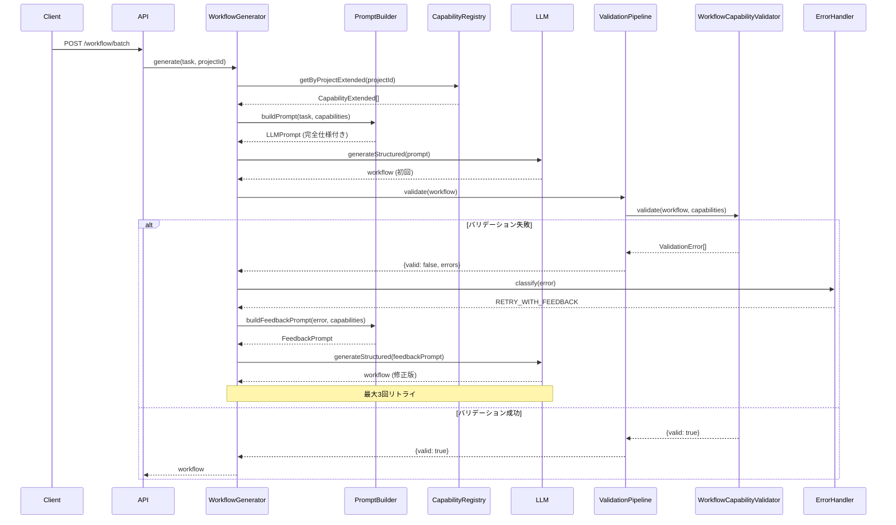

# 設計方針書: TaskFlowGeneratorAgent Capability強化

**Issue**: #374 feat(mySwiftAgentCore): Capability Prompt強化 + Validation強化 + フィードバックループ実装
**作成日**: 2026-01-17
**作成者**: Claude (Design Policy スキル)

---

## 1. 概要

本設計方針書は、TaskFlowGeneratorAgentにおけるCapability情報の活用を強化し、LLMが生成するワークフローの品質と成功率を向上させるためのアーキテクチャ設計を定めるものです。

### 1.1 現状の課題

- **Capability情報の不完全性**: PromptBuilderがLLMに渡すCapability情報が最小限（id, name, description, category）
- **バリデーション不足**: CapabilityValidatorが存在確認のみで、パラメータ検証が不十分
- **エラー回復の欠如**: バリデーション失敗時に手動修正が必要（フィードバックループなし）

### 1.2 設計目標

1. **完全なCapability仕様の提供**: responseSchema、examples、validationルールを含む
2. **厳密なバリデーション**: パラメータ型、必須項目、制約条件の検証
3. **自動エラー修正**: フィードバックループによる最大3回の自動リトライ

---

## 2. システム構成図

### 2.1 改善後のアーキテクチャ

```mermaid
graph TB
    subgraph "API Layer"
        API["/api/v1/generator/workflow/batch"]
    end

    subgraph "Orchestration Layer"
        BP[BatchProcessor]
        WG[WorkflowGenerator]
        WR[WorkflowRegistrar]
    end

    subgraph "Capability Management"
        CR[CapabilityRegistry]
        CL[CapabilityLoader]
        CE[(Capability YAMLs)]
    end

    subgraph "Generation Core"
        PB[PromptBuilder<br/>+formatCapabilities<br/>+buildFeedbackPrompt]
        LC[LLMClient]
        EH[ErrorHandler]
    end

    subgraph "Validation Layer"
        VP[ValidationPipeline]
        SV[SchemaValidator]
        DV[DependencyValidator]
        VV[VariableValidator]
        CV[WorkflowCapabilityValidator<br/>(新規)]
        SecV[SecurityValidator]
    end

    subgraph "Storage"
        WS[WorkflowStorage]
        MR[MemoryRegistry]
    end

    API --> BP
    BP --> WG
    WG --> PB
    WG --> LC
    WG --> VP
    WG --> EH

    CR --> CE
    CL --> CE
    CR --> CL

    PB -.-> CR
    CV -.-> CR

    VP --> SV
    VP --> DV
    VP --> VV
    VP --> CV
    VP --> SecV

    WG --> WR
    WR --> WS
    WR --> MR

    style CV fill:#9cf,stroke:#333,stroke-width:4px
    style PB fill:#9cf,stroke:#333,stroke-width:4px
    style EH fill:#fcf,stroke:#333,stroke-width:2px
```

### 2.2 データフロー



---

## 3. 技術選定

### 3.1 技術スタック（既存との整合性重視）

| カテゴリ | 選定技術 | 選定理由 | 既存との整合性 |
|----------|----------|----------|----------------|
| **型システム** | TypeScript + Zod | 型安全性 + ランタイム検証 | ✅ 既存で使用中 |
| **バリデーション** | Zod Schema | 宣言的検証 + 型推論 | ✅ ValidationPipelineで使用 |
| **エラーハンドリング** | カスタムError階層 | 詳細なエラー情報 | ✅ LLMValidationError等 |
| **非同期処理** | async/await + Promise | 標準的な非同期パターン | ✅ 全体で使用 |
| **ロギング** | pino | 高速・構造化ログ | ✅ 既存インフラ |
| **テスト** | Vitest | 高速・TypeScript対応 | ✅ プロジェクト標準 |

### 3.2 新規導入コンポーネント

| コンポーネント | 役割 | 技術的根拠 |
|---------------|------|------------|
| **WorkflowCapabilityValidator** | Capability仕様準拠検証 | 既存Validatorパターンに準拠 |
| **LLMValidationError** | フィードバック用エラー | 既存エラー階層を拡張 |
| **buildFeedbackPrompt** | エラーフィードバック構築 | PromptBuilderメソッド追加 |

---

## 4. 設計パターン

### 4.1 採用パターン（既存コードベース準拠）

| パターン | 適用箇所 | 実装例 |
|---------|---------|--------|
| **Factory Pattern** | LLMClientFactory | Model → Provider → Client 自動選択（維持） |
| **Pipeline Pattern** | ValidationPipeline | 複数Validator順次実行（拡張） |
| **Strategy Pattern** | ErrorHandler/RetryStrategy | エラー種別で戦略切替（活用） |
| **Builder Pattern** | PromptBuilder | プロンプト構築（強化） |
| **Repository Pattern** | CapabilityRegistry | Capability管理（活用） |
| **Adapter Pattern** | BaseLLMClient | プロバイダ統一インターフェース（維持） |

### 4.2 フィードバックループの設計パターン

```typescript
// Template Method Pattern + State Pattern の組み合わせ
abstract class FeedbackLoopHandler {
  protected abstract buildFeedback(error: LLMValidationError): string;
  protected abstract shouldRetry(attempt: number, error: Error): boolean;

  async execute<T>(
    operation: (prompt: string) => Promise<T>,
    maxAttempts: number = 3
  ): Promise<T> {
    let lastError: LLMValidationError | null = null;

    for (let attempt = 1; attempt <= maxAttempts; attempt++) {
      try {
        const prompt = lastError
          ? this.buildFeedback(lastError)
          : this.buildInitialPrompt();

        return await operation(prompt);
      } catch (error) {
        if (!this.shouldRetry(attempt, error)) throw error;
        lastError = error as LLMValidationError;
      }
    }

    throw new MaxRetriesExceededError(lastError);
  }
}
```

---

## 5. データモデル設計

### 5.1 拡張型定義

```typescript
// Capability情報の完全型（PromptBuilder用）
export interface CapabilityForPrompt extends Capability {
  // 既存フィールド
  id: string;
  name: string;
  description?: string;
  category: string;
  status: CapabilityStatus;
  parameters?: CapabilityParameter[];

  // 拡張フィールド（CapabilityExtended から選択）
  responseSchema?: Record<string, unknown>;
  examples?: CapabilityTaskFlowExample[];
  metadata?: {
    use_cases?: string[];
    workflow_usage_example?: string;
    performance_note?: string;
    recommended_timeout?: number;
  };
}

// パラメータ検証情報の追加
export interface CapabilityParameter {
  name: string;
  type: string;
  required: boolean;
  description?: string;

  // 新規追加
  defaultValue?: unknown;
  validation?: {
    min?: number;
    max?: number;
    pattern?: string;
    enum?: unknown[];
  };
}

// TaskFlow使用例
export interface CapabilityTaskFlowExample {
  description: string;
  taskflow_step: {
    id: string;
    type: string;
    config: {
      capability_id: string;
      method?: string;
    };
    params: {
      body: Record<string, unknown>;
    };
  };
  output_mapping?: Record<string, string>;
}
```

### 5.2 エラー情報の構造化

```typescript
// フィードバックループ用エラー
export class LLMValidationError extends Error {
  constructor(
    message: string,
    public readonly validationResult: ValidationResult,
    public readonly rawContent: string,
    public readonly attempt: number
  ) {
    super(message);
    this.name = 'LLMValidationError';
  }

  toFeedbackSummary(): string {
    // エラー詳細を構造化してフィードバック生成
  }
}

// バリデーション結果の詳細化
export interface ValidationResult {
  valid: boolean;
  errors: ValidationError[];
  warnings: ValidationWarning[];

  // 新規追加
  capabilityErrors?: CapabilityValidationError[];
}

export interface CapabilityValidationError extends ValidationError {
  capability: string;
  parameter?: string;
  expected?: string;
  actual?: string;
  suggestion?: string;
}
```

---

## 6. API設計

### 6.1 内部API（コンポーネント間）

#### CapabilityRegistry 拡張

```typescript
interface CapabilityRegistry {
  // 既存メソッド
  getByProject(projectId: string): Capability[];

  // 新規追加（完全情報取得）
  getByProjectExtended(projectId: string): CapabilityExtended[];

  // パラメータスキーマ取得
  getParameterSchema(projectId: string, capabilityId: string): CapabilityParameter[];
}
```

#### PromptBuilder 拡張

```typescript
interface PromptBuilder {
  // 既存メソッド
  buildPrompt(task: TaskGenerationRequest, capabilities: Capability[]): LLMPrompt;

  // メソッドオーバーロード（完全情報対応）
  buildPrompt(task: TaskGenerationRequest, capabilities: CapabilityForPrompt[]): LLMPrompt;

  // 新規追加（フィードバック）
  buildFeedbackPrompt(
    originalPrompt: string,
    error: LLMValidationError,
    capabilities: CapabilityForPrompt[]
  ): string;
}
```

### 6.2 エラーレスポンス改善

```typescript
// 詳細なエラーレスポンス
interface EnhancedErrorResponse {
  success: false;
  error: {
    code: string;
    message: string;
    details: ValidationError[];

    // 新規追加
    capabilityMismatches?: Array<{
      step: string;
      capability: string;
      issue: string;
      suggestion: string;
      example?: unknown;
    }>;
  };

  // 自動修正の試行情報
  retryInfo?: {
    attempts: number;
    lastError: string;
    improvementsSuggested: string[];
  };
}
```

---

## 7. セキュリティ設計

### 7.1 Capability情報のフィルタリング

| 項目 | LLMへの開示 | 理由 |
|------|------------|------|
| `_internal.endpoint` | ❌ 禁止 | 内部実装詳細 |
| `_internal.secret_key` | ❌ 禁止 | 認証情報参照 |
| `_internal.auth_type` | ❌ 禁止 | 認証方式 |
| `responseSchema` | ✅ 許可 | レスポンス構造理解に必要 |
| `examples` | ✅ 許可 | 正しい使用例として必要 |
| `metadata.use_cases` | ✅ 許可 | 用途理解に有用 |
| `metadata.performance_note` | ✅ 許可 | タイムアウト設定の参考 |

### 7.2 実装例

```typescript
function filterCapabilityForPrompt(cap: CapabilityExtended): CapabilityForPrompt {
  const { _internal, ...safeFields } = cap;
  return safeFields as CapabilityForPrompt;
}
```

---

## 8. パフォーマンス設計

### 8.1 キャッシング戦略

| 対象 | 戦略 | 実装方法 |
|------|------|----------|
| **CapabilityExtended** | 起動時読み込み | CapabilityRegistry内でキャッシュ |
| **フォーマット済みプロンプト** | リクエスト内キャッシュ | PromptBuilder内で一時保存 |
| **LLMClient インスタンス** | シングルトン | Factory内でプロバイダ別管理 |

### 8.2 並列処理とタイムアウト

```typescript
// BatchProcessor の並列度設定（維持）
const DEFAULT_CONCURRENCY = 5;
const MAX_CONCURRENCY = 20;

// フィードバックループのタイムアウト戦略
const FEEDBACK_TIMEOUTS = {
  initial: 30000,      // 30秒
  retry1: 45000,       // 45秒（1.5倍）
  retry2: 60000,       // 60秒（2倍）
  retry3: 60000,       // 60秒（上限）
};
```

---

## 9. 設計上の決定事項とトレードオフ

### 9.1 採用した設計の理由

| 決定事項 | 理由 | トレードオフ |
|---------|------|------------|
| **完全Capability情報の提供** | LLMの理解度向上、エラー率削減 | プロンプトサイズ増加（約2-3倍） |
| **WorkflowCapabilityValidator新設** | 既存Validator構造との一貫性 | ValidationPipelineの処理時間増加 |
| **最大3回のリトライ** | 実用的な成功率とレスポンス時間のバランス | 最悪ケースで処理時間3倍 |
| **LLMValidationError専用型** | 詳細なフィードバック情報の保持 | エラー階層の複雑化 |

### 9.2 代替案との比較

#### Capability情報の提供方法

| 案 | メリット | デメリット | 採用/却下 |
|----|--------|-----------|----------|
| **A: 完全情報提供（採用）** | 高精度、具体例あり | プロンプト肥大化 | ✅ 採用 |
| B: 段階的提供 | プロンプト最小化 | 複雑な状態管理 | ❌ 却下 |
| C: 参照リンク方式 | 最小プロンプト | LLM外部参照不可 | ❌ 却下 |

#### フィードバックループ実装

| 案 | メリット | デメリット | 採用/却下 |
|----|--------|-----------|----------|
| **A: PromptBuilder統合（採用）** | 既存構造活用、シンプル | PromptBuilder責務増加 | ✅ 採用 |
| B: 独立Feedback Manager | 責務分離明確 | 新規コンポーネント | ❌ 却下 |
| C: LLMClient内蔵 | 透過的リトライ | LLMClient複雑化 | ❌ 却下 |

### 9.3 想定されるリスクと対策

| リスク | 影響度 | 発生可能性 | 対策 |
|--------|--------|------------|------|
| **プロンプトサイズ超過** | 高 | 中 | Capability数制限、要約機能 |
| **無限リトライ** | 中 | 低 | 最大回数制限、タイムアウト |
| **コスト増加（Token使用量）** | 中 | 高 | 初回成功率向上で相殺 |
| **レスポンス遅延** | 低 | 中 | 並列処理維持、キャッシュ活用 |

---

## 10. 実装優先順位

### Phase 1: 基盤整備（必須）
1. 型定義の拡張（CapabilityForPrompt、LLMValidationError）
2. CapabilityRegistry.getByProjectExtended() 実装

### Phase 2: PromptBuilder強化（コア機能）
1. formatCapabilities() の拡張実装
2. Capability情報フィルタリング（セキュリティ）

### Phase 3: Validation強化（品質向上）
1. WorkflowCapabilityValidator 実装
2. ValidationPipeline への統合

### Phase 4: フィードバックループ（自動修正）
1. buildFeedbackPrompt() 実装
2. WorkflowGenerator へのループ統合
3. ErrorHandler 活用

### Phase 5: 統合テスト（品質保証）
1. E2Eテストケース追加
2. パフォーマンステスト
3. エラー率測定

---

## 11. 参照ドキュメント

本設計は以下のドキュメントを参照して作成されました：

- [service-dependencies.md](../../../../docs/arch/service-dependencies.md) - サービス間依存関係
- [設計仕様書](design-spec-capability-prompt-enhancement.md) - 詳細実装仕様
- 既存コード調査レポート（Task tool実行結果）

---

## 12. 制約条件への準拠

CLAUDE.mdに定義された以下の原則に準拠しています：

- **SOLID原則**: 単一責任（各Validatorは1つの検証のみ）、開放閉鎖原則（Validator追加で拡張）
- **KISS原則**: 既存パターンを踏襲、新規概念を最小化
- **YAGNI原則**: 現時点で必要な機能のみ実装
- **DRY原則**: 共通ロジックはBaseクラスに集約

### テストカバレッジ目標
- 単体テスト: 90%以上（CLAUDE.md準拠）
- 結合テスト: 50%以上（フィードバックループ重点）

---

## 13. アーキテクチャレビュー対応（追記: 2026-01-17）

アーキテクチャレビューで指摘された**必須改善項目（Must Fix）**に対応しました。

### 13.1 プロンプトサイズ制限の実装

**課題**: 大規模プロジェクトでCapability数が多い場合、プロンプトサイズがLLMのコンテキスト制限を超過するリスク

**対策**:

```typescript
// 定数定義
const MAX_CAPABILITIES_PER_PROMPT = 50;

// タスクに関連性の高いCapabilityを優先選択
function selectRelevantCapabilities(
  task: TaskDefinition,
  capabilities: CapabilityForPrompt[],
  maxCount: number
): CapabilityForPrompt[];
```

**選択アルゴリズム**:
1. タスク名・説明からキーワードを抽出
2. 各Capabilityに関連性スコアを計算
   - Capability名一致: +10点
   - 説明文一致: +5点
   - カテゴリ一致: +3点
   - use_cases一致: +7点
3. スコア順に上位50件を選択

**参照**: 設計仕様書 Section 4.4

### 13.2 メトリクス収集の実装

**課題**: フィードバックループの効果測定ができず、継続的改善のデータがない

**対策**:

```typescript
interface GenerationMetrics {
  initialSuccessRate: number;       // 初回成功率
  averageRetryCount: number;        // 平均リトライ回数
  tokenUsageByAttempt: number[];    // 試行ごとのトークン使用量
  validationErrorTypes: Record<string, number>;  // エラータイプ別カウント
  totalDurationMs: number;          // 総処理時間
}
```

**収集ポイント**:
1. `GenerationMetricsCollector.startGeneration()` - 生成開始
2. `recordAttempt()` - 各試行の結果記録
3. `finalize()` - 最終メトリクス計算

**出力先**:
- APIレスポンスの `metrics` フィールド
- 構造化ログ（将来的にLangfuse連携）

**参照**: 設計仕様書 Section 7.8

### 13.3 実装計画への反映

以下のPhaseが追加されました：

| Phase | 内容 |
|-------|------|
| Phase 2 追加 | `selectRelevantCapabilities()`, `calculateRelevanceScore()` |
| Phase 4.5 新設 | メトリクス収集（GenerationMetricsCollector, MetricsAggregator） |

---

**以上**