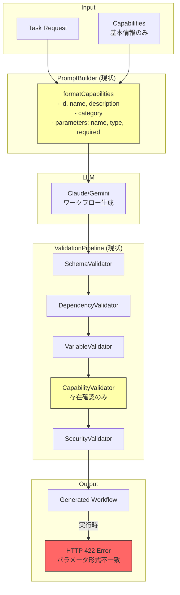
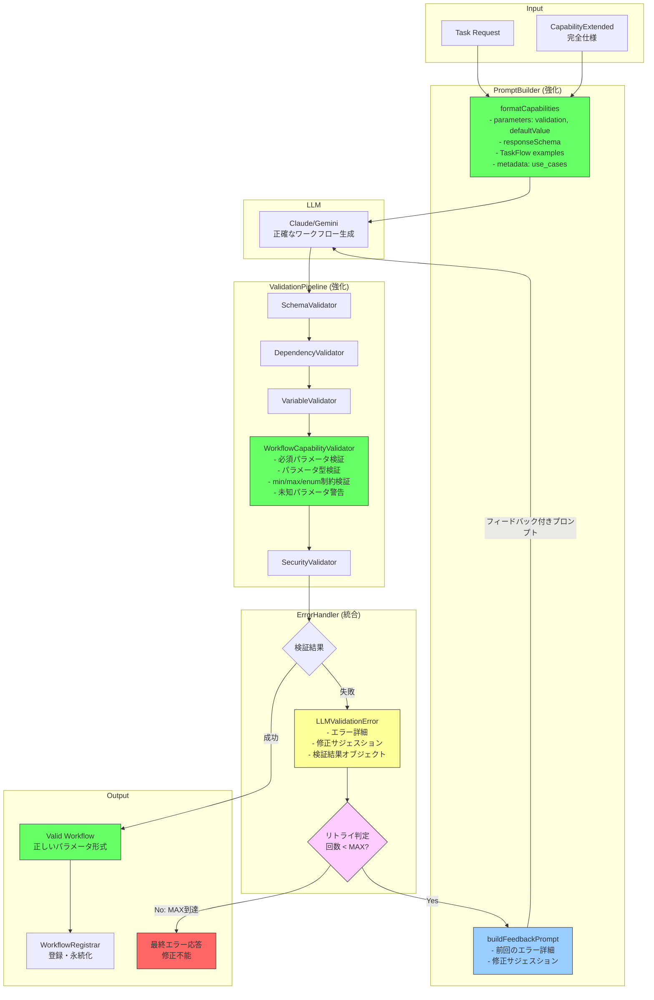

# Capability仕様をLLMに渡す設計仕様

## TaskFlowGeneratorAgent: Capability Prompt Enhancement & Validation

### 1. 背景と問題

#### 1.1 現状の問題

E2Eテスト（Test 4）で以下のエラーが発生：

```
HTTP 422 Unprocessable Entity
```

**原因**: LLMが生成したワークフローのパラメータ形式がCapability仕様と不一致

| 項目 | LLMが生成 | 実際のAPI仕様 |
|------|-----------|---------------|
| パラメータ名 | `query: string` | `queries: array` |
| 形式 | `{"query": "検索キーワード"}` | `{"queries": ["検索キーワード"], "num": 3}` |

#### 1.2 根本原因

`PromptBuilder.formatCapabilities()` が渡す情報が不十分：

**現在渡している情報**:
- id, name, description, category
- parameters: name, type, required, description のみ

**渡していない情報**:
- `validation`: min, max, enum制約
- `defaultValue`: パラメータのデフォルト値
- `responseSchema`: APIレスポンス構造
- `examples`: TaskFlow形式の使用例
- `metadata.workflow_usage_example`: 実際のワークフロー例

### 2. 処理フロー比較

#### 2.1 Before（現在）



#### 2.2 After（改善後：フィードバックループ付き）



**フィードバックループの流れ**:
1. LLMがワークフロー生成
2. ValidationPipelineで検証
3. 失敗時: `LLMValidationError`を生成（エラー詳細 + 修正サジェスション）
4. リトライ回数チェック（デフォルト最大3回）
5. リトライ可能: `buildFeedbackPrompt()`でエラー情報を含むプロンプトを構築
6. LLMに再度生成依頼（前回のエラーを学習）
7. 成功するまで繰り返し、または最大回数到達でエラー応答

### 3. 設計方針

#### 3.1 アーキテクチャ概要

```
┌─────────────────────────────────────────────────────────────────────┐
│                        Workflow Generation Flow                      │
├─────────────────────────────────────────────────────────────────────┤
│                                                                      │
│  config/capabilities/{project_id}/*.yaml                            │
│           │                                                          │
│           ▼                                                          │
│  ┌─────────────────────┐                                            │
│  │  CapabilityLoader   │  -- 全フィールド読み込み済み                 │
│  │  (既存実装)         │     CapabilityExtended型                    │
│  └──────────┬──────────┘                                            │
│             │                                                        │
│             ▼                                                        │
│  ┌─────────────────────┐                                            │
│  │ CapabilityRegistry  │  -- プロジェクト別にCapability管理          │
│  │  (既存実装)         │                                            │
│  └──────────┬──────────┘                                            │
│             │                                                        │
│             ▼                                                        │
│  ┌─────────────────────────────────────────────────┐                │
│  │  Generator API (routes.ts)                      │                │
│  │  - CapabilityRegistry から CapabilityExtended取得│                │
│  │  - PromptBuilder に渡す                         │  ★ 変更点1     │
│  └──────────┬──────────────────────────────────────┘                │
│             │                                                        │
│             ▼                                                        │
│  ┌─────────────────────────────────────────────────┐                │
│  │  PromptBuilder (Enhanced)                       │                │
│  │  - formatCapabilities() 拡張                    │  ★ 変更点2     │
│  │  - responseSchema, examples, validation を含める │                │
│  └──────────┬──────────────────────────────────────┘                │
│             │                                                        │
│             ▼                                                        │
│  ┌─────────────────────┐                                            │
│  │  LLM (Claude)       │  -- 完全なCapability仕様を認識              │
│  │                     │     正確なパラメータ形式で生成               │
│  └─────────────────────┘                                            │
│                                                                      │
└─────────────────────────────────────────────────────────────────────┘
```

#### 3.2 変更箇所

| ファイル | 変更内容 |
|----------|----------|
| `src/taskflowGeneratorAgent/types/generator.ts` | `Capability`型をCapabilityExtended互換に拡張 |
| `src/taskflowGeneratorAgent/prompts/PromptBuilder.ts` | `formatCapabilities()`を拡張 |
| `src/api/routes.ts` | CapabilityExtendedをPromptBuilderに渡す |

### 4. 詳細設計

#### 4.1 型定義の拡張 (generator.ts)

```typescript
// 現在の簡易Capability型
export interface Capability {
  id: string;
  name: string;
  description?: string;
  category: string;
  status: 'available' | 'unavailable' | 'deprecated';
  parameters?: CapabilityParameter[];
}

// ↓ 拡張後（CapabilityExtendedと互換）

export interface CapabilityForPrompt {
  id: string;
  name: string;
  description?: string;
  category: string;
  status: 'available' | 'unavailable' | 'deprecated';
  parameters?: CapabilityParameter[];

  // 追加フィールド
  responseSchema?: Record<string, unknown>;      // APIレスポンス構造
  examples?: CapabilityTaskFlowExample[];        // TaskFlow使用例
  metadata?: {
    use_cases?: string[];                         // ユースケース
    workflow_usage_example?: string;              // ワークフロー例
    performance_note?: string;                    // パフォーマンス注意
    recommended_timeout?: number;                 // 推奨タイムアウト
  };
}

// TaskFlow形式の例
export interface CapabilityTaskFlowExample {
  description: string;
  taskflow_step: {
    id: string;
    type: string;
    config: {
      capability_id: string;
      method: string;
    };
    params: {
      body: Record<string, unknown>;
    };
  };
  output_mapping?: Record<string, string>;
}

// パラメータ拡張
export interface CapabilityParameter {
  name: string;
  type: string;
  required: boolean;
  description?: string;
  defaultValue?: unknown;          // 追加
  validation?: {                   // 追加
    min?: number;
    max?: number;
    pattern?: string;
    enum?: unknown[];
  };
}
```

#### 4.2 PromptBuilder.formatCapabilities() 拡張

```typescript
/**
 * Format capabilities for prompt (Enhanced)
 *
 * 拡張内容:
 * - パラメータの詳細情報（defaultValue, validation）
 * - レスポンススキーマ
 * - TaskFlow使用例
 * - ユースケースとワークフロー例
 */
formatCapabilities(capabilities: CapabilityForPrompt[]): string {
  const byCategory = this.groupByCategory(capabilities);
  const sections: string[] = [];

  for (const [category, caps] of Object.entries(byCategory)) {
    sections.push(`### ${this.formatCategoryName(category)}`);
    sections.push('');

    for (const cap of caps) {
      sections.push(this.formatSingleCapability(cap));
    }
  }

  return sections.join('\n');
}

/**
 * Format single capability with full details
 */
private formatSingleCapability(cap: CapabilityForPrompt): string {
  const lines: string[] = [];

  // 基本情報
  lines.push(`#### ${cap.name} (\`${cap.id}\`)`);
  if (cap.description) {
    lines.push(cap.description);
  }
  lines.push('');

  // パラメータ詳細
  if (cap.parameters && cap.parameters.length > 0) {
    lines.push('**Parameters:**');
    lines.push('```');
    for (const param of cap.parameters) {
      lines.push(this.formatParameter(param));
    }
    lines.push('```');
    lines.push('');
  }

  // レスポンススキーマ
  if (cap.responseSchema) {
    lines.push('**Response Schema:**');
    lines.push('```json');
    lines.push(JSON.stringify(cap.responseSchema, null, 2));
    lines.push('```');
    lines.push('');
  }

  // TaskFlow使用例（最も重要）
  if (cap.examples && cap.examples.length > 0) {
    lines.push('**TaskFlow Step Example:**');
    const example = cap.examples[0]; // 最初の例を使用
    lines.push('```json');
    lines.push(JSON.stringify(example.taskflow_step, null, 2));
    lines.push('```');
    if (example.output_mapping) {
      lines.push('Output mapping:');
      lines.push('```json');
      lines.push(JSON.stringify(example.output_mapping, null, 2));
      lines.push('```');
    }
    lines.push('');
  }

  // ワークフロー例（metadataから）
  if (cap.metadata?.workflow_usage_example) {
    lines.push('**Workflow Usage Example:**');
    lines.push('```json');
    lines.push(cap.metadata.workflow_usage_example);
    lines.push('```');
    lines.push('');
  }

  // ユースケース
  if (cap.metadata?.use_cases && cap.metadata.use_cases.length > 0) {
    lines.push('**Use Cases:**');
    for (const useCase of cap.metadata.use_cases) {
      lines.push(`- ${useCase}`);
    }
    lines.push('');
  }

  return lines.join('\n');
}

/**
 * Format parameter with full details
 */
private formatParameter(param: CapabilityParameter): string {
  const required = param.required ? '(required)' : '(optional)';
  let line = `- ${param.name}: ${param.type} ${required}`;

  if (param.description) {
    line += ` - ${param.description}`;
  }

  if (param.defaultValue !== undefined) {
    line += ` [default: ${JSON.stringify(param.defaultValue)}]`;
  }

  if (param.validation) {
    const constraints: string[] = [];
    if (param.validation.min !== undefined) {
      constraints.push(`min: ${param.validation.min}`);
    }
    if (param.validation.max !== undefined) {
      constraints.push(`max: ${param.validation.max}`);
    }
    if (param.validation.enum) {
      constraints.push(`enum: ${JSON.stringify(param.validation.enum)}`);
    }
    if (constraints.length > 0) {
      line += ` {${constraints.join(', ')}}`;
    }
  }

  return line;
}
```

#### 4.3 routes.ts 修正

```typescript
// 現在: 簡易Capability型を使用
const capabilities = registry.getByProject(projectId);

// 変更後: CapabilityExtendedをそのまま渡す
const capabilitiesExtended = registry.getByProjectExtended(projectId);

// PromptBuilderに渡す際、_internal は除外（セキュリティ）
const capabilitiesForPrompt = capabilitiesExtended.map(cap => ({
  id: cap.id,
  name: cap.name,
  description: cap.description,
  category: cap.category,
  status: cap.status,
  parameters: cap.parameters,
  responseSchema: (cap as any).responseSchema,  // YAML追加フィールド
  examples: cap.examples,
  metadata: cap.metadata,
}));
```

#### 4.4 プロンプトサイズ制限

大規模プロジェクトでCapability数が多い場合、プロンプトサイズが増大しトークン制限に達する問題を防止します。

**定数定義:**

```typescript
/**
 * プロンプトに含める最大Capability数
 *
 * 50件を超える場合は、タスクに関連性の高いCapabilityのみ選択
 */
export const MAX_CAPABILITIES_PER_PROMPT = 50;

/**
 * 各Capabilityの最大文字数（examples含む）
 */
export const MAX_CAPABILITY_DESCRIPTION_LENGTH = 2000;
```

**関連性に基づくCapability選択:**

```typescript
/**
 * タスクに関連性の高いCapabilityを選択
 *
 * @param task - 生成対象タスク
 * @param capabilities - 全Capability
 * @param maxCount - 最大選択数
 * @returns 関連性の高いCapability（最大maxCount件）
 */
function selectRelevantCapabilities(
  task: TaskDefinition,
  capabilities: CapabilityForPrompt[],
  maxCount: number = MAX_CAPABILITIES_PER_PROMPT
): CapabilityForPrompt[] {
  if (capabilities.length <= maxCount) {
    return capabilities;
  }

  // 1. タスク名・説明に含まれるキーワードでスコアリング
  const taskKeywords = extractKeywords(task.name + ' ' + (task.description ?? ''));

  const scored = capabilities.map(cap => ({
    cap,
    score: calculateRelevanceScore(cap, taskKeywords),
  }));

  // 2. スコア順でソート
  scored.sort((a, b) => b.score - a.score);

  // 3. 上位maxCount件を返す
  return scored.slice(0, maxCount).map(s => s.cap);
}

/**
 * Capabilityの関連性スコアを計算
 */
function calculateRelevanceScore(
  cap: CapabilityForPrompt,
  taskKeywords: string[]
): number {
  let score = 0;

  // Capability名にキーワードが含まれる
  for (const keyword of taskKeywords) {
    if (cap.name.toLowerCase().includes(keyword.toLowerCase())) {
      score += 10;
    }
    if (cap.description?.toLowerCase().includes(keyword.toLowerCase())) {
      score += 5;
    }
    if (cap.category.toLowerCase().includes(keyword.toLowerCase())) {
      score += 3;
    }
    // use_casesにキーワードが含まれる
    if (cap.metadata?.use_cases?.some(uc =>
      uc.toLowerCase().includes(keyword.toLowerCase())
    )) {
      score += 7;
    }
  }

  // 頻出カテゴリにボーナス
  const frequentCategories = ['llm', 'search', 'communication', 'utility'];
  if (frequentCategories.includes(cap.category.toLowerCase())) {
    score += 2;
  }

  return score;
}

/**
 * テキストからキーワードを抽出
 */
function extractKeywords(text: string): string[] {
  // ストップワードを除外
  const stopWords = ['the', 'a', 'an', 'to', 'for', 'of', 'with', 'and', 'or'];
  const words = text.toLowerCase()
    .split(/[\s\-_]+/)
    .filter(w => w.length > 2 && !stopWords.includes(w));
  return [...new Set(words)];
}
```

**PromptBuilder統合:**

```typescript
formatCapabilities(
  capabilities: CapabilityForPrompt[],
  task?: TaskDefinition
): string {
  // サイズ制限を適用
  let selectedCapabilities = capabilities;

  if (capabilities.length > MAX_CAPABILITIES_PER_PROMPT) {
    if (task) {
      selectedCapabilities = selectRelevantCapabilities(task, capabilities);
      console.log(
        `[PromptBuilder] Capability count reduced: ${capabilities.length} -> ${selectedCapabilities.length}`
      );
    } else {
      // タスク情報がない場合は先頭から取得
      selectedCapabilities = capabilities.slice(0, MAX_CAPABILITIES_PER_PROMPT);
    }
  }

  const byCategory = this.groupByCategory(selectedCapabilities);
  const sections: string[] = [];

  // 選択されたCapability数を先頭に追加
  if (capabilities.length > MAX_CAPABILITIES_PER_PROMPT) {
    sections.push(`> Note: ${capabilities.length} capabilities available, showing top ${selectedCapabilities.length} most relevant.`);
    sections.push('');
  }

  for (const [category, caps] of Object.entries(byCategory)) {
    sections.push(`### ${this.formatCategoryName(category)}`);
    sections.push('');

    for (const cap of caps) {
      sections.push(this.formatSingleCapability(cap));
    }
  }

  return sections.join('\n');
}
```

### 5. 生成されるプロンプト例

#### 5.1 現在のプロンプト（不十分）

```markdown
### Search Capabilities

#### Google検索 (`google_search`)
Web検索（Serper API使用）- LLMによるナレッジ抽出を含むため処理時間が長い
- **Category**: search
- **Parameters**:
  - `queries`: array (required)
  - `num`: number (optional)
```

#### 5.2 拡張後のプロンプト（完全）

```markdown
### Search Capabilities

#### Google検索 (`google_search`)
Web検索（Serper API使用）- LLMによるナレッジ抽出を含むため処理時間が長い

**Parameters:**
```
- queries: array (required) - 検索クエリのリスト
- num: number (optional) - 各クエリの検索結果件数 [default: 10] {min: 1, max: 100}
```

**Response Schema:**
```json
{
  "search_results": {
    "type": "array",
    "description": "検索結果のリスト",
    "items": {
      "type": "object",
      "properties": {
        "title": { "type": "string" },
        "link": { "type": "string" },
        "knowledge": { "type": "string" }
      }
    }
  },
  "search_results_count": { "type": "integer" }
}
```

**TaskFlow Step Example:**
```json
{
  "id": "google_search",
  "type": "api_rest",
  "config": {
    "capability_id": "google_search",
    "method": "POST"
  },
  "params": {
    "body": {
      "queries": ["$input.search_query"],
      "num": 3
    }
  }
}
```

**Use Cases:**
- キーワード検索
- 複数クエリ一括検索（queries配列）
- 検索結果件数指定（num）
```

### 6. Validation強化設計

LLMが生成したワークフローをCapability仕様に照らして検証し、不正なパラメータを事前に検出する機能を追加します。

#### 6.1 アーキテクチャ

```
┌─────────────────────────────────────────────────────────────────────┐
│                   Workflow Validation Flow                          │
├─────────────────────────────────────────────────────────────────────┤
│                                                                      │
│  LLM Generated Workflow                                             │
│           │                                                          │
│           ▼                                                          │
│  ┌─────────────────────────────────────────────────┐                │
│  │  WorkflowCapabilityValidator (新規)             │                │
│  │  - validateWorkflowAgainstCapabilities()        │  ★ 新規追加   │
│  │  - validateStepParameters()                     │                │
│  │  - validateRequiredParameters()                 │                │
│  │  - validateParameterTypes()                     │                │
│  │  - validateParameterConstraints()               │                │
│  └──────────┬──────────────────────────────────────┘                │
│             │                                                        │
│             ▼                                                        │
│  ┌─────────────────────┐     ┌─────────────────────┐                │
│  │  Validation Failed  │     │  Validation Passed  │                │
│  │  - Error details    │     │  - Register workflow │                │
│  │  - Suggested fixes  │     │  - Ready to execute  │                │
│  └─────────────────────┘     └─────────────────────┘                │
│                                                                      │
└─────────────────────────────────────────────────────────────────────┘
```

#### 6.2 WorkflowCapabilityValidator 設計

```typescript
/**
 * WorkflowCapabilityValidator - Validates workflow against capability specs
 *
 * LLMが生成したワークフローがCapability仕様に準拠しているか検証
 */
export class WorkflowCapabilityValidator {
  constructor(private registry: CapabilityRegistry) {}

  /**
   * ワークフロー全体を検証
   */
  validateWorkflow(
    workflow: TaskFlowDefinition,
    projectId: string
  ): ValidationResult {
    const errors: ValidationError[] = [];
    const warnings: ValidationWarning[] = [];

    for (const step of workflow.steps) {
      if (step.type === 'api_rest' && step.config?.capability_id) {
        const stepResult = this.validateStep(step, projectId);
        errors.push(...stepResult.errors);
        warnings.push(...stepResult.warnings);
      }
    }

    return {
      valid: errors.length === 0,
      errors,
      warnings,
    };
  }

  /**
   * 個別ステップを検証
   */
  private validateStep(
    step: TaskFlowStep,
    projectId: string
  ): StepValidationResult {
    const capability = this.registry.get(projectId, step.config.capability_id);

    if (!capability) {
      return {
        errors: [{
          code: 'CAPABILITY_NOT_FOUND',
          message: `Capability '${step.config.capability_id}' not found`,
          step: step.id,
        }],
        warnings: [],
      };
    }

    const errors: ValidationError[] = [];
    const warnings: ValidationWarning[] = [];

    // 1. 必須パラメータチェック
    errors.push(...this.validateRequiredParams(step, capability));

    // 2. パラメータ型チェック
    errors.push(...this.validateParamTypes(step, capability));

    // 3. パラメータ制約チェック（min, max, enum）
    errors.push(...this.validateParamConstraints(step, capability));

    // 4. 未知のパラメータ警告
    warnings.push(...this.warnUnknownParams(step, capability));

    return { errors, warnings };
  }

  /**
   * 必須パラメータの検証
   */
  private validateRequiredParams(
    step: TaskFlowStep,
    capability: CapabilityExtended
  ): ValidationError[] {
    const errors: ValidationError[] = [];
    const bodyParams = step.params?.body ?? {};

    for (const param of capability.parameters ?? []) {
      if (param.required && !(param.name in bodyParams)) {
        errors.push({
          code: 'MISSING_REQUIRED_PARAM',
          message: `Required parameter '${param.name}' is missing`,
          step: step.id,
          capability: capability.id,
          parameter: param.name,
          suggestion: `Add '${param.name}' to params.body`,
        });
      }
    }

    return errors;
  }

  /**
   * パラメータ型の検証
   */
  private validateParamTypes(
    step: TaskFlowStep,
    capability: CapabilityExtended
  ): ValidationError[] {
    const errors: ValidationError[] = [];
    const bodyParams = step.params?.body ?? {};

    for (const param of capability.parameters ?? []) {
      const value = bodyParams[param.name];
      if (value === undefined) continue;

      // $input.xxx や $steps.xxx は実行時解決のためスキップ
      if (typeof value === 'string' && value.startsWith('$')) continue;

      const actualType = this.getValueType(value);
      if (actualType !== param.type) {
        errors.push({
          code: 'PARAM_TYPE_MISMATCH',
          message: `Parameter '${param.name}' should be ${param.type}, got ${actualType}`,
          step: step.id,
          capability: capability.id,
          parameter: param.name,
          expected: param.type,
          actual: actualType,
        });
      }
    }

    return errors;
  }

  /**
   * パラメータ制約の検証（min, max, enum）
   */
  private validateParamConstraints(
    step: TaskFlowStep,
    capability: CapabilityExtended
  ): ValidationError[] {
    const errors: ValidationError[] = [];
    const bodyParams = step.params?.body ?? {};

    for (const param of capability.parameters ?? []) {
      const value = bodyParams[param.name];
      if (value === undefined || !param.validation) continue;

      // 動的参照はスキップ
      if (typeof value === 'string' && value.startsWith('$')) continue;

      const { min, max, enum: enumValues } = param.validation;

      // min制約
      if (min !== undefined && typeof value === 'number' && value < min) {
        errors.push({
          code: 'PARAM_BELOW_MIN',
          message: `Parameter '${param.name}' value ${value} is below minimum ${min}`,
          step: step.id,
          parameter: param.name,
        });
      }

      // max制約
      if (max !== undefined && typeof value === 'number' && value > max) {
        errors.push({
          code: 'PARAM_ABOVE_MAX',
          message: `Parameter '${param.name}' value ${value} is above maximum ${max}`,
          step: step.id,
          parameter: param.name,
        });
      }

      // enum制約
      if (enumValues && !enumValues.includes(value)) {
        errors.push({
          code: 'PARAM_NOT_IN_ENUM',
          message: `Parameter '${param.name}' value must be one of: ${enumValues.join(', ')}`,
          step: step.id,
          parameter: param.name,
        });
      }
    }

    return errors;
  }

  /**
   * 未知のパラメータを警告
   */
  private warnUnknownParams(
    step: TaskFlowStep,
    capability: CapabilityExtended
  ): ValidationWarning[] {
    const warnings: ValidationWarning[] = [];
    const bodyParams = step.params?.body ?? {};
    const knownParams = new Set((capability.parameters ?? []).map(p => p.name));

    for (const paramName of Object.keys(bodyParams)) {
      if (!knownParams.has(paramName)) {
        warnings.push({
          code: 'UNKNOWN_PARAM',
          message: `Unknown parameter '${paramName}' for capability '${capability.id}'`,
          step: step.id,
          parameter: paramName,
        });
      }
    }

    return warnings;
  }

  private getValueType(value: unknown): string {
    if (Array.isArray(value)) return 'array';
    if (value === null) return 'null';
    return typeof value;
  }
}
```

#### 6.3 型定義

```typescript
export interface ValidationResult {
  valid: boolean;
  errors: ValidationError[];
  warnings: ValidationWarning[];
}

export interface ValidationError {
  code: string;
  message: string;
  step: string;
  capability?: string;
  parameter?: string;
  expected?: string;
  actual?: string;
  suggestion?: string;
}

export interface ValidationWarning {
  code: string;
  message: string;
  step: string;
  parameter?: string;
}
```

#### 6.4 API統合

```typescript
// routes.ts - ワークフロー生成後に検証を追加

const workflow = await generator.generate(task, capabilities);

// 検証実行
const validator = new WorkflowCapabilityValidator(capabilityRegistry);
const validationResult = validator.validateWorkflow(workflow, projectId);

if (!validationResult.valid) {
  // 検証失敗時はエラーを返す（または自動修正を試みる）
  return {
    success: false,
    error: {
      code: 'WORKFLOW_VALIDATION_FAILED',
      message: 'Generated workflow does not match capability specifications',
      details: validationResult.errors,
    },
    suggestions: validationResult.errors.map(e => e.suggestion).filter(Boolean),
  };
}

// 検証成功時のみ登録
await workflowRegistrar.register(projectId, workflow);
```

#### 6.5 エラーメッセージ例

```json
{
  "success": false,
  "error": {
    "code": "WORKFLOW_VALIDATION_FAILED",
    "message": "Generated workflow does not match capability specifications",
    "details": [
      {
        "code": "MISSING_REQUIRED_PARAM",
        "message": "Required parameter 'queries' is missing",
        "step": "google_search",
        "capability": "google_search",
        "parameter": "queries",
        "suggestion": "Add 'queries' to params.body"
      },
      {
        "code": "UNKNOWN_PARAM",
        "message": "Unknown parameter 'query' for capability 'google_search'",
        "step": "google_search",
        "parameter": "query"
      }
    ]
  },
  "suggestions": [
    "Add 'queries' to params.body",
    "Parameter 'query' should be 'queries' (array type)"
  ]
}
```

### 7. フィードバックループ設計（Issue #367統合）

Issue #367で設計されていたフィードバックループを本Issueに統合し、バリデーションエラー発生時にLLMに修正を依頼する機構を実装します。

#### 7.1 概要

```
LLM生成 → 検証失敗 → LLMValidationError → ErrorHandler → RETRY_WITH_FEEDBACK
    ↑                                                          ↓
    └─────────── フィードバック付きプロンプトで再生成 ←──────────┘
```

#### 7.2 LLMValidationError クラス

```typescript
/**
 * LLMValidationError - バリデーション失敗時の専用エラー
 *
 * 通常のErrorと異なり、検証結果と修正サジェスションを含む
 */
export class LLMValidationError extends Error {
  constructor(
    message: string,
    public readonly validationResult: ValidationResult,
    public readonly rawContent: string,  // LLMの生の出力
    public readonly attempt: number,      // 何回目の試行か
  ) {
    super(message);
    this.name = 'LLMValidationError';
  }

  /**
   * フィードバック用のエラーサマリを生成
   */
  toFeedbackSummary(): string {
    const errors = this.validationResult.errors;
    const lines: string[] = [
      `## 前回の生成結果に以下の問題がありました（試行${this.attempt}回目）:`,
      '',
    ];

    for (const error of errors) {
      lines.push(`### エラー: ${error.code}`);
      lines.push(`- ステップ: ${error.step}`);
      lines.push(`- 問題: ${error.message}`);
      if (error.suggestion) {
        lines.push(`- 修正方法: ${error.suggestion}`);
      }
      if (error.expected && error.actual) {
        lines.push(`- 期待値: ${error.expected}, 実際: ${error.actual}`);
      }
      lines.push('');
    }

    lines.push('## 上記のエラーを修正したワークフローを再生成してください。');

    return lines.join('\n');
  }
}
```

#### 7.3 PromptBuilder.buildFeedbackPrompt() 追加

```typescript
/**
 * フィードバック付きプロンプトを構築
 *
 * @param originalPrompt - 元のプロンプト
 * @param error - 前回のLLMValidationError
 * @param capabilities - Capability一覧（修正に必要な情報を再提示）
 */
buildFeedbackPrompt(
  originalPrompt: string,
  error: LLMValidationError,
  capabilities: CapabilityForPrompt[]
): string {
  const sections: string[] = [];

  // 1. エラーフィードバック
  sections.push(error.toFeedbackSummary());
  sections.push('---');
  sections.push('');

  // 2. 問題のあったステップに関連するCapability仕様を再提示
  const problemCapabilities = this.extractProblemCapabilities(
    error.validationResult,
    capabilities
  );

  if (problemCapabilities.length > 0) {
    sections.push('## 参考: 問題のあったCapabilityの正しい仕様');
    sections.push('');
    for (const cap of problemCapabilities) {
      sections.push(this.formatSingleCapability(cap));
    }
    sections.push('---');
    sections.push('');
  }

  // 3. 前回の不正な出力（参考）
  sections.push('## 前回の出力（修正が必要）:');
  sections.push('```json');
  sections.push(error.rawContent);
  sections.push('```');
  sections.push('');

  // 4. 元のタスク要件
  sections.push('## 元の要件:');
  sections.push(originalPrompt);

  return sections.join('\n');
}

/**
 * エラーに関連するCapabilityを抽出
 */
private extractProblemCapabilities(
  validationResult: ValidationResult,
  capabilities: CapabilityForPrompt[]
): CapabilityForPrompt[] {
  const problemCapIds = new Set<string>();

  for (const error of validationResult.errors) {
    if (error.capability) {
      problemCapIds.add(error.capability);
    }
  }

  return capabilities.filter(cap => problemCapIds.has(cap.id));
}
```

#### 7.4 WorkflowGenerator フィードバックループ統合

```typescript
/**
 * WorkflowGenerator - フィードバックループ付きワークフロー生成
 */
export class WorkflowGenerator {
  private readonly maxRetries = 3;
  private readonly promptBuilder: PromptBuilder;
  private readonly validator: WorkflowCapabilityValidator;
  private readonly llmClient: LLMClient;

  async generate(
    task: TaskDefinition,
    capabilities: CapabilityForPrompt[],
    projectId: string
  ): Promise<GenerationResult> {
    let attempt = 0;
    let lastError: LLMValidationError | null = null;

    while (attempt < this.maxRetries) {
      attempt++;

      try {
        // プロンプト構築（フィードバック付きの場合は前回エラーを含める）
        const prompt = lastError
          ? this.promptBuilder.buildFeedbackPrompt(
              this.promptBuilder.buildGenerationPrompt(task, capabilities),
              lastError,
              capabilities
            )
          : this.promptBuilder.buildGenerationPrompt(task, capabilities);

        // LLM呼び出し
        const rawContent = await this.llmClient.generate(prompt);

        // パース
        const workflow = this.parseWorkflow(rawContent);

        // バリデーション
        const validationResult = this.validator.validateWorkflow(
          workflow,
          projectId
        );

        if (validationResult.valid) {
          // 成功
          return {
            success: true,
            workflow,
            attempts: attempt,
            warnings: validationResult.warnings,
          };
        }

        // バリデーション失敗 → LLMValidationError生成
        lastError = new LLMValidationError(
          `Validation failed: ${validationResult.errors.map(e => e.message).join(', ')}`,
          validationResult,
          rawContent,
          attempt
        );

        console.log(
          `[WorkflowGenerator] Attempt ${attempt} failed, retrying with feedback...`
        );

      } catch (error) {
        // パースエラー等の場合
        if (error instanceof LLMValidationError) {
          lastError = error;
        } else {
          throw error; // 予期しないエラーは再スロー
        }
      }
    }

    // 最大リトライ到達
    return {
      success: false,
      error: {
        code: 'MAX_RETRIES_EXCEEDED',
        message: `Failed to generate valid workflow after ${this.maxRetries} attempts`,
        lastValidationErrors: lastError?.validationResult.errors ?? [],
        suggestions: lastError?.validationResult.errors
          .map(e => e.suggestion)
          .filter(Boolean) ?? [],
      },
      attempts: attempt,
    };
  }
}
```

#### 7.5 ErrorHandler 統合（既存コードの活用）

```typescript
// 既存のErrorHandler.tsを実際に使用するように修正

import { ErrorHandler, ErrorType, RecoveryStrategy } from './ErrorHandler';

// WorkflowGenerator内で使用
private readonly errorHandler = new ErrorHandler();

// エラー分類に使用
private classifyAndHandle(error: Error): RecoveryStrategy {
  const classification = this.errorHandler.classify(error);

  switch (classification.recoveryStrategy) {
    case RecoveryStrategy.RETRY_WITH_FEEDBACK:
      // フィードバックループを実行
      return RecoveryStrategy.RETRY_WITH_FEEDBACK;

    case RecoveryStrategy.RETRY_SIMPLE:
      // 単純リトライ
      return RecoveryStrategy.RETRY_SIMPLE;

    case RecoveryStrategy.FAIL_FAST:
      // 即座に失敗
      return RecoveryStrategy.FAIL_FAST;

    default:
      return RecoveryStrategy.FAIL_FAST;
  }
}
```

#### 7.6 型定義

```typescript
export interface GenerationResult {
  success: boolean;
  workflow?: TaskFlowDefinition;
  error?: GenerationError;
  attempts: number;
  warnings?: ValidationWarning[];
}

export interface GenerationError {
  code: string;
  message: string;
  lastValidationErrors?: ValidationError[];
  suggestions?: string[];
}
```

#### 7.7 ログ出力例

```
[WorkflowGenerator] Attempt 1: Generating workflow for task "Execute Google Search"
[WorkflowGenerator] Attempt 1: Validation failed
  - MISSING_REQUIRED_PARAM: Required parameter 'queries' is missing (step: google_search)
  - UNKNOWN_PARAM: Unknown parameter 'query' for capability 'google_search'
[WorkflowGenerator] Attempt 1 failed, retrying with feedback...

[WorkflowGenerator] Attempt 2: Generating with feedback prompt
[WorkflowGenerator] Attempt 2: Validation passed
[WorkflowGenerator] Success after 2 attempts
```

#### 7.8 メトリクス収集

フィードバックループの効果を測定し、継続的な改善を可能にするためのメトリクス収集機能を実装します。

**メトリクス型定義:**

```typescript
/**
 * GenerationMetrics - ワークフロー生成のメトリクス
 *
 * 生成プロセスのパフォーマンスと品質を測定
 */
export interface GenerationMetrics {
  /**
   * 初回成功率（フィードバックなしで成功した割合）
   * 1.0 = 100%初回成功、0.0 = 全てリトライ必要
   */
  initialSuccessRate: number;

  /**
   * 平均リトライ回数
   * 成功までに要した試行回数の平均
   */
  averageRetryCount: number;

  /**
   * 試行ごとのトークン使用量
   * [attempt1_tokens, attempt2_tokens, ...]
   */
  tokenUsageByAttempt: number[];

  /**
   * バリデーションエラータイプ別カウント
   * { "MISSING_REQUIRED_PARAM": 5, "PARAM_TYPE_MISMATCH": 3, ... }
   */
  validationErrorTypes: Record<string, number>;

  /**
   * 総処理時間（ミリ秒）
   */
  totalDurationMs: number;

  /**
   * Capability選択によるトークン削減量（推定）
   */
  tokenSavedBySelection?: number;
}

/**
 * AttemptMetrics - 個別試行のメトリクス
 */
export interface AttemptMetrics {
  attemptNumber: number;
  startTime: number;
  endTime: number;
  durationMs: number;
  tokenUsage: {
    prompt: number;
    completion: number;
    total: number;
  };
  validationErrors: ValidationError[];
  success: boolean;
}
```

**メトリクスコレクター:**

```typescript
/**
 * GenerationMetricsCollector - メトリクス収集クラス
 */
export class GenerationMetricsCollector {
  private attempts: AttemptMetrics[] = [];
  private startTime: number = 0;

  /**
   * 生成開始
   */
  startGeneration(): void {
    this.startTime = Date.now();
    this.attempts = [];
  }

  /**
   * 試行を記録
   */
  recordAttempt(metrics: Omit<AttemptMetrics, 'attemptNumber'>): void {
    this.attempts.push({
      ...metrics,
      attemptNumber: this.attempts.length + 1,
    });
  }

  /**
   * 最終メトリクスを計算
   */
  finalize(): GenerationMetrics {
    const totalDurationMs = Date.now() - this.startTime;
    const successfulAttempts = this.attempts.filter(a => a.success);
    const initialSuccess = this.attempts[0]?.success ?? false;

    // エラータイプ別カウント
    const validationErrorTypes: Record<string, number> = {};
    for (const attempt of this.attempts) {
      for (const error of attempt.validationErrors) {
        validationErrorTypes[error.code] =
          (validationErrorTypes[error.code] ?? 0) + 1;
      }
    }

    return {
      initialSuccessRate: initialSuccess ? 1.0 : 0.0,
      averageRetryCount:
        successfulAttempts.length > 0
          ? this.attempts.length / successfulAttempts.length
          : this.attempts.length,
      tokenUsageByAttempt: this.attempts.map(a => a.tokenUsage.total),
      validationErrorTypes,
      totalDurationMs,
    };
  }
}
```

**WorkflowGenerator統合:**

```typescript
export class WorkflowGenerator {
  private readonly metricsCollector = new GenerationMetricsCollector();

  async generate(
    task: TaskDefinition,
    capabilities: CapabilityForPrompt[],
    projectId: string
  ): Promise<GenerationResult> {
    this.metricsCollector.startGeneration();
    let attempt = 0;
    let lastError: LLMValidationError | null = null;

    while (attempt < this.maxRetries) {
      attempt++;
      const attemptStart = Date.now();

      try {
        const prompt = lastError
          ? this.promptBuilder.buildFeedbackPrompt(...)
          : this.promptBuilder.buildGenerationPrompt(task, capabilities);

        const { content: rawContent, usage } = await this.llmClient.generateWithUsage(prompt);

        const workflow = this.parseWorkflow(rawContent);
        const validationResult = this.validator.validateWorkflow(workflow, projectId);

        // メトリクス記録
        this.metricsCollector.recordAttempt({
          startTime: attemptStart,
          endTime: Date.now(),
          durationMs: Date.now() - attemptStart,
          tokenUsage: usage,
          validationErrors: validationResult.errors,
          success: validationResult.valid,
        });

        if (validationResult.valid) {
          return {
            success: true,
            workflow,
            attempts: attempt,
            warnings: validationResult.warnings,
            metrics: this.metricsCollector.finalize(),  // メトリクス付与
          };
        }

        lastError = new LLMValidationError(...);
      } catch (error) {
        // ...
      }
    }

    // 最大リトライ到達
    return {
      success: false,
      error: { ... },
      attempts: attempt,
      metrics: this.metricsCollector.finalize(),  // 失敗時もメトリクス付与
    };
  }
}
```

**GenerationResult型の更新:**

```typescript
export interface GenerationResult {
  success: boolean;
  workflow?: TaskFlowDefinition;
  error?: GenerationError;
  attempts: number;
  warnings?: ValidationWarning[];
  metrics?: GenerationMetrics;  // ★ メトリクス追加
}
```

**メトリクスログ出力:**

```typescript
// 生成完了時のログ例
console.log('[WorkflowGenerator] Generation complete', {
  success: result.success,
  attempts: result.attempts,
  metrics: {
    initialSuccessRate: result.metrics?.initialSuccessRate,
    averageRetryCount: result.metrics?.averageRetryCount,
    totalDurationMs: result.metrics?.totalDurationMs,
    tokenUsage: result.metrics?.tokenUsageByAttempt.reduce((a, b) => a + b, 0),
    topErrors: Object.entries(result.metrics?.validationErrorTypes ?? {})
      .sort(([, a], [, b]) => b - a)
      .slice(0, 3),
  },
});
```

**集計用ストレージ（将来拡張）:**

```typescript
/**
 * MetricsAggregator - メトリクス集計（将来的にLangfuse等と統合）
 */
export class MetricsAggregator {
  private readonly history: GenerationMetrics[] = [];

  record(metrics: GenerationMetrics): void {
    this.history.push(metrics);
  }

  /**
   * 集計サマリを計算
   */
  getSummary(): MetricsSummary {
    if (this.history.length === 0) {
      return { count: 0, avgInitialSuccessRate: 0, avgRetryCount: 0 };
    }

    const count = this.history.length;
    const avgInitialSuccessRate =
      this.history.reduce((sum, m) => sum + m.initialSuccessRate, 0) / count;
    const avgRetryCount =
      this.history.reduce((sum, m) => sum + m.averageRetryCount, 0) / count;
    const totalTokens =
      this.history.reduce(
        (sum, m) => sum + m.tokenUsageByAttempt.reduce((a, b) => a + b, 0),
        0
      );

    // エラータイプ集計
    const errorTypeCounts: Record<string, number> = {};
    for (const m of this.history) {
      for (const [type, count] of Object.entries(m.validationErrorTypes)) {
        errorTypeCounts[type] = (errorTypeCounts[type] ?? 0) + count;
      }
    }

    return {
      count,
      avgInitialSuccessRate,
      avgRetryCount,
      totalTokens,
      topErrorTypes: Object.entries(errorTypeCounts)
        .sort(([, a], [, b]) => b - a)
        .slice(0, 5),
    };
  }
}

export interface MetricsSummary {
  count: number;
  avgInitialSuccessRate: number;
  avgRetryCount: number;
  totalTokens?: number;
  topErrorTypes?: [string, number][];
}
```

### 8. 実装計画

#### Phase 1: 型定義の拡張
1. `generator.ts` に `CapabilityForPrompt` 型を追加
2. `CapabilityParameter` に `defaultValue`, `validation` を追加
3. `CapabilityTaskFlowExample` 型を追加
4. `LLMValidationError` クラス追加
5. `GenerationResult`, `GenerationError` 型追加
6. `GenerationMetrics`, `AttemptMetrics` 型追加（メトリクス収集用）
7. `MAX_CAPABILITIES_PER_PROMPT` 定数追加（プロンプトサイズ制限用）

#### Phase 2: PromptBuilder拡張
1. `formatCapabilities()` をオーバーホール
2. `formatSingleCapability()` 追加
3. `formatParameter()` 追加
4. レスポンススキーマ、例、メタデータのフォーマット追加
5. **`buildFeedbackPrompt()` 追加** ← フィードバックループ用
6. **`selectRelevantCapabilities()` 追加** ← プロンプトサイズ制限用
7. **`extractKeywords()`, `calculateRelevanceScore()` 追加** ← Capability関連性スコアリング

#### Phase 3: WorkflowCapabilityValidator実装（Validation強化）
1. `WorkflowCapabilityValidator` クラス新規作成
2. 必須パラメータ検証
3. 型検証
4. 制約検証（min, max, enum）
5. 未知パラメータ警告

#### Phase 4: フィードバックループ実装（Issue #367統合）
1. `WorkflowGenerator` にフィードバックループ統合
2. `LLMValidationError` 生成・ハンドリング
3. `ErrorHandler` 統合（既存コード活用）
4. リトライ回数管理（デフォルト最大3回）
5. ログ出力追加

#### Phase 4.5: メトリクス収集実装（アーキテクチャレビュー必須項目）
1. `GenerationMetricsCollector` クラス実装
2. `AttemptMetrics` 記録ロジック追加
3. `WorkflowGenerator` へのメトリクス統合
4. `MetricsAggregator` 実装（将来のLangfuse統合準備）
5. メトリクスログ出力追加
6. APIレスポンスへの `metrics` フィールド追加

#### Phase 5: API統合
1. `routes.ts` で `CapabilityExtended` を取得
2. `_internal` を除外してPromptBuilderに渡す
3. ワークフロー生成後にValidation実行
4. フィードバックループの結果をレスポンスに反映
5. 既存テストの更新

#### Phase 6: 検証
1. E2Eテスト再実行
2. 生成されるワークフローが正しいパラメータ形式か確認
3. HTTP 422エラーが解消されることを確認
4. Validation失敗時のフィードバックループ動作確認
5. 最大リトライ時のエラーレスポンス確認

### 9. セキュリティ考慮

| 項目 | 対応 |
|------|------|
| `_internal.endpoint` | LLMに渡さない（内部実装詳細） |
| `_internal.secret_key` | LLMに渡さない（認証情報参照） |
| `_internal.auth_type` | LLMに渡さない |
| `responseSchema` | LLMに渡す（APIレスポンス構造は必要） |
| `examples` | LLMに渡す（使用例は必要） |
| `metadata` | LLMに渡す（use_cases, workflow_usage_example は有用） |

### 10. 期待される効果

| 指標 | Before | After |
|------|--------|-------|
| パラメータ形式エラー | 頻発（HTTP 422） | 解消 |
| LLMのCapability理解度 | 低（名前と型のみ） | 高（例と制約付き） |
| ワークフロー品質 | 手動修正必要 | そのまま実行可能 |
| 初回成功率 | 低い | 大幅に向上 |
| フィードバック自動修正 | なし（手動修正必要） | あり（最大3回自動リトライ） |
| E2E Test 4 | ❌ FAIL | ✅ PASS |

### 11. ファイル変更一覧

```
mySwiftAgentCore/src/
├── taskflowGeneratorAgent/
│   ├── types/
│   │   ├── generator.ts                    # 型定義拡張 + LLMValidationError
│   │   └── metrics.ts                      # 新規：GenerationMetrics, AttemptMetrics
│   ├── prompts/
│   │   ├── PromptBuilder.ts                # formatCapabilities() + buildFeedbackPrompt()
│   │   └── CapabilitySelector.ts           # 新規：selectRelevantCapabilities()
│   ├── prompts/constants.ts                # 新規：MAX_CAPABILITIES_PER_PROMPT
│   ├── generator/
│   │   └── WorkflowGenerator.ts            # フィードバックループ + メトリクス統合
│   ├── validator/
│   │   └── WorkflowCapabilityValidator.ts  # 新規：Validation強化
│   ├── metrics/
│   │   ├── GenerationMetricsCollector.ts   # 新規：メトリクス収集
│   │   └── MetricsAggregator.ts            # 新規：メトリクス集計（将来拡張）
│   └── recovery/
│       └── ErrorHandler.ts                 # 既存コード活用（統合）
├── api/
│   └── routes.ts                           # CapabilityExtended統合 + Validation呼び出し
└── shared/types/
    └── capability.types.ts                 # responseSchema追加（オプション）
```

---

## 承認後の実装手順

1. 本設計仕様のレビュー・承認
2. Phase 1〜6 の順に実装
3. E2Eテストで検証
4. フィードバックループの動作確認
5. 必要に応じて調整

---

## 関連Issue

- **Issue #367**: RETRY_WITH_FEEDBACK フィードバックループの実装 → 本Issueに統合
- **Issue #364**: taskflowGeneratorAgent 親Issue

---

**作成日**: 2026-01-17
**Issue**: #374
**作成者**: Claude Code
