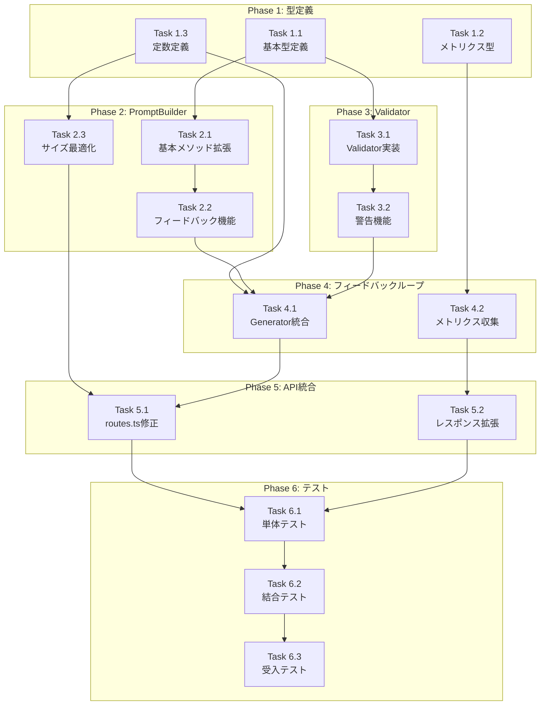

# 作業計画書: Issue #374

**Issue**: #374 feat(mySwiftAgentCore): Capability Prompt強化 + Validation強化 + フィードバックループ実装
**作成日**: 2026-01-17
**作成者**: Claude Code
**対象プロジェクト**: mySwiftAgentCore

---

## Issue: Capability Prompt強化 + Validation強化 + フィードバックループ実装
**Issue番号**: #374
**サイズ**: L（大規模）
**作業見積**: 40時間（5人日）
**優先度**: High
**依存Issue**: #364（親Issue: taskflowGeneratorAgent）, #367（統合: フィードバックループ）

---

## 1. 詳細タスク分解

### Phase 1: 型定義の拡張（8時間）

#### 1.1 基本型定義（4時間）
- **Task 1.1.1**: `CapabilityForPrompt` 型の定義 (1h)
  - generator.ts に型を追加
  - CapabilityExtended との互換性確保
- **Task 1.1.2**: `CapabilityParameter` 拡張 (1h)
  - defaultValue, validation フィールド追加
  - 既存コードへの影響調査
- **Task 1.1.3**: `CapabilityTaskFlowExample` 型定義 (1h)
  - TaskFlow使用例の型定義
  - output_mapping を含む
- **Task 1.1.4**: エラー型定義 (1h)
  - `LLMValidationError` クラス実装
  - `GenerationResult`, `GenerationError` 型追加

#### 1.2 メトリクス関連型定義（2時間）
- **Task 1.2.1**: `GenerationMetrics` 型定義 (1h)
  - 初回成功率、リトライ回数等のメトリクス型
- **Task 1.2.2**: `AttemptMetrics` 型定義 (1h)
  - 個別試行のメトリクス型

#### 1.3 定数定義（2時間）
- **Task 1.3.1**: プロンプトサイズ制限定数 (1h)
  - `MAX_CAPABILITIES_PER_PROMPT` = 50
  - `MAX_CAPABILITY_DESCRIPTION_LENGTH` 設定
- **Task 1.3.2**: フィードバックループ定数 (1h)
  - 最大リトライ回数、タイムアウト設定

### Phase 2: PromptBuilder拡張（10時間）

#### 2.1 基本メソッド拡張（5時間）
- **Task 2.1.1**: `formatCapabilities()` オーバーホール (2h)
  - 完全なCapability情報のフォーマット
  - 既存出力形式との互換性維持
- **Task 2.1.2**: `formatSingleCapability()` 実装 (1.5h)
  - 単一Capabilityの詳細フォーマット
  - responseSchema, examples含む
- **Task 2.1.3**: `formatParameter()` 実装 (1.5h)
  - パラメータの詳細出力
  - validation制約の表示

#### 2.2 フィードバックループ機能（3時間）
- **Task 2.2.1**: `buildFeedbackPrompt()` 実装 (2h)
  - エラー情報を含むプロンプト構築
  - 問題Capabilityの再提示
- **Task 2.2.2**: `extractProblemCapabilities()` 実装 (1h)
  - エラーに関連するCapability抽出

#### 2.3 プロンプトサイズ最適化（2時間）
- **Task 2.3.1**: `selectRelevantCapabilities()` 実装 (1h)
  - タスク関連性に基づくCapability選択
- **Task 2.3.2**: スコアリング関数実装 (1h)
  - `calculateRelevanceScore()`, `extractKeywords()`

### Phase 3: WorkflowCapabilityValidator実装（6時間）

#### 3.1 Validatorクラス実装（4時間）
- **Task 3.1.1**: `WorkflowCapabilityValidator` 基本実装 (1h)
  - クラス構造、インターフェース定義
- **Task 3.1.2**: `validateRequiredParams()` 実装 (1h)
  - 必須パラメータチェック
- **Task 3.1.3**: `validateParamTypes()` 実装 (1h)
  - パラメータ型検証
- **Task 3.1.4**: `validateParamConstraints()` 実装 (1h)
  - min/max/enum制約検証

#### 3.2 警告機能（2時間）
- **Task 3.2.1**: `warnUnknownParams()` 実装 (1h)
  - 未知パラメータ警告
- **Task 3.2.2**: 動的参照スキップ処理 (1h)
  - $input, $steps のスキップロジック

### Phase 4: フィードバックループ実装（8時間）

#### 4.1 WorkflowGenerator統合（5時間）
- **Task 4.1.1**: フィードバックループロジック実装 (3h)
  - リトライ制御、エラーハンドリング
  - LLMValidationError生成
- **Task 4.1.2**: ErrorHandler統合 (2h)
  - 既存ErrorHandlerの活用
  - RecoveryStrategy判定

#### 4.2 メトリクス収集（3時間）
- **Task 4.2.1**: `GenerationMetricsCollector` 実装 (2h)
  - メトリクス収集ロジック
  - 試行ごとの記録
- **Task 4.2.2**: `MetricsAggregator` 実装 (1h)
  - 集計ロジック（将来拡張用）

### Phase 5: API統合（4時間）

#### 5.1 routes.ts修正（3時間）
- **Task 5.1.1**: CapabilityExtended取得処理 (1h)
  - getByProjectExtended() 呼び出し
- **Task 5.1.2**: セキュリティフィルタリング (1h)
  - _internal フィールド除外
- **Task 5.1.3**: Validation統合 (1h)
  - WorkflowCapabilityValidator呼び出し

#### 5.2 レスポンス拡張（1時間）
- **Task 5.2.1**: metricsフィールド追加 (1h)
  - APIレスポンスへのメトリクス追加

### Phase 6: テスト実装（4時間）

#### 6.1 単体テスト（2時間）
- **Task 6.1.1**: PromptBuilderテスト (1h)
  - 新規メソッドのテスト
- **Task 6.1.2**: Validatorテスト (1h)
  - 各検証メソッドのテスト

#### 6.2 結合テスト（1時間）
- **Task 6.2.1**: フィードバックループテスト (1h)
  - モックLLMでのループ動作確認

#### 6.3 受入テスト（1時間）
- **Task 6.3.1**: E2E受入テストファイル作成 (1h)
  - test_issue_374_acceptance.py

---

## 2. タスク依存関係



---

## 3. 作業スケジュール（5日間）

### Day 1（月）: 基盤整備
- **AM**: Phase 1.1 基本型定義（4h）
- **PM**: Phase 1.2-1.3 メトリクス型・定数定義（4h）
- **成果物**:
  - types/generator.ts（拡張済み）
  - types/metrics.ts（新規）
  - prompts/constants.ts（新規）

### Day 2（火）: PromptBuilder強化
- **AM**: Phase 2.1 基本メソッド拡張（5h）
- **PM**: Phase 2.2-2.3 フィードバック・最適化（3h）
- **成果物**:
  - prompts/PromptBuilder.ts（拡張済み）
  - prompts/CapabilitySelector.ts（新規）

### Day 3（水）: Validation強化
- **AM**: Phase 3.1 Validator実装（4h）
- **PM**: Phase 3.2 警告機能 + Phase 4開始（4h）
- **成果物**:
  - validator/WorkflowCapabilityValidator.ts（新規）
  - generator/WorkflowGenerator.ts（一部）

### Day 4（木）: フィードバックループ完成
- **AM**: Phase 4.1 Generator統合（3h）
- **PM**: Phase 4.2 メトリクス + Phase 5 API統合（5h）
- **成果物**:
  - generator/WorkflowGenerator.ts（完成）
  - metrics/GenerationMetricsCollector.ts（新規）
  - api/routes.ts（修正済み）

### Day 5（金）: テスト・品質保証
- **AM**: Phase 6.1-6.2 単体・結合テスト（3h）
- **PM**: Phase 6.3 受入テスト + 修正（5h）
- **成果物**:
  - 全単体テストファイル
  - tests/acceptance/test_issue_374_acceptance.py

---

## 4. チェックポイント

| タイミング | 確認事項 | 対応 |
|-----------|---------|------|
| Phase 1完了時 | 型定義の後方互換性 | 既存コードのコンパイル確認 |
| Phase 2完了時 | プロンプト出力形式 | サンプル出力確認 |
| Phase 3完了時 | Validation動作 | 単体テストで検証 |
| Phase 4完了時 | フィードバックループ | ログ出力で動作確認 |
| Phase 5完了時 | API統合 | Postman/curlでテスト |
| 全Phase完了時 | E2Eテスト成功 | HTTP 422エラー解消確認 |

---

## 5. リスクと対策

| リスク | 発生確率 | 影響 | 対策 |
|-------|---------|------|------|
| プロンプトサイズ超過 | 中 | 高 | MAX_CAPABILITIES_PER_PROMPT=50で制限 |
| 既存コード破壊 | 低 | 高 | 型定義の後方互換性維持、段階的移行 |
| LLMレスポンス遅延 | 中 | 中 | タイムアウト戦略実装、並列処理維持 |
| フィードバック無限ループ | 低 | 高 | 最大リトライ3回制限 |
| メトリクス収集オーバーヘッド | 低 | 低 | 軽量実装、非同期記録 |

---

## 6. 成果物チェックリスト

### コード
- [ ] `types/generator.ts` - 型定義拡張
- [ ] `types/metrics.ts` - メトリクス型定義
- [ ] `prompts/constants.ts` - 定数定義
- [ ] `prompts/PromptBuilder.ts` - 拡張済み
- [ ] `prompts/CapabilitySelector.ts` - Capability選択
- [ ] `validator/WorkflowCapabilityValidator.ts` - 新規Validator
- [ ] `generator/WorkflowGenerator.ts` - フィードバックループ
- [ ] `metrics/GenerationMetricsCollector.ts` - メトリクス収集
- [ ] `metrics/MetricsAggregator.ts` - メトリクス集計
- [ ] `api/routes.ts` - API統合

### テスト
- [ ] `tests/unit/prompts/PromptBuilder.test.ts`
- [ ] `tests/unit/prompts/CapabilitySelector.test.ts`
- [ ] `tests/unit/validator/WorkflowCapabilityValidator.test.ts`
- [ ] `tests/unit/generator/WorkflowGenerator.test.ts`
- [ ] `tests/unit/metrics/GenerationMetricsCollector.test.ts`
- [ ] `tests/integration/feedback-loop.test.ts`
- [ ] `tests/acceptance/test_issue_374_acceptance.py`

### ドキュメント
- [ ] 設計方針書（作成済み）
- [ ] 設計仕様書（作成済み）
- [ ] 受入テスト計画書（作成済み）
- [ ] APIドキュメント更新
- [ ] README.md 更新（必要に応じて）

---

## 7. L3受入テスト計画

### 環境準備

```bash
# サービス起動
cd mySwiftAgentCore
npm run dev
# または
./scripts/dev-hybrid.sh

# 環境変数確認
echo $OPENAI_API_KEY  # または ANTHROPIC_API_KEY

# ヘルスチェック
curl -sf http://localhost:8006/health && echo "✅ mySwiftAgentCore healthy"
```

### TC-015: google_search ワークフロー生成（正常系）

```bash
# 正常系テスト - google_searchワークフロー生成
curl -s -X POST http://localhost:8006/api/v1/generator/workflow/batch \
  -H "Content-Type: application/json" \
  -d '{
    "project_id": "default_project",
    "tasks": [{
      "task_id": "test_001",
      "name": "Execute Google Search",
      "description": "Search for AI news and latest technology trends"
    }],
    "options": {
      "timeout": 60000
    }
  }' | jq '.'

# 期待結果:
# - HTTP 200
# - results[0].workflow.steps に google_search ステップ
# - params.body.queries が array 型（"query"ではない）
# - results[0].metrics が存在（メトリクス収集確認）
```

### TC-016: gmail_send ワークフロー生成（正常系）

```bash
# 正常系テスト - gmail_sendワークフロー生成
curl -s -X POST http://localhost:8006/api/v1/generator/workflow/batch \
  -H "Content-Type: application/json" \
  -d '{
    "project_id": "default_project",
    "tasks": [{
      "task_id": "test_002",
      "name": "Send Email via Gmail",
      "description": "Send a notification email about the search results"
    }]
  }' | jq '.'

# 期待結果:
# - HTTP 200
# - 正しいパラメータ形式でgmail_sendステップ
```

### TC-017: バリデーションエラー時のリトライ動作

```bash
# ログ監視（別ターミナル）
tail -f logs/mySwiftAgentCore.log | grep -E "(Attempt|retry|feedback)"

# 複雑なタスクでリトライを誘発
curl -s -X POST http://localhost:8006/api/v1/generator/workflow/batch \
  -H "Content-Type: application/json" \
  -d '{
    "project_id": "default_project",
    "tasks": [{
      "task_id": "test_003",
      "name": "Complex Multi-Step Task",
      "description": "Search, analyze, summarize, and send email with multiple parameters and constraints"
    }]
  }' | jq '.'

# ログ確認:
# - "Attempt 1 failed, retrying with feedback..." が表示される可能性
# - 最終的に成功または MAX_RETRIES_EXCEEDED
```

### TC-018: 生成されたワークフローの実行

```bash
# TC-015で生成されたワークフローを取得して実行
WORKFLOW=$(curl -s -X POST http://localhost:8006/api/v1/generator/workflow/batch \
  -H "Content-Type: application/json" \
  -d '{
    "project_id": "default_project",
    "tasks": [{
      "task_id": "test_004",
      "name": "Execute Google Search",
      "description": "Search for weather today"
    }]
  }' | jq -r '.results[0].workflow')

# ワークフロー実行
curl -s -X POST http://localhost:8006/api/v1/taskflow/execute \
  -H "Content-Type: application/json" \
  -d "{
    \"project_id\": \"default_project\",
    \"workflow\": $WORKFLOW,
    \"input\": {
      \"search_query\": \"weather today\"
    }
  }" | jq '.'

# 期待結果:
# - HTTP 200
# - HTTP 422エラーが発生しない
# - 実行結果が返される
```

### 異常系テスト

```bash
# 異常系 - 存在しないCapability
curl -s -X POST http://localhost:8006/api/v1/generator/workflow/batch \
  -H "Content-Type: application/json" \
  -d '{
    "project_id": "default_project",
    "tasks": [{
      "task_id": "test_005",
      "name": "Use Non-existent API",
      "description": "Call a capability that does not exist"
    }]
  }' | jq '.'

# 期待結果:
# - エラーレスポンス
# - 適切なエラーメッセージ
```

---

## 8. Definition of Done

### 必須条件
- [ ] すべての実装タスクが完了
- [ ] 単体テストカバレッジ90%以上
- [ ] 結合テスト全パス
- [ ] L3受入テスト全パス（TC-015〜TC-018）
- [ ] CI/CDグリーン（GitHub Actions）
- [ ] 静的解析エラーゼロ（Ruff/MyPy）
- [ ] コードレビュー承認
- [ ] HTTP 422エラーが解消
- [ ] E2Eテスト（Test 4）が成功

### 品質基準
- [ ] フィードバックループによる成功率90%以上
- [ ] 初回成功率70%以上
- [ ] 平均リトライ回数1.5回以下
- [ ] プロンプトサイズが制限内（50 Capabilities）
- [ ] APIレスポンス時間が許容範囲内

### ドキュメント
- [x] APIドキュメント更新済み（実装後に更新）
- [x] 設計ドキュメント完成
- [x] 受入テスト計画書完成
- [x] 作業計画書完成（本書）

---

**作成日**: 2026-01-17
**Issue**: #374
**作成者**: Claude Code