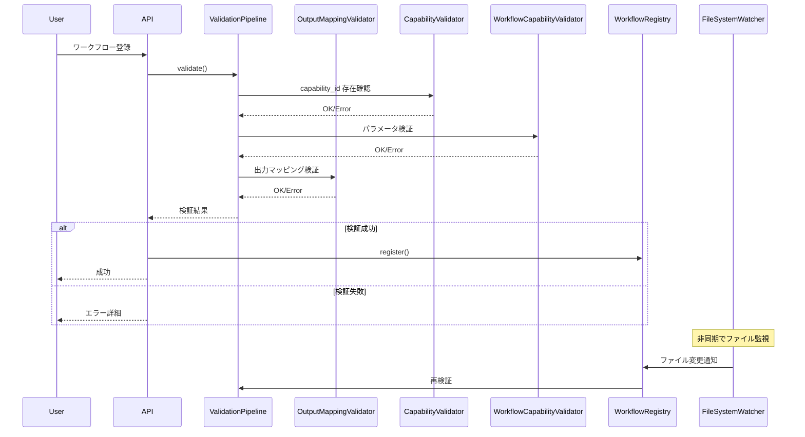

# Issue #375 設計方針書

## 1. 概要

### 1.1 Issue概要
- **Issue番号**: #375
- **タイトル**: mySwiftAgentCore: ワークフロー生成・実行の検証を強化する
- **目的**: E2Eテストで発見された複数の問題を解決し、ワークフロー生成・実行の信頼性を向上させる

### 1.2 解決すべき問題
1. **WorkflowRegistry のホットリロード問題**: ファイル変更が反映されない
2. **capability_id 検証不足**: 存在しない capability への参照エラー
3. **出力マッピング検証不足**: responseSchema とのフィールド不整合
4. **ノードタイプ指定不足**: LLM生成時の曖昧性による誤生成
5. **ワークフローリロード機能の欠如**: 動的更新ができない

## 2. アーキテクチャ設計

### 2.1 システム構成図

```mermaid
graph TB
    subgraph "Workflow Validation Layer"
        VP[ValidationPipeline]
        VP --> SV[SchemaValidator]
        VP --> DV[DependencyValidator]
        VP --> VV[VariableValidator]
        VP --> CV[CapabilityValidator]
        VP --> SecV[SecurityValidator]
        VP --> WCV[WorkflowCapabilityValidator]
        VP --> OMV[OutputMappingValidator<br/>*新規*]
    end

    subgraph "Registry Layer"
        WR[WorkflowRegistry]
        CR[CapabilityRegistry]
        WL[WorkflowLoader]
        FSW[FileSystemWatcher<br/>*新規*]
        WRL[WorkflowReloader<br/>*新規*]
    end

    subgraph "Execution Layer"
        WE[WorkflowExecutor]
        CM[ContextManager]
        NR[NodeRegistry]
    end

    subgraph "API Layer"
        API[TaskFlow API]
        RLD[/reload エンドポイント<br/>*新規*]
    end

    FSW -.->|ファイル変更検知| WRL
    WRL -->|再読み込み| WL
    WL -->|検証| VP
    WL -->|登録| WR
    API --> WR
    API --> WE
    RLD --> WRL
    WE --> NR
    WE --> CM
    CV --> CR
    WCV --> CR
    OMV --> CM
```

### 2.2 検証フロー設計



## 3. 技術選定

### 3.1 ファイル監視
- **chokidar**: Node.js でのファイル監視のデファクトスタンダード
  - 理由: クロスプラットフォーム対応、安定性、パフォーマンス

### 3.2 検証フレームワーク
- **Zod**: 既存システムとの一貫性
  - 理由: 既に全体で使用されており、型安全性が高い

### 3.3 非同期処理
- **EventEmitter**: ファイル変更イベントの処理
  - 理由: Node.js 標準、シンプルで十分な機能

## 4. 設計パターン

### 4.1 適用パターン
1. **Observer Pattern**: ファイル監視とイベント通知
2. **Strategy Pattern**: 各種バリデータの実装（既存踏襲）
3. **Factory Pattern**: ワークフローリローダーの生成
4. **Singleton Pattern**: FileSystemWatcher の単一インスタンス管理

## 5. データモデル設計

### 5.1 新規インターフェース

```typescript
// ファイル監視設定
interface FileWatcherConfig {
  enabled: boolean;
  paths: string[];
  debounceMs: number;
  ignorePatterns?: string[];
}

// リロードイベント
interface WorkflowReloadEvent {
  type: 'added' | 'changed' | 'removed';
  projectId: string;
  workflowName: string;
  filePath: string;
  timestamp: Date;
}

// 出力マッピング検証結果
interface OutputMappingValidationResult {
  isValid: boolean;
  errors: OutputMappingError[];
  warnings: OutputMappingWarning[];
}

interface OutputMappingError {
  code: 'FIELD_NOT_IN_SCHEMA' | 'TYPE_MISMATCH' | 'CASE_MISMATCH';
  message: string;
  field: string;
  expected?: string;
  actual?: string;
}
```

### 5.2 既存インターフェース拡張

```typescript
// WorkflowRegistry に追加
interface WorkflowRegistry {
  // 既存メソッド...

  // 新規メソッド
  reloadWorkflow(projectId: string, workflowName: string): Promise<ValidationResult>;
  enableFileWatching(config: FileWatcherConfig): void;
  disableFileWatching(): void;
  getReloadHistory(projectId: string): WorkflowReloadEvent[];
}

// ValidationContext に追加
interface ValidationContext {
  // 既存フィールド...

  // 新規フィールド
  outputSchema?: IOSchemaType;
  nodeTypeHints?: Record<string, NodeType>;
}
```

## 6. API設計

### 6.1 新規エンドポイント

#### ワークフローリロード
```yaml
POST /api/v1/taskflow/reload/{projectId}/{workflowName}
Response:
  200 OK:
    {
      "status": "success",
      "workflowId": "string",
      "validationResult": ValidationResult,
      "reloadedAt": "2024-01-01T00:00:00Z"
    }
  400 Bad Request:
    {
      "status": "error",
      "errors": ValidationError[]
    }
  404 Not Found:
    {
      "status": "error",
      "message": "Workflow not found"
    }
```

#### ワークフロー検証（ドライラン）
```yaml
POST /api/v1/taskflow/validate
Request:
  {
    "workflow": TaskFlowDefinition,
    "projectId": "string"
  }
Response:
  200 OK:
    {
      "isValid": boolean,
      "errors": ValidationError[],
      "warnings": ValidationWarning[]
    }
```

### 6.2 既存エンドポイント拡張

#### ワークフロー実行エンドポイントの拡張
```yaml
POST /api/v1/taskflow/execute
Request:
  {
    "project": "string",
    "workflow": "string",
    "inputs": {},
    "options": {
      "reloadBeforeExecute": boolean  # 新規オプション
    }
  }
```

## 7. セキュリティ考慮事項

### 7.1 ファイル監視のセキュリティ
- **アクセス制限**: 指定ディレクトリのみ監視可能
- **パス検証**: 相対パス解決によるディレクトリトラバーサル防止
- **リロード制限**: デバウンスによる DoS 攻撃防止

### 7.2 API セキュリティ
- **認証**: 既存の認証メカニズムを踏襲
- **権限**: プロジェクトレベルの権限チェック
- **レート制限**: リロードエンドポイントへのレート制限

## 8. パフォーマンス考慮事項

### 8.1 ファイル監視の最適化
- **デバウンス**: 連続変更を 500ms でグループ化
- **並列処理**: 複数ファイル変更の並列検証
- **キャッシュ**: 検証結果の短期キャッシュ（5分）

### 8.2 検証パフォーマンス
- **早期終了**: エラー発見時の即座終了
- **非同期検証**: バックグラウンドでの再検証
- **部分検証**: 変更部分のみの再検証

## 9. 実装計画

### 9.1 フェーズ1: 検証強化（優先度: 高）
1. **OutputMappingValidator の実装**
   - responseSchema との整合性チェック
   - camelCase/snake_case 変換の自動検出
   - フィールド存在確認

2. **ノードタイプヒントの実装**
   - プロンプトテンプレートへの組み込み
   - 検証時のタイプチェック強化

### 9.2 フェーズ2: ホットリロード（優先度: 中）
1. **FileSystemWatcher の実装**
   - chokidar によるファイル監視
   - イベント発行メカニズム

2. **WorkflowReloader の実装**
   - 変更検知と再読み込み
   - 検証と登録の自動化

3. **リロードAPI の実装**
   - 手動リロードエンドポイント
   - リロード履歴の管理

### 9.3 フェーズ3: フィードバックループ（優先度: 低）
1. **エラーフィードバックの強化**
   - LLM への具体的なエラー情報の伝達
   - 修正提案の生成

## 10. 設計上の決定事項とトレードオフ

### 10.1 ファイル監視の有効化
- **決定**: デフォルトで無効、環境変数で有効化
- **理由**: 本番環境での予期しない動作を防ぐ
- **トレードオフ**: 開発時の利便性 vs 本番環境の安定性

### 10.2 出力マッピング検証の厳密性
- **決定**: エラーではなく警告として実装
- **理由**: 既存ワークフローの互換性維持
- **トレードオフ**: 型安全性 vs 後方互換性

### 10.3 リロード時の実行中ワークフロー
- **決定**: 実行中のワークフローは影響を受けない
- **理由**: 実行の一貫性保証
- **トレードオフ**: 即時反映 vs 実行安定性

## 11. テスト戦略

### 11.1 単体テスト
- OutputMappingValidator: 各種ケースの網羅
- FileSystemWatcher: モック化による動作確認
- WorkflowReloader: 状態遷移のテスト

### 11.2 結合テスト
- E2E シナリオの再現テスト
- ファイル変更からの自動リロードフロー
- エラー時のフィードバックループ

### 11.3 受入テスト
- 実際の「大谷翔平の妻」クエリでの動作確認
- 各受入条件（AC-1〜AC-5）の個別検証

## 12. 移行計画

### 12.1 段階的導入
1. 検証強化機能の導入（既存に影響なし）
2. リロード機能の開発環境導入
3. 本番環境への展開（フィーチャーフラグ使用）

### 12.2 後方互換性
- 既存APIの動作は変更しない
- 新機能はオプトイン方式
- 非推奨警告による段階的移行

## 13. 監視とメトリクス

### 13.1 追加メトリクス
- ワークフロー検証エラー率
- リロード頻度と成功率
- 出力マッピングエラーの頻度
- capability_id 不一致の検出数

### 13.2 アラート設定
- 検証エラー率の急増
- リロード失敗の連続発生
- パフォーマンス劣化の検知

## 14. ドキュメント更新

### 14.1 開発者向けドキュメント
- 新規バリデータの使用方法
- ファイル監視の設定方法
- トラブルシューティングガイド

### 14.2 API ドキュメント
- 新規エンドポイントの仕様
- エラーコード一覧
- 移行ガイド

## 15. 成功指標

### 15.1 定量的指標
- E2E テスト成功率: 95% 以上
- ワークフロー検証エラーの事前検出率: 90% 以上
- ホットリロード成功率: 99% 以上

### 15.2 定性的指標
- 開発者の生産性向上
- デバッグ時間の短縮
- エラーメッセージの分かりやすさ向上

---

## 承認欄

- [ ] アーキテクト承認
- [ ] テックリード承認
- [ ] プロダクトオーナー承認

作成日: 2024-01-18
作成者: Claude Code (PM Auto-Dev)