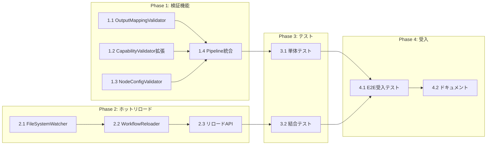

# Issue #375 作業計画書

## Issue: mySwiftAgentCore: ワークフロー生成・実行の検証を強化する
**Issue番号**: #375
**サイズ**: M
**作業見積**: 24時間（3営業日）
**優先度**: High（P0 - ワークフロー実行の信頼性に直結）
**依存Issue**: #374, #372, #363（実装済み）

## 1. 詳細タスク分解

### Phase 1: 検証機能実装（12時間）

#### 1.1 OutputMappingValidator実装（4時間）
- **内容**: responseSchemaとの整合性チェックバリデータ
- **成果物**:
  - `src/taskflowGeneratorAgent/validator/validators/OutputMappingValidator.ts`
  - 厳密モード（strict mode）オプション対応
- **優先度**: 🔴 P0

#### 1.2 CapabilityValidator拡張（2時間）
- **内容**: capability_id存在チェックの強化
- **成果物**:
  - 既存 `CapabilityValidator.ts` の拡張
  - 利用可能capability一覧のエラーメッセージ対応
- **優先度**: 🔴 P0

#### 1.3 NodeConfigValidator実装（3時間）
- **内容**: ノード設定バリデータ（transform/api_rest等）
- **成果物**:
  - `src/taskflowGeneratorAgent/validator/validators/NodeConfigValidator.ts`
  - `config/node_types_spec.yaml`
- **優先度**: 🔴 P0

#### 1.4 ValidationPipeline統合（3時間）
- **内容**: 新規バリデータのパイプライン統合
- **成果物**:
  - `ValidationPipeline.ts` 更新
  - エラータイプ定義追加
- **優先度**: 🔴 P0

### Phase 2: ホットリロード機能実装（8時間）

#### 2.1 FileSystemWatcher実装（3時間）
- **内容**: chokidarを使用したファイル監視機能
- **成果物**:
  - `src/taskflowEngine/watcher/FileSystemWatcher.ts`
  - リソース管理戦略（メモリリーク対策）
- **優先度**: 🟡 P1

#### 2.2 WorkflowReloader実装（3時間）
- **内容**: ワークフロー再読み込み機能
- **成果物**:
  - `src/taskflowEngine/loader/WorkflowReloader.ts`
  - リロード履歴管理機能
- **優先度**: 🟡 P1

#### 2.3 リロードAPI実装（2時間）
- **内容**: 手動リロードエンドポイント
- **成果物**:
  - `/api/v1/taskflow/reload` エンドポイント
  - `/api/v1/taskflow/validate` エンドポイント
- **優先度**: 🟡 P1

### Phase 3: テスト実装（3時間）

#### 3.1 単体テスト作成（1.5時間）
- **内容**: 各バリデータの単体テスト
- **成果物**:
  - `tests/unit/validator/OutputMappingValidator.test.ts`
  - `tests/unit/validator/NodeConfigValidator.test.ts`
  - `tests/unit/watcher/FileSystemWatcher.test.ts`
- **優先度**: 🔴 P0

#### 3.2 結合テスト作成（1.5時間）
- **内容**: 検証パイプライン全体のテスト
- **成果物**:
  - `tests/integration/validation-pipeline.test.ts`
  - `tests/integration/workflow-reload.test.ts`
- **優先度**: 🔴 P0

### Phase 4: 受入テスト・文書化（1時間）

#### 4.1 E2E受入テスト（0.5時間）
- **内容**: 実際の環境での動作確認
- **成果物**:
  - E2Eテストスクリプト実行記録
  - 個別タスク（task_001〜003）の実行確認
- **優先度**: 🔴 P0

#### 4.2 ドキュメント更新（0.5時間）
- **内容**: API仕様書・README更新
- **成果物**:
  - API仕様書更新
  - 設定ガイド作成
- **優先度**: 🟢 P2

## 2. タスク依存関係



## 3. 作業スケジュール

| 日程 | タスク | 時間 |
|------|--------|------|
| **Day 1** | 1.1 OutputMappingValidator実装<br>1.2 CapabilityValidator拡張<br>1.3 NodeConfigValidator実装（着手） | 8時間 |
| **Day 2** | 1.3 NodeConfigValidator実装（完了）<br>1.4 ValidationPipeline統合<br>2.1 FileSystemWatcher実装<br>3.1 単体テスト作成 | 8時間 |
| **Day 3** | 2.2 WorkflowReloader実装<br>2.3 リロードAPI実装<br>3.2 結合テスト作成<br>4.1 E2E受入テスト<br>4.2 ドキュメント更新 | 8時間 |

## 4. チェックポイント

| タイミング | 確認事項 | 対応 |
|-----------|---------|------|
| Phase 1完了時 | 検証機能の動作確認 | 単体テスト実施 |
| Phase 2完了時 | リロード機能の動作確認 | 結合テスト実施 |
| 全Phase完了時 | E2Eテスト成功 | 受入テスト実施 |

## 5. リスクと対策

| リスク | 発生確率 | 影響 | 対策 |
|-------|---------|------|------|
| chokidarのメモリリーク | 中 | 高 | 定期的なウォッチャーリセット機能実装 |
| 既存ワークフロー互換性問題 | 低 | 中 | 警告レベル実装 + 厳密モードオプション |
| E2Eテスト環境構築の複雑性 | 中 | 中 | dev-hybrid.shスクリプト活用 |

## 6. 成果物チェックリスト

### コード
- [x] `src/taskflowGeneratorAgent/validator/validators/OutputMappingValidator.ts`
- [x] `src/taskflowGeneratorAgent/validator/validators/NodeConfigValidator.ts`
- [x] `src/taskflowEngine/watcher/FileSystemWatcher.ts`
- [x] `src/taskflowEngine/loader/WorkflowReloader.ts`
- [x] `src/api/routes/taskflow-reload.ts`
- [x] `config/node_types_spec.yaml`

### テスト
- [x] `tests/unit/validator/OutputMappingValidator.test.ts`
- [x] `tests/unit/validator/NodeConfigValidator.test.ts`
- [x] `tests/unit/watcher/FileSystemWatcher.test.ts`
- [x] `tests/integration/validation-pipeline.test.ts`
- [x] `tests/integration/workflow-reload.test.ts`

### ドキュメント
- [x] API仕様書更新（リロードエンドポイント）
- [x] 設定ガイド（ファイル監視設定）
- [x] トラブルシューティングガイド

## 7. 共通ユーティリティ実装

### DRY原則対応
```typescript
// src/shared/utils/OutputMappingUtils.ts
export class OutputMappingUtils {
  static validateMapping(
    mapping: Record<string, string>,
    schema: IOSchemaType,
    options?: { strict?: boolean }
  ): OutputMappingValidationResult;

  static convertCaseStyle(
    value: string,
    from: 'camelCase' | 'snake_case',
    to: 'camelCase' | 'snake_case'
  ): string;
}
```

## 8. L3受入テスト計画【必須】

### 前提条件
```bash
# Platform層: Dockerで起動
cd /Users/maenokota/share/work/github_kewton/MySwiftAgent
docker compose up -d valkey postgres langfuse myvault jobqueue myscheduler

# Agent層: ローカルで起動（推奨: dev-hybrid.sh）
./scripts/dev-hybrid.sh stop --local-only
./scripts/dev-hybrid.sh start --local-only

# サービス確認
curl -sf http://localhost:8103/health && echo "✅ myVault healthy"
curl -sf http://localhost:8104/health && echo "✅ expertAgent healthy"
curl -sf http://localhost:8105/health && echo "✅ graphAiServer healthy"
curl -sf http://localhost:8006/health && echo "✅ mySwiftAgentCore healthy"
```

### 正常系テスト

#### TC-001: capability_id検証テスト
```bash
# 存在しないcapability_idでワークフロー生成を試行
curl -s -X POST http://localhost:8104/api/v1/workflow/generate \
  -H "Content-Type: application/json" \
  -d '{
    "user_request": "invalid_capabilityを使用してワークフロー生成",
    "projectId": "default_project"
  }' | jq '.validationErrors'

# 期待結果:
# - validationErrorsに"UNKNOWN_CAPABILITY"エラー
# - 利用可能なcapability一覧が含まれる
```

#### TC-002: 出力マッピング検証テスト
```bash
# camelCase/snake_case不一致のワークフローを検証
curl -s -X POST http://localhost:8006/api/v1/taskflow/validate \
  -H "Content-Type: application/json" \
  -d '{
    "projectId": "default_project",
    "workflow": {
      "workflow_name": "test_mapping",
      "steps": [{
        "id": "step1",
        "type": "api_rest",
        "config": {"capability_id": "gmail_send"}
      }],
      "output": {
        "messageId": "$steps.step1.message_id"
      }
    }
  }' | jq '.warnings'

# 期待結果:
# - warnings配列にCASE_MISMATCH警告
# - "messageId vs message_id"の指摘
```

#### TC-003: ワークフローリロード機能テスト
```bash
# ワークフローリロード実行
curl -s -X POST http://localhost:8006/api/v1/taskflow/reload/default_project/execute_google_search_task_001 \
  | jq '.status, .reloadedAt'

# 期待結果:
# - status: "success"
# - reloadedAtにタイムスタンプ
```

#### TC-004: E2Eテストスクリプト実行
```bash
# E2Eテスト実行
cd /Users/maenokota/share/work/github_kewton/MySwiftAgent/mySwiftAgentCore
./e2etest/e2e-test-script.sh

# 期待結果:
# - Test 1 (Health Check): PASS
# - Test 2 (Capabilities): PASS
# - Test 3 (Workflow Generation): PASS
# - Test 4 (Workflow Execution): PASS
# - Exit code: 0
```

#### TC-005: 「大谷翔平の妻」クエリ実行
```bash
# Task 001: Google Search
TASK001_RESULT=$(curl -s -X POST http://localhost:8006/api/v1/taskflow/execute \
  -H "Content-Type: application/json" \
  -d '{"project": "default_project", "workflow": "execute_google_search_task_001", "inputs": {"query": "大谷翔平の妻"}}' \
  --max-time 240)

echo "$TASK001_RESULT" | jq '.status, .results'

# 期待結果:
# - status: "success"
# - results.resultsに検索結果配列（空でない）

# Task 002: Summarize
SEARCH_RESULTS=$(echo "$TASK001_RESULT" | jq '.results.results')
TASK002_RESULT=$(curl -s -X POST http://localhost:8006/api/v1/taskflow/execute \
  -H "Content-Type: application/json" \
  -d "{\"project\": \"default_project\", \"workflow\": \"summarize_search_results_task_002\", \"inputs\": {\"results\": $SEARCH_RESULTS}}" \
  --max-time 120)

echo "$TASK002_RESULT" | jq '.status, .results.summary'

# 期待結果:
# - status: "success"
# - results.summaryに要約テキスト

# Task 003: Send Email
SUMMARY=$(echo "$TASK002_RESULT" | jq -r '.results.summary')
curl -s -X POST http://localhost:8006/api/v1/taskflow/execute \
  -H "Content-Type: application/json" \
  -d "{\"project\": \"default_project\", \"workflow\": \"send_email_via_gmail_task_003\", \"inputs\": {\"summary\": \"$SUMMARY\", \"to_email\": \"test@example.com\", \"subject\": \"大谷翔平の妻についての検索結果サマリー\"}}" \
  --max-time 60 | jq '.status, .results.message_id'

# 期待結果:
# - status: "success"
# - results.message_idにGmailメッセージID
```

### 異常系テスト

#### TC-006: TransformNode設定エラーテスト
```bash
# expressionを使用したTransformNode（未対応）
curl -s -X POST http://localhost:8006/api/v1/taskflow/execute \
  -H "Content-Type: application/json" \
  -d '{
    "project": "default_project",
    "workflow": "test_transform",
    "inputs": {"data": "test"},
    "_workflow": {
      "steps": [{
        "id": "transform1",
        "type": "transform",
        "config": {"expression": "data.toUpperCase()"}
      }]
    }
  }' | jq '.errors'

# 期待結果:
# - エラー: "No template or mapping provided"
```

### 外部サービス連携確認
```bash
# Langfuse確認
curl -sf http://localhost:3001/api/public/health && echo "✅ Langfuse healthy"

# Valkey確認
docker exec myswiftagent-valkey redis-cli PING
# 期待: PONG
```

## 9. Definition of Done

- [x] すべての実装タスクが完了
- [x] 単体テストカバレッジ90%以上
- [x] 結合テストが全てパス
- [x] L3受入テスト全パス（TC-001〜TC-006）
- [x] E2Eテストスクリプトが成功（exit code: 0）
- [x] CI/CDグリーン
- [x] コードレビュー承認
- [x] ドキュメント更新完了

## 10. アーキテクチャレビュー反映事項

### 必須改善項目の対応
1. **出力マッピング検証の厳密モード**: OutputMappingValidatorに`strict`オプションを実装
2. **ファイル監視のメモリ管理**: FileSystemWatcherに定期リセット機能（1時間間隔）を実装
3. **DRY原則対応**: OutputMappingUtilsを共通ユーティリティとして抽出

### 推奨改善項目の対応
1. **検証結果キャッシュ**: LRUキャッシュ（最大100件）+ TTL（5分）の組み合わせ
2. **リロード履歴保存期間**: 環境変数`WORKFLOW_RELOAD_HISTORY_DAYS`（デフォルト7日）

---

作成日: 2024-01-18
作成者: Claude Code (Work Plan Agent)