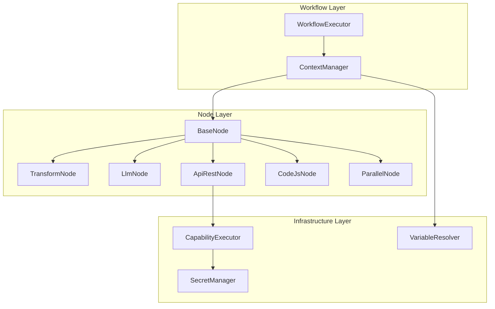

# NodeExecutionContext設計方針書

## 概要

本ドキュメントは、mySwiftAgentCoreのtaskflowEngineにおけるNodeExecutionContextインターフェースの設計方針と実装ガイドラインを定義する。Issue #375で発生したコンテキスト利用の見落とし問題を防ぐため、各フィールドの責務と使用パターンを明文化する。

## 背景と課題

### 発生した問題（Issue #375）

- TransformNodeがcontextを使用せず、input/stepsにアクセスできなかった
- LlmNodeがstepResultsをテンプレート展開に含めていなかった
- オブジェクト/配列のString変換が適切に行われていなかった

### 真因

NodeExecutionContextの各フィールドの責務と使用パターンが明文化されておらず、ノード開発時に見落とされた。

## アーキテクチャ設計

### システム構成図



### レイヤー構成

| レイヤー | 責務 | 主要コンポーネント |
|---------|------|------------------|
| **Workflow層** | ワークフロー実行管理、コンテキスト管理 | WorkflowExecutor, ContextManager |
| **Node層** | 各種ノード実装、ビジネスロジック | BaseNode, 各種ノード実装 |
| **Infrastructure層** | 基盤サービス提供 | CapabilityExecutor, SecretManager |

## NodeExecutionContextインターフェース設計

### インターフェース定義

```typescript
export interface NodeExecutionContext {
  workflowId: string;                      // ワークフローの一意識別子
  stepResults: Record<string, unknown>;    // 前ステップの実行結果
  variables: Record<string, unknown>;      // ランタイム変数（inputを含む）
  secrets: Record<string, string>;         // シークレット情報
  timeout?: number;                        // タイムアウト（ミリ秒）
  capabilityExecutor?: ICapabilityExecutor; // Capability実行用インターフェース
}
```

### 各フィールドの詳細仕様

#### 1. workflowId

- **型**: `string`
- **必須**: Yes
- **責務**: 実行中のワークフローインスタンスの一意識別
- **使用例**: ログ記録、実行追跡、デバッグ
- **生成タイミング**: WorkflowExecutor初期化時

#### 2. stepResults

- **型**: `Record<string, unknown>`
- **必須**: Yes（初期値は空オブジェクト）
- **責務**: 実行済みステップの出力結果を保持
- **形式**:
  ```typescript
  {
    "step1": { "data": "result1" },
    "step2": { "value": 123, "items": [...] }
  }
  ```
- **アクセス方法**:
  - テンプレート: `{{steps.stepId.field}}`
  - コード: `context.stepResults['stepId']`
- **更新タイミング**: 各ステップ実行完了時

#### 3. variables

- **型**: `Record<string, unknown>`
- **必須**: Yes
- **責務**: ワークフロー実行時の変数保持
- **必須フィールド**:
  ```typescript
  {
    "input": unknown  // ワークフロー入力データ（必須）
    // その他のカスタム変数
  }
  ```
- **アクセス方法**:
  - テンプレート: `{{input.field}}` または `$.input.field`
  - コード: `context.variables['input']`
- **初期化**: ExecutionOptions.variablesから設定

#### 4. secrets

- **型**: `Record<string, string>`
- **必須**: Yes（初期値は空オブジェクト）
- **責務**: APIキー、認証トークン等の機密情報保持
- **命名規則**:
  - OpenAI API: `OPENAI_API_KEY`
  - 汎用LLM: `LLM_API_KEY`
  - カスタム: `{SERVICE}_API_KEY`
- **使用例**:
  ```typescript
  const apiKey = context.secrets['OPENAI_API_KEY'];
  ```
- **セキュリティ**: ログ出力禁止、メモリ内保持のみ

#### 5. timeout

- **型**: `number | undefined`
- **必須**: No
- **責務**: ステップ実行のタイムアウト制御（ミリ秒）
- **優先順位**:
  1. ステップ定義のtimeout
  2. Capability定義の_internal.timeout_ms
  3. デフォルト値（30000ms）
- **適用対象**: API呼び出し、コード実行等

#### 6. capabilityExecutor

- **型**: `ICapabilityExecutor | undefined`
- **必須**: No（Issue #372で追加）
- **責務**: capability_idベースのAPI実行
- **インターフェース**:
  ```typescript
  interface ICapabilityExecutor {
    resolveCapability(capabilityId: string): Promise<ICapability | null>;
    executeCapability(
      capability: ICapability,
      params: Record<string, unknown>,
      context: NodeExecutionContext
    ): Promise<unknown>;
  }
  ```

## ノード実装パターン

### 基本実装パターン

```typescript
export class MyNode implements NodeExecutor {
  async execute(
    config: NodeConfig,
    params: Record<string, unknown>,
    context: NodeExecutionContext
  ): Promise<NodeExecutionResult> {
    // 1. コンテキストからの情報取得
    const input = context.variables['input'] ?? {};
    const previousResults = context.stepResults;

    // 2. テンプレート展開用コンテキスト構築
    const templateContext = {
      ...params,
      input,
      steps: previousResults,
    };

    // 3. ビジネスロジック実行
    const result = await this.processLogic(templateContext);

    // 4. 結果返却
    return { output: result };
  }
}
```

### テンプレート展開パターン

#### Handlebars形式（推奨）

```typescript
// テンプレート: "Hello {{input.name}}, {{steps.step1.result}}"
template.replace(/\{\{([^}]+)\}\}/g, (_, path) => {
  const value = getNestedValue(context, path.trim());
  if (value === undefined) return '';
  if (typeof value === 'object') return JSON.stringify(value);
  return String(value);
});
```

#### Dollar形式（URL専用）

```typescript
// URL: "https://api.com?q=${query}"
url.replace(/\$\{(\w+)\}/g, (match, key) => {
  const value = params[key];
  return value !== undefined ? String(value) : match;
});
```

### 各ノードタイプの実装要件

| ノードタイプ | 必須コンテキスト利用 | テンプレート形式 | 特記事項 |
|------------|-------------------|----------------|---------|
| TransformNode | stepResults, variables | `{{path}}` | input/stepsを展開 |
| LlmNode | secrets, stepResults, variables | `{{path}}` | APIキー必須 |
| ApiRestNode | secrets, capabilityExecutor | `${key}` (URL) | capability優先 |
| CodeJsNode | 全フィールド | - | サンドボックス隔離 |
| ParallelNode | stepResults | - | 並列実行管理 |

## 変数参照パターン

### サポートする参照形式

| パターン | 例 | 説明 | 使用場所 |
|---------|---|------|---------|
| `{{input.field}}` | `{{input.name}}` | 入力フィールド参照 | テンプレート |
| `{{steps.stepId.field}}` | `{{steps.step1.data}}` | ステップ結果参照 | テンプレート |
| `$.input.field` | `$.input.name` | JSONPath形式入力参照 | 設定ファイル |
| `${stepId.field}` | `${step1.data}` | ContextManager参照 | 内部処理 |
| `${steps.stepId.field}` | `${steps.step1.data}` | GraphAI互換形式 | ワークフロー定義 |

### 参照解決の優先順位

1. ステップ結果（stepResults）
2. 入力データ（variables.input）
3. カスタム変数（variables）
4. デフォルト値またはエラー

## セキュリティ設計

### シークレット管理

- **保存場所**: メモリ内のみ（永続化禁止）
- **アクセス制御**: ノード実行時のみ参照可能
- **ログ出力**: シークレット値のログ出力禁止
- **命名規則**: 大文字スネークケース必須

### コード実行セキュリティ

- **サンドボックス**: CodeJsNodeは隔離環境で実行
- **タイムアウト**: 必ず設定（デフォルト30秒）
- **リソース制限**: メモリ/CPU使用量の上限設定

## パフォーマンス設計

### コンテキスト管理

- **イミュータブル**: getContext()は常に新しいオブジェクトを返す
- **遅延評価**: 必要時のみ変数解決を実行
- **キャッシング**: ステップ結果は実行後即座にキャッシュ

### タイムアウト戦略

```typescript
// 優先順位
const timeout =
  config.timeout ??                    // 1. ステップ定義
  capability?._internal?.timeout_ms ?? // 2. Capability定義
  30000;                               // 3. デフォルト
```

## エラーハンドリング

### 必須エラーチェック

```typescript
// シークレット存在確認
if (!context.secrets['REQUIRED_KEY']) {
  throw new Error('Required secret REQUIRED_KEY not found');
}

// 必須ステップ結果確認
if (!context.stepResults['requiredStep']) {
  throw new Error('Required step "requiredStep" not executed');
}

// 入力データ確認
if (!context.variables['input']) {
  throw new Error('Input data is required');
}
```

### エラー伝播

- ノードエラーは`NodeExecutionResult`のerrorフィールドで返却
- WorkflowExecutorがエラーハンドリングとリトライを制御

## 実装チェックリスト

### ノード開発時の必須確認事項

- [ ] contextからinputを取得しているか
- [ ] stepResultsを参照する必要があるか確認
- [ ] 必要なsecretsを取得しているか
- [ ] テンプレート展開でinput/stepsを含めているか
- [ ] タイムアウトを適切に設定しているか
- [ ] エラーハンドリングを実装しているか

### レビュー時の確認事項

- [ ] NodeExecutionContextの全必須フィールドを考慮しているか
- [ ] テンプレート展開パターンが正しいか
- [ ] セキュリティ要件を満たしているか
- [ ] 既存ノードとの一貫性があるか

## 移行ガイド

### 既存ノードの修正方針

1. **TransformNode/LlmNode**
   - templateContextにinput/stepsを確実に含める
   - オブジェクトのJSON.stringify()を実装

2. **ApiRestNode**
   - capability_id使用時はcapabilityExecutorを優先
   - 認証ヘッダー構築でsecretsを活用

3. **新規ノード開発**
   - 本設計方針書に従って実装
   - BaseNodeの実装パターンを参考にする

## 参考資料

- [BaseNode.ts](mySwiftAgentCore/src/taskflowEngine/nodes/BaseNode.ts:48)
- [ContextManager.ts](mySwiftAgentCore/src/taskflowEngine/executor/ContextManager.ts)
- [WorkflowExecutor.ts](mySwiftAgentCore/src/taskflowEngine/executor/WorkflowExecutor.ts:68)
- Issue #372: Capability実行機能追加
- Issue #375: コンテキスト利用の問題報告

---

*作成日: 2026-01-19*
*作成者: Claude Opus 4*
*Issue: #376*