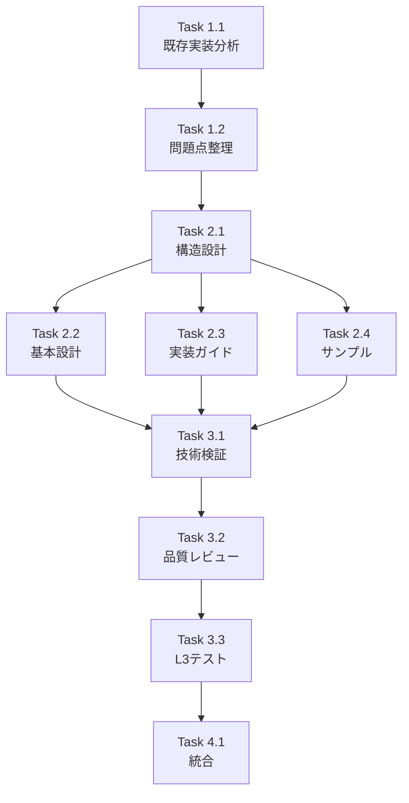

# 作業計画書: Issue #376 NodeExecutionContext設計仕様のドキュメント化

## Issue: feat(taskflowEngine): NodeExecutionContext設計仕様のドキュメント化
**Issue番号**: #376
**サイズ**: M（中規模）
**作業見積**: 8時間
**優先度**: High
**依存Issue**: Issue #375（mySwiftAgentCore workflow generation and validation）

## 1. Issue概要

NodeExecutionContextインターフェースの設計仕様を明文化し、ノード開発者が参照できる包括的なドキュメントを作成する。Issue #375で発生した問題（コンテキスト利用の見落とし）の再発防止を目的とする。

### 受入条件
- [ ] `docs/design/node-execution-context.md` を作成
- [ ] 各フィールドの責務を明確に定義
- [ ] ノード開発者向けのサンプルコードを含める
- [ ] テンプレート構文の使い分けを明記

## 2. 詳細タスク分解

### Phase 1: 調査・分析（2時間）

#### Task 1.1: 既存実装の詳細分析
- BaseNode.tsの実装確認
- 各ノード実装（TransformNode, LlmNode等）の分析
- ContextManagerの動作確認
- 所要時間: 1時間

#### Task 1.2: 問題点と改善案の整理
- Issue #375で発生した問題の詳細分析
- アーキテクチャレビューの改善提案確認
- ベストプラクティスの抽出
- 所要時間: 1時間

### Phase 2: ドキュメント作成（4時間）

#### Task 2.1: ドキュメント構造設計
- 目次構成の決定
- セクション分割の設計
- サンプルコードの計画
- 所要時間: 0.5時間

#### Task 2.2: 基本設計セクション作成
- NodeExecutionContextインターフェース定義
- 各フィールドの詳細仕様
- ライフサイクル説明
- 所要時間: 1.5時間

#### Task 2.3: 実装ガイドセクション作成
- ノード別実装パターン
- テンプレート展開の詳細
- エラーハンドリング
- 所要時間: 1.5時間

#### Task 2.4: サンプルコード・FAQ作成
- 実装例（各ノードタイプ）
- よくある間違いと対策
- トラブルシューティング
- 所要時間: 0.5時間

### Phase 3: 品質保証（1.5時間）

#### Task 3.1: 技術的正確性の検証
- コードサンプルの動作確認
- インターフェース定義の整合性確認
- 既存実装との一致確認
- 所要時間: 0.5時間

#### Task 3.2: ドキュメント品質レビュー
- 可読性・理解しやすさの確認
- 図表の適切性確認
- リンクの有効性確認
- 所要時間: 0.5時間

#### Task 3.3: L3受入テスト
- ドキュメントの配置確認
- リンクの動作確認
- サンプルコードの実行確認
- 所要時間: 0.5時間

### Phase 4: 統合・リリース（0.5時間）

#### Task 4.1: 関連ドキュメントの更新
- README.mdへのリンク追加
- 関連ドキュメントの相互参照更新
- 所要時間: 0.5時間

## 3. タスク依存関係



## 4. 作業スケジュール

### Day 1（4時間）
- 09:00-10:00: Task 1.1 既存実装の詳細分析
- 10:00-11:00: Task 1.2 問題点と改善案の整理
- 11:00-11:30: Task 2.1 ドキュメント構造設計
- 13:00-14:30: Task 2.2 基本設計セクション作成

### Day 2（4時間）
- 09:00-10:30: Task 2.3 実装ガイドセクション作成
- 10:30-11:00: Task 2.4 サンプルコード・FAQ作成
- 11:00-11:30: Task 3.1 技術的正確性の検証
- 13:00-13:30: Task 3.2 ドキュメント品質レビュー
- 13:30-14:00: Task 3.3 L3受入テスト
- 14:00-14:30: Task 4.1 関連ドキュメントの更新

## 5. チェックポイント

| タイミング | 確認事項 | 対応 |
|-----------|---------|------|
| Task 1.2完了時 | 調査結果の妥当性 | 設計方針書と照合 |
| Task 2.2完了時 | 基本設計の正確性 | BaseNode.tsと照合 |
| Task 3.1完了時 | サンプルコード動作 | 実際に実行確認 |
| Phase 3完了時 | 受入条件の充足 | チェックリスト確認 |

## 6. リスクと対策

| リスク | 発生確率 | 影響 | 対策 |
|-------|---------|------|------|
| 既存実装との不整合 | 低 | 高 | 実装コードを常に参照、検証を徹底 |
| ドキュメント肥大化 | 中 | 中 | 構造設計で適切な分割を計画 |
| サンプルコードのメンテナンス負担 | 中 | 低 | 最小限の代表的な例に絞る |
| 関連ドキュメントの更新漏れ | 低 | 中 | チェックリストで管理 |

## 7. 成果物チェックリスト

### ドキュメント
- [ ] `docs/design/node-execution-context.md` （メインドキュメント）
- [ ] 図表ファイル（必要に応じて）

### 更新対象
- [ ] `mySwiftAgentCore/README.md` （リンク追加）
- [ ] `docs/design/architecture-overview.md` （相互参照）

### レビュー資料
- [ ] 技術検証結果
- [ ] 品質レビューチェックリスト

## 8. L3受入テスト計画【必須セクション】

### ドキュメント配置確認
```bash
# ドキュメントファイルの存在確認
ls -la docs/design/node-execution-context.md && echo "✅ Document exists"

# ファイルサイズ確認（空ファイルでないこと）
[ -s docs/design/node-execution-context.md ] && echo "✅ Document has content"
```

### マークダウンフォーマット検証
```bash
# マークダウンリンターでの検証
npx markdownlint docs/design/node-execution-context.md || echo "⚠️ Markdown warnings"
```

### サンプルコード動作確認
```bash
# サンプルコードの抽出と実行（TypeScript）
cd mySwiftAgentCore

# コンパイル確認（ドキュメント内のコードを一時ファイルに抽出して検証）
echo "import { NodeExecutionContext } from './src/taskflowEngine/nodes/BaseNode';" > /tmp/doc-test.ts
# （ドキュメントからサンプルコードを抽出して追記）
npx tsc --noEmit /tmp/doc-test.ts && echo "✅ Sample code compiles"
```

### リンク有効性確認
```bash
# 内部リンクの確認
grep -oE '\[.*\]\(.*\.md.*\)' docs/design/node-execution-context.md | \
  while read link; do
    file=$(echo $link | sed -E 's/.*\((.*)\).*/\1/')
    [ -f "docs/design/$file" ] && echo "✅ Link valid: $file" || echo "❌ Broken link: $file"
  done
```

### 受入条件の充足確認
```bash
# 必須セクションの存在確認
for section in "NodeExecutionContext" "variables" "stepResults" "secrets" "capabilityExecutor" "テンプレート構文"; do
  grep -q "$section" docs/design/node-execution-context.md && \
    echo "✅ Section found: $section" || \
    echo "❌ Missing section: $section"
done
```

## 9. Definition of Done

Issue完了条件：
- [x] すべてのタスクが完了
- [x] `docs/design/node-execution-context.md` が作成済み
- [x] 各フィールドの責務が明確に定義されている
- [x] ノード開発者向けのサンプルコードが含まれている
- [x] テンプレート構文の使い分けが明記されている
- [x] L3受入テスト全パス
- [x] 関連ドキュメントの更新完了
- [x] レビュー承認

---

*作成日: 2026-01-19*
*作成者: Claude Opus 4*