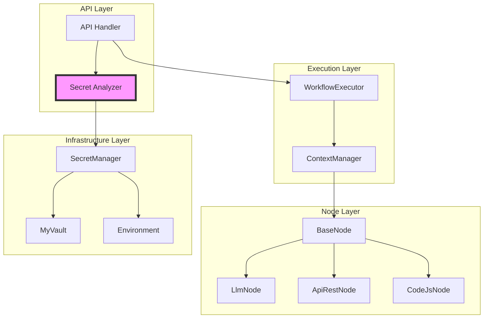
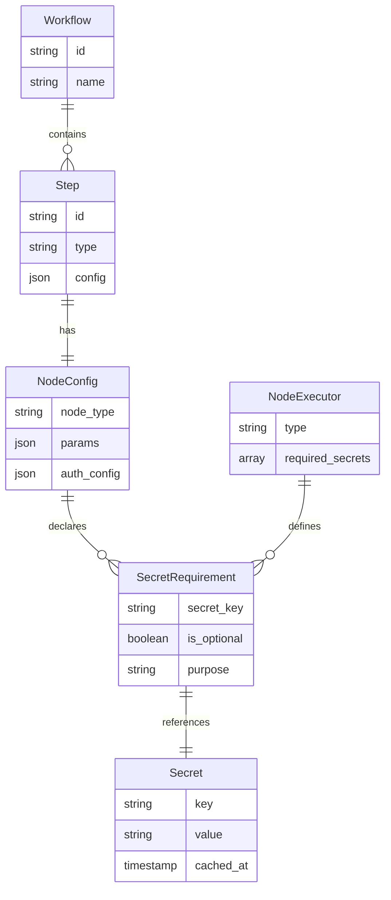

# Secrets注入パターン統一設計方針書

## 概要

本ドキュメントは、mySwiftAgentCoreのtaskflowEngineにおけるSecrets注入パターンの統一化に関する設計方針を定義する。Issue #375で発生したLlmNodeのAPIキー取得問題を解決し、全ノードタイプで一貫したSecrets管理を実現する。

## 背景と課題

### 発生した問題（Issue #375）

LlmNodeがAPIキーを取得できない問題が発生。原因はノードタイプによってSecrets取得方法が異なっていたため。

### 現状の問題点

1. **ハードコーディングされたSecrets**: handlersが固定的な4つのキーのみを取得
2. **暗黙的な依存**: ノードが必要なSecretsを宣言する仕組みがない
3. **一貫性のないエラーハンドリング**: LlmNodeは明示的に失敗、ApiRestNodeは静黙的に失敗
4. **非効率な取得**: ワークフローで使用しないSecretsも取得

### 参照したドキュメント

- [NodeExecutionContext設計仕様書](../../../docs/design/node-execution-context.md)
- [BaseNode.ts](../../../mySwiftAgentCore/src/taskflowEngine/nodes/BaseNode.ts)
- 既存ノード実装（LlmNode, ApiRestNode, CapabilityExecutor）

## アーキテクチャ設計

### システム構成図



### レイヤー構成

| レイヤー | 責務 | 主要コンポーネント |
|---------|------|------------------|
| **API層** | Secrets要件分析、注入 | Handler, SecretAnalyzer |
| **実行層** | コンテキスト管理、ワークフロー実行 | WorkflowExecutor, ContextManager |
| **ノード層** | ビジネスロジック実装 | 各種ノード実装 |
| **インフラ層** | Secrets取得・キャッシング | SecretManager, MyVault |

## 技術選定

| カテゴリ | 選定技術 | 選定理由 | 既存との整合性 |
|---------|---------|---------|---------------|
| Secrets宣言 | TypeScript Interface拡張 | 型安全性、既存パターンとの一致 | NodeExecutorインターフェースの拡張 |
| 分析ロジック | ワークフロー事前解析 | 実行前の検証可能、効率的な取得 | 既存のWorkflowValidator参考 |
| エラーハンドリング | 統一例外パターン | 一貫性、デバッグ容易性 | NodeExecutionResultパターン活用 |
| テスト戦略 | モックベース単体テスト | 既存テストパターン踏襲 | 既存のノードテスト参考 |

## 設計パターン

### 1. 宣言的Secrets定義パターン

```typescript
// NodeExecutorインターフェースの拡張
interface NodeExecutor {
  readonly type: string;
  readonly requiredSecrets?: readonly string[]; // 新規追加
  execute(
    config: NodeConfig,
    params: Record<string, unknown>,
    context: NodeExecutionContext
  ): Promise<NodeExecutionResult>;
  validate(config: NodeConfig): NodeValidationResult;
}
```

### 2. ワークフローレベルのSecrets要件集約

```typescript
interface WorkflowSecretRequirements {
  requiredSecrets: Set<string>;
  optionalSecrets: Set<string>;
  byStep: Map<string, string[]>;
}
```

### 3. 効率的な一括取得パターン

```typescript
class SecretAnalyzer {
  async analyzeWorkflow(
    workflow: InternalWorkflowDefinition
  ): Promise<WorkflowSecretRequirements> {
    // ワークフロー全体を解析し、必要なSecretsを特定
  }
}
```

## データモデル設計

### ER図



## API設計

### 1. NodeExecutor実装例

#### LlmNode

```typescript
export class LlmNode implements NodeExecutor {
  readonly type = 'llm';
  readonly requiredSecrets = ['OPENAI_API_KEY', 'LLM_API_KEY'] as const;

  async execute(
    config: NodeConfig,
    params: Record<string, unknown>,
    context: NodeExecutionContext
  ): Promise<NodeExecutionResult> {
    // Secretsの存在は事前検証済みなので、直接アクセス可能
    const apiKey = context.secrets['OPENAI_API_KEY'] || context.secrets['LLM_API_KEY'];

    if (!apiKey) {
      // フォールバックロジック（本来は不要だが防御的プログラミング）
      return {
        success: false,
        output: null,
        error: {
          code: 'SECRET_NOT_FOUND',
          message: 'Required LLM API key not found',
          details: { requiredKeys: this.requiredSecrets }
        }
      };
    }

    // 通常の処理続行
    // ...
  }
}
```

#### ApiRestNode（動的Secrets）

```typescript
export class ApiRestNode implements NodeExecutor {
  readonly type = 'api_rest';
  readonly requiredSecrets = undefined; // 動的に決定

  async getRequiredSecrets(config: NodeConfig): Promise<string[]> {
    const { auth } = config.config as ApiRestNodeConfig;
    return auth?.secret_key ? [auth.secret_key] : [];
  }

  async execute(/* ... */) {
    // 実行ロジック
  }
}
```

### 2. Secret Analyzer実装

```typescript
export class SecretAnalyzer {
  constructor(private nodeRegistry: NodeRegistry) {}

  async analyzeWorkflow(
    workflow: InternalWorkflowDefinition
  ): Promise<WorkflowSecretRequirements> {
    const requirements: WorkflowSecretRequirements = {
      requiredSecrets: new Set<string>(),
      optionalSecrets: new Set<string>(),
      byStep: new Map<string, string[]>()
    };

    for (const step of workflow.steps) {
      const executor = this.nodeRegistry.get(step.type);
      if (!executor) continue;

      let secrets: string[] = [];

      // 静的Secrets（宣言的）
      if (executor.requiredSecrets) {
        secrets = executor.requiredSecrets;
      }
      // 動的Secrets（configベース）
      else if ('getRequiredSecrets' in executor) {
        secrets = await executor.getRequiredSecrets(step);
      }

      // 要件に追加
      secrets.forEach(secret => {
        requirements.requiredSecrets.add(secret);
      });
      requirements.byStep.set(step.id, secrets);
    }

    return requirements;
  }
}
```

### 3. 改善されたHandler実装

```typescript
export function createWorkflowHandler(deps: HandlerDependencies): WorkflowHandler {
  const secretAnalyzer = new SecretAnalyzer(deps.nodeRegistry);

  return {
    async execute(request: WorkflowExecuteRequest): Promise<WorkflowExecuteResponse> {
      // 1. ワークフロー解析
      const workflow = await deps.loader.load(request.workflow_id);

      // 2. Secrets要件分析
      const secretRequirements = await secretAnalyzer.analyzeWorkflow(workflow);

      // 3. 必要なSecretsのみ取得
      const secrets: Record<string, string> = {};
      for (const secretKey of secretRequirements.requiredSecrets) {
        const value = await deps.secretManager.get(secretKey);
        if (!value) {
          throw new SecretNotFoundError(secretKey, {
                workflow: workflow.workflow_id,
            step: Array.from(secretRequirements.byStep.entries())
              .filter(([_, secrets]) => secrets.includes(secretKey))
              .map(([stepId]) => stepId)
          });
        }
        secrets[secretKey] = value;
      }

      // 4. ワークフロー実行
      const result = await deps.executor.execute(workflow, {
        inputs: request.inputs,
        secrets, // 必要なSecretsのみ
      });

      return result;
    }
  };
}
```

## セキュリティ設計

### 1. Secrets取得の最小権限原則

- **必要なSecretsのみ取得**: ワークフローで使用するものだけ
- **事前検証**: 実行前にSecrets存在確認
- **キャッシュ活用**: SecretManagerの5分キャッシュを継続利用

### 2. エラーハンドリング

```typescript
export class SecretNotFoundError extends Error {
  constructor(
    public readonly secretKey: string,
    public readonly context: {
      workflow: string;
      step: string[];
    }
  ) {
    super(`Required secret '${secretKey}' not found for workflow '${context.workflow}'`);
    this.name = 'SecretNotFoundError';
  }
}
```

### 3. ログ安全性

- Secrets値のログ出力禁止（既存ルール遵守）
- エラーメッセージにはキー名のみ含める
- 存在確認のみログ記録

## パフォーマンス設計

### 1. 一括取得戦略

```typescript
// 改善前: 固定4キーを毎回取得
const secretKeys = ['OPENAI_API_KEY', 'LLM_API_KEY', 'ANTHROPIC_API_KEY', 'GOOGLE_API_KEY'];

// 改善後: 必要なキーのみ取得
const secretKeys = Array.from(secretRequirements.requiredSecrets);
```

### 2. キャッシング戦略

- SecretManagerの既存5分キャッシュを活用
- ワークフロー実行中はコンテキスト内で共有

### 3. 並列取得

```typescript
// 並列でSecrets取得（既存のSecretManager実装を活用）
const secretPromises = Array.from(secretRequirements.requiredSecrets)
  .map(key => deps.secretManager.get(key).then(value => ({ key, value })));

const results = await Promise.all(secretPromises);
```

## 設計上の決定事項とトレードオフ

### 1. 宣言的 vs 動的Secrets定義

| アプローチ | メリット | デメリット | 採用理由 |
|-----------|--------|-----------|---------|
| **宣言的（静的）** | 型安全、事前検証容易 | 柔軟性が低い | LlmNodeなど固定的なケース向け |
| **動的（config参照）** | 柔軟、既存実装と互換 | 実行時まで不明 | ApiRestNodeなど設定依存ケース向け |
| **ハイブリッド** ✓ | 両方のメリット | 実装が複雑 | 現実的な要求に対応 |

### 2. エラーハンドリング戦略

| パターン | 説明 | 採用有無 |
|---------|------|---------|
| **事前検証** | Handler層で全Secrets確認 | ✓ 採用 |
| **遅延検証** | ノード実行時に確認 | × 不採用（既存の問題） |
| **防御的実装** | 両方で確認 | △ フォールバックとして |

### 3. 後方互換性

- 既存のNodeExecutorインターフェースを拡張（破壊的変更なし）
- requiredSecretsはオプショナルプロパティ
- 既存ノードは段階的に移行可能

## 移行計画

### Phase 1: 基盤実装（1週目）

1. NodeExecutorインターフェース拡張
2. SecretAnalyzerクラス実装
3. 改善されたHandler実装

### Phase 2: ノード移行（2週目）

1. LlmNode: requiredSecrets追加
2. ApiRestNode: getRequiredSecrets実装
3. CodeJsNode: 必要に応じて実装
4. 単体テスト更新

### Phase 3: 統合テスト（3週目）

1. E2Eテストシナリオ作成
2. パフォーマンステスト
3. ドキュメント更新

## リスクと対策

| リスク | 影響度 | 発生確率 | 対策 |
|-------|-------|---------|------|
| 既存ワークフロー互換性 | 高 | 低 | 段階的移行、後方互換性維持 |
| パフォーマンス劣化 | 中 | 低 | 並列取得、キャッシュ活用 |
| Secrets漏洩 | 高 | 低 | 既存セキュリティパターン踏襲 |
| 実装複雑化 | 中 | 中 | シンプルなインターフェース設計 |

## 制約条件

CLAUDE.mdの原則に準拠：
- **SOLID原則**: 単一責任（SecretAnalyzer）、開放閉鎖（NodeExecutor拡張）
- **KISS原則**: シンプルな宣言的インターフェース
- **YAGNI原則**: 必要最小限の機能実装
- **DRY原則**: Secrets取得ロジックの一元化

## 参考資料

- Issue #375: mySwiftAgentCore workflow generation and validation
- Issue #376: NodeExecutionContext設計仕様のドキュメント化
- [NodeExecutionContext設計仕様書](../../../docs/design/node-execution-context.md)
- [BaseNode.ts](../../../mySwiftAgentCore/src/taskflowEngine/nodes/BaseNode.ts)
- [SecretManager.ts](../../../mySwiftAgentCore/src/shared/context/SecretManager.ts)

---

*作成日: 2026-01-19*
*作成者: Claude Opus 4*
*Issue: #377*