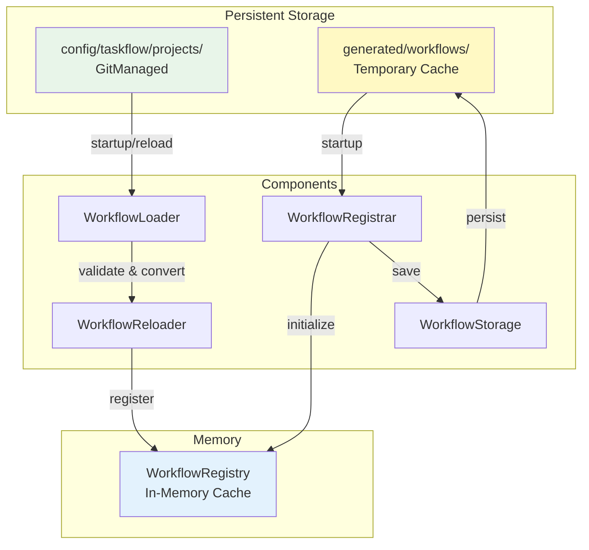
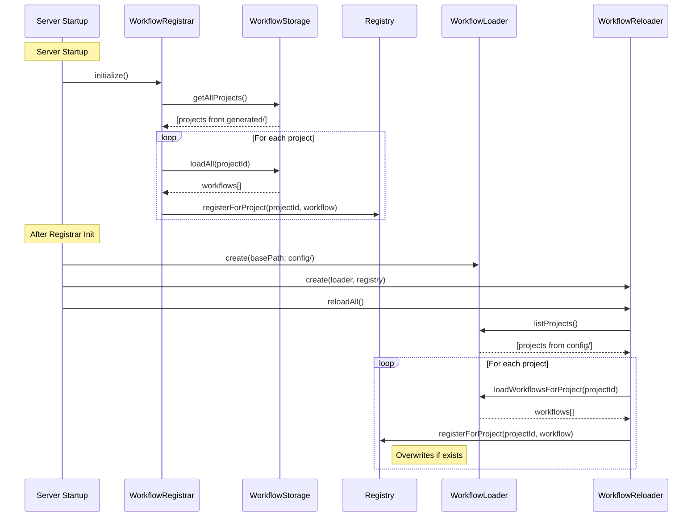

# Issue #378: ワークフローストレージの責務分離と優先順位の明確化 - 設計方針書

## 概要

`generated/workflows/`と`config/taskflow/projects/`のワークフローストレージの責務と優先順位を明確化し、開発者が予測可能な動作を実現するための設計方針を策定する。

## 背景

### 現状の問題

1. **優先順位の不明確性**: 同一ワークフローIDが両ディレクトリに存在する場合の優先順位が未定義
2. **reload APIの動作不一致**: `/api/v1/taskflow/reload` APIがconfig/からの読み込みを保証しない
3. **開発者の混乱**: どちらのディレクトリに保存すべきか判断基準が不明確

### 根本原因

- 起動時に`generated/workflows/`のみがロードされ、`config/taskflow/projects/`はreload APIでのみ読み込まれる
- ワークフロー実行時はメモリ内のレジストリのみを参照し、ディスクへのフォールバックがない
- 2つのストレージの役割が重複し、明確な使い分けがされていない

## 設計方針

### 1. ストレージの責務分離

#### config/taskflow/projects/
- **役割**: ソースコントロール管理されたワークフローの永続保存
- **特徴**:
  - Gitで管理される（バージョン管理対象）
  - 手動で作成・編集されたワークフロー
  - リファレンス実装、テスト用ワークフロー
  - 環境間で共有される標準ワークフロー
- **ライフサイクル**: 永続的（明示的な削除まで保持）

#### generated/workflows/
- **役割**: 動的生成されたワークフローの一時保存とキャッシュ
- **特徴**:
  - AIエージェントにより自動生成
  - 実行時に動的に作成される
  - `.gitignore`で除外される
  - TTLベースのキャッシュ管理対象
- **ライフサイクル**: 一時的（TTL期限切れで削除可能）

### 2. 優先順位ルール

**採用案: config/を常に優先**

理由:
- 開発者の明示的な設定を優先することで予測可能性を確保
- テスト環境での動作確認が容易
- 本番環境への移行時の挙動が一貫

#### 実装詳細

```
起動時の読み込み順序:
1. generated/workflows/ からロード（キャッシュ復元）
2. config/taskflow/projects/ からロード
3. 同一ワークフローID（projectId + workflowName）が存在する場合:
   - config/のワークフローでレジストリを上書き
   - ログに上書き情報を記録

reload API実行時:
1. 指定されたprojectのレジストリをクリア（オプション）
2. config/taskflow/projects/{projectId} からロード
3. レジストリに登録（既存エントリを上書き）
```

### 3. アーキテクチャ設計

#### システム構成図



#### データフロー



### 4. 技術選定

| カテゴリ | 選定技術 | 選定理由 | 既存との整合性 |
|---------|---------|---------|---------------|
| ファイルシステム | Node.js fs/promises | 非同期I/O、既存実装 | ✓ 既存で使用 |
| パス検証 | PathValidator | パストラバーサル防止 | ✓ 既存実装あり |
| キャッシュ | TTL + LRU | メモリ効率とパフォーマンス | ✓ Issue #373で実装済 |
| スキーマ検証 | Zod | 型安全性、既存利用 | ✓ 全体で使用 |

### 5. API設計

#### 拡張されたreload API

```typescript
POST /api/v1/taskflow/reload

Request Body:
{
  "project": "projectId",      // optional
  "file_path": "/path/to/file", // optional
  "clear_before_reload": true,  // optional, default: false
  "source": "config"           // optional, default: "config"
}

Response:
{
  "status": "success",
  "reloaded": {
    "projects": ["project1", "project2"],
    "workflows": 5,
    "overwrites": 2  // 上書きされた既存ワークフロー数
  },
  "details": [
    {
      "project": "project1",
      "workflow": "workflow1",
      "action": "created|updated",
      "source": "config"
    }
  ]
}
```

### 6. 実装変更点

#### WorkflowRegistrar.initialize()の修正

```typescript
async initialize(): Promise<void> {
  // Step 1: Load from generated/ first (cache restore)
  await this.loadFromGenerated();

  // Step 2: Load from config/ and overwrite
  await this.loadFromConfig();

  this.logger.info('Workflow initialization complete', {
    totalWorkflows: this.registry.getTotalCount(),
    generatedWorkflows: this.generatedCount,
    configWorkflows: this.configCount,
    overwrites: this.overwriteCount
  });
}

private async loadFromConfig(): Promise<void> {
  const loader = createWorkflowLoader({
    basePath: 'config/taskflow/projects'
  });
  const projects = await loader.listProjects();

  for (const projectId of projects) {
    const workflows = await loader.loadWorkflowsForProject(projectId);

    for (const workflow of workflows) {
      const exists = this.registry.getWorkflow(projectId, workflow.id);
      if (exists) {
        this.overwriteCount++;
        this.logger.info('Overwriting workflow from config', {
          projectId,
          workflowId: workflow.id,
          source: 'config'
        });
      }

      this.registry.registerForProject(projectId, workflow);
      this.configCount++;
    }
  }
}
```

#### WorkflowReloader.reloadProject()の修正

```typescript
async reloadProject(
  projectId: string,
  options?: { clearBeforeReload?: boolean }
): Promise<ReloadResult> {
  const startTime = Date.now();

  // Optional: Clear existing workflows for the project
  if (options?.clearBeforeReload) {
    this.registry.clearProject(projectId);
  }

  const workflows = await this.loader.loadWorkflowsForProject(projectId);
  const results: ReloadDetail[] = [];

  for (const workflow of workflows) {
    const existing = this.registry.getWorkflow(projectId, workflow.id);
    const action = existing ? 'updated' : 'created';

    this.registry.registerForProject(projectId, workflow);

    results.push({
      project: projectId,
      workflow: workflow.id,
      action,
      source: 'config'
    });
  }

  const duration = Date.now() - startTime;
  this.updateReloadTimestamp(projectId);

  return {
    status: 'success',
    reloaded: {
      projects: [projectId],
      workflows: workflows.length,
      overwrites: results.filter(r => r.action === 'updated').length
    },
    details: results,
    duration
  };
}
```

### 7. セキュリティ設計

- **パス検証**: PathValidatorによる厳密なパス検証を維持
- **権限管理**: reload APIには既存のAdmin Token認証を適用
- **監査ログ**: ワークフローの上書き操作を詳細にログ記録

### 8. パフォーマンス設計

- **起動時間**: config/からの追加読み込みによる影響を最小化
  - 並列読み込みの実装
  - 必要に応じて遅延読み込みオプション
- **メモリ使用量**: 既存のTTLキャッシュ機構を活用
- **I/O最適化**: ファイルシステムアクセスの最小化

### 9. 設計上の決定事項とトレードオフ

#### 採用した設計: config/優先ルール

**理由**:
1. **予測可能性**: 開発者の明示的な設定が常に優先される
2. **デバッグ容易性**: config/のファイルを確認すれば動作が分かる
3. **環境間の一貫性**: 本番・開発環境で同じ動作を保証

**トレードオフ**:
- 動的生成されたワークフローがconfig/の古いバージョンで上書きされる可能性
- 対策: reload APIのclear_before_reloadオプションで制御可能

#### 代替案の検討

**案2: タイムスタンプベース**
- メリット: 最新の変更が常に反映される
- デメリット: 動作の予測が困難、デバッグが複雑

**案3: 明示的マージ戦略**
- メリット: 柔軟な制御が可能
- デメリット: 実装が複雑、設定ミスのリスク

### 10. 移行計画

1. **Phase 1**: 起動時のconfig/読み込み実装（後方互換性維持）
2. **Phase 2**: reload APIの拡張（詳細レスポンス追加）
3. **Phase 3**: ドキュメント更新と開発者向けガイド作成
4. **Phase 4**: 既存ワークフローの整理（generated/からconfig/への移動）

## 実装優先順位

1. **必須（P0）**:
   - WorkflowRegistrar.initialize()へのconfig/読み込み追加
   - reload APIレスポンスの詳細化
   - 上書きログの実装

2. **推奨（P1）**:
   - clear_before_reloadオプションの実装
   - 起動時のパフォーマンス最適化
   - 開発者向けドキュメント作成

3. **オプション（P2）**:
   - ワークフロー移行ツールの作成
   - 統計情報APIの追加

## 参照ドキュメント

- [サービス依存関係](../../../../docs/arch/service-dependencies.md)
- [Issue #375の調査結果](../375/investigation.md)
- [ワークフロー生成ルール](../../../../mySwiftAgentCore/docs/WORKFLOW_GENERATION_RULES.md)

---

**作成日**: 2025-01-19
**作成者**: Claude (Design Policy Skill)
**Issue**: #378