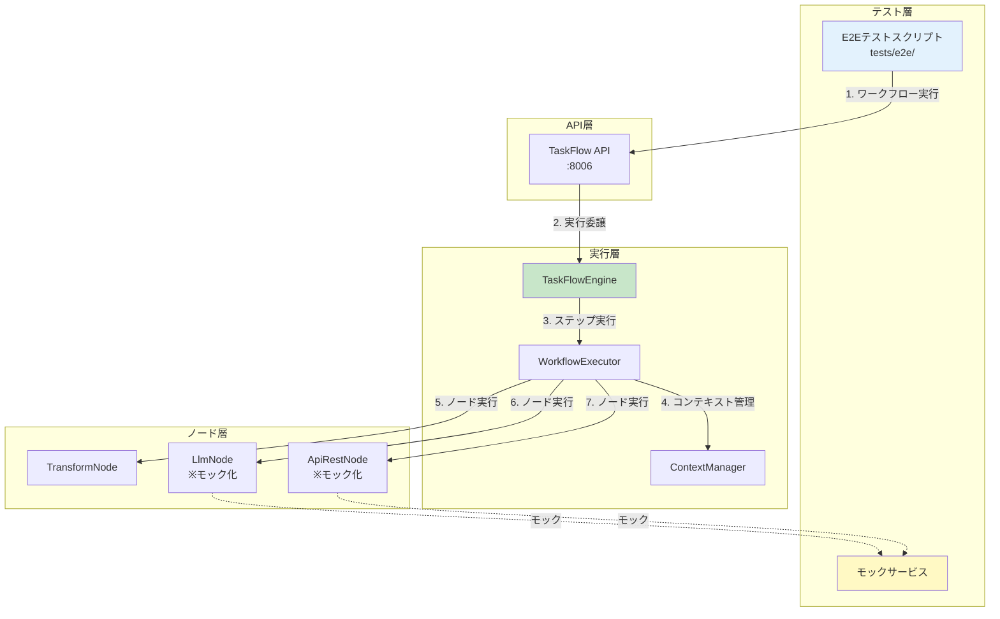

# Issue #379 設計方針書 - ワークフローチェーンのE2E結合テスト追加

## 概要

task_001 → task_002 → task_003 のようなワークフローチェーンをE2Eで自動テストする仕組みを追加する。

### 背景と問題

Issue #375のタスクチェーン動作確認で発見された問題はすべて、E2E結合テストがあれば事前に検出できた。

**真因**: 各ノードの単体テストは存在したが、ワークフロー全体を通したE2Eテストが存在しなかった。

### 対象スコープ

- mySwiftAgentCore/TaskFlowEngineのワークフローチェーン実行
- stepResultsの引き渡し
- テンプレート変数展開（`{{steps.xxx}}`）
- シークレット注入

---

## アーキテクチャ設計

### システム構成図



### レイヤー構成

| レイヤー | 責務 | 実装場所 |
|---------|------|---------|
| **テスト層** | E2Eシナリオ実行、アサーション | `tests/e2e/` |
| **モック層** | 外部API呼び出しのモック化 | `tests/e2e/mocks/` |
| **API層** | HTTP エンドポイント提供 | `src/api/routes/` |
| **実行層** | ワークフロー実行制御 | `src/taskflowEngine/` |
| **ノード層** | 個別ステップ処理 | `src/taskflowEngine/nodes/` |

---

## 技術選定

### 既存技術との整合性確認

| カテゴリ | 選定技術 | 選定理由 | 既存との整合性 |
|---------|---------|---------|---------------|
| **テストフレームワーク** | Vitest + TypeScript | ・既存の単体/統合テストと統一<br/>・型安全性<br/>・高速実行 | ✅ 既存テストと同じ |
| **HTTPクライアント** | node-fetch | ・軽量<br/>・Promiseベース<br/>・既存コードで使用 | ✅ e2etest/で使用中 |
| **モック手法** | Vitest Mock + MSW | ・HTTPレベルモック<br/>・実際のネットワーク動作を再現 | 🔄 MSWは新規導入 |
| **アサーション** | Vitest expect | ・豊富なマッチャー<br/>・既存テストと統一 | ✅ 既存と同じ |
| **CI環境** | GitHub Actions | ・既存のCI/CDパイプライン活用 | ✅ 既存と同じ |

---

## 設計パターン

### 既存パターンの活用

1. **テストワークフロー配置パターン**
   - 既存: `config/taskflow/projects/default_project/workflows/`
   - E2E用: `tests/e2e/fixtures/workflows/` （テスト専用ディレクトリ）

2. **モックパターン**
   - 既存: Vitest vi.fn() による関数モック
   - 追加: MSW による HTTP レベルモック（よりリアルな動作再現）

3. **実行パターン**
   - 既存: `POST /api/v1/taskflow/execute` エンドポイント
   - E2E: 同一エンドポイントを使用（実環境と同じ動作）

---

## データモデル設計

### テスト用ワークフロー定義

```typescript
// tests/e2e/fixtures/workflows/chain-test-workflow.json
{
  "workflow_name": "e2e_chain_test",
  "input_schema": {
    "type": "object",
    "properties": {
      "query": { "type": "string" }
    },
    "required": ["query"]
  },
  "steps": [
    {
      "id": "task_001",
      "name": "Mock Search",
      "type": "transform",
      "config": {
        "mapping": {
          "search_results": [
            { "title": "Result 1", "content": "Content 1" },
            { "title": "Result 2", "content": "Content 2" }
          ],
          "query": "$.input.query"
        }
      }
    },
    {
      "id": "task_002",
      "name": "Mock Summary",
      "type": "llm",
      "config": {
        "prompt": "Summarize: {{steps.task_001.search_results}}",
        "model": "gpt-4o-mini"
      },
      "dependencies": ["task_001"]
    },
    {
      "id": "task_003",
      "name": "Mock Output",
      "type": "api_rest",
      "config": {
        "url": "http://mock-output-service",
        "method": "POST"
      },
      "params": {
        "body": {
          "summary": "$steps.task_002.content",
          "original_query": "$steps.task_001.query"
        }
      },
      "dependencies": ["task_002"]
    }
  ],
  "output": {
    "final_result": "$steps.task_003.response",
    "summary": "$steps.task_002.content"
  }
}
```

### モックレスポンス定義

```typescript
// tests/e2e/mocks/handlers.ts
export const handlers = [
  // LLM モック
  http.post('*/v1/chat/completions', () => {
    return HttpResponse.json({
      choices: [{
        message: {
          content: 'Mocked summary of search results'
        }
      }]
    });
  }),

  // Output API モック
  http.post('http://mock-output-service', async (req) => {
    const body = await req.json();
    return HttpResponse.json({
      success: true,
      received: body,
      timestamp: new Date().toISOString()
    });
  })
];
```

---

## API設計

### エンドポイント（既存活用）

| エンドポイント | メソッド | 用途 |
|--------------|---------|------|
| `/api/v1/taskflow/execute` | POST | ワークフロー実行 |
| `/api/v1/taskflow/reload` | POST | ワークフローリロード |
| `/health` | GET | ヘルスチェック |

### リクエスト/レスポンス形式

**リクエスト**:
```json
{
  "project": "default_project",
  "workflow": "e2e_chain_test",
  "inputs": {
    "query": "test query"
  },
  "options": {
    "timeout": 30000,
    "enableDebug": true
  }
}
```

**レスポンス**:
```json
{
  "success": true,
  "workflowId": "e2e_chain_test",
  "result": {
    "final_result": { "success": true, "received": {...} },
    "summary": "Mocked summary of search results"
  },
  "executionTime": 1234,
  "stepResults": [
    {
      "stepId": "task_001",
      "status": "success",
      "output": { "search_results": [...], "query": "test query" }
    },
    {
      "stepId": "task_002",
      "status": "success",
      "output": { "content": "Mocked summary of search results" }
    },
    {
      "stepId": "task_003",
      "status": "success",
      "output": { "response": { "success": true, "received": {...} } }
    }
  ]
}
```

---

## セキュリティ設計

### テスト環境のセキュリティ

1. **シークレット管理**
   - テスト用のダミーシークレットを使用
   - 実際のAPIキーは使用しない（モックで代替）
   - CI環境変数でテストモード判定

2. **外部API呼び出し**
   - すべての外部APIをモック化
   - 実ネットワーク呼び出しを防止
   - コスト発生を完全に回避

3. **データ隔離**
   - テスト専用のプロジェクトID使用
   - テスト後のクリーンアップ処理

---

## パフォーマンス設計

### テスト実行時間の最適化

1. **並列実行**
   - 独立したテストケースは並列実行
   - Vitest の並列実行機能を活用

2. **モック応答の高速化**
   - 遅延なしの即座レスポンス
   - タイムアウトテストのみ意図的な遅延

3. **リソース管理**
   - テストごとにモックサーバーのリセット
   - メモリリークの防止

---

## 設計上の決定事項とトレードオフ

### 採用した設計の理由

1. **TypeScript + Vitest の採用**
   - **理由**: 既存のテストスタックとの統一性、型安全性
   - **代替案**: Jest、Mocha
   - **トレードオフ**: 新規学習コストなし vs 特殊な要件への対応力

2. **MSW によるHTTPモック**
   - **理由**: 実際のHTTP通信に近い動作、Service Worker ベース
   - **代替案**: nock、直接的な関数モック
   - **トレードオフ**: セットアップの複雑さ vs リアルな動作再現

3. **tests/e2e/ ディレクトリ配置**
   - **理由**: 単体・統合・E2Eの明確な分離
   - **代替案**: tests/integration/ に含める
   - **トレードオフ**: ディレクトリ増加 vs テスト種別の明確化

### 想定されるリスクと対策

| リスク | 影響度 | 対策 |
|--------|-------|------|
| モックと実APIの乖離 | 高 | 定期的な実環境テスト実施 |
| テスト実行時間の増大 | 中 | 並列実行、選択的実行の導入 |
| モックの保守コスト | 中 | APIスキーマ共有、自動生成 |
| CI環境でのタイムアウト | 低 | タイムアウト値の調整可能化 |

---

## 実装方針

### ディレクトリ構成

```
mySwiftAgentCore/
├── tests/
│   ├── e2e/                           # 新規作成
│   │   ├── test_workflow_chain.ts     # メインテストファイル
│   │   ├── fixtures/
│   │   │   └── workflows/             # テスト用ワークフロー
│   │   │       ├── chain-test-workflow.json
│   │   │       ├── parallel-test-workflow.json
│   │   │       └── error-test-workflow.json
│   │   ├── mocks/
│   │   │   ├── handlers.ts            # MSWハンドラー定義
│   │   │   └── server.ts              # モックサーバー設定
│   │   └── utils/
│   │       ├── client.ts              # APIクライアント
│   │       └── assertions.ts          # カスタムアサーション
│   ├── integration/                    # 既存
│   └── unit/                          # 既存
```

### 段階的実装

1. **Phase 1**: 基本的なチェーンテスト
   - 3ステップの連鎖実行
   - stepResults の引き渡し確認

2. **Phase 2**: 高度なシナリオ
   - 並列実行を含むワークフロー
   - エラーハンドリング
   - タイムアウト処理

3. **Phase 3**: CI統合
   - GitHub Actions 設定
   - レポート生成
   - パフォーマンス監視

---

## 参照ドキュメント

- [サービス依存関係](../../../docs/arch/service-dependencies.md)
- [Issue #375: mySwiftAgentCore workflow generation and validation](https://github.com/myorg/myswiftagent/issues/375)
- [Issue #376: NodeExecutionContext設計仕様](https://github.com/myorg/myswiftagent/issues/376)
- [Issue #377: Secrets注入パターンの統一](https://github.com/myorg/myswiftagent/issues/377)

---

**ドキュメント作成日**: 2026-01-19
**Issue番号**: #379
**作成者**: Claude (design-policy スキル)