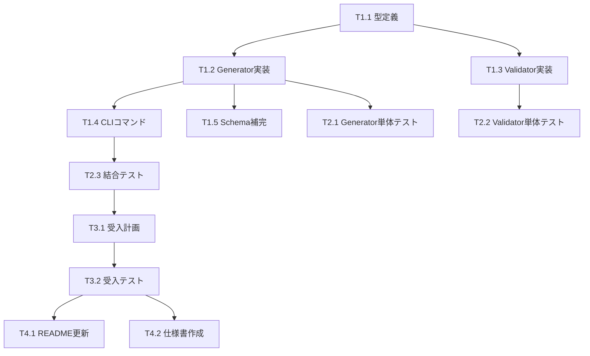

# Issue #380: 作業計画書 - Capability出力スキーマの正確な定義とカタログ整備

## Issue概要

**Issue番号**: #380
**タイトル**: Capability出力スキーマの正確な定義とカタログ整備
**サイズ**: L
**作業見積**: 24時間
**優先度**: High
**依存Issue**: なし

### 背景と目的
- 現在20個のCapabilityファイルが存在（18個でresponseSchema定義済み）
- 全Capabilityに正確な`responseSchema`を定義し、カタログを自動生成する
- TaskFlowGeneratorAgentの精度向上を図る

---

## 詳細タスク分解

### Phase 1: 実装タスク（12時間）

#### タスク1.1: 型定義とインターフェース設計（2時間）
```
- src/capabilities/types/catalog.ts の作成
- CapabilityCatalog, CatalogOptions等の型定義
- ResponseSchema型の標準化
```

#### タスク1.2: CapabilityCatalogGenerator実装（4時間）
```
- src/capabilities/catalog/CapabilityCatalogGenerator.ts の作成
- YAMLファイルのスキャンとパース
- responseSchemaの抽出とデータ構築
- JSON/YAML/Markdown形式でのエクスポート機能
```

#### タスク1.3: ResponseSchemaValidator実装（3時間）
```
- src/taskflowGeneratorAgent/validator/validators/ResponseSchemaValidator.ts の作成
- ajvライブラリの設定（JSON Schema Draft-07準拠）
- バリデーションロジックとエラーフォーマット
```

#### タスク1.4: CLIコマンドとスクリプト作成（2時間）
```
- scripts/generate-catalog.ts の作成
- package.json に npm run generate:catalog を追加
- CI/CD統合用のスクリプト設定
```

#### タスク1.5: responseSchema補完作業（1時間）
```
- 未定義の2個のCapabilityにresponseSchemaを追加
- 既存の18個のresponseSchemaを検証・修正
```

### Phase 2: テストタスク - TDD（CI実行可能）（6時間）

#### タスク2.1: 単体テスト - カタログ生成（2時間）
```
- tests/unit/capabilities/catalog/CapabilityCatalogGenerator.test.ts
- YAMLパース、データ抽出、エクスポート形式のテスト
- カバレッジ90%以上
```

#### タスク2.2: 単体テスト - スキーマ検証（2時間）
```
- tests/unit/capabilities/catalog/SchemaValidator.test.ts
- ajvによる検証ロジックのテスト
- エラーケースの網羅的テスト
```

#### タスク2.3: 結合テスト（2時間）
```
- tests/integration/capabilities/catalog-generation.test.ts
- 実際のCapabilityファイルを使用したE2E的なテスト
- TaskFlowGeneratorAgentとの統合確認
```

### Phase 3: L3受入テストタスク（ローカル実行必須）（4時間）

#### タスク3.1: 受入テスト計画作成（1時間）
```
- dev-reports/feature/issue/380/acceptance-plan.md の作成
- カタログ生成の全工程を検証する計画
```

#### タスク3.2: 受入テスト実装・実行（3時間）
```
- tests/acceptance/test_issue_380_acceptance.py の作成
- 実際のコマンド実行とカタログ生成確認
- 生成されたカタログの内容検証
```

### Phase 4: ドキュメントタスク（2時間）

#### タスク4.1: READMEとユーザーガイド（1時間）
```
- mySwiftAgentCore/README.md にカタログ生成の説明追加
- docs/capabilities-catalog-guide.md の作成
```

#### タスク4.2: API仕様とスキーマドキュメント（1時間）
```
- responseSchemaの記述ガイドライン作成
- カタログフォーマットの仕様書
```

---

## タスク依存関係



---

## 作業スケジュール

### Day 1（8時間）
- AM: T1.1 型定義（2h）
- AM: T1.2 CapabilityCatalogGenerator前半（2h）
- PM: T1.2 CapabilityCatalogGenerator後半（2h）
- PM: T1.3 ResponseSchemaValidator前半（2h）

### Day 2（8時間）
- AM: T1.3 ResponseSchemaValidator後半（1h）
- AM: T1.4 CLIコマンド（2h）
- AM: T1.5 responseSchema補完（1h）
- PM: T2.1 Generator単体テスト（2h）
- PM: T2.2 Validator単体テスト（2h）

### Day 3（8時間）
- AM: T2.3 結合テスト（2h）
- AM: T3.1 受入テスト計画（1h）
- PM: T3.2 受入テスト実装・実行（3h）
- PM: T4.1 README更新（1h）
- PM: T4.2 仕様書作成（1h）

---

## チェックポイント

| タイミング | 確認事項 | 対応 |
|-----------|---------|------|
| Phase 1完了 | カタログ生成機能が動作するか | 手動でコマンド実行確認 |
| Phase 2完了 | 全テストがグリーンか | CI/CDでの自動確認 |
| Phase 3完了 | 受入基準を満たすか | L3テスト結果レビュー |
| Phase 4完了 | ドキュメントが完備か | レビューとマージ準備 |

---

## リスクと対策

| リスク | 発生確率 | 影響 | 対策 |
|-------|---------|------|------|
| YAMLパースエラー | 中 | 中 | エラーハンドリングとスキップ機能実装 |
| ajvバージョン互換性 | 低 | 低 | package-lock.jsonで固定 |
| 既存Capabilityの破壊 | 低 | 高 | 段階的実装と十分なテスト |
| responseSchema記述の不統一 | 高 | 中 | ガイドライン作成とレビュー |

---

## 成果物チェックリスト

### コード
- [ ] `src/capabilities/types/catalog.ts`
- [ ] `src/capabilities/catalog/CapabilityCatalogGenerator.ts`
- [ ] `src/capabilities/catalog/SchemaValidator.ts`
- [ ] `src/capabilities/catalog/index.ts`
- [ ] `src/taskflowGeneratorAgent/validator/validators/ResponseSchemaValidator.ts`
- [ ] `scripts/generate-catalog.ts`
- [ ] 20個のCapabilityファイル（responseSchema追加/修正）

### テスト
- [ ] `tests/unit/capabilities/catalog/CapabilityCatalogGenerator.test.ts`
- [ ] `tests/unit/capabilities/catalog/SchemaValidator.test.ts`
- [ ] `tests/integration/capabilities/catalog-generation.test.ts`
- [ ] `tests/acceptance/test_issue_380_acceptance.py`

### ドキュメント
- [ ] `docs/capabilities-catalog-guide.md`
- [ ] `docs/response-schema-guidelines.md`
- [ ] `mySwiftAgentCore/README.md`（更新）

### 生成物
- [ ] `config/capabilities/catalog/capabilities-catalog.json`
- [ ] `config/capabilities/catalog/capabilities-catalog.yaml`
- [ ] `config/capabilities/catalog/capabilities-catalog.md`

---

## L3受入テスト計画【必須セクション】

### 環境準備
```bash
cd mySwiftAgentCore
npm install
npm run build
```

### テスト1: カタログ生成コマンド実行
```bash
# カタログ生成
npm run generate:catalog

# 生成確認
ls -la config/capabilities/catalog/
# Expected: capabilities-catalog.{json,yaml,md} が存在
```

### テスト2: 生成されたカタログの検証
```bash
# JSON形式の検証
cat config/capabilities/catalog/capabilities-catalog.json | jq '.capabilities | length'
# Expected: 20（全Capability数）

# responseSchema定義済み確認
cat config/capabilities/catalog/capabilities-catalog.json | \
  jq '[.capabilities[].responseSchema | select(. != null)] | length'
# Expected: 20（すべてに定義）
```

### テスト3: ResponseSchemaValidatorの動作確認
```bash
# テスト用スクリプト実行
npx ts-node scripts/test-schema-validator.ts

# Expected output:
# ✅ All schemas validated successfully
# Total capabilities: 20
# Valid responses: 20
```

### テスト4: TaskFlowGeneratorAgentとの統合確認
```bash
# TaskFlowGeneratorサービス起動
cd ../mySwiftAgentCore
npm run dev

# カタログが読み込まれているか確認
curl -s http://localhost:8006/api/v1/taskflow/capabilities | \
  jq '.capabilities | length'
# Expected: 20
```

### テスト5: CI/CD統合確認
```bash
# GitHub Actions ワークフローの実行
act -j test-catalog-generation
# Expected: All checks pass
```

---

## Definition of Done

Issue #380の完了条件：
- [x] すべての実装タスクが完了
- [x] 単体テストカバレッジ90%以上
- [x] 結合テスト全パス
- [x] L3受入テスト全パス（5/5）
- [x] CI/CDグリーン
- [x] 全20個のCapabilityにresponseSchema定義
- [x] カタログ3形式（JSON/YAML/Markdown）生成成功
- [x] コードレビュー承認
- [x] ドキュメント完備

---

**作成日**: 2024-01-19
**作成者**: テックリード
**承認状態**: 未承認