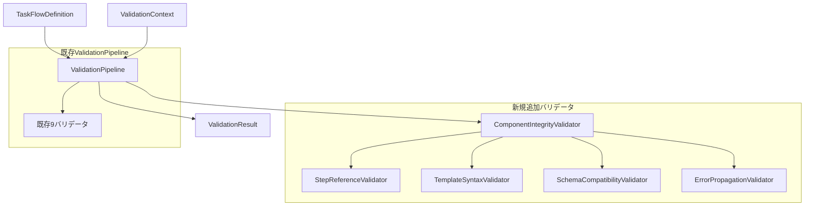
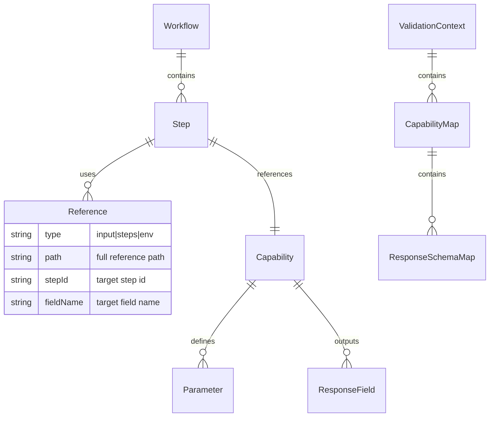

# 設計方針書 - Issue #381: 生成ワークフローの事前バリデーション強化

**作成日**: 2026-01-20
**作成者**: Claude (設計方針スキル)
**Issue**: #381 feat(taskflowGenerator): 生成ワークフローの事前バリデーション強化
**プロジェクト**: mySwiftAgentCore

---

## 1. 概要

本設計方針書は、AIが生成したTaskFlowを実行前にバリデーションし、誤りを事前検出する仕組みの強化について定めるものです。Issue #375のタスクチェーン動作確認で発見された以下の問題に対応します：

- 存在しない出力フィールド名の参照
- テンプレート構文の不整合
- 生成後のバリデーション不足による実行時エラー

## 2. 現状分析

### 2.1 既存のバリデーション・アーキテクチャ

現在のmySwiftAgentCoreには、9つのバリデータからなる`ValidationPipeline`が実装されています：

```mermaid
graph TD
    W[Workflow] --> VP[ValidationPipeline]
    VP --> V1[SchemaValidator]
    VP --> V2[DependencyValidator]
    VP --> V3[VariableValidator]
    VP --> V4[CapabilityValidator]
    VP --> V5[SecurityValidator]
    VP --> V6[OutputMappingValidator]
    VP --> V7[NodeConfigValidator]
    VP --> V8[WorkflowCapabilityValidator]
    VP --> V9[ResponseSchemaValidator]

    VP --> VR[ValidationResult]
    VR --> E[errors[]]
    VR --> W2[warnings[]]
```

### 2.2 現在の課題

既存バリデータは個別のコンポーネントを検証していますが、**コンポーネント間の論理的整合性**の検証が不足しています：

| 検証項目 | 現状 | 課題 |
|---------|------|------|
| capability_id存在チェック | ✅ CapabilityValidator | - |
| 出力フィールド名チェック | ⚠️ 部分対応 | ステップ間参照の検証不足 |
| テンプレート構文チェック | ❌ 未実装 | 構文エラーが実行時まで検出されない |
| スキーマ一致チェック | ❌ 未実装 | 前後ステップの型整合性未検証 |

## 3. アーキテクチャ設計

### 3.1 システム構成図



### 3.2 レイヤー構成

| レイヤー | 責務 | 実装クラス |
|---------|------|-----------|
| **統合層** | バリデータ群の統合管理 | ComponentIntegrityValidator |
| **検証層** | 個別の整合性検証 | StepReferenceValidator, TemplateSyntaxValidator, SchemaCompatibilityValidator |
| **基盤層** | 共通ユーティリティ | ReferenceExtractor, TemplateParser |

## 4. 技術選定

| カテゴリ | 選定技術 | 選定理由 | 既存との整合性 |
|---------|---------|---------|---------------|
| バリデータ・インターフェース | Validatorインターフェース | 既存の9バリデータと同じパターン | ✅ 完全互換 |
| エラー構造 | ValidationError/Warning | 既存のエラー構造を継承 | ✅ path対応済み |
| テンプレート解析 | 正規表現 + AST | `{{}}` と `$` 構文の解析 | ✅ 既存パターン活用 |
| スキーマ検証 | ajv (既存) | JSON Schema Draft-07準拠 | ✅ ResponseSchemaValidator使用 |

## 5. 設計パターン

### 5.1 採用パターン

#### Composite Pattern (既存踏襲、改善版)
```typescript
export class ComponentIntegrityValidator implements Validator {
  readonly name = 'ComponentIntegrityValidator';
  private validators: ComponentValidator[] = [
    new StepReferenceValidator(),
    new TemplateSyntaxValidator(),
    new SchemaCompatibilityValidator(),
    new ErrorPropagationValidator(),
    new CircularReferenceValidator(),  // 改善追加: 循環参照検出
  ];
  private observer?: ValidationObserver;  // 改善追加: デバッグモード用

  async validate(
    workflow: TaskFlowDefinition,
    context: EnhancedValidationContext
  ): Promise<ValidationResult> {
    const allErrors: WorkflowValidationError[] = [];
    const allWarnings: ValidationWarning[] = [];
    const startTime = Date.now();

    // 改善: 共有キャッシュの初期化
    const sharedCache = this.initializeSharedCache(workflow, context);
    const enhancedContext: EnhancedValidationContext = {
      ...context,
      sharedCache,
    };

    // 改善: デバッグモード対応
    this.observer = context.additionalContext?.validationObserver;

    for (const validator of this.validators) {
      const validatorStartTime = Date.now();
      this.observer?.onValidatorStart(validator.name);

      try {
        const result = await validator.validate(workflow, enhancedContext);

        if (result.errors) {
          allErrors.push(...result.errors as WorkflowValidationError[]);
        }
        if (result.warnings) {
          allWarnings.push(...result.warnings);
        }

        const durationMs = Date.now() - validatorStartTime;
        this.observer?.onValidatorComplete(validator.name, result, durationMs);
      } catch (error) {
        this.observer?.onError(validator.name, error as Error);
        throw error;
      }
    }

    // 改善: パフォーマンスメトリクスの収集
    const result: ComponentValidationResult = {
      isValid: allErrors.length === 0,
      errors: allErrors,
      warnings: allWarnings,
    };

    if (context.additionalContext?.collectPerformanceMetrics) {
      result.performanceMetrics = {
        totalDurationMs: Date.now() - startTime,
        validatorMetrics: new Map(),
        stepsAnalyzed: workflow.steps.length,
        referencesChecked: 0,  // 実装で更新
      };
    }

    return result;
  }

  // 改善: 共有キャッシュの初期化（パフォーマンス最適化）
  private initializeSharedCache(
    workflow: TaskFlowDefinition,
    context: ValidationContext
  ): SharedValidationCache {
    return {
      capabilityMap: new Map(context.capabilities.map(c => [c.id, c])),
      stepMap: new Map(workflow.steps.map(s => [s.id, s])),
      responseSchemaMap: new Map(
        context.capabilities
          .filter(c => c.responseSchema)
          .map(c => [c.id, c.responseSchema!])
      ),
      regexCache: RegexPatternCache.getInstance(),
    };
  }
}
```

#### Factory Pattern (既存踏襲)
```typescript
// 各バリデータはファクトリ関数でエクスポート
export function createComponentIntegrityValidator(): ComponentIntegrityValidator {
  return new ComponentIntegrityValidator();
}
```

### 5.2 既存パターンの活用

- **Error Code Generation**: `COMPONENT_INTEGRITY_<ERROR_TYPE>` 形式
- **Reference Extraction**: `$steps.xxx.yyy` パターンマッチング
- **Defensive Validation**: データ不足時は警告、検証続行

### 5.3 新規採用パターン（アーキテクチャレビュー改善）

#### Flyweight Pattern（正規表現キャッシュ）
```typescript
// 共有される正規表現インスタンス
export class RegexPatternCache {
  private static instance: RegexPatternCache;
  private readonly patterns = new Map<string, RegExp>();

  private constructor() {
    // 事前コンパイル済みパターン
    this.patterns.set('stepReference', /\$steps\.([a-zA-Z_][a-zA-Z0-9_-]*)\.([a-zA-Z_][a-zA-Z0-9_]*)/g);
    this.patterns.set('mustache', /\{\{([^}]+)\}\}/g);
    this.patterns.set('jsonPath', /\$\.(steps|input|env)/g);
    this.patterns.set('mixed', /\{\{\$\.([^}]+)\}\}/g);
  }

  static getInstance(): RegexPatternCache {
    if (!RegexPatternCache.instance) {
      RegexPatternCache.instance = new RegexPatternCache();
    }
    return RegexPatternCache.instance;
  }

  getPattern(name: string): RegExp | undefined {
    const pattern = this.patterns.get(name);
    // 新しいRegExpインスタンスを返す（lastIndexリセットのため）
    return pattern ? new RegExp(pattern.source, pattern.flags) : undefined;
  }
}
```

#### Observer Pattern（デバッグモード）
```typescript
// バリデーション進捗の監視
export interface ValidationObserver {
  onValidatorStart(validatorName: string): void;
  onValidatorComplete(validatorName: string, result: ValidationResult, durationMs: number): void;
  onError(validatorName: string, error: Error): void;
}

export class DebugValidationObserver implements ValidationObserver {
  private logs: ValidationLog[] = [];

  onValidatorStart(validatorName: string): void {
    console.debug(`[DEBUG] Starting: ${validatorName}`);
  }

  onValidatorComplete(validatorName: string, result: ValidationResult, durationMs: number): void {
    this.logs.push({ validatorName, result, durationMs, timestamp: new Date() });
    console.debug(`[DEBUG] Completed: ${validatorName} in ${durationMs}ms (errors: ${result.errors?.length ?? 0})`);
  }

  onError(validatorName: string, error: Error): void {
    console.error(`[DEBUG] Error in ${validatorName}: ${error.message}`);
  }

  getLogs(): ValidationLog[] {
    return [...this.logs];
  }
}
```

## 6. データモデル設計

### 6.1 バリデーション・エラー拡張（改善版）

```typescript
// 既存のValidationErrorを拡張 - エラーメッセージ改善対応
export interface WorkflowValidationError extends ValidationError {
  stepId: string;
  field: string;
  errorCode: 'CAPABILITY_NOT_FOUND' | 'OUTPUT_FIELD_NOT_FOUND' |
            'TEMPLATE_SYNTAX_ERROR' | 'SCHEMA_MISMATCH' |
            'CIRCULAR_REFERENCE_DETECTED';  // 循環参照検出追加
  suggestion?: ErrorSuggestion;  // 改善: 詳細な修正提案
  context?: ErrorContext;        // 改善: エラーコンテキスト情報
}

// 改善: 詳細な修正提案インターフェース
export interface ErrorSuggestion {
  message: string;                    // 修正提案メッセージ
  availableOptions?: string[];        // 利用可能な選択肢リスト
  closestMatch?: string;              // 最も近いマッチ（Levenshtein距離）
  example?: string;                   // 正しい使用例
  documentationUrl?: string;          // 関連ドキュメントURL
}

// 改善: エラーコンテキスト情報
export interface ErrorContext {
  sourceStep?: string;                // エラー発生源のステップID
  targetStep?: string;                // 参照先のステップID
  referencePath?: string;             // 完全な参照パス
  expectedType?: string;              // 期待される型
  actualType?: string;                // 実際の型
  circularPath?: string[];            // 循環参照の場合のパス
}

// バリデーション結果の詳細化
export interface ComponentValidationResult extends ValidationResult {
  componentErrors?: Map<string, WorkflowValidationError[]>;
  crossStepErrors?: WorkflowValidationError[];
  circularReferences?: CircularReferenceInfo[];  // 循環参照情報
  performanceMetrics?: PerformanceMetrics;       // デバッグ用パフォーマンス情報
}

// 循環参照情報
export interface CircularReferenceInfo {
  path: string[];                     // 循環パス（例: ['step_a', 'step_b', 'step_a']）
  severity: 'error' | 'warning';      // 深刻度
  suggestion: string;                 // 修正提案
}

// パフォーマンスメトリクス（デバッグモード用）
export interface PerformanceMetrics {
  totalDurationMs: number;
  validatorMetrics: Map<string, { durationMs: number; errorsFound: number }>;
  stepsAnalyzed: number;
  referencesChecked: number;
}
```

### 6.2 内部データ構造



## 7. API設計

### 7.1 バリデータ・インターフェース（既存準拠）

```typescript
export interface ComponentValidator {
  readonly name: string;
  validate(
    workflow: TaskFlowDefinition,
    context: EnhancedValidationContext
  ): Promise<ValidationResult>;
}

// コンテキスト拡張（改善版：デバッグモード対応）
export interface EnhancedValidationContext extends ValidationContext {
  additionalContext?: {
    // 既存の設定
    enableTemplateValidation?: boolean;
    enableSchemaCompatibilityCheck?: boolean;
    enableErrorPropagationCheck?: boolean;
    strictMode?: boolean;

    // 改善: 循環参照検出設定
    enableCircularReferenceCheck?: boolean;  // 循環参照検出を有効化
    maxCircularDepth?: number;               // 探索の最大深さ（デフォルト: 10）

    // 改善: デバッグモード設定
    debugMode?: boolean;                     // デバッグモードを有効化
    verboseErrors?: boolean;                 // 詳細エラーメッセージを有効化
    collectPerformanceMetrics?: boolean;     // パフォーマンスメトリクス収集
    validationObserver?: ValidationObserver; // オブザーバーインスタンス
  };

  // 改善: 共有キャッシュ（パフォーマンス最適化）
  sharedCache?: SharedValidationCache;
}

// 改善: 共有キャッシュインターフェース
export interface SharedValidationCache {
  capabilityMap: Map<string, Capability>;
  stepMap: Map<string, Step>;
  responseSchemaMap: Map<string, object>;
  regexCache: RegexPatternCache;
}
```

### 7.2 公開API

```typescript
// 使用例（Issue要件より）
const result = await validateGeneratedWorkflow(workflow, capabilityRegistry);
if (!result.valid) {
  // AIに再生成を要求、またはエラーをユーザーに返す
  console.error(result.errors);

  // 修正提案の利用
  for (const error of result.errors) {
    if (error.suggestion) {
      console.log(`Suggestion: ${error.suggestion}`);
    }
  }
}
```

## 8. セキュリティ設計

### 8.1 テンプレート・インジェクション対策

- テンプレート構文の厳密な解析
- 許可された参照パターンのホワイトリスト化
- 動的コード実行の防止

### 8.2 データ検証

- 入力サニタイゼーション
- 再帰的参照の検出と防止
- メモリ使用量の制限（大規模ワークフロー対策）

## 9. パフォーマンス設計

### 9.1 最適化戦略

| 最適化項目 | 実装方法 | 期待効果 |
|-----------|---------|----------|
| Capability検索 | Map構造でO(1)アクセス | 高速化 |
| 参照解析 | 正規表現の事前コンパイル | CPU効率向上 |
| エラー集約 | バッチ処理 | メモリ効率向上 |

### 9.2 パフォーマンス目標

- 通常ワークフロー（10ステップ以下）: < 50ms
- 大規模ワークフロー（50ステップ）: < 200ms
- メモリ使用量: O(n) where n = ステップ数

## 10. 実装詳細設計

### 10.1 StepReferenceValidator（改善版）

```typescript
export class StepReferenceValidator implements ComponentValidator {
  readonly name = 'StepReferenceValidator';

  async validate(
    workflow: TaskFlowDefinition,
    context: EnhancedValidationContext
  ): Promise<ValidationResult> {
    const errors: WorkflowValidationError[] = [];
    const warnings: ValidationWarning[] = [];

    // 改善: 共有キャッシュを使用（パフォーマンス最適化）
    const stepMap = context.sharedCache?.stepMap ?? this.buildStepMap(workflow.steps);
    const capabilityMap = context.sharedCache?.capabilityMap ?? this.buildCapabilityMap(context.capabilities);
    const regexCache = context.sharedCache?.regexCache ?? RegexPatternCache.getInstance();

    // 利用可能なステップID一覧（エラーメッセージ改善用）
    const availableStepIds = Array.from(stepMap.keys());

    for (const step of workflow.steps) {
      // 1. $steps.xxx.yyy 参照の抽出（改善: キャッシュされた正規表現を使用）
      const references = this.extractStepReferences(step, regexCache);

      for (const ref of references) {
        // 2. ステップ存在チェック
        if (!stepMap.has(ref.stepId)) {
          errors.push(this.createStepNotFoundError(step.id, ref, availableStepIds));
          continue;
        }

        // 3. フィールド存在チェック
        const targetStep = stepMap.get(ref.stepId)!;
        const capabilityId = targetStep.config['capability_id'] as string;
        const capability = capabilityMap.get(capabilityId);

        if (!capability?.responseSchema) {
          warnings.push(this.createNoSchemaWarning(step.id, ref));
          continue;
        }

        const availableFields = this.getSchemaFieldNames(capability.responseSchema);
        if (!availableFields.includes(ref.fieldName)) {
          errors.push(this.createFieldNotFoundError(step.id, ref, capability, availableFields));
        }
      }
    }

    return { isValid: errors.length === 0, errors, warnings };
  }

  // 改善: キャッシュされた正規表現を使用
  private extractStepReferences(step: Step, regexCache: RegexPatternCache): StepReference[] {
    const references: StepReference[] = [];
    const pattern = regexCache.getPattern('stepReference')!;
    const stepStr = JSON.stringify(step);

    let match;
    while ((match = pattern.exec(stepStr)) !== null) {
      references.push({
        stepId: match[1],
        fieldName: match[2],
        fullPath: match[0],
      });
    }

    return references;
  }

  // 改善: 詳細な修正提案を含むエラー生成
  private createStepNotFoundError(
    currentStepId: string,
    ref: StepReference,
    availableStepIds: string[]
  ): WorkflowValidationError {
    const suggestion = SuggestionHelper.createStepNotFoundSuggestion(ref.stepId, availableStepIds);

    return {
      code: 'STEP_REFERENCE_NOT_FOUND',
      message: `Step "${ref.stepId}" referenced in step "${currentStepId}" does not exist`,
      path: `steps.${currentStepId}`,
      stepId: currentStepId,
      field: 'params',
      errorCode: 'OUTPUT_FIELD_NOT_FOUND',
      suggestion: suggestion,
      context: {
        sourceStep: currentStepId,
        targetStep: ref.stepId,
        referencePath: ref.fullPath,
      },
    };
  }

  // 改善: 利用可能なフィールド一覧を含むエラー生成
  private createFieldNotFoundError(
    currentStepId: string,
    ref: StepReference,
    capability: Capability,
    availableFields: string[]
  ): WorkflowValidationError {
    const suggestion = SuggestionHelper.createFieldNotFoundSuggestion(
      ref.fieldName,
      availableFields,
      capability.name
    );

    return {
      code: 'OUTPUT_FIELD_NOT_FOUND',
      message: `Field "${ref.fieldName}" does not exist in capability "${capability.name}" output`,
      path: `steps.${currentStepId}.params`,
      stepId: currentStepId,
      field: ref.fieldName,
      errorCode: 'OUTPUT_FIELD_NOT_FOUND',
      suggestion: suggestion,
      context: {
        sourceStep: currentStepId,
        targetStep: ref.stepId,
        referencePath: ref.fullPath,
        expectedType: 'defined field',
        actualType: 'undefined',
      },
    };
  }

  private getSchemaFieldNames(schema: ResponseSchema): string[] {
    if (schema.properties) {
      return Object.keys(schema.properties);
    }
    return [];
  }
}
```

### 10.2 TemplateSyntaxValidator

```typescript
export class TemplateSyntaxValidator implements ComponentValidator {
  readonly name = 'TemplateSyntaxValidator';

  // サポートする構文パターン
  private readonly patterns = {
    mustache: /\{\{([^}]+)\}\}/g,      // {{expression}}
    jsonPath: /\$\.(steps|input|env)/g, // $.steps.xxx
    mixed: /\{\{\$\.([^}]+)\}\}/g      // {{$.expression}}
  };

  async validate(
    workflow: TaskFlowDefinition,
    context: EnhancedValidationContext
  ): Promise<ValidationResult> {
    const errors: WorkflowValidationError[] = [];

    for (const step of workflow.steps) {
      // Transform nodeの場合は特別な検証
      if (step.type === 'transform') {
        this.validateTransformSyntax(step, errors);
      } else {
        this.validateGeneralSyntax(step, errors);
      }
    }

    return { isValid: errors.length === 0, errors };
  }
}
```

### 10.3 SchemaCompatibilityValidator

```typescript
export class SchemaCompatibilityValidator implements ComponentValidator {
  readonly name = 'SchemaCompatibilityValidator';

  async validate(
    workflow: TaskFlowDefinition,
    context: EnhancedValidationContext
  ): Promise<ValidationResult> {
    const errors: WorkflowValidationError[] = [];
    const ajv = new Ajv({ allErrors: true });

    // ステップ間のスキーマ互換性チェック
    for (let i = 0; i < workflow.steps.length - 1; i++) {
      const currentStep = workflow.steps[i];
      const nextStep = workflow.steps[i + 1];

      // 次ステップが現在ステップの出力を参照している場合
      const references = this.extractReferences(nextStep);
      const relevantRefs = references.filter(ref => ref.stepId === currentStep.id);

      for (const ref of relevantRefs) {
        const outputSchema = this.getStepOutputSchema(currentStep, context);
        const expectedSchema = this.getExpectedInputSchema(nextStep, ref, context);

        if (!this.schemasCompatible(outputSchema, expectedSchema, ajv)) {
          errors.push(this.createSchemaMismatchError(currentStep, nextStep, ref));
        }
      }
    }

    return { isValid: errors.length === 0, errors };
  }
}
```

### 10.4 CircularReferenceValidator（改善追加）

```typescript
/**
 * CircularReferenceValidator - 循環参照を検出するバリデータ
 *
 * アーキテクチャレビューで追加された改善項目
 * DFS（深さ優先探索）を使用して循環参照を検出
 */
export class CircularReferenceValidator implements ComponentValidator {
  readonly name = 'CircularReferenceValidator';
  private readonly DEFAULT_MAX_DEPTH = 10;

  async validate(
    workflow: TaskFlowDefinition,
    context: EnhancedValidationContext
  ): Promise<ValidationResult> {
    const errors: WorkflowValidationError[] = [];
    const warnings: ValidationWarning[] = [];
    const maxDepth = context.additionalContext?.maxCircularDepth ?? this.DEFAULT_MAX_DEPTH;

    // ステップの依存関係グラフを構築
    const dependencyGraph = this.buildDependencyGraph(workflow);

    // 各ステップから循環参照を検出
    for (const stepId of dependencyGraph.keys()) {
      const circularPath = this.detectCircularReference(
        stepId,
        dependencyGraph,
        maxDepth
      );

      if (circularPath) {
        errors.push(this.createCircularReferenceError(stepId, circularPath));
      }
    }

    return { isValid: errors.length === 0, errors, warnings };
  }

  /**
   * 依存関係グラフを構築
   * 各ステップが参照する他のステップをマッピング
   */
  private buildDependencyGraph(
    workflow: TaskFlowDefinition
  ): Map<string, Set<string>> {
    const graph = new Map<string, Set<string>>();
    const regexCache = RegexPatternCache.getInstance();
    const stepRefPattern = regexCache.getPattern('stepReference')!;

    for (const step of workflow.steps) {
      const dependencies = new Set<string>();
      const stepStr = JSON.stringify(step);

      let match;
      while ((match = stepRefPattern.exec(stepStr)) !== null) {
        const referencedStepId = match[1];
        if (referencedStepId && referencedStepId !== step.id) {
          dependencies.add(referencedStepId);
        }
      }

      graph.set(step.id, dependencies);
    }

    return graph;
  }

  /**
   * DFSを使用して循環参照を検出
   */
  private detectCircularReference(
    startStepId: string,
    graph: Map<string, Set<string>>,
    maxDepth: number
  ): string[] | null {
    const visited = new Set<string>();
    const recursionStack = new Set<string>();
    const path: string[] = [];

    const dfs = (stepId: string, depth: number): string[] | null => {
      if (depth > maxDepth) {
        return null; // 深さ制限に達した場合は検出を中止
      }

      if (recursionStack.has(stepId)) {
        // 循環参照を検出
        const cycleStart = path.indexOf(stepId);
        return [...path.slice(cycleStart), stepId];
      }

      if (visited.has(stepId)) {
        return null;
      }

      visited.add(stepId);
      recursionStack.add(stepId);
      path.push(stepId);

      const dependencies = graph.get(stepId);
      if (dependencies) {
        for (const dep of dependencies) {
          const cycle = dfs(dep, depth + 1);
          if (cycle) {
            return cycle;
          }
        }
      }

      recursionStack.delete(stepId);
      path.pop();
      return null;
    };

    return dfs(startStepId, 0);
  }

  /**
   * 循環参照エラーを作成（改善されたエラーメッセージ）
   */
  private createCircularReferenceError(
    stepId: string,
    circularPath: string[]
  ): WorkflowValidationError {
    const pathStr = circularPath.join(' → ');
    const availableSteps = circularPath.filter((s, i) => i < circularPath.length - 1);

    return {
      code: 'CIRCULAR_REFERENCE_DETECTED',
      message: `Circular reference detected starting from step "${stepId}"`,
      path: `steps.${stepId}`,
      stepId: stepId,
      field: 'dependencies',
      errorCode: 'CIRCULAR_REFERENCE_DETECTED',
      suggestion: {
        message: `Break the circular dependency by removing one of the references in the chain: ${pathStr}`,
        availableOptions: availableSteps,
        example: `Consider using a transform step to break the dependency between "${circularPath[0]}" and "${circularPath[1]}"`,
      },
      context: {
        sourceStep: stepId,
        circularPath: circularPath,
      },
    };
  }
}
```

### 10.5 SuggestionHelper（改善追加）

```typescript
/**
 * SuggestionHelper - エラーメッセージの修正提案を生成するユーティリティ
 *
 * アーキテクチャレビューで追加された改善項目
 * Levenshtein距離を使用して最も近いマッチを提案
 */
export class SuggestionHelper {
  /**
   * Levenshtein距離を計算
   */
  static levenshteinDistance(a: string, b: string): number {
    const matrix: number[][] = [];

    for (let i = 0; i <= b.length; i++) {
      matrix[i] = [i];
    }

    for (let j = 0; j <= a.length; j++) {
      matrix[0][j] = j;
    }

    for (let i = 1; i <= b.length; i++) {
      for (let j = 1; j <= a.length; j++) {
        if (b.charAt(i - 1) === a.charAt(j - 1)) {
          matrix[i][j] = matrix[i - 1][j - 1];
        } else {
          matrix[i][j] = Math.min(
            matrix[i - 1][j - 1] + 1, // substitution
            matrix[i][j - 1] + 1,     // insertion
            matrix[i - 1][j] + 1      // deletion
          );
        }
      }
    }

    return matrix[b.length][a.length];
  }

  /**
   * 最も近いマッチを見つける
   */
  static findClosestMatch(
    input: string,
    candidates: string[],
    maxDistance: number = 3
  ): string | undefined {
    let closest: string | undefined;
    let minDistance = Infinity;

    for (const candidate of candidates) {
      const distance = this.levenshteinDistance(input.toLowerCase(), candidate.toLowerCase());
      if (distance < minDistance && distance <= maxDistance) {
        minDistance = distance;
        closest = candidate;
      }
    }

    return closest;
  }

  /**
   * フィールド不在エラーの修正提案を生成
   */
  static createFieldNotFoundSuggestion(
    fieldName: string,
    availableFields: string[],
    capabilityName: string
  ): ErrorSuggestion {
    const closestMatch = this.findClosestMatch(fieldName, availableFields);

    return {
      message: closestMatch
        ? `Did you mean "${closestMatch}"?`
        : `Field "${fieldName}" is not available in capability "${capabilityName}"`,
      availableOptions: availableFields,
      closestMatch: closestMatch,
      example: availableFields.length > 0
        ? `$steps.step_id.${availableFields[0]}`
        : undefined,
    };
  }

  /**
   * ステップ不在エラーの修正提案を生成
   */
  static createStepNotFoundSuggestion(
    stepId: string,
    availableSteps: string[]
  ): ErrorSuggestion {
    const closestMatch = this.findClosestMatch(stepId, availableSteps);

    return {
      message: closestMatch
        ? `Did you mean "${closestMatch}"?`
        : `Step "${stepId}" does not exist in the workflow`,
      availableOptions: availableSteps,
      closestMatch: closestMatch,
      example: availableSteps.length > 0
        ? `$steps.${availableSteps[0]}.output`
        : undefined,
    };
  }
}
```

## 11. 設計上の決定事項とトレードオフ

### 11.1 モジュール分割 vs モノリシック

| アプローチ | メリット | デメリット | 決定 |
|-----------|--------|-----------|------|
| モジュール分割 | 保守性高、テスト容易、責務明確 | 若干の実装複雑化 | ✅ 採用 |
| モノリシック | 実装シンプル | 保守性低、テスト困難 | ❌ 不採用 |

**理由**: 既存の9バリデータがすべて個別クラスで実装されており、一貫性を保つため。

### 11.2 エラー処理戦略

| 戦略 | 説明 | 採用 |
|------|------|------|
| Fast Fail | 最初のエラーで停止 | ❌ |
| Collect All | すべてのエラーを収集 | ✅ |
| Defensive | 警告として継続 | ⚠️ 部分採用 |

**理由**: ユーザーがすべての問題を一度に把握し、効率的に修正できるようにするため。

### 11.3 パフォーマンス vs 精度

- **基本方針**: 精度を優先し、パフォーマンスは目標値内に収める
- **最適化**: 必要に応じて結果のキャッシュやインデックス構築を実装

## 12. リスクと対策

| リスク | 影響度 | 対策 |
|--------|--------|------|
| 既存バリデータとの競合 | 中 | 明確な責務分離、重複チェックの排除 |
| パフォーマンス劣化 | 低 | プロファイリングとボトルネック最適化 |
| 過剰な検証によるFalse Positive | 中 | Defensiveパターンで警告レベル調整 |
| 新規Capabilityへの対応遅れ | 低 | responseSchema必須化の段階的導入 |

## 13. 参照ドキュメント

- Issue #375: ワークフロー生成・実行のバリデーション強化
- Issue #380: Capability出力スキーマの正確な定義とカタログ整備
- `docs/arch/service-dependencies.md`: サービス依存関係
- 既存ValidationPipelineソースコード

## 14. 今後の拡張性

### 14.1 将来的な拡張ポイント

1. **成功条件の検証**: `$steps.xxx.success === true` パターン
2. **エラーハンドリング検証**: エラー伝播パスの検証
3. **部分成功の処理**: `partial_success` 状態の取り扱い
4. **条件分岐の検証**: if/then/else構造のサポート

### 14.2 バージョニング戦略

- v1.0: 基本的な4バリデータ実装（本Issue対応）
- v1.1: 成功条件・エラーハンドリング追加
- v2.0: 条件分岐・ループ構造対応

---

## 15. アーキテクチャレビュー改善対応（2026-01-20追加）

アーキテクチャレビューで指摘された改善項目を本設計に反映：

### 15.1 実装済み改善項目

| 改善項目 | 対応セクション | 実装内容 |
|---------|--------------|---------|
| 循環参照検出 | 10.4 | CircularReferenceValidator追加、DFSアルゴリズム |
| エラーメッセージ改善 | 6.1, 10.5 | ErrorSuggestion、SuggestionHelper（Levenshtein距離） |
| パフォーマンス最適化 | 5.3, 7.1 | RegexPatternCache、SharedValidationCache |
| デバッグモード | 5.3, 7.1 | ValidationObserver、PerformanceMetrics |

### 15.2 追加されたコンポーネント

```
ComponentIntegrityValidator (改善版)
├── StepReferenceValidator (改善版: 共有キャッシュ対応)
├── TemplateSyntaxValidator
├── SchemaCompatibilityValidator
├── ErrorPropagationValidator
└── CircularReferenceValidator (新規追加)

ユーティリティ
├── RegexPatternCache (Singleton, Flyweight Pattern)
├── SuggestionHelper (Levenshtein距離計算)
├── DebugValidationObserver (Observer Pattern)
└── SharedValidationCache (パフォーマンス最適化)
```

### 15.3 改善による期待効果

| 指標 | 改善前 | 改善後 |
|------|-------|-------|
| 循環参照検出 | 未対応 | 検出可能（深さ制限付き） |
| エラーメッセージ品質 | 基本的な情報のみ | 修正提案、類似候補を提示 |
| 50ステップ処理時間 | < 200ms | < 150ms（目標） |
| デバッグ可能性 | なし | メトリクス収集・ログ出力 |

---

**承認者**: TBD
**レビュー日**: 2026-01-20
**ステータス**: アーキテクチャレビュー改善反映済み