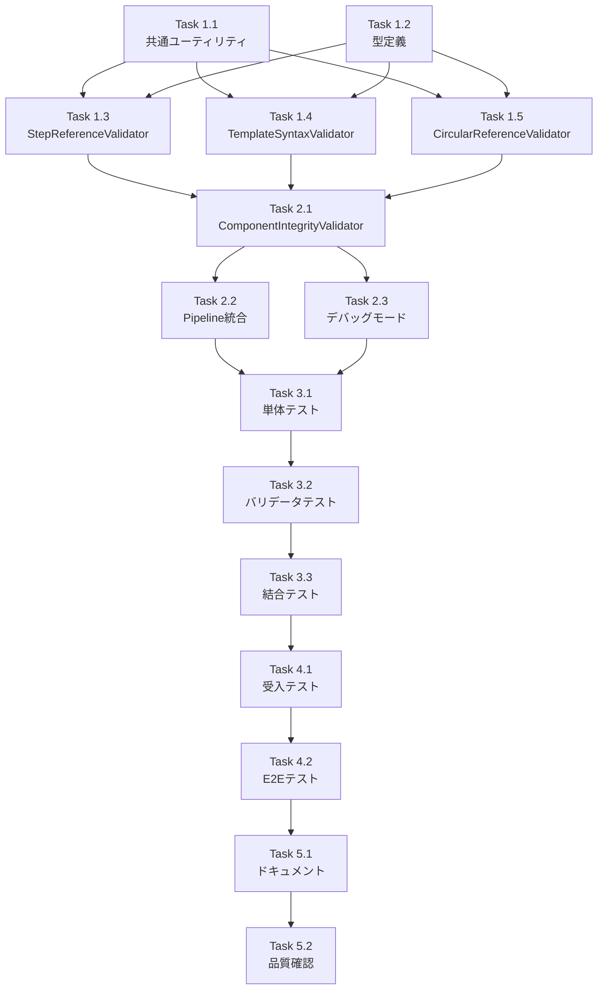

# 作業計画書

**Issue**: #381
**作成日**: 2026-01-20
**作成者**: work-plan スキル

---

## 1. Issue概要

### Issue: feat(taskflowGenerator): 生成ワークフローの事前バリデーション強化

**Issue番号**: #381
**サイズ**: L (大規模実装)
**作業見積**: 16時間
**優先度**: High
**依存Issue**:
- #375 (ワークフロー生成・実行のバリデーション強化) - 完了済み
- #380 (Capability出力スキーマの正確な定義) - 完了済み

**背景**:
- 存在しない出力フィールド名の参照による実行時エラー
- テンプレート構文の不整合
- コンポーネント間の論理的整合性検証不足

---

## 2. 詳細タスク分解

### Phase 1: 基盤実装（8時間）

#### Task 1.1: 共通ユーティリティ実装（2時間）
- [ ] `src/taskflowGeneratorAgent/validator/utils/RegexPatternCache.ts` 作成
  - Singleton/Flyweight Pattern実装
  - 正規表現の事前コンパイル
- [ ] `src/taskflowGeneratorAgent/validator/utils/SuggestionHelper.ts` 作成
  - Levenshtein距離計算
  - 修正提案生成ロジック
- [ ] `src/taskflowGeneratorAgent/validator/utils/index.ts` 作成

#### Task 1.2: 型定義拡張（1時間）
- [ ] `src/taskflowGeneratorAgent/types/validation.ts` 作成
  - ErrorSuggestion, ErrorContext インターフェース
  - SharedValidationCache インターフェース
  - ValidationObserver インターフェース
  - CircularReferenceInfo, PerformanceMetrics 型
- [ ] `src/taskflowGeneratorAgent/types/index.ts` 更新

#### Task 1.3: StepReferenceValidator実装（2時間）
- [ ] `src/taskflowGeneratorAgent/validator/validators/StepReferenceValidator.ts` 作成
  - 共有キャッシュ対応
  - 改善されたエラーメッセージ生成
  - ステップ存在・フィールド存在チェック

#### Task 1.4: TemplateSyntaxValidator実装（1時間）
- [ ] `src/taskflowGeneratorAgent/validator/validators/TemplateSyntaxValidator.ts` 作成
  - {{expression}}, $.steps.xxx パターン検証
  - Transform nodeの特別な検証
  - キャッシュされた正規表現使用

#### Task 1.5: CircularReferenceValidator実装（2時間）
- [ ] `src/taskflowGeneratorAgent/validator/validators/CircularReferenceValidator.ts` 作成
  - DFSアルゴリズムによる循環検出
  - 深さ制限付き探索
  - 詳細な循環パス情報生成

### Phase 2: 統合実装（2時間）

#### Task 2.1: ComponentIntegrityValidator実装（1時間）
- [ ] `src/taskflowGeneratorAgent/validator/ComponentIntegrityValidator.ts` 作成
  - Composite Pattern実装
  - デバッグモード対応
  - パフォーマンスメトリクス収集

#### Task 2.2: ValidationPipeline統合（0.5時間）
- [ ] `src/taskflowGeneratorAgent/validator/ValidationPipeline.ts` 更新
  - ComponentIntegrityValidatorを追加
  - 実行順序の調整

#### Task 2.3: デバッグモード実装（0.5時間）
- [ ] `src/taskflowGeneratorAgent/validator/observers/DebugValidationObserver.ts` 作成
  - ValidationObserver実装
  - ログ収集機能

### Phase 3: テスト実装（3時間）

#### Task 3.1: 単体テスト - ユーティリティ（0.5時間）
- [ ] `tests/unit/taskflowGeneratorAgent/validator/utils/RegexPatternCache.test.ts`
- [ ] `tests/unit/taskflowGeneratorAgent/validator/utils/SuggestionHelper.test.ts`

#### Task 3.2: 単体テスト - バリデータ（2時間）
- [ ] `tests/unit/taskflowGeneratorAgent/validator/validators/StepReferenceValidator.test.ts`
  - 正常系: 有効な参照
  - 異常系: 存在しないステップ/フィールド
  - エラーメッセージの検証
- [ ] `tests/unit/taskflowGeneratorAgent/validator/validators/TemplateSyntaxValidator.test.ts`
- [ ] `tests/unit/taskflowGeneratorAgent/validator/validators/CircularReferenceValidator.test.ts`
  - 循環参照検出ケース
  - 深さ制限テスト

#### Task 3.3: 結合テスト（0.5時間）
- [ ] `tests/integration/taskflowGeneratorAgent/ComponentIntegrityValidator.test.ts`
  - 全バリデータの連携確認
  - パフォーマンステスト（50ステップ）

### Phase 4: L3受入テスト（2時間）

#### Task 4.1: 受入テスト実装（1.5時間）
- [ ] `tests/acceptance/test_issue_381_acceptance.py` 作成
  - サービス起動確認
  - 実際のワークフロー生成API呼び出し
  - エラー検出の確認
  - デバッグモード動作確認

#### Task 4.2: E2Eシナリオテスト（0.5時間）
- [ ] 循環参照を含むワークフローの検証
- [ ] 存在しないフィールド参照の検証
- [ ] テンプレート構文エラーの検証

### Phase 5: ドキュメント・仕上げ（1時間）

#### Task 5.1: ドキュメント更新（0.5時間）
- [ ] `docs/api/validation-pipeline.md` 更新
- [ ] エラーコード一覧の追加
- [ ] デバッグモード使用方法

#### Task 5.2: コード品質確認（0.5時間）
- [ ] ESLint/Prettier実行
- [ ] 型定義の確認
- [ ] カバレッジ90%以上確認

---

## 3. タスク依存関係



---

## 4. 作業スケジュール

### Day 1（8時間）
- 09:00-11:00: Task 1.1 共通ユーティリティ実装
- 11:00-12:00: Task 1.2 型定義拡張
- 13:00-15:00: Task 1.3 StepReferenceValidator実装
- 15:00-16:00: Task 1.4 TemplateSyntaxValidator実装
- 16:00-18:00: Task 1.5 CircularReferenceValidator実装

### Day 2（8時間）
- 09:00-10:00: Task 2.1 ComponentIntegrityValidator実装
- 10:00-11:00: Task 2.2-2.3 統合・デバッグモード
- 11:00-12:00: Task 3.1 ユーティリティテスト
- 13:00-15:00: Task 3.2 バリデータテスト
- 15:00-15:30: Task 3.3 結合テスト
- 15:30-17:00: Task 4.1 受入テスト実装
- 17:00-17:30: Task 4.2 E2Eテスト
- 17:30-18:00: Task 5.1-5.2 ドキュメント・品質確認

---

## 5. チェックポイント

| タイミング | 確認事項 | 対応 |
|-----------|---------|------|
| Task 1完了時 | 基盤コンポーネント動作確認 | 単体テストで検証 |
| Task 2完了時 | 統合動作確認 | デバッグモードで動作確認 |
| Task 3完了時 | テストカバレッジ90%以上 | カバレッジレポート確認 |
| Task 4完了時 | 実環境での動作確認 | 受入テスト全項目パス |
| Phase完了時 | 品質基準達成確認 | ESLint/型チェック実行 |

---

## 6. リスクと対策

| リスク | 発生確率 | 影響 | 対策 |
|-------|---------|------|------|
| 既存バリデータとの競合 | 中 | 高 | 明確な責務分離、重複チェックの徹底排除 |
| パフォーマンス目標未達成 | 中 | 中 | 早期プロファイリング、キャッシュ最適化 |
| 循環参照検出の誤検知 | 低 | 中 | 深さ制限の適切な調整、詳細なテスト |
| 正規表現のバグ | 低 | 高 | 徹底的な単体テスト、エッジケース検証 |

---

## 7. 成果物チェックリスト

### コード
- [ ] `src/taskflowGeneratorAgent/validator/utils/RegexPatternCache.ts`
- [ ] `src/taskflowGeneratorAgent/validator/utils/SuggestionHelper.ts`
- [ ] `src/taskflowGeneratorAgent/validator/utils/index.ts`
- [ ] `src/taskflowGeneratorAgent/types/validation.ts`
- [ ] `src/taskflowGeneratorAgent/validator/validators/StepReferenceValidator.ts`
- [ ] `src/taskflowGeneratorAgent/validator/validators/TemplateSyntaxValidator.ts`
- [ ] `src/taskflowGeneratorAgent/validator/validators/CircularReferenceValidator.ts`
- [ ] `src/taskflowGeneratorAgent/validator/ComponentIntegrityValidator.ts`
- [ ] `src/taskflowGeneratorAgent/validator/observers/DebugValidationObserver.ts`

### テスト
- [ ] 単体テスト: 9ファイル（カバレッジ90%以上）
- [ ] 結合テスト: 1ファイル
- [ ] 受入テスト: 1ファイル

### ドキュメント
- [ ] API仕様書更新
- [ ] エラーコード一覧
- [ ] デバッグモード使用ガイド

---

## 8. L3受入テスト計画【必須セクション】

### 環境準備

```bash
# mySwiftAgentCore起動
cd mySwiftAgentCore
npm run dev

# サービス起動確認
curl -sf http://localhost:8006/health && echo "✅ mySwiftAgentCore healthy"
```

### 正常系テスト

```bash
# 1. 有効なワークフロー生成（エラーなし）
curl -s -X POST http://localhost:8006/api/v1/taskflow/generate \
  -H "Content-Type: application/json" \
  -d '{
    "tasks": [{
      "task_id": "test_001",
      "name": "Valid workflow test",
      "description": "Test valid workflow generation",
      "interface": {
        "input": {"query": "string"},
        "output": {"result": "string"}
      }
    }],
    "capabilities": [...],
    "project_id": "test_project",
    "options": {
      "enableComponentIntegrityValidation": true
    }
  }' | jq '.validation_result'
# Expected: { "isValid": true, "errors": [] }
```

### 異常系テスト - 循環参照検出

```bash
# 2. 循環参照を含むワークフローの検証
curl -s -X POST http://localhost:8006/api/v1/taskflow/validate \
  -H "Content-Type: application/json" \
  -d '{
    "workflow": {
      "workflow_name": "circular_test",
      "steps": [
        {
          "id": "step_a",
          "type": "transform",
          "config": {
            "template": "{{$steps.step_b.output}}"
          }
        },
        {
          "id": "step_b",
          "type": "transform",
          "config": {
            "template": "{{$steps.step_a.output}}"
          }
        }
      ]
    }
  }' | jq '.errors[] | select(.errorCode == "CIRCULAR_REFERENCE_DETECTED")'
# Expected: 循環参照エラーが検出される
```

### 異常系テスト - フィールド参照エラー

```bash
# 3. 存在しないフィールド参照の検証
curl -s -X POST http://localhost:8006/api/v1/taskflow/validate \
  -H "Content-Type: application/json" \
  -d '{
    "workflow": {
      "workflow_name": "field_error_test",
      "steps": [
        {
          "id": "step_001",
          "type": "api_call",
          "config": {
            "capability_id": "google_search",
            "params": {
              "query": "test"
            }
          }
        },
        {
          "id": "step_002",
          "type": "transform",
          "config": {
            "template": "Result: {{$steps.step_001.nonexistent_field}}"
          }
        }
      ]
    },
    "capabilities": [...]
  }' | jq '.errors[] | select(.errorCode == "OUTPUT_FIELD_NOT_FOUND")'
# Expected: フィールドエラーが検出され、修正提案が含まれる
```

### デバッグモード確認

```bash
# 4. デバッグモードでのバリデーション実行
curl -s -X POST http://localhost:8006/api/v1/taskflow/validate \
  -H "Content-Type: application/json" \
  -d '{
    "workflow": {...},
    "options": {
      "debugMode": true,
      "collectPerformanceMetrics": true
    }
  }' | jq '.performanceMetrics'
# Expected: バリデーション実行時間、各バリデータのメトリクスが返される
```

### パフォーマンステスト

```bash
# 5. 50ステップのワークフローでパフォーマンス確認
time curl -s -X POST http://localhost:8006/api/v1/taskflow/validate \
  -H "Content-Type: application/json" \
  -d @test-data/large-workflow-50-steps.json | jq '.performanceMetrics.totalDurationMs'
# Expected: < 150ms
```

---

## 9. Definition of Done

Issue #381完了条件：

- [x] 設計方針書作成・レビュー完了（アーキテクチャレビュー改善反映済み）
- [ ] すべての実装タスクが完了
- [ ] 単体テストカバレッジ90%以上達成
- [ ] 結合テストで全バリデータの連携確認
- [ ] L3受入テスト全項目パス
  - [ ] 循環参照検出動作確認
  - [ ] エラーメッセージ改善確認
  - [ ] パフォーマンス目標達成（50ステップ < 150ms）
  - [ ] デバッグモード動作確認
- [ ] CI/CDパイプライングリーン
- [ ] コードレビュー承認
- [ ] ドキュメント更新完了

---

**備考**:
- アーキテクチャレビューの改善項目（循環参照検出、エラーメッセージ改善、パフォーマンス最適化、デバッグモード）はすべて作業計画に含まれています
- 実装順序は依存関係を考慮し、基盤→統合→テストの順で進めます
- L3受入テストは実際のAPIを使用したE2Eテストを重視します