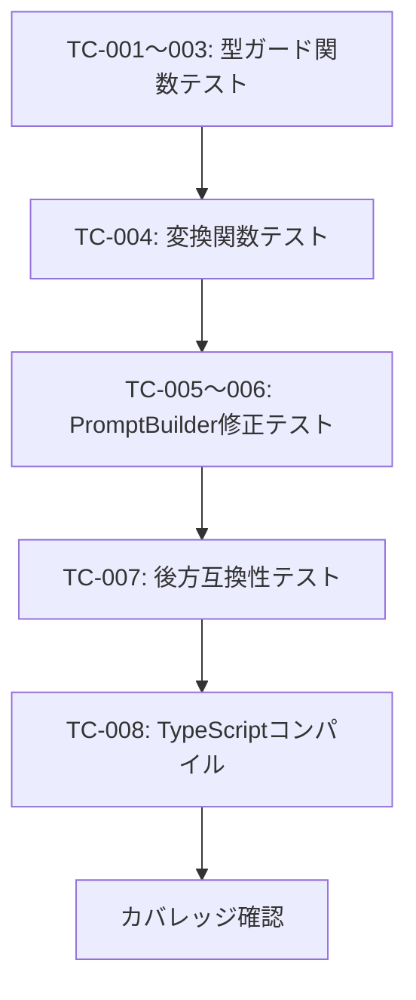

# 受入テスト計画書 - Issue #382

**Issue**: #382 feat(taskflowGenerator): AIプロンプトへのCapability情報の自動注入
**作成日**: 2026-01-20
**ステータス**: 計画中

---

## 1. 概要

### 1.1 目的
PromptBuilder の buildSystemPromptWithCapabilities() メソッドを修正し、初回プロンプトで formatCapabilitiesEnhanced() を使用することで、AIがCapabilityの詳細情報（validation制約、responseSchema）を参照できるようにする。

### 1.2 スコープ
- Phase 1（必須）: 型ガード関数の追加、PromptBuilder修正、テスト追加
- Phase 2, 3（推奨/オプション）: 本Issueのスコープ外

---

## 2. 受入条件分析

| AC | 受入条件 | 検証方法 | 優先度 |
|----|---------|---------|--------|
| AC-1 | 初回プロンプトにvalidation制約が含まれる | 単体テストで生成されたプロンプト内容を検証 | 🔴 必須 |
| AC-2 | 初回プロンプトにresponseSchemaが含まれる | 単体テストで生成されたプロンプト内容を検証 | 🔴 必須 |
| AC-3 | buildSystemPromptWithCapabilities()がformatCapabilitiesEnhanced()を使用 | 単体テスト、実装確認 | 🔴 必須 |
| AC-4 | 型安全な変換（toCapabilitiesForPrompt）の実装 | 単体テスト、TypeScript型チェック | 🔴 必須 |
| AC-5 | 後方互換性の維持 | 既存テストの全パス確認 | 🔴 必須 |
| AC-6 | 単体テストカバレッジ90%以上 | Vitest coverageレポート | 🔴 必須 |
| AC-7 | TypeScriptコンパイルエラーゼロ | `npx tsc --noEmit` | 🔴 必須 |

---

## 3. 設計方針検証項目

| DP | 設計方針 | 検証方法 | 優先度 |
|----|---------|---------|--------|
| DP-1 | 型キャスト（as）を避け、型ガード関数を使用 | isCapabilityForPromptの実装確認 | 🔴 必須 |
| DP-2 | 既存実装（formatCapabilitiesEnhanced）の再利用 | buildSystemPromptWithCapabilitiesの呼び出し確認 | 🔴 必須 |
| DP-3 | 既存APIを変更しない（後方互換性） | 既存テストの全パス | 🔴 必須 |
| DP-4 | 拡張フィールドがない場合も安全に動作 | 基本Capabilityでのテスト | 🔴 必須 |

---

## 4. デッドコード検証計画

### 4.1 新規実装機能

| F | 機能名 | ファイル | 期待される呼び出し元 |
|---|--------|---------|-------------------|
| F-1 | isCapabilityForPrompt() | PromptBuilder.ts | toCapabilitiesForPrompt() |
| F-2 | toCapabilitiesForPrompt() | PromptBuilder.ts | buildSystemPromptWithCapabilities() |

### 4.2 検証方法

```bash
# F-1: isCapabilityForPromptの呼び出し確認
grep -rn "isCapabilityForPrompt" mySwiftAgentCore/src/

# F-2: toCapabilitiesForPromptの呼び出し確認
grep -rn "toCapabilitiesForPrompt" mySwiftAgentCore/src/
```

---

## 5. テスト環境・方法

### 5.1 テスト環境

| 項目 | 値 |
|------|-----|
| プロジェクト | mySwiftAgentCore |
| テストフレームワーク | Vitest |
| 言語 | TypeScript |
| Node.js | >= 20 |

### 5.2 テスト実行コマンド

```bash
# 単体テスト
cd mySwiftAgentCore
npm test

# 特定テストのみ
npm test -- PromptBuilder

# カバレッジ付き
npm test -- --coverage
```

---

## 6. テスト項目

### TC-001: isCapabilityForPrompt - responseSchemaがある場合

| 項目 | 内容 |
|------|------|
| **テスト種別** | 単体テスト |
| **対象** | isCapabilityForPrompt() |
| **前提条件** | responseSchemaを持つCapabilityForPrompt |
| **手順** | 関数を呼び出し、戻り値を確認 |
| **期待結果** | true を返す |

### TC-002: isCapabilityForPrompt - validationがある場合

| 項目 | 内容 |
|------|------|
| **テスト種別** | 単体テスト |
| **対象** | isCapabilityForPrompt() |
| **前提条件** | parameters[0].validationを持つCapabilityForPrompt |
| **手順** | 関数を呼び出し、戻り値を確認 |
| **期待結果** | true を返す |

### TC-003: isCapabilityForPrompt - 基本Capability

| 項目 | 内容 |
|------|------|
| **テスト種別** | 単体テスト |
| **対象** | isCapabilityForPrompt() |
| **前提条件** | 拡張フィールドがないCapability |
| **手順** | 関数を呼び出し、戻り値を確認 |
| **期待結果** | false を返す |

### TC-004: toCapabilitiesForPrompt - 混合配列

| 項目 | 内容 |
|------|------|
| **テスト種別** | 単体テスト |
| **対象** | toCapabilitiesForPrompt() |
| **前提条件** | 基本Capabilityと拡張Capabilityの混合配列 |
| **手順** | 関数を呼び出し、結果配列を確認 |
| **期待結果** | 全てCapabilityForPrompt[]として使用可能、拡張フィールドは保持 |

### TC-005: buildSystemPromptWithCapabilities - 詳細情報含有

| 項目 | 内容 |
|------|------|
| **テスト種別** | 単体テスト |
| **対象** | buildSystemPromptWithCapabilities() |
| **前提条件** | validation制約とresponseSchemaを持つCapability |
| **手順** | メソッドを呼び出し、生成されたプロンプトを確認 |
| **期待結果** | validation情報（min/max等）がプロンプトに含まれる |

### TC-006: buildSystemPromptWithCapabilities - responseSchema含有

| 項目 | 内容 |
|------|------|
| **テスト種別** | 単体テスト |
| **対象** | buildSystemPromptWithCapabilities() |
| **前提条件** | responseSchemaを持つCapability |
| **手順** | メソッドを呼び出し、生成されたプロンプトを確認 |
| **期待結果** | "Response Schema" セクションがプロンプトに含まれる |

### TC-007: 後方互換性 - 既存テスト全パス

| 項目 | 内容 |
|------|------|
| **テスト種別** | 結合テスト |
| **対象** | PromptBuilder全体 |
| **前提条件** | 既存のPromptBuilder.test.tsが存在 |
| **手順** | npm test を実行 |
| **期待結果** | 既存の全テストがパス |

### TC-008: TypeScriptコンパイル

| 項目 | 内容 |
|------|------|
| **テスト種別** | 静的解析 |
| **対象** | 全TypeScriptファイル |
| **前提条件** | tsconfig.json設定済み |
| **手順** | `npx tsc --noEmit` を実行 |
| **期待結果** | エラー0件 |

---

## 7. テスト実行計画

### 7.1 実行順序



### 7.2 合格基準

| 基準 | 閾値 |
|------|------|
| テスト成功率 | 100% (8/8) |
| カバレッジ | 90%以上 |
| TypeScriptエラー | 0件 |
| 新規デッドコード | 0件 |

---

## 8. 承認

- **計画作成者**: Claude (PM Auto-Dev)
- **計画作成日**: 2026-01-20
- **承認ステータス**: レビュー待ち
