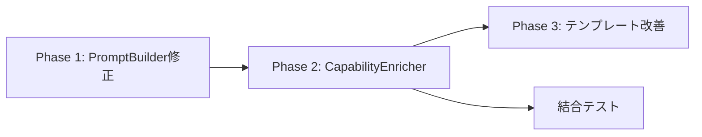

# 設計方針書 - Issue #382

**Issue**: #382 feat(taskflowGenerator): AIプロンプトへのCapability情報の自動注入
**作成日**: 2026-01-20
**作成者**: Claude (PM Design Policy スキル)

---

## 1. 要件分析

### 1.1 解決すべき問題

AIがTaskFlowを生成する際、利用可能なCapabilityの詳細情報がプロンプトに含まれていないため：
- AIが適切なCapabilityを選択できない
- 誤ったパラメータでCapabilityを使用する
- 存在しないCapabilityを想定する

### 1.2 機能要件

1. **Capability情報の自動注入**
   - WorkflowGenerator実行時に利用可能なCapabilityをプロンプトに注入
   - カテゴリ別に整理された形式で提示

2. **Capability詳細の提供**
   - capability_id、name、description
   - パラメータ仕様（名前、型、必須/オプション、説明）
   - レスポンススキーマ（出力フィールド情報）

3. **インテリジェントな選択**
   - タスクに関連するCapabilityを優先的に表示
   - プロンプトサイズの最適化

### 1.3 非機能要件

- **パフォーマンス**: Capability情報追加によるレスポンス遅延を最小限に
- **保守性**: Capability追加時に自動的にプロンプトに反映
- **拡張性**: 将来的なメタデータ拡張に対応可能

---

## 2. 既存実装の分析

### 2.1 Issue #374の実装内容

すでにIssue #374で以下が実装済み：

1. **PromptBuilder.formatCapabilitiesEnhanced()**
   - パラメータのvalidation制約（min/max/enum/pattern）を含む
   - デフォルト値の表示
   - レスポンススキーマの詳細表示

2. **PromptBuilder.selectRelevantCapabilities()**
   - タスク記述からのキーワード抽出
   - 関連性スコアリングによる優先順位付け
   - MAX_CAPABILITIES_PER_PROMPT（50個）制限

3. **buildFeedbackPrompt()**
   - バリデーションエラー時の再試行プロンプト
   - 問題のあるCapabilityの詳細情報を優先表示

### 2.2 現在の課題

1. **初回プロンプトでの情報不足**
   - `buildPrompt()`では基本的な`formatCapabilities()`のみ使用
   - validation制約やレスポンススキーマが含まれない

2. **Capability情報の不完全性**
   - `CapabilityForPrompt`型は定義されているが、実際のデータが不完全
   - responseSchemaやmetadataが適切に設定されていない

---

## 3. 設計方針

### 3.1 基本方針

1. **既存実装の最大活用**
   - Issue #374の`formatCapabilitiesEnhanced()`を初回プロンプトでも使用
   - `selectRelevantCapabilities()`のインテリジェント選択を活用

2. **段階的な改善**
   - Phase 1: 既存メソッドの適用範囲拡大
   - Phase 2: Capability情報の充実化
   - Phase 3: 動的なメタデータ注入

3. **後方互換性の維持**
   - 既存のPromptBuilder APIを変更しない
   - CapabilityForPrompt型の拡張は追加のみ

### 3.2 実装アプローチ

```
┌─────────────────────┐
│  WorkflowGenerator  │
└──────────┬──────────┘
           │ buildPrompt(task, capabilities)
           ▼
┌─────────────────────┐     ┌──────────────────────┐
│   PromptBuilder     │────▶│ CapabilityEnricher   │
├─────────────────────┤     │ (新規コンポーネント)  │
│ buildPrompt()       │     └──────────────────────┘
│ ├─selectRelevant()  │              │
│ └─formatEnhanced()  │              │ enrich()
└─────────────────────┘              ▼
           │                ┌──────────────────────┐
           │                │ CapabilityRegistry   │
           ▼                └──────────────────────┘
┌─────────────────────┐
│  System Prompt +    │
│  Enhanced Caps Info │
└─────────────────────┘
```

---

## 4. 詳細設計

### 4.1 Phase 1: 既存メソッドの適用（必須・優先度高）

#### 4.1.1 型ガード関数の追加

**目的**: 型キャスト（`as`）を避け、実行時の型安全性を確保

**追加場所**: `src/taskflowGeneratorAgent/prompts/PromptBuilder.ts`

```typescript
/**
 * Type guard to check if a Capability has enhanced prompt information
 *
 * Issue #382: Ensures type safety when using formatCapabilitiesEnhanced
 *
 * @param cap - Capability to check
 * @returns true if the capability has enhanced fields
 */
function isCapabilityForPrompt(cap: Capability): cap is CapabilityForPrompt {
  // Check for responseSchema (enhanced capability field)
  if ('responseSchema' in cap && cap.responseSchema !== undefined) {
    return true;
  }

  // Check for validation in parameters (enhanced parameter field)
  if (cap.parameters && cap.parameters.length > 0) {
    const firstParam = cap.parameters[0] as Record<string, unknown>;
    if ('validation' in firstParam) {
      return true;
    }
  }

  return false;
}

/**
 * Convert Capability array to CapabilityForPrompt array
 *
 * Non-enhanced capabilities are safely converted with undefined enhanced fields
 *
 * @param capabilities - Array of capabilities
 * @returns Array of CapabilityForPrompt
 */
function toCapabilitiesForPrompt(capabilities: Capability[]): CapabilityForPrompt[] {
  return capabilities.map(cap => {
    if (isCapabilityForPrompt(cap)) {
      return cap;
    }
    // Safe conversion: enhanced fields will be undefined
    return cap as CapabilityForPrompt;
  });
}
```

#### 4.1.2 buildSystemPromptWithCapabilities の修正

**変更対象**: `PromptBuilder.buildSystemPromptWithCapabilities()`

```typescript
private buildSystemPromptWithCapabilities(capabilities: Capability[]): string {
  const availableCapabilities = capabilities.filter(c => c.status === 'available');

  if (availableCapabilities.length === 0) {
    return DEFAULT_SYSTEM_PROMPT;
  }

  // Issue #382: Use type-safe conversion instead of unsafe cast
  const enhancedCapabilities = toCapabilitiesForPrompt(availableCapabilities);
  const capabilitiesSection = this.formatCapabilitiesEnhanced(enhancedCapabilities);

  return buildSystemPromptTemplate(capabilitiesSection);
}
```

#### 4.1.3 テスト追加

**追加場所**: `tests/unit/taskflowGeneratorAgent/prompts/PromptBuilder.test.ts`

```typescript
describe('Type Guards (Issue #382)', () => {
  describe('isCapabilityForPrompt', () => {
    it('should return true when capability has responseSchema', () => {
      const cap: CapabilityForPrompt = {
        id: 'test',
        name: 'Test',
        category: 'test',
        status: 'available',
        responseSchema: { type: 'object', properties: {} },
      };
      expect(isCapabilityForPrompt(cap)).toBe(true);
    });

    it('should return true when parameter has validation', () => {
      const cap: CapabilityForPrompt = {
        id: 'test',
        name: 'Test',
        category: 'test',
        status: 'available',
        parameters: [{
          name: 'param1',
          type: 'string',
          required: true,
          validation: { pattern: '^[a-z]+$' },
        }],
      };
      expect(isCapabilityForPrompt(cap)).toBe(true);
    });

    it('should return false for basic Capability without enhanced fields', () => {
      const cap: Capability = {
        id: 'test',
        name: 'Test',
        category: 'test',
        status: 'available',
      };
      expect(isCapabilityForPrompt(cap)).toBe(false);
    });
  });

  describe('toCapabilitiesForPrompt', () => {
    it('should convert mixed array safely', () => {
      const capabilities: Capability[] = [
        { id: 'basic', name: 'Basic', category: 'test', status: 'available' },
        {
          id: 'enhanced',
          name: 'Enhanced',
          category: 'test',
          status: 'available',
          responseSchema: { type: 'object' },
        } as CapabilityForPrompt,
      ];

      const result = toCapabilitiesForPrompt(capabilities);
      expect(result).toHaveLength(2);
      // Both should be usable as CapabilityForPrompt
      expect(result[0].id).toBe('basic');
      expect(result[1].responseSchema).toBeDefined();
    });
  });
});
```

### 4.2 Phase 2: CapabilityEnricher（新規コンポーネント）

**目的**: Capabilityに不足している情報を補完

```typescript
// src/taskflowGeneratorAgent/enricher/CapabilityEnricher.ts
export class CapabilityEnricher {
  constructor(
    private readonly registry: CapabilityRegistry,
    private readonly schemaLoader: SchemaLoader // 新規: スキーマ定義をロード
  ) {}

  async enrichCapabilities(
    capabilities: Capability[],
    projectId: string
  ): Promise<CapabilityForPrompt[]> {
    const enriched: CapabilityForPrompt[] = [];

    for (const cap of capabilities) {
      const enhanced = await this.enrichSingle(cap, projectId);
      enriched.push(enhanced);
    }

    return enriched;
  }

  private async enrichSingle(
    cap: Capability,
    projectId: string
  ): Promise<CapabilityForPrompt> {
    // 1. 基本情報のコピー
    const enhanced: CapabilityForPrompt = { ...cap };

    // 2. レスポンススキーマの取得
    if (!enhanced.responseSchema && cap.id) {
      enhanced.responseSchema = await this.schemaLoader.loadResponseSchema(
        projectId,
        cap.id
      );
    }

    // 3. パラメータのvalidation情報補完
    if (enhanced.parameters) {
      enhanced.parameters = await this.enrichParameters(
        enhanced.parameters,
        cap.id,
        projectId
      );
    }

    // 4. メタデータの追加
    enhanced.metadata = {
      ...enhanced.metadata,
      enrichedAt: new Date().toISOString(),
      projectId,
    };

    return enhanced;
  }
}
```

### 4.3 Phase 3: プロンプトテンプレートの改善

**system.ts の拡張**:

```typescript
export function buildSystemPromptTemplate(
  capabilitiesSection: string,
  options?: {
    includeExamples?: boolean;
    emphasizeValidation?: boolean;
  }
): string {
  const sections = [TASKFLOW_RULES];

  if (capabilitiesSection) {
    sections.push('## Available Capabilities');
    sections.push(capabilitiesSection);

    if (options?.includeExamples) {
      sections.push(CAPABILITY_USAGE_EXAMPLES);
    }

    if (options?.emphasizeValidation) {
      sections.push(VALIDATION_EMPHASIS);
    }
  }

  sections.push(DEFAULT_SYSTEM_PROMPT);
  return sections.join('\n\n');
}
```

---

## 5. 実装計画

### 5.1 タスク分解

| フェーズ | タスク | 工数 | 優先度 |
|---------|--------|------|---------|
| **Phase 1** | PromptBuilder修正 | 2h | 🔴 必須 |
| | formatCapabilitiesEnhancedを初回プロンプトで使用 | | |
| | 単体テスト更新 | 1h | 🔴 必須 |
| **Phase 2** | CapabilityEnricher実装 | 4h | 🟡 推奨 |
| | SchemaLoader実装 | 3h | 🟡 推奨 |
| | WorkflowGeneratorへの統合 | 2h | 🟡 推奨 |
| **Phase 3** | プロンプトテンプレート改善 | 2h | 🟢 オプション |
| | 使用例の追加 | 1h | 🟢 オプション |

### 5.2 依存関係



---

## 6. テスト計画

### 6.1 単体テスト

1. **PromptBuilder.test.ts の更新**
   - `buildSystemPromptWithCapabilities`がenhanced形式を使用することを確認
   - validation制約が含まれることを確認

2. **CapabilityEnricher.test.ts（新規）**
   - スキーマ情報の補完
   - メタデータの追加
   - エラーハンドリング

### 6.2 結合テスト

1. **WorkflowGenerator統合テスト**
   - エンリッチされたCapability情報でのワークフロー生成
   - プロンプトサイズの検証

### 6.3 受入テスト

1. **実際のAI応答確認**
   - Capability情報が適切に利用されているか
   - パラメータエラーが減少したか

---

## 7. リスクと対策

| リスク | 影響 | 対策 |
|--------|------|------|
| プロンプトサイズ増大 | トークン制限超過 | selectRelevantCapabilities()の活用 |
| レスポンス遅延 | UX悪化 | Capability情報のキャッシング |
| 既存動作への影響 | 互換性問題 | 段階的リリース、フィーチャーフラグ |

---

## 8. 成功基準

1. **定量的指標**
   - Capability関連のバリデーションエラー50%減少
   - ワークフロー生成の初回成功率20%向上

2. **定性的指標**
   - AIが適切なCapabilityを選択できる
   - パラメータの型や必須項目のミスが減少

---

## 9. 今後の拡張性

1. **動的Capability発見**
   - 実行時に利用可能なCapabilityを動的に取得

2. **使用統計の活用**
   - よく使われるCapabilityの優先表示

3. **コンテキスト依存の情報注入**
   - タスクの種類に応じた情報の深さ調整

---

## 10. 決定事項

1. **Phase 1を優先実装**
   - 既存の`formatCapabilitiesEnhanced()`を活用
   - 最小限の変更で効果を検証

2. **後方互換性の維持**
   - 既存APIは変更しない
   - 追加のみで対応

3. **段階的なリリース**
   - Phase 1で効果測定
   - 必要に応じてPhase 2, 3を実装

---

**承認者**: 実装前にレビューをお願いします