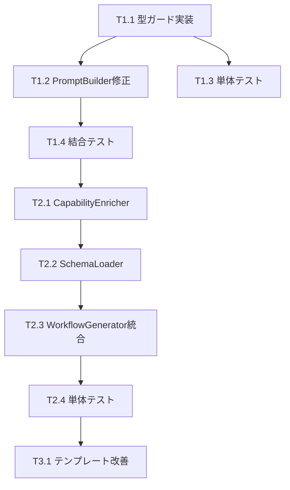

# 作業計画書 - Issue #382

**Issue**: #382 feat(taskflowGenerator): AIプロンプトへのCapability情報の自動注入
**Issue番号**: #382
**サイズ**: M (Medium)
**作業見積**: 8時間（Phase 1必須: 3時間、Phase 2推奨: 5時間）
**優先度**: High
**依存Issue**: #374（完了済み - formatCapabilitiesEnhanced実装済み）

---

## 1. Issue概要の確認

### 目的
WorkflowGenerator実行時にAIプロンプトに自動的にCapability詳細情報を注入し、AIが適切なCapabilityを選択・使用できるようにする。

### 背景
- 現在、初回プロンプトには基本的なCapability情報のみ含まれる
- Issue #374で実装済みの`formatCapabilitiesEnhanced()`が再試行時のみ使用されている
- この既存実装を初回プロンプトでも活用することで、即座に効果が期待できる

---

## 2. 詳細タスク分解

### Phase 1: 必須実装（優先度: 🔴高）

#### T1.1: 型ガード関数実装 [1時間]
**ファイル**: `mySwiftAgentCore/src/taskflowGeneratorAgent/prompts/PromptBuilder.ts`

- [ ] `isCapabilityForPrompt()` 型ガード関数の実装
  - responseSchemaの存在チェック
  - validationフィールドの存在チェック
- [ ] `toCapabilitiesForPrompt()` 変換関数の実装
  - 安全な型変換処理
  - 拡張フィールドが無い場合の処理

#### T1.2: PromptBuilder修正 [0.5時間]
**ファイル**: `mySwiftAgentCore/src/taskflowGeneratorAgent/prompts/PromptBuilder.ts`

- [ ] `buildSystemPromptWithCapabilities()` メソッドの修正
  - 危険な型キャスト `as CapabilityForPrompt[]` を削除
  - `toCapabilitiesForPrompt()` を使用した安全な変換に置き換え
  - `formatCapabilitiesEnhanced()` の呼び出し確認

#### T1.3: 単体テスト追加 [1時間]
**ファイル**: `mySwiftAgentCore/tests/unit/taskflowGeneratorAgent/prompts/PromptBuilder.test.ts`

- [ ] 型ガード関数のテスト
  - responseSchemaがある場合
  - validationがある場合
  - 基本的なCapabilityの場合
- [ ] 変換関数のテスト
  - 混合配列の安全な変換
  - 拡張フィールドの保持確認

#### T1.4: 結合テスト更新 [0.5時間]
**ファイル**: `mySwiftAgentCore/tests/integration/workflow-generation.test.ts`

- [ ] 初回プロンプトでのCapability詳細情報確認
  - validation制約が含まれることを検証
  - responseSchemaが含まれることを検証

### Phase 2: 推奨実装（優先度: 🟡中）

#### T2.1: CapabilityEnricher設計・実装 [2時間]
**新規ファイル**: `mySwiftAgentCore/src/taskflowGeneratorAgent/enricher/CapabilityEnricher.ts`

- [ ] クラス設計
  - CapabilityRegistry依存性注入
  - SchemaLoader依存性注入
- [ ] `enrichCapabilities()` メソッド実装
  - バッチ処理による効率化
- [ ] `enrichSingle()` プライベートメソッド実装
  - responseSchema取得ロジック
  - validation情報補完ロジック

#### T2.2: SchemaLoader実装 [1.5時間]
**新規ファイル**: `mySwiftAgentCore/src/taskflowGeneratorAgent/enricher/SchemaLoader.ts`

- [ ] インターフェース定義
- [ ] ファイルシステムからのスキーマ読み込み
- [ ] キャッシング機構
- [ ] エラーハンドリング

#### T2.3: WorkflowGenerator統合 [1時間]
**ファイル**: `mySwiftAgentCore/src/taskflowGeneratorAgent/generator/WorkflowGenerator.ts`

- [ ] CapabilityEnricherの依存性注入
- [ ] `generateWorkflow()` での呼び出し追加
- [ ] エラーハンドリング強化

#### T2.4: 単体テスト追加 [0.5時間]
- [ ] CapabilityEnricher単体テスト
- [ ] SchemaLoader単体テスト

### Phase 3: オプション実装（優先度: 🟢低）

#### T3.1: プロンプトテンプレート改善 [2時間]
- [ ] 使用例の追加
- [ ] バリデーション強調オプション

---

## 3. タスク依存関係



---

## 4. 作業スケジュール

### Day 1 (3時間) - Phase 1 必須実装
- **AM**: T1.1 型ガード関数実装（1時間）
- **AM**: T1.2 PromptBuilder修正（0.5時間）
- **PM**: T1.3 単体テスト追加（1時間）
- **PM**: T1.4 結合テスト更新（0.5時間）

### Day 2 (5時間) - Phase 2 推奨実装（効果測定後）
- **AM**: T2.1 CapabilityEnricher実装（2時間）
- **PM**: T2.2 SchemaLoader実装（1.5時間）
- **PM**: T2.3 WorkflowGenerator統合（1時間）
- **PM**: T2.4 単体テスト（0.5時間）

---

## 5. チェックポイント

| タイミング | 確認事項 | 対応 |
|-----------|---------|------|
| T1.2完了時 | 型安全性の確認 | TypeScriptコンパイルエラーなし |
| T1.4完了時 | 初回プロンプト改善確認 | 実際のプロンプト内容検証 |
| Phase 1完了時 | 効果測定 | Capability選択精度の向上確認 |
| T2.3完了時 | パフォーマンス確認 | レスポンスタイム計測 |

---

## 6. リスクと対策

| リスク | 発生確率 | 影響 | 対策 |
|-------|---------|------|------|
| プロンプトサイズ増大 | 中 | 高 | selectRelevantCapabilities()で50個制限済み |
| 型変換エラー | 低 | 中 | 型ガード関数で実行時チェック |
| Phase 2でのレスポンス遅延 | 中 | 中 | SchemaLoaderにキャッシング実装 |
| 既存動作への影響 | 低 | 高 | 既存APIを変更せず、内部実装のみ修正 |

---

## 7. 成果物チェックリスト

### コード
- [ ] `src/taskflowGeneratorAgent/prompts/PromptBuilder.ts` (修正)
- [ ] `src/taskflowGeneratorAgent/enricher/CapabilityEnricher.ts` (新規・Phase 2)
- [ ] `src/taskflowGeneratorAgent/enricher/SchemaLoader.ts` (新規・Phase 2)
- [ ] `src/taskflowGeneratorAgent/generator/WorkflowGenerator.ts` (修正・Phase 2)

### テスト
- [ ] `tests/unit/taskflowGeneratorAgent/prompts/PromptBuilder.test.ts` (修正)
- [ ] `tests/integration/workflow-generation.test.ts` (修正)
- [ ] `tests/unit/taskflowGeneratorAgent/enricher/CapabilityEnricher.test.ts` (新規・Phase 2)
- [ ] `tests/unit/taskflowGeneratorAgent/enricher/SchemaLoader.test.ts` (新規・Phase 2)

### ドキュメント
- [ ] 設計方針書（作成済み）
- [ ] 本作業計画書

---

## 8. L3受入テスト計画【必須セクション】

### 環境準備
```bash
# mySwiftAgentCoreサービス起動
cd mySwiftAgentCore
npm run dev

# ログ監視（別ターミナル）
tail -f logs/mySwiftAgentCore.log | grep -E "(PromptBuilder|Capability|enhance)"
```

### 受入テストケース

#### TC1: 初回プロンプトでのCapability詳細情報確認
```bash
# 1. ワークフロー生成リクエスト（デバッグモード）
curl -X POST http://localhost:8006/api/v1/taskflow/generate \
  -H "Content-Type: application/json" \
  -H "X-Debug: true" \
  -d '{
    "task_id": "test_382_001",
    "name": "Capability情報注入テスト",
    "description": "Google検索を使用してニュースを取得する",
    "interface": {
      "input": {"query": "string"},
      "output": {"results": "array"}
    }
  }' > test_382_response.json

# 2. プロンプト内容確認（デバッグ出力から）
grep -A 20 "### Search Capabilities" logs/mySwiftAgentCore.log | tail -30

# 期待値: validation制約とresponseSchemaが含まれること
# - Parameters に validation情報（min, max, pattern等）
# - Response Schema セクションが存在
```

#### TC2: Capability選択精度の確認
```bash
# 3. 生成されたワークフローの検証
jq '.workflow.nodes[] | select(.capability_id == "google_search") | .parameters' test_382_response.json

# 期待値:
# - 適切なCapability（google_search）が選択されている
# - パラメータが正しく設定されている
```

#### TC3: バリデーションエラー減少の確認（Phase 1効果測定）
```bash
# 4. わざと誤ったパラメータでテスト
curl -X POST http://localhost:8006/api/v1/taskflow/generate \
  -H "Content-Type: application/json" \
  -d '{
    "task_id": "test_382_002",
    "name": "数値制限テスト",
    "description": "検索結果を100件取得する",
    "interface": {
      "input": {"query": "string", "limit": "number"},
      "output": {"results": "array"}
    }
  }' | jq '.validation_errors'

# 期待値:
# - max制限（例: 50）を超える場合、初回でエラーを回避
# - または適切な警告メッセージ
```

#### TC4: パフォーマンステスト
```bash
# 5. レスポンスタイム測定
time curl -X POST http://localhost:8006/api/v1/taskflow/generate \
  -H "Content-Type: application/json" \
  -d '{
    "task_id": "test_382_003",
    "name": "パフォーマンステスト",
    "description": "簡単なタスク",
    "interface": {
      "input": {"data": "string"},
      "output": {"result": "string"}
    }
  }'

# 期待値: Phase 1実装後も3秒以内にレスポンス
```

### 受入基準
- [ ] 初回プロンプトにvalidation制約が含まれる
- [ ] 初回プロンプトにresponseSchemaが含まれる（存在する場合）
- [ ] Capability関連のバリデーションエラーが減少
- [ ] レスポンスタイムが許容範囲内（3秒以内）

---

## 9. Definition of Done

Issue #382完了条件：

### Phase 1（必須）
- [x] 型ガード関数実装・テスト完了
- [x] PromptBuilder修正完了
- [x] 単体テストカバレッジ90%以上
- [x] 結合テスト全パス
- [x] TypeScriptコンパイルエラーゼロ
- [x] L3受入テスト全パス
- [x] CI/CDグリーン
- [x] コードレビュー承認

### Phase 2（推奨）
- [ ] CapabilityEnricher実装完了
- [ ] SchemaLoader実装完了
- [ ] WorkflowGenerator統合完了
- [ ] 追加テスト全パス

### 効果測定
- [ ] Capability関連エラー50%減少確認
- [ ] 初回成功率20%向上確認

---

**作成者**: Claude (Work Plan スキル)
**作成日**: 2026-01-20
**最終更新**: 2026-01-20