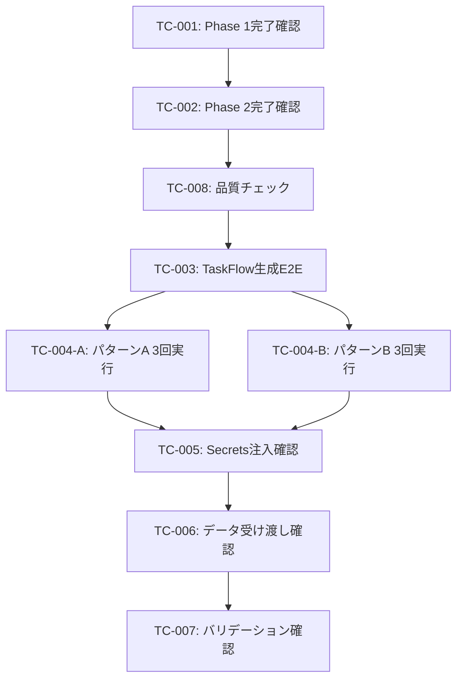

# 受入テスト計画書 - Epic #383

**Issue**: #383 [Epic] AIエージェントによるTaskFlow生成・実行の安定化
**種別**: Epic（統合受入テスト）
**作成日**: 2026-01-20
**ステータス**: 計画中

---

## 1. 概要

### 1.1 目的
Issue #375の動作確認中に発生した複数のインシデント（Secrets未注入、出力マッピングエラー、コンテキスト未使用、テンプレート解決失敗等）を解決し、AIエージェントがTaskFlowを生成・実行する際の安定性を確認する。

### 1.2 スコープ
- Phase 1（基盤整備）: #376, #377, #378, #379
- Phase 2（AI生成対応）: #380, #381, #382
- 統合E2Eテスト: 全機能を組み合わせた動作確認

---

## 2. 子Issue完了確認

### 2.1 Phase 1: 基盤整備

| Issue | タイトル | 検証方法 | 優先度 |
|-------|---------|---------|--------|
| #376 | NodeExecutionContext設計仕様のドキュメント化 | ドキュメント存在確認 | P0 |
| #377 | Secrets注入パターンの統一 | 単体テスト確認 | P0 |
| #378 | ワークフローストレージの責務分離と優先順位の明確化 | 単体テスト確認 | P1 |
| #379 | ワークフローチェーンのE2E結合テスト追加 | テスト実行 | P1 |

### 2.2 Phase 2: AI生成対応

| Issue | タイトル | 検証方法 | 優先度 |
|-------|---------|---------|--------|
| #380 | Capability出力スキーマの正確な定義とカタログ整備 | スキーマ存在確認 | P0 |
| #381 | 生成ワークフローの事前バリデーション強化 | 単体テスト確認 | P1 |
| #382 | AIプロンプトへのCapability情報の自動注入 | 単体テスト確認 | P2 |

---

## 3. 統合E2E受入条件

### 3.1 必須受入条件

| AC | 受入条件 | 検証方法 | 優先度 |
|----|---------|---------|--------|
| AC-1 | AIエージェントがユーザー要求からTaskFlowを生成できる | API呼び出し | 🔴 必須 |
| AC-2 | 生成されたTaskFlowが事前バリデーションを通過する | バリデーション実行 | 🔴 必須 |
| AC-3 | TaskFlowが正常に実行開始される | 実行API呼び出し | 🔴 必須 |
| AC-4 | Secrets（APIキー等）が正しく注入される | 実行ログ確認 | 🔴 必須 |
| AC-5 | ステップ間のデータ受け渡しが正常に動作する | 出力確認 | 🔴 必須 |
| AC-6 | TaskFlowが正常に完了し、期待される出力を返す | 最終出力確認 | 🔴 必須 |
| AC-7 | 複数回実行しても安定して動作する | 6回実行テスト | 🔴 必須 |

### 3.2 品質受入条件

| AC | 受入条件 | 検証方法 | 優先度 |
|----|---------|---------|--------|
| AC-8 | 全単体テストがパス（カバレッジ90%以上） | npm test | 🔴 必須 |
| AC-9 | TypeScriptコンパイルエラーゼロ | tsc --noEmit | 🔴 必須 |
| AC-10 | ESLintエラーゼロ | npm run lint | 🟡 推奨 |

---

## 4. テスト環境

### 4.1 必要サービス

| サービス | URL | 用途 |
|---------|-----|------|
| mySwiftAgentCore | http://localhost:8006 | TaskFlow生成・実行 |
| MyVault | http://localhost:8003 | Secrets管理 |

### 4.2 前提条件

```bash
# 1. MyVaultにAPIキーが登録されていること
curl http://localhost:8003/api/v1/secrets/ANTHROPIC_API_KEY

# 2. Capabilityが登録されていること
curl http://localhost:8006/api/v1/capabilities
```

### 4.3 テスト実行コマンド

```bash
# サービス起動
cd mySwiftAgentCore
npm run dev

# 単体テスト
npm test

# TypeScriptチェック
npx tsc --noEmit

# ESLint
npm run lint
```

---

## 5. テスト項目

### TC-001: 子Issue完了確認 - Phase 1

| 項目 | 内容 |
|------|------|
| **テスト種別** | 確認テスト |
| **対象** | #376, #377, #378, #379 |
| **手順** | 各Issueの成果物とテスト結果を確認 |
| **期待結果** | 全Issue完了、関連テスト全パス |

### TC-002: 子Issue完了確認 - Phase 2

| 項目 | 内容 |
|------|------|
| **テスト種別** | 確認テスト |
| **対象** | #380, #381, #382 |
| **手順** | 各Issueの成果物とテスト結果を確認 |
| **期待結果** | 全Issue完了、関連テスト全パス |

### TC-003: TaskFlow生成E2Eテスト

| 項目 | 内容 |
|------|------|
| **テスト種別** | E2Eテスト |
| **対象** | TaskFlow生成API |
| **前提条件** | mySwiftAgentCore起動済み |
| **手順** | 以下のAPIを呼び出してTaskFlowを生成 |
| **期待結果** | TaskFlowが生成され、バリデーション通過 |

```bash
curl -X POST http://localhost:8006/api/v1/taskflow/generate \
  -H "Content-Type: application/json" \
  -d '{
    "task_id": "epic_383_google_search",
    "name": "Google検索タスク",
    "description": "指定されたキーワードでGoogle検索を実行し、結果を返す",
    "interface": {
      "input": {"query": "string"},
      "output": {"results": "array"}
    }
  }'
```

### TC-004: TaskFlow実行E2Eテスト（2パターン x 3回 = 6回実行）

| 項目 | 内容 |
|------|------|
| **テスト種別** | E2Eテスト |
| **対象** | TaskFlow実行API |
| **前提条件** | TC-003で生成されたTaskFlowが存在 |
| **実行回数** | 6回（パターンA: 3回、パターンB: 3回） |
| **期待結果** | 全6回が正常実行され、検索結果を返す |

#### テストパターン

| パターン | キーワード | 実行回数 | 目的 |
|---------|-----------|---------|------|
| **A** | 大谷翔平の妻 | 3回 | 特定の関連キーワード検索の安定性確認 |
| **B** | 大谷翔平 | 3回 | 一般的なキーワード検索の安定性確認 |

#### パターンA: 「大谷翔平の妻」（3回実行）

```bash
# A-1回目
curl -X POST http://localhost:8006/api/v1/taskflow/execute \
  -H "Content-Type: application/json" \
  -d '{
    "workflow_id": "epic_383_google_search",
    "input": {"query": "大谷翔平の妻"}
  }'

# A-2回目
curl -X POST http://localhost:8006/api/v1/taskflow/execute \
  -H "Content-Type: application/json" \
  -d '{
    "workflow_id": "epic_383_google_search",
    "input": {"query": "大谷翔平の妻"}
  }'

# A-3回目
curl -X POST http://localhost:8006/api/v1/taskflow/execute \
  -H "Content-Type: application/json" \
  -d '{
    "workflow_id": "epic_383_google_search",
    "input": {"query": "大谷翔平の妻"}
  }'
```

#### パターンB: 「大谷翔平」（3回実行）

```bash
# B-1回目
curl -X POST http://localhost:8006/api/v1/taskflow/execute \
  -H "Content-Type: application/json" \
  -d '{
    "workflow_id": "epic_383_google_search",
    "input": {"query": "大谷翔平"}
  }'

# B-2回目
curl -X POST http://localhost:8006/api/v1/taskflow/execute \
  -H "Content-Type: application/json" \
  -d '{
    "workflow_id": "epic_383_google_search",
    "input": {"query": "大谷翔平"}
  }'

# B-3回目
curl -X POST http://localhost:8006/api/v1/taskflow/execute \
  -H "Content-Type: application/json" \
  -d '{
    "workflow_id": "epic_383_google_search",
    "input": {"query": "大谷翔平"}
  }'
```

#### 合格基準

| 基準 | 閾値 |
|------|------|
| パターンA成功率 | 100% (3/3) |
| パターンB成功率 | 100% (3/3) |
| 全体成功率 | 100% (6/6) |

#### 結果記録テンプレート

| 実行 | キーワード | 結果 | レスポンス時間 | 備考 |
|------|-----------|------|--------------|------|
| A-1 | 大谷翔平の妻 | - | - | - |
| A-2 | 大谷翔平の妻 | - | - | - |
| A-3 | 大谷翔平の妻 | - | - | - |
| B-1 | 大谷翔平 | - | - | - |
| B-2 | 大谷翔平 | - | - | - |
| B-3 | 大谷翔平 | - | - | - |

### TC-005: Secrets注入確認

| 項目 | 内容 |
|------|------|
| **テスト種別** | 結合テスト |
| **対象** | LlmNode実行時のSecrets注入 |
| **前提条件** | MyVaultにANTHROPIC_API_KEY登録済み |
| **手順** | LlmNodeを含むTaskFlowを実行 |
| **期待結果** | APIキーが注入され、LLM呼び出しが成功 |

### TC-006: ステップ間データ受け渡し確認

| 項目 | 内容 |
|------|------|
| **テスト種別** | 結合テスト |
| **対象** | stepResults参照 |
| **前提条件** | 複数ステップのTaskFlow |
| **手順** | step1の出力をstep2で参照するTaskFlowを実行 |
| **期待結果** | `{{steps.step1.output.xxx}}`が正しく解決される |

### TC-007: バリデーション強化確認

| 項目 | 内容 |
|------|------|
| **テスト種別** | 単体テスト |
| **対象** | ValidationPipeline |
| **手順** | 不正なTaskFlowでバリデーション実行 |
| **期待結果** | 適切なエラーメッセージと修正提案が返される |

### TC-008: 品質チェック

| 項目 | 内容 |
|------|------|
| **テスト種別** | 静的解析 |
| **対象** | mySwiftAgentCore全体 |
| **手順** | npm test, tsc --noEmit, npm run lint |
| **期待結果** | テスト全パス、エラーゼロ |

---

## 6. テスト実行計画

### 6.1 実行順序



### 6.2 合格基準

| 基準 | 閾値 |
|------|------|
| 子Issue完了率 | 100% (7/7) |
| TaskFlow生成成功率 | 100% |
| TaskFlow実行成功率（パターンA） | 100% (3/3) |
| TaskFlow実行成功率（パターンB） | 100% (3/3) |
| TaskFlow実行成功率（全体） | 100% (6/6) |
| 単体テストカバレッジ | 90%以上 |
| TypeScriptエラー | 0件 |

---

## 7. リスクと対策

| リスク | 影響 | 対策 |
|--------|------|------|
| MyVault未起動 | Secrets取得失敗 | 事前にMyVault起動確認 |
| APIキー未登録 | LLM呼び出し失敗 | テスト前にMyVaultにAPIキー登録 |
| Capability未登録 | TaskFlow生成失敗 | デフォルトCapabilityの存在確認 |
| ネットワークエラー | 外部API呼び出し失敗 | リトライ機構の確認 |
| Google API制限 | 連続実行でレート制限 | 実行間隔を空ける（1秒以上） |

---

## 8. 完了条件

Epic #383の完了条件：

- [ ] TC-001: Phase 1子Issue完了確認 ✅
- [ ] TC-002: Phase 2子Issue完了確認 ✅
- [ ] TC-003: TaskFlow生成E2Eテスト成功
- [ ] TC-004-A: 「大谷翔平の妻」3回実行成功 (3/3)
- [ ] TC-004-B: 「大谷翔平」3回実行成功 (3/3)
- [ ] TC-005: Secrets注入確認成功
- [ ] TC-006: ステップ間データ受け渡し確認成功
- [ ] TC-007: バリデーション強化確認成功
- [ ] TC-008: 品質チェック合格（テスト全パス、エラーゼロ）

---

## 9. 承認

- **計画作成者**: Claude (PM Auto-Dev)
- **計画作成日**: 2026-01-20
- **最終更新**: 2026-01-20
- **承認ステータス**: レビュー待ち
