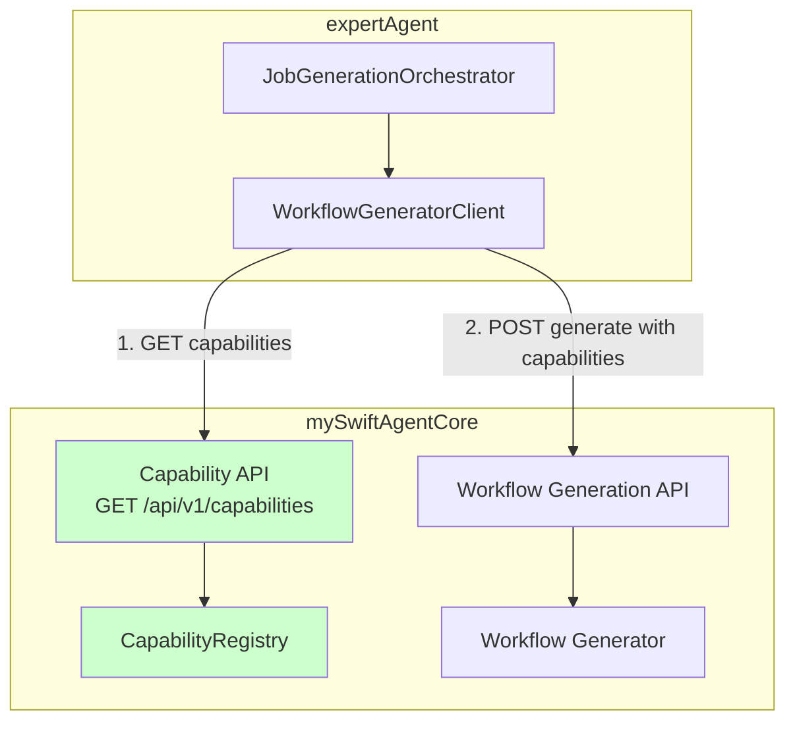

# Issue #385: Capability取得・渡し + 空タスク検証の実装 - 設計方針書

## 1. 概要

Issue #359/361の実装で発生した重大な乖離を修正する設計方針を策定します。

### 問題点
1. **Capability取得・渡しが未実装**: `orchestrator.py`でcapabilityが常に空配列として渡されている
2. **空タスク検証が未実装**: 0タスク生成でも「成功」として処理が継続

### 影響
- mySwiftAgentCoreがcapabilityを知らないため、LLMが適切なノードを生成できない
- 無効な要求でもエラーが発生せず、無意味な処理が実行される

## 2. アーキテクチャ設計

### システム構成図



### レイヤー構成

| レイヤー | コンポーネント | 責務 |
|---------|--------------|------|
| **Orchestration層** | JobGenerationOrchestrator | 全体フロー制御 |
| **Client層** | WorkflowGeneratorClient | mySwiftAgentCore API呼び出し（capability取得含む） |
| **Capability層** | CapabilityRegistry (mySwiftAgentCore) | capability管理・提供 |
| **Validation層** | TaskValidator | タスク数検証 |

## 3. 技術選定

### Capability管理方式の選定

| 方式 | 説明 | 選定理由 |
|------|------|---------|
| **方式A: expertAgent側で管理** | expertAgentがcapabilityを管理 | ❌ 不採用 - 重複管理になる |
| **方式B: mySwiftAgentCore側で管理** | mySwiftAgentCoreが独自にcapability管理、API提供 | ✅ **採用** - Issue #365で実装済み |
| **方式C: 共有サービス** | 別サービスでcapability管理 | ❌ 不採用 - 既存実装を活用 |

### mySwiftAgentCore Capability API（Issue #365実装済み）

| エンドポイント | メソッド | 説明 |
|--------------|---------|------|
| `/api/v1/capabilities?project={project_id}` | GET | プロジェクト別capability一覧取得 |
| `/api/v1/capabilities/yaml?project={project_id}` | GET | YAML形式で取得 |
| `/api/v1/capabilities/:id?project={project_id}` | GET | 単一capability取得 |
| `/api/v1/capabilities` | POST | capability作成（管理者のみ） |

### Capability取得タイミング

| タイミング | 説明 | 選定理由 |
|---------|------|---------|
| **起動時** | サーバー起動時に一度だけ取得 | ❌ 不採用 - 動的更新に対応できない |
| **Workflow生成時** | ワークフロー生成リクエスト毎に取得 | ✅ **採用** - 最新情報を反映可能 |
| **キャッシュ併用** | キャッシュ + 定期更新 | 🔄 将来検討 - v2で実装予定 |

## 4. 設計パターン

### Capability取得の実装パターン

```python
# WorkflowGeneratorClient に capability取得メソッドを追加
class WorkflowGeneratorClient:
    """mySwiftAgentCore API クライアント"""

    async def fetch_capabilities(self, project_id: str) -> list[dict[str, Any]]:
        """mySwiftAgentCore からcapabilityを取得

        Args:
            project_id: プロジェクトID

        Returns:
            capability配列（PublicCapability形式）
        """
        url = f"{self._base_url}/api/v1/capabilities"
        params = {"project": project_id}

        async with self._client.get(url, params=params) as response:
            data = await response.json()
            return data["capabilities"]
```

### Orchestratorでのcapability統合

```python
# orchestrator.py の _execute_workflow_gen() を修正
async def _execute_workflow_gen(
    self,
    task_identifiers: list[UnifiedTaskIdentifier],
    interfaces: dict[str, InterfaceDefinition],
    project_id: str = "default_project",
    # ...
) -> ParallelExecutionResult:
    # 1. mySwiftAgentCoreからcapabilityを取得
    capabilities = await client.fetch_capabilities(project_id)

    # 2. ワークフロー生成APIにcapabilityを渡す
    response = await client.generate_workflows(
        tasks=task_requests,
        capabilities=capabilities,  # 実際のcapabilityを渡す
        project_id=project_id,
        # ...
    )
```

### 空タスク検証の実装パターン

```python
# Guard Clause Pattern
def _validate_task_count(self, tasks: list[AnalyzedTask]) -> None:
    """タスク数検証（早期リターン）"""
    if len(tasks) == 0:
        raise OrchestratorError(
            "Job analysis returned 0 tasks. User requirement may be unclear.",
            phase=Phase.JOB_ANALYSIS,
            error_type=ErrorType.VALIDATION,
        )
```

## 5. データモデル設計

### mySwiftAgentCore Capability形式（Issue #365）

```typescript
// mySwiftAgentCoreで管理されるCapability（PublicCapability）
interface PublicCapability {
    id: string;
    name: string;
    description: string;
    version: string;
    status: 'available' | 'unavailable' | 'deprecated';
    category: string;
    parameters: CapabilityParameter[];
    returnType: ParameterType;
    examples?: CapabilityExample[];
    tags?: string[];
    metadata?: Record<string, unknown>;
    project?: string;
    // 注: _internal セクションは除外（セキュリティ）
}
```

### API レスポンス形式

```json
// GET /api/v1/capabilities?project=default_project
{
    "capabilities": [
        {
            "id": "gmail_send",
            "name": "Gmail送信",
            "description": "メール送信（高速・Direct API）",
            "category": "utility",
            "status": "available",
            "parameters": [...],
            "returnType": "object"
        }
    ],
    "count": 4,
    "project": "default_project"
}
```

## 6. API設計

### WorkflowGeneratorClient の拡張

```python
class WorkflowGeneratorClient:
    """mySwiftAgentCore API クライアント（Issue #385拡張）"""

    # 既存メソッド
    async def generate_workflows(
        self,
        tasks: list[TaskRequest],
        capabilities: list[dict[str, Any]],
        project_id: str,
        # ...
    ) -> BatchWorkflowGenerationResponse:
        """ワークフロー生成"""
        pass

    # 新規追加メソッド
    async def fetch_capabilities(
        self,
        project_id: str,
        category: str | None = None,
        status: str | None = None,
    ) -> list[dict[str, Any]]:
        """mySwiftAgentCoreからcapability取得

        Args:
            project_id: プロジェクトID
            category: カテゴリでフィルタ（オプション）
            status: ステータスでフィルタ（オプション）

        Returns:
            PublicCapability形式のcapability配列
        """
        pass
```

### エラーハンドリング

```python
class CapabilityFetchError(Exception):
    """Capability取得エラー"""
    pass

# 使用例
try:
    capabilities = await client.fetch_capabilities(project_id)
except CapabilityFetchError as e:
    logger.error(f"Failed to fetch capabilities: {e}")
    # フォールバック: 空配列で続行 or エラー
    raise OrchestratorError(
        f"Cannot fetch capabilities from mySwiftAgentCore: {e}",
        phase=Phase.WORKFLOW_GEN,
        error_type=ErrorType.API,
    )
```

## 7. セキュリティ設計

### Capability情報の保護（mySwiftAgentCore側で実装済み）

| 項目 | 対策 |
|------|------|
| **エンドポイントURL** | `_internal`セクションに格納、APIレスポンスから除外 |
| **認証情報** | `_internal.secret_key`で参照、実値は含まない |
| **内部実装詳細** | `CapabilitySanitizer`でPublicCapabilityに変換 |

### expertAgent側の対応

- mySwiftAgentCoreから受け取ったcapabilityをそのまま使用
- 内部情報の追加処理は不要
- ログ出力時は機密情報をマスク

### ログマスキングの具体的実装

capability情報をログ出力する際、センシティブな情報を除外するユーティリティ関数を実装します。

```python
# expertAgent/aiagent/clients/utils/log_sanitizer.py

from typing import Any

# ログから除外すべきキー（センシティブ情報）
SENSITIVE_KEYS = frozenset({
    "_internal",
    "secret_key",
    "api_key",
    "token",
    "password",
    "credential",
    "auth",
})


def sanitize_capability_for_log(capability: dict[str, Any]) -> dict[str, Any]:
    """単一のcapabilityからセンシティブ情報を除外

    Args:
        capability: capability辞書

    Returns:
        センシティブ情報を除外したcapability辞書
    """
    return {
        k: v for k, v in capability.items()
        if k.lower() not in SENSITIVE_KEYS
    }


def sanitize_capabilities_for_log(
    capabilities: list[dict[str, Any]]
) -> list[dict[str, Any]]:
    """複数のcapabilityからセンシティブ情報を除外

    Args:
        capabilities: capability辞書のリスト

    Returns:
        センシティブ情報を除外したcapability辞書のリスト
    """
    return [sanitize_capability_for_log(cap) for cap in capabilities]


def create_capability_log_summary(capabilities: list[dict[str, Any]]) -> str:
    """ログ出力用のcapabilityサマリを生成

    詳細情報は出力せず、件数とID一覧のみを返す（最も安全）

    Args:
        capabilities: capability辞書のリスト

    Returns:
        ログ出力用のサマリ文字列
    """
    if not capabilities:
        return "capabilities=[] (empty)"

    ids = [cap.get("id", "unknown") for cap in capabilities]
    return f"capabilities=[{', '.join(ids)}] (count={len(capabilities)})"
```

### ログ出力パターン

```python
# 推奨パターン1: サマリのみ（最も安全）
from aiagent.clients.utils.log_sanitizer import create_capability_log_summary

capabilities = await client.fetch_capabilities(project_id)
logger.info(f"Fetched {create_capability_log_summary(capabilities)}")
# 出力例: "Fetched capabilities=[gmail_send, google_search, direct_llm] (count=3)"

# 推奨パターン2: デバッグ時のみ詳細出力
from aiagent.clients.utils.log_sanitizer import sanitize_capabilities_for_log

if logger.isEnabledFor(logging.DEBUG):
    logger.debug(f"Capability details: {sanitize_capabilities_for_log(capabilities)}")

# 禁止パターン（センシティブ情報漏洩リスク）
# logger.info(f"Capabilities: {capabilities}")  # ❌ 絶対禁止
```

### テスト

```python
# tests/unit/test_clients/test_log_sanitizer.py

def test_sanitize_capability_removes_internal():
    """_internalセクションが除外されることを確認"""
    cap = {
        "id": "test_cap",
        "name": "Test",
        "_internal": {"endpoint": "http://secret.api"},
    }
    result = sanitize_capability_for_log(cap)
    assert "_internal" not in result
    assert result["id"] == "test_cap"


def test_sanitize_capability_removes_secret_key():
    """secret_keyが除外されることを確認"""
    cap = {"id": "test", "secret_key": "sk-xxx"}
    result = sanitize_capability_for_log(cap)
    assert "secret_key" not in result


def test_create_capability_log_summary_empty():
    """空リストの場合のサマリ出力を確認"""
    result = create_capability_log_summary([])
    assert result == "capabilities=[] (empty)"


def test_create_capability_log_summary_multiple():
    """複数capabilityのサマリ出力を確認"""
    caps = [{"id": "cap1"}, {"id": "cap2"}]
    result = create_capability_log_summary(caps)
    assert "cap1" in result
    assert "cap2" in result
    assert "count=2" in result
```

## 8. パフォーマンス設計

### 最適化戦略

| 領域 | 戦略 |
|------|------|
| **Capability取得** | mySwiftAgentCoreへの1回のHTTPリクエスト |
| **キャッシュ** | v1では非実装、v2で検討 |
| **並列処理** | capability取得とタスク準備を並列化（将来） |

### 想定レイテンシ

| 処理 | 想定時間 |
|------|---------|
| Capability取得 | 10-50ms（ローカルネットワーク） |
| ワークフロー生成 | 1-10秒（LLM呼び出し） |

## 9. 設計上の決定事項とトレードオフ

### 決定事項1: mySwiftAgentCore側でcapability管理

**理由**:
- Issue #365で既に実装済み
- capability定義のYAML管理が一元化される
- セキュリティ（`_internal`除外）が担保済み
- REST APIが提供されており連携が容易

**トレードオフ**:
- expertAgent → mySwiftAgentCore への追加HTTPリクエスト
- ネットワーク障害時のリスク
- ただし、サービス間の責務分離が明確になるメリットが大きい

### 決定事項2: Workflow生成時にcapability取得

**理由**:
- 最新のcapability情報を使用可能
- 動的なcapability追加/更新に対応
- 実装の簡潔性

**トレードオフ**:
- 毎回のHTTPリクエストオーバーヘッド
- ただし、10-50ms程度であり許容範囲

### 決定事項3: 早期検証の採用

**理由**:
- 無効な処理の早期停止
- エラーメッセージの明確化
- リソースの無駄遣い防止

**トレードオフ**:
- 検証ロジックの追加
- ただし、保守性向上のメリットが大きい

## 10. 実装方針

### Phase 1: WorkflowGeneratorClientへのcapability取得機能追加

1. **fetch_capabilities()メソッド追加**
   - `workflow_generator_client.py`に新メソッド追加
   - HTTP GET `/api/v1/capabilities?project={project_id}`
   - エラーハンドリング（タイムアウト、接続エラー）

2. **単体テスト作成**
   - モックを使用したcapability取得テスト
   - エラーケースのテスト

### Phase 2: Orchestratorへの統合

1. **_execute_workflow_gen()の修正**
   - capability取得の呼び出し追加
   - 取得したcapabilityをgenerate_workflows()に渡す

2. **エラーハンドリング**
   - capability取得失敗時の処理
   - 適切なOrchestratorErrorの発生

### Phase 3: 空タスク検証実装

1. **検証メソッド追加**
   - `_validate_task_count()`の実装
   - `_execute_job_analysis()`に検証追加

2. **エラーハンドリング**
   - OrchestratorError with VALIDATION type
   - 適切なエラーメッセージ

### Phase 4: テスト実装

1. **単体テスト**
   - Capability取得テスト
   - 空タスク検証テスト
   - モックを使用した統合テスト

2. **結合テスト**
   - 実際のmySwiftAgentCore連携テスト
   - E2Eシナリオテスト

## 11. 移行計画

### 影響範囲

| コンポーネント | 影響 | 対応 |
|--------------|------|------|
| workflow_generator_client.py | 修正 | fetch_capabilities()追加 |
| orchestrator.py | 修正 | capability取得・渡し、空タスク検証追加 |
| テストコード | 更新 | モックの更新が必要 |

### 後方互換性

- APIインターフェースの変更なし
- 内部実装の変更のみ
- 既存の動作に影響なし（capability活用により品質向上）

## 12. 監視・運用

### ログ出力

**重要**: Capabilityログ出力時は必ず`log_sanitizer`を使用すること。

```python
from aiagent.clients.utils.log_sanitizer import create_capability_log_summary

# Capability取得時（サニタイズ済み）
logger.info(f"Fetching capabilities from mySwiftAgentCore for project {project_id}")
logger.info(f"Fetched {create_capability_log_summary(capabilities)}")
# 出力例: "Fetched capabilities=[direct_llm, gmail_send, google_search] (count=3)"

# Capability取得失敗時
logger.error(f"Failed to fetch capabilities for project {project_id}: {error}")

# 空タスク検証時
logger.error(f"Job analysis returned 0 tasks for requirement: {user_requirement[:100]}...")

# デバッグ時（サニタイズ済み詳細）
from aiagent.clients.utils.log_sanitizer import sanitize_capabilities_for_log
logger.debug(f"Capability details: {sanitize_capabilities_for_log(capabilities)}")
```

**禁止パターン**:
```python
# ❌ 禁止: 生データをログ出力
logger.info(f"Capabilities: {capabilities}")  # _internalが漏洩する可能性

# ✅ 安全: サニタイザー使用
logger.info(f"Capabilities: {create_capability_log_summary(capabilities)}")
```

### メトリクス

- Capability取得時間
- Capability取得成功/失敗率
- 空タスク発生率
- エラー発生率

## 13. 今後の拡張性

### v2での検討事項

1. **Capabilityキャッシング（expertAgent側）**
   - TTLベースのキャッシュ
   - 変更検知による自動更新

2. **Capability同期**
   - mySwiftAgentCoreからのWebhook通知
   - リアルタイム更新

3. **プロジェクト横断Capability**
   - 共有capabilityの管理
   - プロジェクト間の参照

## 14. リスクと対策

| リスク | 影響度 | 対策 |
|--------|-------|------|
| mySwiftAgentCore接続失敗 | 高 | タイムアウト設定、リトライ、明確なエラーメッセージ |
| Capability取得遅延 | 中 | タイムアウト設定、将来的にキャッシュ実装 |
| Capability形式不整合 | 低 | スキーマ検証、ログ出力 |

## 15. 参照ドキュメント

- [Issue #365: Project-based Capability Management](https://github.com/xxx/MySwiftAgent/issues/365)
- [mySwiftAgentCore README](../../mySwiftAgentCore/README.md)
- [service-dependencies.md](../../docs/arch/service-dependencies.md)
- [API_REFERENCE.md](../../expertAgent/docs/API_REFERENCE.md)

---

**作成日**: 2026-01-21
**作成者**: Claude Opus 4.5
**レビュー**: 未実施
**承認**: 未承認
