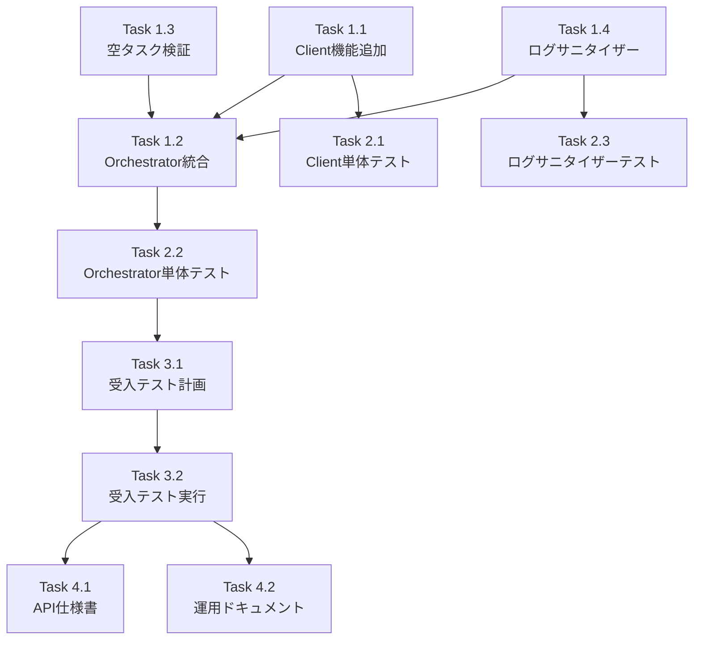

# Issue #385: Capability取得・渡し + 空タスク検証の実装 - 作業計画書

## Issue概要

**Issue番号**: #385
**サイズ**: M（設計完了済み、実装規模は中程度）
**作業見積**: 16時間（2人日）
**優先度**: P0（Critical）
**依存Issue**:
- #359 3フェーズアーキテクチャ設計（完了）
- #361 mySwiftAgentCore連携実装（完了）

**ラベル**: `bug`, `cross-layer`

## 問題の概要

1. **Capability取得・渡しが未実装**
   - `orchestrator.py L302`で常に`capabilities=[]`が渡されている
   - mySwiftAgentCoreがcapabilityを知らないため、適切なワークフローが生成されない

2. **空タスク検証が未実装**
   - 0タスク生成でも「成功」として処理が継続
   - 無効な要求でもエラーが発生しない

## 詳細タスク分解

### Phase 1: 実装タスク（8時間）

#### Task 1.1: WorkflowGeneratorClientへCapability取得機能追加（2時間）
- [ ] `fetch_capabilities()`メソッドの実装
- [ ] エラーハンドリング（タイムアウト、接続エラー）
- [ ] レスポンス型定義（PublicCapability）

#### Task 1.2: Orchestratorへの統合（3時間）
- [ ] `_execute_workflow_gen()`の修正
- [ ] Capability取得処理の追加
- [ ] 取得したcapabilityをgenerate_workflows()に渡す
- [ ] エラーハンドリング（OrchestratorError）

#### Task 1.3: 空タスク検証実装（1時間）
- [ ] `_validate_task_count()`メソッドの追加
- [ ] `_execute_job_analysis()`に検証処理追加
- [ ] エラーメッセージの実装

#### Task 1.4: ログサニタイザー実装（2時間）
- [ ] `log_sanitizer.py`ユーティリティ作成
- [ ] `sanitize_capability_for_log()`関数
- [ ] `create_capability_log_summary()`関数
- [ ] 各所でのログ出力修正

### Phase 2: テストタスク（TDD - CI実行可能）（4時間）

#### Task 2.1: WorkflowGeneratorClient単体テスト（1.5時間）
- [ ] `test_fetch_capabilities_success`
- [ ] `test_fetch_capabilities_timeout`
- [ ] `test_fetch_capabilities_connection_error`
- [ ] `test_capability_response_validation`

#### Task 2.2: Orchestrator単体テスト（1.5時間）
- [ ] `test_validate_task_count_success`
- [ ] `test_validate_task_count_empty_error`
- [ ] `test_execute_workflow_gen_with_capabilities`
- [ ] モックを使用した統合フローテスト

#### Task 2.3: ログサニタイザー単体テスト（1時間）
- [ ] `test_sanitize_capability_removes_internal`
- [ ] `test_sanitize_handles_nested_sensitive_keys`
- [ ] `test_create_log_summary_format`
- [ ] `test_empty_capabilities_summary`

### Phase 3: 受入テストタスク（L3ローカル受入テスト）（3時間）

#### Task 3.1: 受入テスト計画作成（1時間）
- [ ] テストシナリオ設計
- [ ] 環境準備手順書作成
- [ ] 期待結果の定義

#### Task 3.2: 受入テスト実装・実行（2時間）
- [ ] E2Eテストコード作成（`test_issue_385_acceptance.py`）
- [ ] mySwiftAgentCore連携確認
- [ ] Capability取得フロー検証
- [ ] 空タスクエラー検証

### Phase 4: ドキュメントタスク（1時間）

#### Task 4.1: API仕様書更新（30分）
- [ ] WorkflowGeneratorClient変更内容
- [ ] エラーレスポンス追加

#### Task 4.2: 運用ドキュメント更新（30分）
- [ ] ログ監視ポイントの追加
- [ ] トラブルシューティングガイド

## タスク依存関係



## 作業スケジュール

### Day 1（8時間）
- **AM（4時間）**
  - Task 1.1: WorkflowGeneratorClient実装（2時間）
  - Task 1.4: ログサニタイザー実装（2時間）

- **PM（4時間）**
  - Task 1.2: Orchestrator統合（3時間）
  - Task 1.3: 空タスク検証（1時間）

### Day 2（8時間）
- **AM（4時間）**
  - Task 2.1: Client単体テスト（1.5時間）
  - Task 2.2: Orchestrator単体テスト（1.5時間）
  - Task 2.3: ログサニタイザーテスト（1時間）

- **PM（4時間）**
  - Task 3.1: 受入テスト計画（1時間）
  - Task 3.2: 受入テスト実行（2時間）
  - Task 4.1-4.2: ドキュメント更新（1時間）

## チェックポイント

| タイミング | 確認事項 | 対応 |
|-----------|---------|------|
| Task 1.1完了時 | fetch_capabilities()がPublicCapabilityを返すか | 型チェック |
| Task 1.2完了時 | capabilityが実際に渡されるか | デバッグログ確認 |
| Phase 2完了時 | 単体テストカバレッジ90%以上 | カバレッジレポート確認 |
| Phase 3完了時 | E2Eで実際のcapability取得確認 | ログ・レスポンス確認 |

## リスクと対策

| リスク | 発生確率 | 影響 | 対策 |
|-------|---------|------|------|
| mySwiftAgentCore API仕様変更 | 低 | 高 | API仕様確認、バージョン確認 |
| Capability取得の性能劣化 | 中 | 中 | タイムアウト設定、将来的にキャッシュ検討 |
| 既存テストの修正量多い | 高 | 中 | capabilities=[]前提のテストを優先修正 |

## 成果物チェックリスト

### コード
- [ ] `expertAgent/aiagent/clients/workflow_generator_client.py` - fetch_capabilities()追加
- [ ] `expertAgent/aiagent/langgraph/jobGeneratorV2/orchestrator.py` - capability取得・検証追加
- [ ] `expertAgent/aiagent/clients/utils/log_sanitizer.py` - 新規作成

### テスト
- [ ] `expertAgent/tests/unit/test_clients/test_workflow_generator_client.py` - 単体テスト追加
- [ ] `expertAgent/tests/unit/test_langgraph/test_jobGeneratorV2/test_orchestrator.py` - 単体テスト追加
- [ ] `expertAgent/tests/unit/test_clients/test_log_sanitizer.py` - 新規作成
- [ ] `expertAgent/tests/acceptance/test_issue_385_acceptance.py` - 新規作成

### ドキュメント
- [ ] `expertAgent/docs/API_REFERENCE.md` - WorkflowGeneratorClient更新
- [ ] `docs/ops/monitoring.md` - ログ監視ポイント追加

## L3受入テスト計画

### 環境準備

```bash
# 1. 全サービス起動（mySwiftAgentCoreを含む）
./scripts/dev-hybrid.sh

# 2. サービス起動確認
curl -sf http://localhost:8004/health && echo "✅ ExpertAgent healthy"
curl -sf http://localhost:8006/health && echo "✅ mySwiftAgentCore healthy"
```

### 正常系テスト

```bash
# 1. Capability取得確認（mySwiftAgentCore直接）
curl -s http://localhost:8006/api/v1/capabilities?project=default_project | \
  jq '.capabilities | length' | \
  xargs -I {} test {} -gt 0 && echo "✅ Capabilities available"

# 2. Job Generator呼び出し（capabilityが渡される確認）
curl -s -X POST http://localhost:8004/v1/job-generator/generate \
  -H "Content-Type: application/json" \
  -d '{
    "user_requirement": "Gmailで未読メールをチェックして",
    "project_id": "default_project"
  }' | jq '.workflows | length' | \
  xargs -I {} test {} -gt 0 && echo "✅ Workflows generated with capabilities"
```

### 異常系テスト

```bash
# 3. 空タスク検証（無効な要求でエラー）
curl -s -X POST http://localhost:8004/v1/job-generator/generate \
  -H "Content-Type: application/json" \
  -d '{
    "user_requirement": "",
    "project_id": "default_project"
  }' | jq -e '.error | test("0 tasks")' && \
  echo "✅ Empty task validation working"

# 4. 存在しないproject_id（capability取得エラー）
curl -s -X POST http://localhost:8004/v1/job-generator/generate \
  -H "Content-Type: application/json" \
  -d '{
    "user_requirement": "テストタスク",
    "project_id": "non_existent_project"
  }' | jq -e '.error | test("capability|Capability")' && \
  echo "✅ Capability fetch error handling working"
```

### ログ確認

```bash
# 5. ログサニタイザー動作確認
docker logs expertAgent 2>&1 | \
  grep "Fetched capabilities=" | \
  grep -v "_internal" && \
  echo "✅ Log sanitizer working"
```

## Definition of Done

- [x] 設計方針書の作成・レビュー完了
- [ ] すべての実装タスクが完了
- [ ] 単体テストカバレッジ90%以上達成
- [ ] L3受入テスト全項目PASS
- [ ] CI/CD（GitHub Actions）グリーン
- [ ] コードレビュー承認
- [ ] ドキュメント更新完了
- [ ] 実際のcapabilityが渡されることを本番環境相当で確認

## 備考

- 設計方針書は作成済み（`dev-reports/feature/issue/385/design-policy.md`）
- アーキテクチャレビュー実施済み、必須改善項目対応済み
- mySwiftAgentCore APIは既存（Issue #365で実装済み）を利用
- 将来的なキャッシュ実装は本Issueのスコープ外

---

**作成日**: 2026-01-21
**作成者**: Claude Opus 4.5
**対象Issue**: #385 【P0】Capability取得・渡し + 空タスク検証の実装