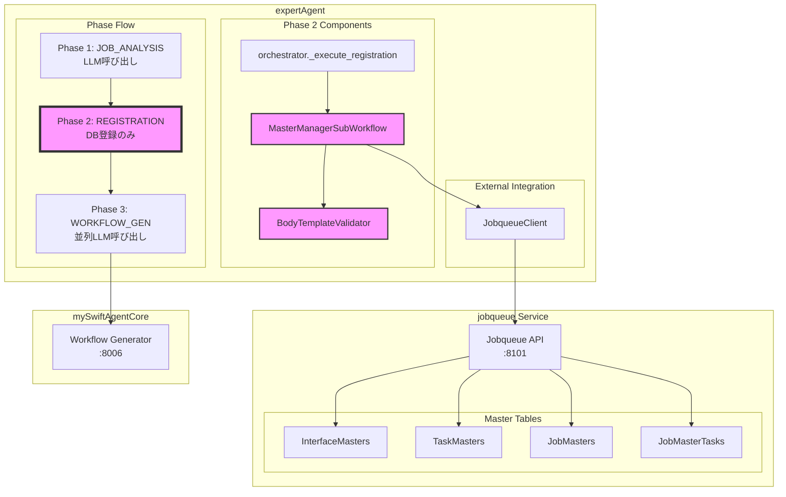
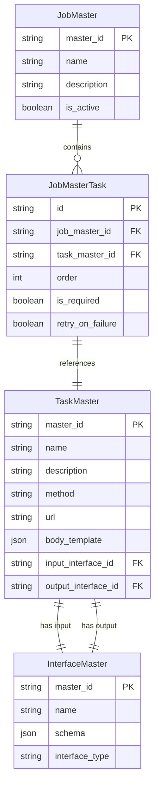
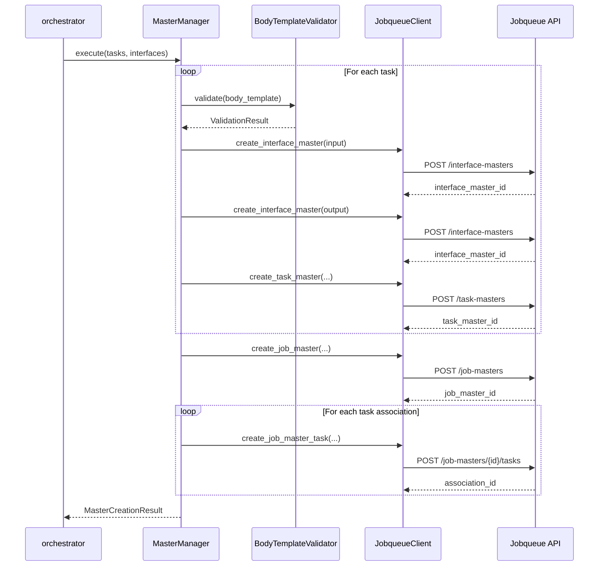

# 設計方針書

**Issue**: #386
**作成日**: 2025-01-21
**作成者**: design-policy skill
**タイトル**: 【P1】Phase 2統合: master_manager + BodyTemplateValidator + trace_id伝播

---

## 1. アーキテクチャ設計

### システム構成図



### レイヤー構成

| レイヤー | 役割 | 実装ファイル |
|---------|------|------------|
| **Orchestration層** | 3フェーズ制御 | `orchestrator.py` |
| **Registration層** | マスターデータ登録 | `master_manager.py` |
| **Validation層** | テンプレート検証 | `validators/body_template_validator.py` |
| **Client層** | API通信 | `clients/jobqueue_client.py` |
| **Context層** | 実行コンテキスト管理 | `context.py` |

---

## 2. 技術選定

| カテゴリ | 選定技術 | 選定理由 | 既存との整合性 |
|---------|---------|---------|---------------|
| **言語/フレームワーク** | Python 3.11+ / FastAPI | 既存コードベースと統一 | ✅ 完全一致 |
| **非同期処理** | asyncio / aiohttp | 並列API呼び出しの効率化 | ✅ 既存パターンを踏襲 |
| **バリデーション** | Pydantic / 独自Validator | 型安全性とビジネスルール検証 | ✅ 既存実装を活用 |
| **トレーシング** | Langfuse | 分散トレース追跡 | ✅ Issue #361で実装済み |
| **ロギング** | structlog | 構造化ログ | ✅ 既存と統一 |

---

## 3. 設計パターン

### 採用パターン

1. **Unified ID Pattern** (Issue #359)
   - `task_id` を全フェーズで一貫使用
   - インデックスベースの参照を禁止
   - `UnifiedTaskIdentifier` データクラスで管理

2. **Dependency Injection Pattern**
   - `ExecutionContext` 経由で依存性注入
   - `JobqueueClient` は context.storage から取得
   - テスタビリティの向上

3. **Strategy Pattern** (既存実装を活用)
   - `BodyTemplateValidator` での検証戦略
   - TaskFlow/GraphAI エンジン別の処理

4. **Fail-Fast Pattern**
   - エラー時は即座に例外を raise
   - サイレントフォールバックなし

---

## 4. データモデル設計

### ER図



### データフロー



---

## 5. API設計

### Phase 2 内部API

エンドポイントは既存のjobqueue APIをそのまま使用：

| エンドポイント | メソッド | 説明 |
|--------------|---------|------|
| `/interface-masters` | POST | InterfaceMaster作成 |
| `/task-masters` | POST | TaskMaster作成 |
| `/job-masters` | POST | JobMaster作成 |
| `/job-masters/{id}/tasks` | POST | JobMasterTask関連付け |

### リクエスト/レスポンス形式

既存の `JobqueueClient` 実装をそのまま活用。

---

## 6. セキュリティ設計

### 認証/認可方式

- Jobqueue API: `X-API-Token` ヘッダー認証
- 環境変数 `JOBQUEUE_API_TOKEN` から取得
- JobqueueClient が内部的に処理

### データ検証

1. **入力検証**: Pydantic モデルによる型検証
2. **ビジネスルール検証**: BodyTemplateValidator による参照整合性チェック
3. **SQLインジェクション対策**: パラメータ化クエリ（jobqueue側で実装済み）

---

## 7. パフォーマンス設計

### 並列処理戦略

```python
# Phase 2は順次処理（DB整合性のため）
for task in tasks:
    # 各タスクのマスター登録は順次実行
    await create_masters(task)

# Phase 3は並列処理（Issue #361で実装済み）
await asyncio.gather(*[
    generate_workflow(task) for task in tasks
])
```

### トランザクション管理

- JobMaster作成は最後に実行（全TaskMaster作成後）
- エラー時は `OrchestratorError` で上位層へ伝播
- ロールバックはjobqueue側のトランザクション管理に依存

---

## 8. 設計上の決定事項とトレードオフ

### 採用した設計の理由

1. **MasterManagerSubWorkflow の再利用**
   - 理由：既に完全実装され、テスト済み
   - メリット：開発工数削減、品質保証
   - デメリット：特になし

2. **Phase 2 での順次処理**
   - 理由：DB整合性の保証が必要
   - メリット：データ整合性、エラー処理の簡潔性
   - デメリット：並列化による高速化は不可

3. **trace_id の HTTP ヘッダー伝播**
   - 理由：Issue #361 で確立済みのパターン
   - メリット：統一的なトレース追跡
   - デメリット：ヘッダー設定の手間（わずか）

### 代替案との比較

| 項目 | 採用案 | 代替案 | 採用理由 |
|------|--------|--------|----------|
| Master登録 | 既存MasterManager活用 | 新規実装 | 品質・工数の観点 |
| エラー処理 | Fail-Fast | リトライ | データ整合性優先 |
| ID管理 | UnifiedTaskIdentifier | 単純string | 型安全性 |

### 想定されるリスクと対策

1. **リスク：jobqueue サービス停止**
   - 対策：ヘルスチェック、適切なエラーメッセージ

2. **リスク：大量タスク時の処理時間**
   - 対策：タスク数上限（max_tasks）の設定

3. **リスク：body_template 検証エラー**
   - 対策：詳細なエラーメッセージ、Phase 1での事前チェック強化

---

## 実装方針

### 変更対象ファイル

1. **orchestrator.py**
   - `_execute_registration` メソッドの実装
   - `run_workflow` での trace_id 受け取り
   - ExecutionContext の活用

2. **実装の要点**
   ```python
   async def _execute_registration(
       self,
       tasks: list[AnalyzedTask],
       interfaces: dict[str, InterfaceDefinition],
       project_id: str,
       context: ExecutionContext,  # 追加
   ) -> dict[str, Any]:
       """Phase 2: 実際のDB登録処理."""

       # MasterManagerSubWorkflow を使用
       master_manager = MasterManagerSubWorkflow(context)

       # 実際のAPI呼び出しで登録
       result = await master_manager.execute(
           tasks=tasks,
           interfaces=interfaces,
           project_id=project_id,
       )

       # task_id → task_master_id マッピング
       task_id_to_master_id = {
           info.task_id: info.task_master_id
           for info in result.task_masters.values()
       }

       return {
           "job_master_id": result.job_master.master_id,
           "task_id_to_master_id": task_id_to_master_id,
       }
   ```

### テスト戦略

1. **単体テスト**
   - Mock を使用した orchestrator のテスト
   - 実際の API 呼び出しの検証

2. **結合テスト**
   - Phase 1 → Phase 2 → Phase 3 の連携
   - エラーケースの検証

3. **受入テスト**
   - 実際の jobqueue サービスとの連携
   - trace_id の伝播確認

---

## 制約条件

CLAUDE.md の原則に準拠：
- ✅ SOLID原則：単一責任、インターフェース分離
- ✅ KISS原則：既存実装の再利用
- ✅ YAGNI原則：必要な機能のみ実装
- ✅ DRY原則：MasterManager の再利用

Issue #359 の制約：
- ✅ Orchestrator サイズ：300行以内を維持
- ✅ Unified ID Pattern の遵守
- ✅ No Silent Fallback の徹底

---

## 参照ドキュメント

- Issue #359 設計方針書: `/dev-reports/feature/issue/359/design-policy.md`
- Issue #361 設計方針書: `/dev-reports/feature/issue/361/design-policy.md`
- expertAgent API Reference: `/expertAgent/docs/API_REFERENCE.md`
- サービス依存関係: `/docs/arch/service-dependencies.md`

---

**作成日**: 2025-01-21
**作成者**: design-policy skill
**レビュー**: 未実施