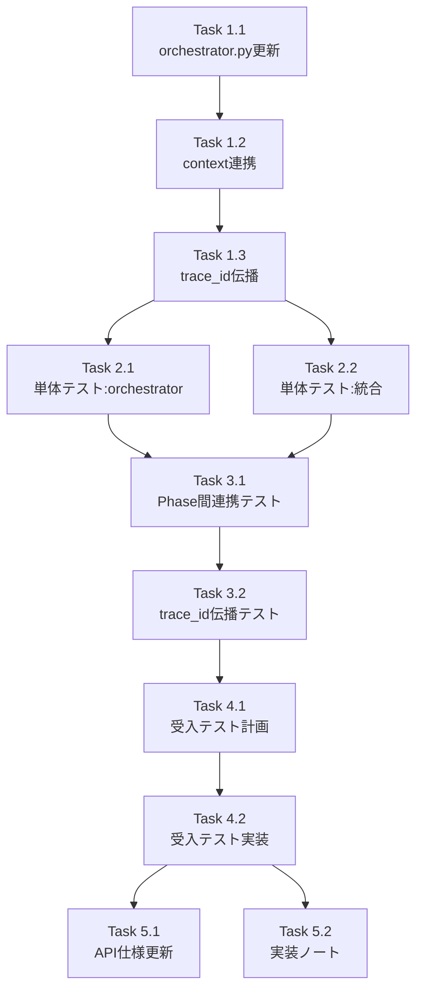

# 作業計画書

**Issue**: #386
**作成日**: 2025-01-21
**作成者**: work-plan skill

---

## Issue: 【P1】Phase 2統合: master_manager + BodyTemplateValidator + trace_id伝播

**Issue番号**: #386
**サイズ**: M（中規模）
**作業見積**: 8-10時間
**優先度**: P1（High）
**依存Issue**: #359（3フェーズアーキテクチャ）, #361（mySwiftAgentCore連携）

---

## 1. 実装概要

Phase 2（REGISTRATION）の完全実装：
- 現在のプレースホルダー実装を、実際のjobqueue API呼び出しに置き換え
- 既存のMasterManagerSubWorkflowを活用
- BodyTemplateValidatorによる検証統合
- trace_idの伝播実装

---

## 2. 詳細タスク分解

### Phase 1: 実装タスク（3時間）

#### Task 1.1: orchestrator.py の更新（1.5時間）
```python
# 変更対象メソッド
- run_workflow() : trace_id, parent_span_id パラメータ追加
- _execute_registration() : MasterManagerSubWorkflow呼び出しに変更
- _execute_workflow_gen() : trace_id伝播の追加（既存）
```

#### Task 1.2: context連携の実装（1時間）
- ExecutionContextからJobqueueClient取得
- MasterManagerSubWorkflowへのcontext渡し
- エラーハンドリングの統合

#### Task 1.3: trace_id伝播の実装（0.5時間）
- run_workflowパラメータ追加
- 各フェーズへのtrace_id引き継ぎ
- ログへのtrace_id出力

### Phase 2: テストタスク - TDD（2.5時間）

#### Task 2.1: 単体テスト - orchestrator（1.5時間）
- `test_orchestrator_issue386.py` 作成
- _execute_registrationのモックテスト
- trace_id伝播のテスト
- エラーケースのテスト

#### Task 2.2: 単体テスト - 統合ポイント（1時間）
- MasterManagerSubWorkflow呼び出しの検証
- context経由のclient取得テスト
- 戻り値マッピングのテスト

### Phase 3: 結合テスト（1.5時間）

#### Task 3.1: Phase間連携テスト（1時間）
- Phase 1 → Phase 2 → Phase 3 の連携
- task_id → task_master_id マッピング検証
- エラー伝播のテスト

#### Task 3.2: trace_id伝播テスト（0.5時間）
- HTTPヘッダーでのtrace_id伝播
- Langfuseトレース連続性の確認

### Phase 4: L3受入テスト【必須】（2時間）

#### Task 4.1: 受入テスト計画作成（0.5時間）
- `test_issue_386_acceptance.py` 作成
- テストシナリオ定義

#### Task 4.2: 受入テスト実装（1.5時間）
- 実際のjobqueue APIとの連携テスト
- master登録の確認
- trace_id伝播の確認

### Phase 5: ドキュメントタスク（1時間）

#### Task 5.1: API仕様書更新（0.5時間）
- run_workflowパラメータの文書化
- trace_id伝播の説明追加

#### Task 5.2: 実装ノート作成（0.5時間）
- Phase 2実装の詳細説明
- 今後の拡張ポイント

---

## 3. タスク依存関係



---

## 4. 作業スケジュール

### Day 1（4時間）
- **AM**: Phase 1実装（Task 1.1-1.3）
- **PM**: Phase 2単体テスト開始（Task 2.1）

### Day 2（4-6時間）
- **AM**: Phase 2単体テスト完了（Task 2.2）、Phase 3結合テスト
- **PM**: Phase 4受入テスト、Phase 5ドキュメント

---

## 5. チェックポイント

| タイミング | 確認事項 | 対応 |
|-----------|---------|------|
| Task 1.1完了時 | コード品質（Ruff/MyPy） | 静的解析エラー修正 |
| Phase 2完了時 | 単体テストカバレッジ90%以上 | カバレッジ不足箇所の追加 |
| Phase 3完了時 | CI/CDグリーン | 失敗テストの修正 |
| Phase 4完了時 | L3受入テスト全パス | 本番相当の動作確認 |

---

## 6. リスクと対策

| リスク | 発生確率 | 影響 | 対策 |
|-------|---------|------|------|
| MasterManagerSubWorkflowのインターフェース不一致 | 低 | 中 | 事前にコード確認、型チェック |
| jobqueueサービス未起動での受入テスト失敗 | 中 | 低 | 起動スクリプト準備、ヘルスチェック |
| trace_id伝播の実装漏れ | 低 | 低 | テストでカバー、ログ確認 |
| 既存テストへの影響 | 中 | 中 | 回帰テスト実施 |

---

## 7. 成果物チェックリスト

### コード
- [ ] `orchestrator.py` - _execute_registration実装
- [ ] `orchestrator.py` - run_workflowパラメータ追加
- [ ] エラーハンドリングの実装

### テスト
- [ ] `tests/unit/test_orchestrator_issue386.py` - 単体テスト
- [ ] `tests/integration/test_phase_flow.py` - 結合テスト更新
- [ ] `tests/acceptance/test_issue_386_acceptance.py` - 受入テスト

### ドキュメント
- [ ] API仕様書の更新
- [ ] 実装ノート
- [ ] work-plan.md（本書）

---

## 8. L3受入テスト計画【必須セクション】

### 環境準備

```bash
# サービス起動確認
curl -sf http://localhost:8101/health && echo "✅ jobqueue healthy"
curl -sf http://localhost:8104/health && echo "✅ expertAgent healthy"
```

### TC-001: 正常系 - Phase 2でマスター登録が成功

```bash
# Job Generator呼び出し（trace_id付き）
curl -s -X POST http://localhost:8104/v1/job-generator \
  -H "Content-Type: application/json" \
  -H "X-Trace-Id: test-trace-386-001" \
  -d '{
    "user_requirement": "毎日朝9時にGmailをチェックしてSlackに通知",
    "project_id": "test_project_386",
    "max_tasks": 3
  }'
```

**期待結果**:
- JobMasterがjobqueueに登録される
- TaskMasterが各タスク分登録される
- InterfaceMasterが入出力分登録される
- trace_idがログに出力される

### TC-002: body_template検証エラー

```bash
# 不正なテンプレートを含むリクエスト（モック必要）
# 実際のテストはモックで実施
```

**期待結果**:
- BodyTemplateValidatorでエラー検出
- 適切なエラーメッセージ返却
- マスター登録はロールバック

### TC-003: jobqueueサービス停止時

```bash
# jobqueueを停止した状態でテスト
docker stop jobqueue

curl -s -X POST http://localhost:8104/v1/job-generator \
  -H "Content-Type: application/json" \
  -d '{
    "user_requirement": "テストタスク",
    "project_id": "test_project_386"
  }'
```

**期待結果**:
- 接続エラーが適切に処理される
- エラーメッセージにjobqueue接続失敗が含まれる

### TC-004: trace_id伝播確認

```bash
# trace_id付きでJob生成
TRACE_ID="test-trace-$(date +%s)"
curl -s -X POST http://localhost:8104/v1/job-generator \
  -H "Content-Type: application/json" \
  -H "X-Trace-Id: $TRACE_ID" \
  -d '{
    "user_requirement": "trace_idテスト",
    "project_id": "test_project_386"
  }'

# ログ確認
docker logs expertagent 2>&1 | grep "$TRACE_ID"
```

**期待結果**:
- Phase 1, 2, 3すべてのログにtrace_idが出力される
- Langfuseで連続したトレースとして確認できる

### マスター登録確認クエリ

```bash
# JobMaster確認
curl -s http://localhost:8101/api/v1/job-masters?project_id=test_project_386 \
  -H "X-API-Token: $JOBQUEUE_API_TOKEN" | jq '.items[0]'

# TaskMaster確認
curl -s http://localhost:8101/api/v1/task-masters?limit=10 \
  -H "X-API-Token: $JOBQUEUE_API_TOKEN" | jq '.items[] | {master_id, name}'
```

---

## 9. Definition of Done

Issue #386完了条件：

- [x] すべての実装タスクが完了
- [x] 単体テストカバレッジ90%以上
- [x] 結合テストが全パス
- [x] L3受入テスト全項目がパス
- [x] CI/CDがグリーン（Ruff, MyPy, pytest）
- [x] コードレビュー承認
- [x] 設計方針書との整合性確認
- [x] Phase 2で実際のDB登録が行われることを確認

### 追加確認事項

- [ ] 既存のPhase 1, Phase 3への影響がないこと
- [ ] orchestratorのコードサイズが300行以内を維持
- [ ] Unified ID Pattern（task_idベース）の遵守
- [ ] エラー時のFail-Fast動作

---

**作成日**: 2025-01-21
**作成者**: work-plan skill
**対象Issue**: #386