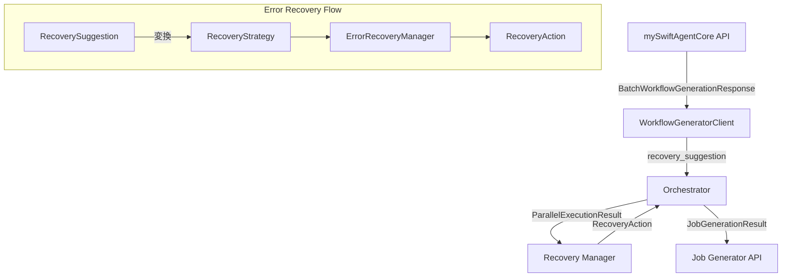
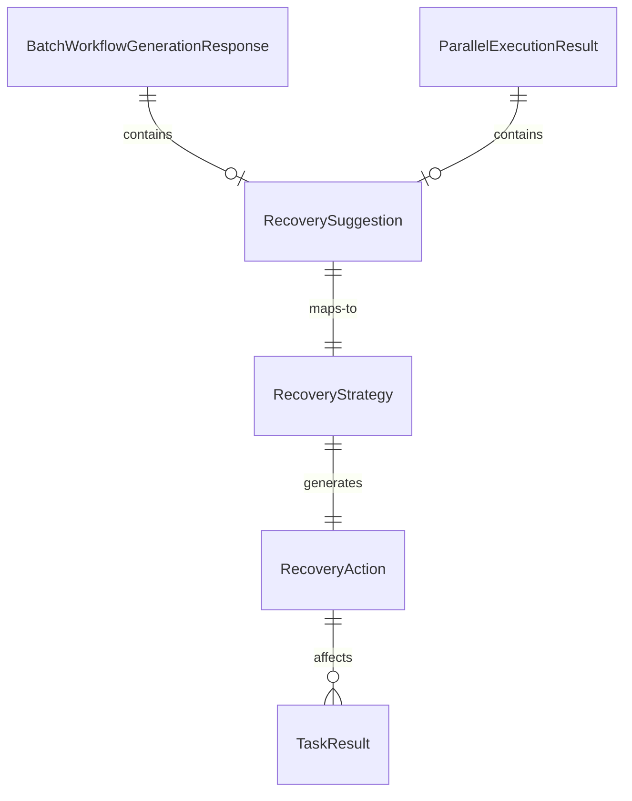

# Issue #387: recovery_suggestion処理の実装 - 設計方針書

## 概要

**Issue番号**: #387
**タイトル**: 【P2】recovery_suggestion処理の実装
**作成日**: 2026-01-21
**作成者**: design-policy skill

### 目的

mySwiftAgentCoreから返される `recovery_suggestion` を適切に処理し、既存のErrorRecoveryManagerと連携したリカバリーアクションを実装する。

### 背景

現在の実装では、mySwiftAgentCoreからの `recovery_suggestion` は警告ログとして出力されるのみで、実際のリカバリー処理は実行されない。これにより、エラー時の自動復旧機能が不完全な状態となっている。

### 参照ドキュメント

- Issue: #387
- 関連Issue: #359 (3フェーズアーキテクチャ設計), #361 (mySwiftAgentCore連携実装)
- アーキテクチャ: `docs/arch/service-dependencies.md`
- API仕様: `expertAgent/docs/API_REFERENCE.md`

---

## 1. アーキテクチャ設計

### システム構成図



### レイヤー構成

| レイヤー | コンポーネント | 責務 |
|----------|--------------|------|
| **外部API層** | mySwiftAgentCore | recovery_suggestionの生成 |
| **クライアント層** | WorkflowGeneratorClient | recovery_suggestionの受信・パース |
| **ビジネスロジック層** | Orchestrator | recovery処理の実行判断 |
| **エラー処理層** | ErrorRecoveryManager | リカバリー戦略の実行 |
| **データ層** | ParallelExecutionResult | recovery_suggestionの保持 |

---

## 2. 技術選定

### 既存技術の活用

| カテゴリ | 選定技術 | 選定理由 | 既存との整合性 |
|----------|---------|----------|---------------|
| エラー処理 | ErrorRecoveryManager | 既存のリカバリー戦略管理機構を活用 | ✅ 完全互換 |
| データ構造 | Dataclass拡張 | ParallelExecutionResultへのフィールド追加 | ✅ 後方互換性維持 |
| 型定義 | Enum (RecoverySuggestion) | 型安全性の確保 | ✅ 既存パターン踏襲 |
| 非同期処理 | async/await | 既存の非同期処理パターンに準拠 | ✅ 一貫性確保 |

---

## 3. 設計パターン

### 適用するパターン

#### Strategy Pattern (既存活用)

```python
# RecoverySuggestionからRecoveryStrategyへの変換
SUGGESTION_TO_STRATEGY = {
    RecoverySuggestion.ROLLBACK_TO_ANALYSIS: RecoveryStrategy.ROLLBACK_TO_ANALYSIS,
    RecoverySuggestion.RELAXATION: RecoveryStrategy.RELAXATION,
}
```

#### Chain of Responsibility (既存活用)

```python
# エラー処理の連鎖
mySwiftAgentCore → Orchestrator → ErrorRecoveryManager → RecoveryAction
```

#### Adapter Pattern (新規)

```python
# recovery_suggestionを既存のErrorRecoveryManagerで処理可能な形式に変換
async def _adapt_recovery_suggestion(
    self,
    suggestion: RecoverySuggestion,
    failed_tasks: list[TaskResult],
) -> RecoveryAction:
    """RecoverySuggestionをRecoveryActionに変換"""
```

---

## 4. データモデル設計

### ER図



### データ構造の拡張

#### ParallelExecutionResult の拡張

```python
@dataclass
class ParallelExecutionResult:
    """Parallel workflow execution result with recovery support.

    Attributes:
        successful_tasks: Successfully executed tasks
        failed_tasks: Failed tasks
        total_execution_time_ms: Total execution time
        recovery_suggestion: Recovery suggestion from mySwiftAgentCore (NEW)
    """
    successful_tasks: list[TaskResult] = field(default_factory=list)
    failed_tasks: list[TaskResult] = field(default_factory=list)
    total_execution_time_ms: float = 0.0
    recovery_suggestion: RecoverySuggestion | None = None  # 追加
```

---

## 5. API設計

### 内部API設計

#### recovery_suggestion処理メソッド

```python
async def _handle_recovery_suggestion(
    self,
    suggestion: RecoverySuggestion,
    execution_result: ParallelExecutionResult,
    context: ExecutionContext,
) -> ParallelExecutionResult | None:
    """
    Handle recovery suggestion from mySwiftAgentCore.

    Args:
        suggestion: Recovery suggestion from mySwiftAgentCore
        execution_result: Current execution result
        context: Execution context with dependencies

    Returns:
        Modified execution result or None to proceed with current result

    Raises:
        OrchestratorError: When ABORT is suggested
    """
```

#### ErrorRecoveryManagerとの統合API

```python
def convert_suggestion_to_strategy(
    suggestion: RecoverySuggestion,
) -> RecoveryStrategy:
    """Convert mySwiftAgentCore suggestion to internal recovery strategy."""
    return SUGGESTION_TO_STRATEGY.get(
        suggestion,
        RecoveryStrategy.FAIL_FAST  # デフォルト
    )
```

### 外部API設計への影響

現時点では、`WorkflowGeneratorResponse` (expertAgent HTTP API) には `recovery_suggestion` を含めない。内部処理での自動リカバリーに留める。

---

## 6. セキュリティ設計

### 考慮事項

| 項目 | 対策 |
|------|------|
| **情報漏洩** | recovery_suggestionの内容をログに記録する際は機密情報をマスク |
| **無限ループ** | リトライ回数の上限を既存のErrorRecoveryManagerの制限に準拠 |
| **権限昇格** | recovery処理は現在のユーザー権限内で実行 |

---

## 7. パフォーマンス設計

### 考慮事項

| 項目 | 設計方針 |
|------|----------|
| **レスポンスタイム** | recovery_suggestionの処理は非同期で実行 |
| **リトライ遅延** | 指数バックオフ戦略を採用（既存のErrorRecoveryManagerに準拠） |
| **メモリ使用量** | ParallelExecutionResultへのフィールド追加による影響は軽微 |

---

## 8. 設計上の決定事項とトレードオフ

### 決定事項1: RecoverySuggestionの値マッピング

**採用案**: 限定的なマッピング
```python
SUGGESTION_TO_STRATEGY = {
    RecoverySuggestion.ROLLBACK_TO_ANALYSIS: RecoveryStrategy.ROLLBACK_TO_ANALYSIS,
    RecoverySuggestion.RELAXATION: RecoveryStrategy.RELAXATION,
}
```

**理由**:
- mySwiftAgentCoreの2つのsuggestion値に対して、明確な対応戦略が存在
- 将来の拡張性を保ちつつ、現在の要件に最小限で対応

**代替案**:
- 全RecoveryStrategy値へのマッピング
- カスタムRecoveryStrategy の新規作成

**トレードオフ**:
- ✅ シンプルで理解しやすい
- ✅ 既存のErrorRecoveryManagerを最大限活用
- ❌ RETRY_FAILED, SKIP_FAILED, ABORTなどの戦略は直接マップされない

### 決定事項2: ParallelExecutionResultの拡張

**採用案**: recovery_suggestionフィールドの追加
```python
recovery_suggestion: RecoverySuggestion | None = None
```

**理由**:
- 後方互換性を維持
- オプショナルフィールドとして影響を最小限に

**代替案**:
- 新しいデータクラスの作成
- 継承による拡張

**トレードオフ**:
- ✅ 既存コードへの影響最小
- ✅ 型安全性の維持
- ❌ データクラスの責務が増加

### 決定事項3: 外部APIへの非公開

**採用案**: recovery_suggestionは内部処理に留める

**理由**:
- エラーリカバリーは内部的な処理詳細
- クライアントは最終結果のみを関心事とする

**代替案**:
- WorkflowGeneratorResponseに含める
- 別途エラー詳細エンドポイントを作成

**トレードオフ**:
- ✅ APIの単純性維持
- ✅ クライアントへの影響なし
- ❌ デバッグ時の可視性低下

---

## 9. 実装ガイドライン

### フェーズ1: データ構造の拡張
1. `ParallelExecutionResult` に `recovery_suggestion` フィールドを追加
2. `_convert_to_parallel_result` メソッドでフィールドを設定

### フェーズ2: recovery処理の実装
1. `_handle_recovery_suggestion` メソッドの実装
2. `SUGGESTION_TO_STRATEGY` マッピングの定義
3. ErrorRecoveryManagerとの統合

### フェーズ3: テストの実装
1. 単体テスト: recovery_suggestionの変換ロジック
2. 結合テスト: エンドツーエンドのrecovery処理
3. 受入テスト: 実際のmySwiftAgentCore連携

### フェーズ4: ログとモニタリング
1. recovery_suggestionの処理結果をログに記録
2. メトリクスの追加（recovery成功率など）

---

## 10. 想定されるリスクと対策

| リスク | 影響度 | 対策 |
|--------|--------|------|
| **無限リトライ** | 高 | ErrorRecoveryManagerの既存制限を活用 |
| **不適切なマッピング** | 中 | デフォルトをFAIL_FASTに設定 |
| **パフォーマンス劣化** | 低 | 非同期処理とタイムアウト設定 |
| **後方互換性の破壊** | 低 | オプショナルフィールドとして実装 |

---

## 11. 今後の拡張可能性

1. **RecoverySuggestion値の追加**
   - RETRY_FAILED, SKIP_FAILED, ABORTなどの直接サポート

2. **カスタムリカバリー戦略**
   - プラグイン形式でのリカバリー戦略追加

3. **外部API公開**
   - デバッグ用エンドポイントの追加
   - recovery履歴の取得API

4. **機械学習による最適化**
   - recovery成功パターンの学習
   - 自動的な戦略選択の最適化

---

**承認者**: _______________
**承認日**: _______________