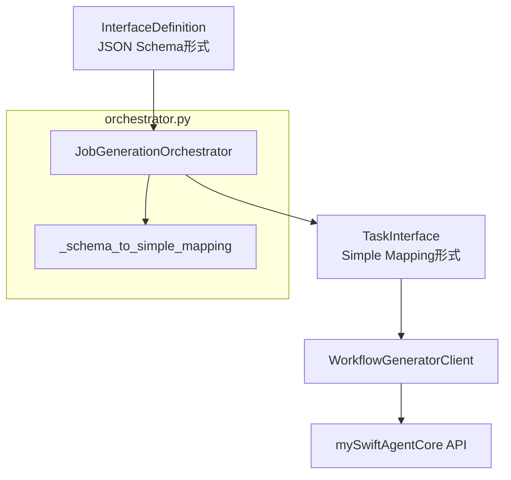
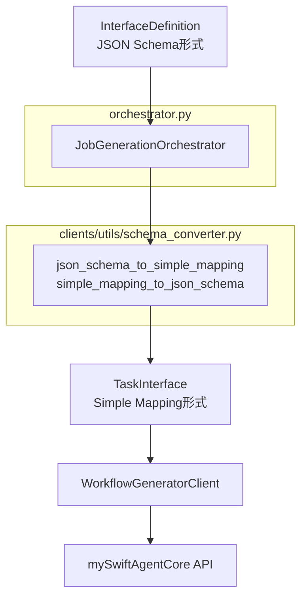

# Issue #388: スキーマ変換ロジックの分離 - 設計方針書

## 1. 概要

### 背景
Issue #387 の根本原因分析により、expertAgentとmySwiftAgentCore間でインターフェース形式の不一致が発見されました：

- **expertAgent**: JSON Schema形式 `{"type": "object", "properties": {"email": {"type": "string"}}}`
- **mySwiftAgentCore**: Simple Mapping形式 `{"email": "string"}`

現在の修正では `orchestrator.py` 内に `_schema_to_simple_mapping()` メソッドを追加していますが、責務の分離の観点から専用コンバーターへの分離を推奨します。

### 目的
スキーマ変換ロジックを独立したユーティリティモジュールとして分離し、テスト容易性・再利用性を向上させる。

## 2. システム構成

### 現状のアーキテクチャ



### 目標アーキテクチャ



## 3. 技術選定

### 設計アプローチの選定

| アプローチ | 選定 | 理由 |
|-----------|------|------|
| Option A: クライアント層での変換 | ❌ | TaskInterface型の変更が必要で影響範囲大 |
| Option B: 専用コンバーター | ✅ | 既存型定義を維持しつつ責務を分離可能 |
| Option C: 現状維持 | ❌ | 責務の混在、テスト困難性 |

### 既存パターンとの整合性

既存のユーティリティモジュール調査により、以下のパターンを踏襲：

| パターン | 例 | 本設計での適用 |
|---------|-----|--------------|
| レイヤー分離 | types → interfaces → utils → client | clients/utils層に配置 |
| 純粋関数設計 | log_sanitizer.py | ステートレスな変換関数 |
| 双方向変換 | - | 逆変換も実装（将来の拡張性） |
| 包括的テスト | test_issue387_schema_conversion.py | 正常系・異常系・情報損失テスト |

## 4. モジュール設計

### ディレクトリ構造

```
aiagent/clients/
├── utils/
│   ├── __init__.py
│   ├── log_sanitizer.py      # 既存
│   └── schema_converter.py    # 新規追加
└── ...

tests/unit/test_clients/
├── utils/
│   ├── __init__.py
│   └── test_schema_converter.py  # 新規追加
└── ...
```

### インターフェース設計

```python
# aiagent/clients/utils/schema_converter.py

from typing import Any

def json_schema_to_simple_mapping(schema: dict[str, Any]) -> dict[str, str]:
    """Convert JSON Schema to simple {field_name: type} mapping.

    Args:
        schema: JSON Schema object
            Example: {"type": "object", "properties": {"email": {"type": "string"}}}

    Returns:
        Simple mapping
            Example: {"email": "string"}

    Note:
        Information loss occurs for: required, description, format,
        nested structures, array item types
    """

def simple_mapping_to_json_schema(mapping: dict[str, str]) -> dict[str, Any]:
    """Convert simple mapping back to minimal JSON Schema.

    Args:
        mapping: Simple field:type mapping
            Example: {"email": "string"}

    Returns:
        Minimal JSON Schema
            Example: {"type": "object", "properties": {"email": {"type": "string"}}}

    Note:
        This is a lossy reconstruction - original metadata cannot be recovered
    """
```

## 5. 設計パターン

### 採用するパターン

| パターン | 理由 | 実装詳細 |
|---------|------|----------|
| **純粋関数** | ステートレスでテスト容易 | 入力→出力の決定的変換 |
| **エラー透過** | 入力エラーは変換せず透過 | 空辞書や不正な型はそのまま処理 |
| **段階的判定** | 複数の形式に対応 | 1)空チェック 2)簡易形式判定 3)JSON Schema処理 |
| **デフォルト値** | 堅牢性の確保 | 型未指定時は "string" をデフォルト |

### 既存パターンとの整合性

```python
# 既存: json_converter.py の複数フォールバック
try:
    # 直接パース
except:
    # regex抽出
except:
    # YAML fallback

# 本設計: 段階的判定パターン
if not schema:
    return {}
elif "properties" not in schema:
    # 簡易形式チェック
else:
    # JSON Schema処理
```

## 6. エラーハンドリング

### エラー処理方針

| ケース | 処理 | 理由 |
|--------|------|------|
| 空・None入力 | 空辞書を返す | 防御的プログラミング |
| 不正な型混在 | 空辞書を返す | 一貫性のない入力は拒否 |
| 型情報なし | "string"デフォルト | mySwiftAgentCoreの期待値 |
| ネストした型 | 最上位型のみ保持 | 情報損失を許容 |

### 例外は発生させない設計
- 変換関数は例外を発生させない（純粋関数の原則）
- 呼び出し側（orchestrator）でのエラーハンドリング不要

## 7. テスト戦略

### テスト構成（3層）

```
tests/unit/test_clients/utils/test_schema_converter.py
├── TestJsonSchemaToSimpleMapping    # 順変換テスト（10+ tests）
├── TestSimpleMappingToJsonSchema    # 逆変換テスト（5+ tests）
├── TestRoundTripConversion          # 往復変換テスト（3+ tests）
└── TestInformationLoss              # 情報損失文書化（5+ tests）
```

### カバレッジ目標
- 単体テストカバレッジ: 90%以上（CLAUDE.md準拠）
- 全てのエッジケースをカバー

### 既存テストの移行
```
tests/unit/langgraph/jobGeneratorV2/test_issue387_schema_conversion.py
  → tests/unit/test_clients/utils/test_schema_converter.py
```

## 8. 情報損失の文書化

### 変換で失われる情報

| 情報種別 | 例 | 影響 |
|----------|-----|------|
| required フィールド | `"required": ["email"]` | 必須項目の区別不可 |
| description | `"description": "User email"` | ドキュメント情報損失 |
| format 制約 | `"format": "email"` | バリデーション情報損失 |
| ネスト構造 | `properties.user.properties` | 階層構造の平坦化 |
| 配列要素型 | `"items": {"type": "string"}` | 要素型情報の損失 |

### 情報損失の許容理由
- mySwiftAgentCoreはLLMプロンプト生成にシンプルな形式で十分
- expertAgent内でのバリデーションは別途実施
- 将来的には共有API仕様（Issue #389）で解決予定

## 9. 設計上の決定事項とトレードオフ

### 決定事項

| 項目 | 決定 | 根拠 |
|------|------|------|
| **配置場所** | clients/utils/ | 既存のユーティリティ配置と一貫性 |
| **関数設計** | 純粋関数 | テスト容易性とステートレス性 |
| **逆変換実装** | 実装する | 将来の双方向変換ニーズに対応 |
| **例外処理** | 発生させない | 防御的プログラミング |

### トレードオフ

| 観点 | 採用案 | 代替案 | トレードオフ |
|------|--------|--------|-------------|
| **情報保持** | 情報損失を許容 | フル情報を保持する中間形式 | シンプルさ vs 完全性 |
| **エラー処理** | サイレント処理 | 例外を発生 | 堅牢性 vs 明示性 |
| **YAGNI** | 現時点で1箇所のみ使用でも分離 | orchestrator内に保持 | 将来性 vs 現在の簡潔性 |

### リスクと対策

| リスク | 対策 |
|--------|------|
| 将来的に複雑な変換が必要になる | モジュール化により拡張容易 |
| 逆変換で元の情報を復元できない | テストで情報損失を明示的に文書化 |
| 1箇所でしか使わない過剰設計 | 将来の共有API仕様対応を見据えた投資 |

## 10. 実装順序

1. **schema_converter.py の作成**
   - json_schema_to_simple_mapping() 実装
   - simple_mapping_to_json_schema() 実装

2. **テストの作成・移行**
   - 既存テストを移行
   - 逆変換テストを追加
   - 往復変換テストを追加

3. **orchestrator.py の修正**
   - _schema_to_simple_mapping() を削除
   - import を変更

4. **__init__.py の更新**
   - エクスポートを追加

## 11. 制約条件の遵守

CLAUDE.md の原則への準拠：

| 原則 | 本設計での適用 |
|------|--------------|
| **SOLID原則** | 単一責任（変換のみ）、開放閉鎖（拡張可能） |
| **KISS原則** | シンプルな純粋関数、複雑な状態管理なし |
| **YAGNI原則** | 現時点では最小限の実装、ただし将来性を考慮 |
| **DRY原則** | 変換ロジックを1箇所に集約 |

## 12. 参照ドキュメント

- expertAgent/docs/API_REFERENCE.md
- tests/unit/langgraph/jobGeneratorV2/test_issue387_schema_conversion.py
- aiagent/clients/utils/log_sanitizer.py（既存ユーティリティの参考）
- Issue #387（親Issue）
- Issue #389（長期対応：共有API仕様）

---

作成日: 2026-01-21
作成者: Claude (AI Assistant)