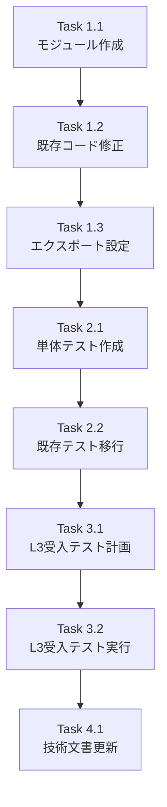

# Issue #388: スキーマ変換ロジックの分離 - 作業計画書

## Issue: スキーマ変換ロジックの分離
**Issue番号**: #388
**サイズ**: S
**作業見積**: 4時間
**優先度**: High
**依存Issue**: #387（親Issue）

## 詳細タスク分解

### 実装タスク（Phase 1）

#### Task 1.1: モジュール作成 (30分)
- [ ] `aiagent/clients/interfaces/schema_converter.py` を作成
- [ ] `json_schema_to_simple_mapping()` 関数を実装
- [ ] `simple_mapping_to_json_schema()` 関数を実装
- [ ] 型エイリアス（JsonSchema, SimpleMapping）を定義
- [ ] デバッグログ機能を実装

#### Task 1.2: 既存コード修正 (30分)
- [ ] `orchestrator.py` から `_schema_to_simple_mapping()` メソッドを削除
- [ ] `orchestrator.py` に新モジュールのimportを追加
- [ ] 呼び出し箇所を `json_schema_to_simple_mapping()` に変更

#### Task 1.3: エクスポート設定 (15分)
- [ ] `aiagent/clients/interfaces/__init__.py` を更新
- [ ] 新関数と型エイリアスをエクスポート

### テストタスク（Phase 2: TDD - CI実行可能）

#### Task 2.1: 単体テスト作成 (1時間)
- [ ] `tests/unit/test_clients/test_schema_converter.py` を作成
- [ ] 正常系テスト（9ケース）
- [ ] 異常系テスト（4ケース）
- [ ] 往復変換テスト（3ケース）
- [ ] 情報損失文書化テスト（5ケース）
- [ ] ログ出力テスト（5ケース）

#### Task 2.2: 既存テスト移行 (15分)
- [ ] `test_issue387_schema_conversion.py` を更新
- [ ] 新モジュールを参照するよう修正
- [ ] 非推奨コメントを追加

### 受入テストタスク（Phase 3: L3ローカル受入テスト）【必須】

#### Task 3.1: L3受入テスト計画 (30分)
- [ ] 受入条件の定義
- [ ] テストシナリオの作成
- [ ] `tests/acceptance/test_issue388_acceptance.py` の作成

#### Task 3.2: L3受入テスト実行 (30分)
- [ ] JobGenerator APIを通じたスキーマ変換の動作確認
- [ ] mySwiftAgentCoreとの統合確認
- [ ] ログ出力の確認

### ドキュメントタスク（Phase 4）

#### Task 4.1: 技術文書更新 (30分)
- [ ] API_REFERENCE.md にスキーマコンバーター仕様を追加
- [ ] 使用例を記載
- [ ] 情報損失に関する注意事項を明記

## タスク依存関係



## 作業スケジュール

### Day 1（2時間）
- 09:00-10:00: Task 1.1～1.3（実装タスク）
- 10:00-11:00: Task 2.1（単体テスト作成）

### Day 2（2時間）
- 09:00-09:15: Task 2.2（既存テスト移行）
- 09:15-10:00: Task 3.1～3.2（L3受入テスト）
- 10:00-10:30: Task 4.1（ドキュメント）
- 10:30-11:00: 最終確認・マージ準備

## チェックポイント

| タイミング | 確認事項 | 対応 |
|-----------|---------|------|
| Task 1.3完了時 | importエラーがないか | `python -c "from aiagent.clients.interfaces.schema_converter import json_schema_to_simple_mapping"` |
| Task 2.1完了時 | テストカバレッジ90%以上 | pytest --cov |
| Task 3.2完了時 | JobGenerator APIが正常動作 | curl実行確認 |
| Phase完了時 | Ruff/MyPyエラーゼロ | `./scripts/pre-push-check-all.sh` |

## リスクと対策

| リスク | 発生確率 | 影響 | 対策 |
|-------|---------|------|------|
| 既存テストが失敗する | 中 | 中 | 既存テストをまず実行して互換性確認 |
| import循環参照 | 低 | 高 | 純粋関数として実装、依存を最小化 |
| パフォーマンス劣化 | 低 | 低 | 大規模データでプロファイリング |

## 成果物チェックリスト

### コード
- [x] `aiagent/clients/interfaces/schema_converter.py`
- [x] `aiagent/langgraph/jobGeneratorV2/orchestrator.py`（修正）
- [x] `aiagent/clients/interfaces/__init__.py`（修正）

### テスト
- [x] `tests/unit/test_clients/test_schema_converter.py`
- [x] `tests/unit/langgraph/jobGeneratorV2/test_issue387_schema_conversion.py`（修正）
- [x] `tests/acceptance/test_issue388_acceptance.py`

### ドキュメント
- [ ] `expertAgent/docs/API_REFERENCE.md`（追記）
- [x] `dev-reports/feature/issue/388/design-policy.md`
- [x] `dev-reports/feature/issue/388/architecture-review.md`
- [x] `dev-reports/feature/issue/388/work-plan.md`（本文書）

## L3受入テスト計画【必須セクション】

### 受入条件
1. JobGenerator APIがスキーマ変換を正しく実行
2. mySwiftAgentCoreへのリクエストが成功
3. 情報損失がデバッグログに記録される

### テストシナリオ

```bash
# サービス起動確認
curl -sf http://localhost:8004/health && echo "✅ expertAgent healthy"

# 1. Job生成リクエスト（JSON Schema形式のインターフェースを含む）
# Note: エンドポイントは /v1/job-generator（/generate なし）
#       リクエストは user_requirement フィールドを使用
curl -s -X POST http://localhost:8004/v1/job-generator \
  -H "Content-Type: application/json" \
  -d '{
    "user_requirement": "Create a task to send an email with recipient, subject and body fields",
    "project_id": "default_project"
  }' | jq .

# 2. デバッグログ確認（情報損失の記録）
tail -n 50 logs/expertAgent.log | grep -E "(schema_converter|Information loss)"

# 3. mySwiftAgentCoreへの変換結果確認
# WorkflowGeneratorClient経由でSimple Mapping形式が送信されることを確認
curl -s http://localhost:8006/api/v1/generator/workflow/batch \
  -H "Content-Type: application/json" | jq '.tasks[].interface'
```

### 期待される結果
1. Job生成が成功し、適切なインターフェースが生成される
2. ログに情報損失の詳細が記録される（required, format等）
3. mySwiftAgentCoreへのリクエストがSimple Mapping形式で送信される

## Definition of Done

Issue完了条件：
- [x] すべての実装タスクが完了
- [x] 単体テストカバレッジ90%以上（実測: 100%）
- [x] 静的解析エラーゼロ（Ruff, MyPy）
- [x] L3受入テスト全パス（20 passed）
- [ ] CI/CDグリーン
- [ ] コードレビュー承認
- [ ] API_REFERENCE.mdへの仕様追記

---

作成日: 2026-01-21
作成者: Claude AI Assistant
Issue: #388 スキーマ変換ロジックの分離