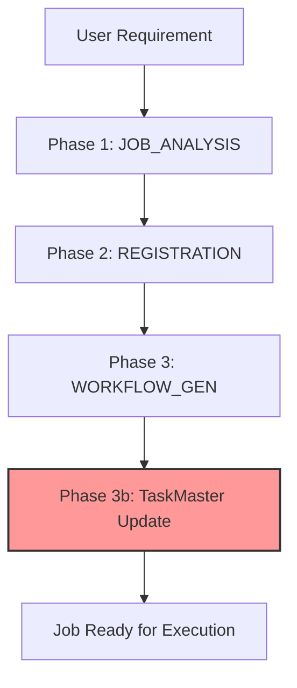
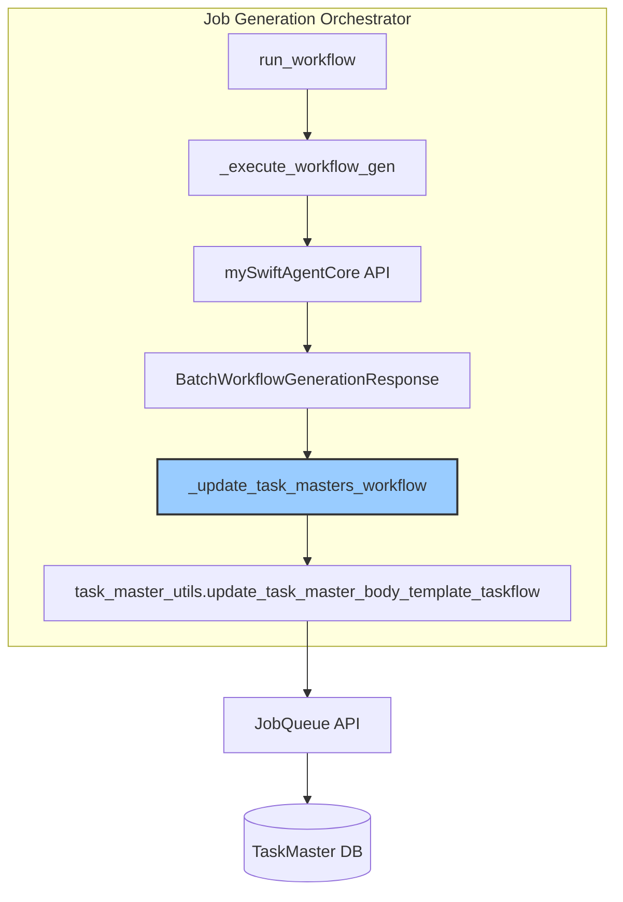
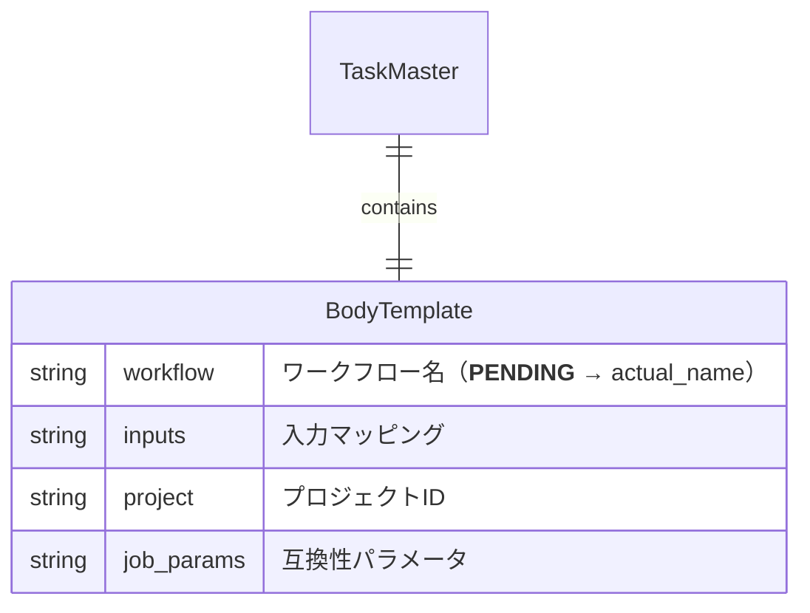

# Issue #390 設計方針書：TaskMaster Workflow更新機能実装

## 概要

Issue #390 で特定された問題#4（TaskMaster workflow更新の欠落）に対する設計方針を策定する。本設計は、Job Generator V2のPhase 3（WORKFLOW_GEN）完了後にTaskMasterの`body_template.workflow`フィールドを`__PENDING__`から実際のワークフロー名に更新する機能を実装する。

## 現状調査結果

### Issue #390 の内容

- **問題**: mySwiftAgentCoreパスでワークフロー生成成功後、TaskMasterの更新が行われない
- **影響**: ジョブ実行時に `HTTP 404: Workflow '__PENDING__' not found` エラー
- **関連Issue**: Issue #396（本設計の実装Issue）

### 既存アーキテクチャ

#### Job Generator V2 3フェーズアーキテクチャ



- **Phase 1**: ジョブ分析（タスク分解 + インターフェース設計）
- **Phase 2**: マスター登録（JobMaster, TaskMaster, InterfaceMaster）
- **Phase 3**: ワークフロー生成（mySwiftAgentCore経由）
- **Phase 3b**: **TaskMaster更新（未実装）** ← 本設計の対象

### 既存の更新関数

```python
# expertAgent/aiagent/langgraph/jobGeneratorV2/workflows/registration/task_master_utils.py
async def update_task_master_body_template_taskflow(
    task_master_id: str,
    workflow_name: str,
) -> bool:
    """TaskMasterのbody_template.workflowを更新"""
```

この関数は既に実装済みで、GraphAiServerパスでは使用されている。

## アーキテクチャ設計

### システム構成図



### レイヤー構成

| レイヤー | 責務 | 実装ファイル |
|---------|------|------------|
| オーケストレーション層 | ワークフロー全体の制御 | `orchestrator.py` |
| ユーティリティ層 | TaskMaster更新ロジック | `task_master_utils.py` |
| クライアント層 | JobQueue API通信 | `jobqueue_client.py` |
| データアクセス層 | TaskMaster永続化 | JobQueue Service |

## 技術選定

| カテゴリ | 選定技術 | 選定理由 | 既存との整合性 |
|---------|---------|---------|---------------|
| 非同期処理 | Python asyncio | 既存コードベースとの統一性 | ✅ 全体で使用 |
| エラーハンドリング | Try-Except + ロギング | 部分的失敗を許容 | ✅ 既存パターン |
| API通信 | JobqueueClient | 既存クライアントの再利用 | ✅ 実装済み |
| トレース | Langfuse integration | 分散トレーシング | ✅ Phase 3で使用 |

## 設計パターン

### 1. Strategy Pattern の活用

既存のPhase-based実行に新しいステップを追加：

```python
class JobGenerationOrchestrator:
    async def _execute_workflow_gen(...):
        # 1. ワークフロー生成
        response = await self._generate_workflows_batch(...)

        # 2. TaskMaster更新（新規追加）
        await self._update_task_masters_workflow(response, task_identifiers)

        # 3. 結果変換
        return self._convert_to_parallel_result(response, task_identifiers)
```

### 2. Fail-Safe Pattern

部分的な更新失敗を許容し、全体の処理を継続：

```python
async def _update_task_masters_workflow(
    self,
    response: BatchWorkflowGenerationResponse,
    task_identifiers: list[UnifiedTaskIdentifier]
) -> None:
    """Update TaskMasters with generated workflow names (fail-safe)."""
    for workflow in response.workflows:
        try:
            await update_task_master_body_template_taskflow(...)
        except Exception as e:
            logger.error(f"Failed to update TaskMaster: {e}")
            # 個別の失敗は全体の処理を止めない
```

## データモデル設計

### TaskMaster body_template 構造



### 更新フロー

```
Before (Phase 2):
{
    "workflow": "__PENDING__",
    "inputs": "{{job.body}}",
    "project": "{{job.body.project}}",
    "job_params": "{{job.body}}"
}

After (Phase 3b):
{
    "workflow": "task_001_google_search",  ← 更新
    "inputs": "{{job.body}}",             ← 保持
    "project": "{{job.body.project}}",    ← 保持
    "job_params": "{{job.body}}"          ← 保持
}
```

## API設計

### 内部メソッド追加

```python
async def _update_task_masters_workflow(
    self,
    response: BatchWorkflowGenerationResponse,
    task_identifiers: list[UnifiedTaskIdentifier]
) -> None:
    """
    Update TaskMasters with generated workflow names.

    Issue #390: This method updates the body_template.workflow field
    from '__PENDING__' to the actual workflow name after successful
    workflow generation.

    Args:
        response: Batch workflow generation response from mySwiftAgentCore
        task_identifiers: List of task identifiers with master IDs

    Note:
        - Failures in individual updates do not stop the overall process
        - Each update is logged separately for debugging
    """
```

### 既存APIの活用

JobQueue API（既存）:
- `PUT /api/v1/task-masters/{id}` - TaskMaster更新エンドポイント

## セキュリティ設計

| 項目 | 対策 | 実装 |
|------|------|------|
| 認証 | JobQueue APIトークン | 既存のJobqueueClient使用 |
| 権限 | job_generator_v2として更新 | `updated_by`フィールドで記録 |
| 監査 | 更新理由の記録 | `change_reason`フィールド使用 |

## パフォーマンス設計

### 並列更新

```python
# 複数のTaskMasterを並列更新
update_tasks = [
    update_task_master_body_template_taskflow(
        identifier.task_master_id,
        workflow.workflow_name
    )
    for identifier, workflow in zip(task_identifiers, workflows)
    if identifier.task_master_id and workflow
]
await asyncio.gather(*update_tasks, return_exceptions=True)
```

### キャッシング戦略

- TaskMaster取得結果はキャッシュしない（常に最新状態を取得）
- 更新は冪等性を保証（同じworkflow名での複数更新は安全）

## 設計上の決定事項とトレードオフ

### 1. 更新タイミング

| 選択肢 | 決定 | 理由 |
|--------|------|------|
| ワークフロー生成直後 | ✅ 採用 | 即座に実行可能な状態にする |
| ジョブ実行時 | ❌ 不採用 | 実行時のオーバーヘッドを避ける |
| バッチ処理 | ❌ 不採用 | リアルタイム性が重要 |

### 2. エラーハンドリング

| 選択肢 | 決定 | 理由 |
|--------|------|------|
| 全体失敗 | ❌ 不採用 | 部分的成功でも価値がある |
| 個別失敗許容 | ✅ 採用 | Fail-safe設計で堅牢性確保 |
| リトライ機構 | ❌ 不採用 | 既存のPhaseレベルリトライで十分 |

### 3. 実装場所

| 選択肢 | 決定 | 理由 |
|--------|------|------|
| orchestrator.py | ✅ 採用 | 中央制御で一貫性確保 |
| workflow_gen内 | ❌ 不採用 | 責務の分離を維持 |
| 別サービス | ❌ 不採用 | 複雑性を避ける |

## 制約条件への準拠

### SOLID原則
- **S**: 単一責任 - `_update_task_masters_workflow`は更新のみ担当
- **O**: 開放/閉鎖 - 既存の`_execute_workflow_gen`を拡張
- **L**: リスコフ置換 - 適用なし
- **I**: インターフェース分離 - 既存インターフェースを維持
- **D**: 依存性逆転 - 抽象（protocol）に依存

### その他の原則
- **KISS**: 既存関数の再利用で複雑性を最小化
- **YAGNI**: 必要最小限の機能のみ実装
- **DRY**: `update_task_master_body_template_taskflow`を再利用

## リスクと対策

| リスク | 影響度 | 対策 |
|--------|--------|------|
| 更新失敗によるジョブ実行不可 | 高 | ログ記録 + アラート通知 |
| 部分的更新による不整合 | 中 | 各TaskMasterの独立性を保持 |
| パフォーマンス劣化 | 低 | 並列更新で最小化 |

## 実装計画

1. **Phase 1**: `_update_task_masters_workflow`メソッド実装
2. **Phase 2**: `_execute_workflow_gen`への統合
3. **Phase 3**: 既存テストのskip解除と検証
4. **Phase 4**: E2Eテスト実行

## 参照ドキュメント

- Issue #390: Bug: JobGenerationOrchestrator - TaskMaster workflow field not updated
- Issue #396: 本設計の実装Issue
- `expertAgent/docs/API_REFERENCE.md`: API仕様
- `docs/arch/service-dependencies.md`: サービス間依存関係

---

**作成日**: 2026-01-23
**作成者**: Claude Code (Design Policy Skill)
**対象Issue**: #390