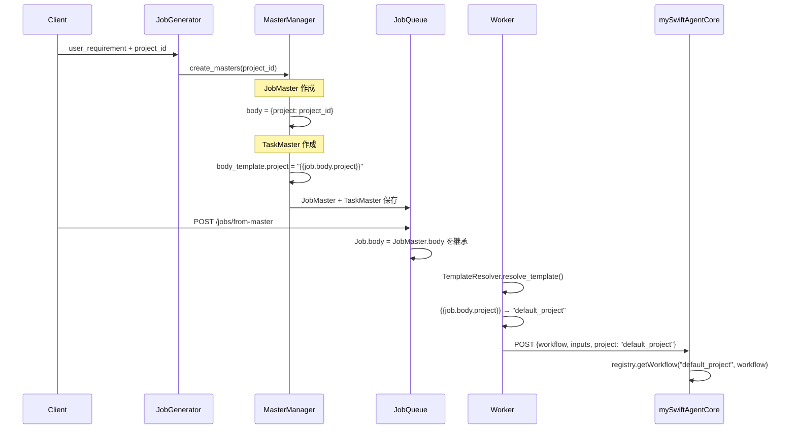
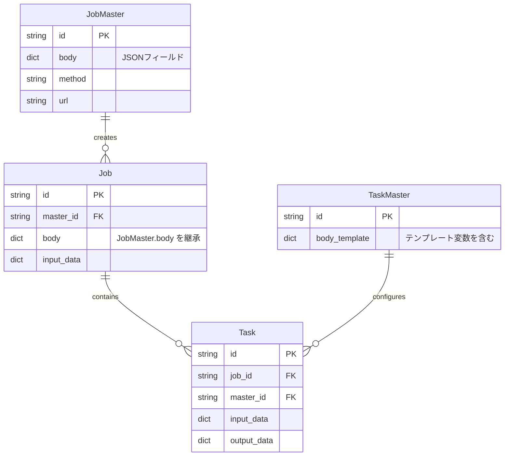

# 設計方針書: Issue #391 - TaskMaster body_template の project 設定修正と JobMaster への project 追加

作成日: 2024-01-21
作成者: design-policy skill
Issue: [#391](https://github.com/Kewton/MySwiftAgent/issues/391)

---

## 1. 概要

### 1.1 問題の背景

Job Generator V2で生成されたジョブを実行する際、mySwiftAgentCore がワークフロー検索に失敗する問題が発生しています。根本原因は以下の2点です：

1. **テンプレート変数の誤り**: TaskMaster の body_template で `{{job.project}}` を使用しているが、Job モデルに `project` 属性が存在しない
2. **データ伝播の欠落**: JobMaster 作成時に `body.project` が設定されていないため、Job 実行時に project 情報が伝わらない

### 1.2 設計目標

- 既存のテンプレート解決メカニズムを活用し、最小限の変更で問題を解決
- Job Generator V2 の 3フェーズアーキテクチャとの整合性を維持
- 既存のテンプレートパターンおよび検証機構と互換性を保つ

---

## 2. アーキテクチャ設計

### 2.1 システム構成図

```mermaid
graph TD
    subgraph "Job Generator V2 (expertAgent)"
        A[Phase 1: JOB_ANALYSIS] --> B[Phase 2: REGISTRATION]
        B --> C[Phase 3: WORKFLOW_GEN]

        subgraph "Phase 2 Details"
            B --> D[MasterManagerSubWorkflow]
            D --> E[JobMaster 作成]
            D --> F[TaskMaster 作成]
            E --> |body.project 追加| G[body: {project: project_id}]
            F --> |テンプレート修正| H["project: {{job.body.project}}"]
        end
    end

    subgraph "Job 実行 (jobqueue)"
        I[Job 作成 from JobMaster] --> J[body 継承]
        J --> K[Task 実行]
        K --> L[TemplateResolver]
        L --> |解決| M["{{job.body.project}} → actual_project"]
    end

    subgraph "Workflow 実行 (mySwiftAgentCore)"
        M --> N[POST /api/v1/taskflow/execute]
        N --> O[registry.getWorkflow(project, workflowName)]
    end

    C --> K
    G --> J
    H --> L
```

### 2.2 データフロー



---

## 3. 技術選定

### 3.1 選定理由

| カテゴリ | 選定技術 | 選定理由 | 既存との整合性 |
|---------|---------|---------|---------------|
| テンプレート変数 | `{{job.body.project}}` | 既存の TemplatePatterns がサポート済み | ✅ 完全互換 |
| データ保存場所 | JobMaster.body | Job 作成時に自動的に body が継承される | ✅ 既存フロー活用 |
| 解決メカニズム | TemplateResolver | 既存のドット記法パス解決を活用 | ✅ 変更不要 |
| 検証 | BodyTemplateValidator | 既存の検証ロジックで対応可能 | ✅ 変更不要 |

### 3.2 代替案との比較

| 案 | 内容 | メリット | デメリット | 採用 |
|----|------|---------|------------|------|
| A | `{{job.body.project}}` 使用 | 既存パターン活用、変更最小 | JobMaster.body への追加必要 | ✅ |
| B | Job モデルに project 追加 | 直感的な `{{job.project}}` | DBマイグレーション必要、影響大 | ❌ |
| C | `{{job.input_data.project}}` 使用 | input_data は既存フィールド | input_data の用途と不整合 | ❌ |

---

## 4. 設計パターン

### 4.1 採用パターン

#### Template Variable Pattern（既存）

```python
# TemplatePatterns.JOB_VARIABLE
r"\{\{job\.(body|input_data)(\.[\w.]+)?\}\}"
```

このパターンにより `{{job.body.project}}` は自動的にサポートされます。

#### Builder Pattern（既存）

```python
class MasterManagerSubWorkflow:
    def _build_body_template(self, order: int) -> dict[str, Any]:
        # エンジン別にテンプレート構造を構築
        if self._engine == "taskflow":
            return {
                "workflow": "__PENDING__",
                "inputs": "...",
                "project": "{{job.body.project}}"  # 修正点
            }
```

---

## 5. データモデル設計

### 5.1 既存モデル（変更なし）



### 5.2 データ構造の変更

#### JobMaster.body（新規追加）

```json
{
  "project": "default_project"  // Job生成時の project_id を保存
}
```

#### TaskMaster.body_template（修正）

```json
{
  "workflow": "__PENDING__",
  "inputs": "{{job.body}}",
  "project": "{{job.body.project}}"  // {{job.project}} から修正
}
```

---

## 6. API設計

変更なし。既存のAPIエンドポイントおよびリクエスト/レスポンス形式を維持。

---

## 7. セキュリティ設計

### 7.1 考慮事項

- **project 情報の露出**: JobMaster.body に project_id を含めることで、Job の body に project 情報が含まれる
- **権限検証**: 既存の mySwiftAgentCore での project ベース権限検証がそのまま機能

### 7.2 リスク評価

- **低リスク**: project 情報は既に API リクエストで渡されている公開情報
- **影響なし**: 既存のセキュリティモデルに変更なし

---

## 8. パフォーマンス設計

### 8.1 影響評価

- **テンプレート解決**: 既存の `{{job.body.field}}` パターンと同じ処理時間
- **データサイズ**: JobMaster.body に project フィールド追加（数十バイト）
- **DB負荷**: 変更なし（既存フィールドの利用）

---

## 9. 設計上の決定事項とトレードオフ

### 9.1 決定事項

1. **`{{job.body.project}}` の採用**
   - 理由: 既存のテンプレートパターンで対応可能、jobqueue 側の変更不要
   - トレードオフ: JobMaster 作成時の追加処理が必要

2. **JobMaster.body への project 追加**
   - 理由: Job 作成時の自動継承メカニズムを活用
   - トレードオフ: JobMaster のデータ構造に依存

3. **Job モデルの変更を避ける**
   - 理由: DBマイグレーションを回避、影響範囲を最小化
   - トレードオフ: 直感的でない `{{job.body.project}}` 記法

### 9.2 リスクと対策

| リスク | 影響度 | 発生確率 | 対策 |
|--------|-------|---------|------|
| JobMaster.body が null の場合 | 高 | 低 | body 初期化を確実に実施 |
| project_id が空文字の場合 | 中 | 低 | 入力検証で対処 |
| 既存 JobMaster との互換性 | 低 | 中 | body.project が null でも動作継続 |

---

## 10. 実装方針

### 10.1 修正対象ファイル

| ファイル | 修正内容 | 優先度 |
|---------|---------|--------|
| `expertAgent/.../master_manager.py` | `_build_body_template`: project 設定修正 | 必須 |
| `expertAgent/.../master_manager.py` | `_create_job_master`: body.project 追加 | 必須 |

### 10.2 実装手順

1. **Step 1**: `_build_body_template` メソッドの修正
   ```python
   # Before
   "project": "{{job.project}}"

   # After
   "project": "{{job.body.project}}"
   ```

2. **Step 2**: `_create_job_master` メソッドの修正
   ```python
   body = {
       "project": project_id,  # 追加
   }
   ```

3. **Step 3**: 単体テストの更新
   - `test_master_manager.py` のアサーション修正
   - `test_registration/test_master_manager.py` のアサーション修正

4. **Step 4**: E2E テストで動作確認
   - Issue #390 の受入テストを再実行

---

## 11. 検証計画

### 11.1 単体テスト

- `_build_body_template` が正しい形式を返すことを確認
- `_create_job_master` が body.project を含むことを確認

### 11.2 結合テスト

- JobMaster → Job → Task の一連のフローで project が伝播することを確認
- TemplateResolver が `{{job.body.project}}` を正しく解決することを確認

### 11.3 E2E テスト

- Job Generator V2 でジョブ生成 → Job 実行 → mySwiftAgentCore 呼び出しの成功確認

---

## 12. 参照ドキュメント

- [expertAgent API Reference](expertAgent/docs/API_REFERENCE.md) - Job Generator V2 仕様
- [Service Dependencies](docs/arch/service-dependencies.md) - サービス間連携
- Issue #390 - 関連する TaskMaster workflow field 更新
- Issue #361 - mySwiftAgentCore 統合

---

## 13. まとめ

本設計は既存のアーキテクチャとテンプレート解決メカニズムを最大限活用し、最小限の変更で問題を解決します。Job モデルの変更を避けることで、DBマイグレーションやAPI の破壊的変更を回避し、安全かつ迅速な実装を可能にします。