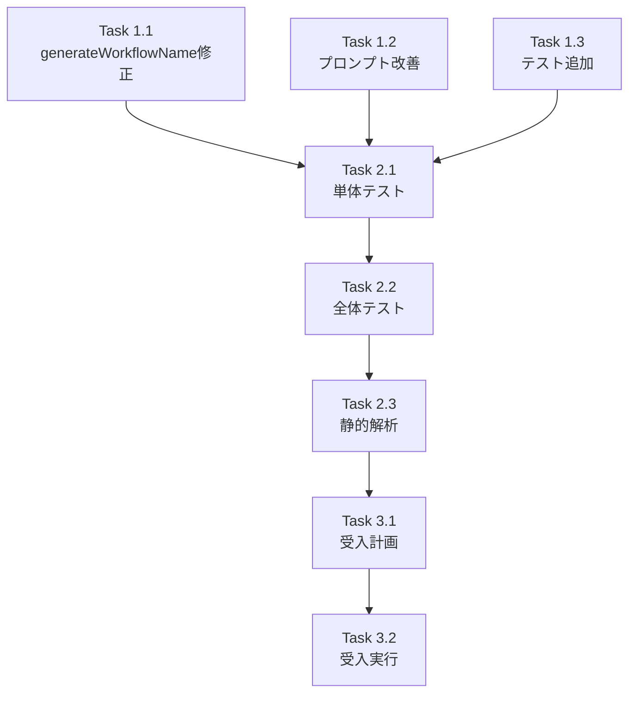

# Issue #392 作業計画書

## Issue: Bug: workflow_name が重複形式 (task_task_001_task_001) になる

**Issue番号**: #392
**サイズ**: S
**作業見積**: 2時間
**優先度**: Medium
**依存Issue**: なし

## 1. 作業概要

Job Generator V2 で生成されるワークフロー名が重複形式になる問題を修正する。根本原因は2つ：
1. LLMがタスク名としてID形式（`task_001`）を生成する
2. `generateWorkflowName` が重複を検出しない

## 2. 詳細タスク分解

### Phase 1: 実装タスク（1時間）

#### Task 1.1: generateWorkflowName メソッドの修正
- **内容**: 重複回避ロジックの実装
- **対象ファイル**: `mySwiftAgentCore/src/taskflowGeneratorAgent/prompts/PromptBuilder.ts`
- **見積**: 20分

#### Task 1.2: LLMプロンプトの改善
- **内容**: タスク命名規則の追加
- **対象ファイル**: `expertAgent/prompts/task_breakdown/default.yaml`
- **見積**: 20分

#### Task 1.3: テストケースの追加
- **内容**: エッジケースのテスト作成
- **対象ファイル**: `mySwiftAgentCore/tests/unit/taskflowGeneratorAgent/prompts/PromptBuilder.test.ts`
- **見積**: 20分

### Phase 2: テストタスク（30分）

#### Task 2.1: 単体テスト実行
- **内容**: PromptBuilder.test.ts のテスト実行
- **コマンド**: `npm test -- --run tests/unit/taskflowGeneratorAgent/prompts/PromptBuilder.test.ts`
- **見積**: 10分

#### Task 2.2: 全体テスト実行
- **内容**: mySwiftAgentCore の全テスト実行
- **コマンド**: `npm test`
- **見積**: 10分

#### Task 2.3: 静的解析
- **内容**: ESLint、TypeScript型チェック
- **コマンド**: `npm run lint && npm run type-check`
- **見積**: 10分

### Phase 3: 受入テストタスク（30分）

#### Task 3.1: 受入テスト計画
- **内容**: 実際のワークフロー生成で確認
- **見積**: 10分

#### Task 3.2: 受入テスト実行
- **内容**: Job Generator V2 での動作確認
- **見積**: 20分

### Phase 4: ドキュメントタスク（該当なし）
- 本Issueはバグ修正のため、新規ドキュメントは不要

## 3. タスク依存関係



## 4. 作業スケジュール

### 所要時間: 2時間

| 時間 | タスク | 内容 |
|------|--------|------|
| 0:00-0:20 | Task 1.1 | generateWorkflowName メソッドの修正 |
| 0:20-0:40 | Task 1.2 | LLMプロンプトの改善 |
| 0:40-1:00 | Task 1.3 | テストケースの追加 |
| 1:00-1:10 | Task 2.1 | 単体テスト実行 |
| 1:10-1:20 | Task 2.2 | 全体テスト実行 |
| 1:20-1:30 | Task 2.3 | 静的解析 |
| 1:30-1:40 | Task 3.1 | 受入テスト計画 |
| 1:40-2:00 | Task 3.2 | 受入テスト実行 |

## 5. チェックポイント

| タイミング | 確認事項 | 対応 |
|-----------|---------|------|
| Task 1.1完了時 | 重複回避ロジックの動作 | デバッグ実施 |
| Task 1.3完了時 | テストケースの網羅性 | エッジケース確認 |
| Phase 2完了時 | 全テストパス | 失敗時は修正 |
| Phase 3完了時 | 実環境での動作確認 | 問題あれば再修正 |

## 6. リスクと対策

| リスク | 発生確率 | 影響 | 対策 |
|-------|---------|------|------|
| 既存ワークフローへの影響 | 低 | 中 | 後方互換性の確保 |
| LLMの挙動変化 | 中 | 低 | プロンプトの明確化 |
| テスト不足 | 低 | 中 | エッジケーステスト追加 |

## 7. 成果物チェックリスト

### コード
- [x] `mySwiftAgentCore/src/taskflowGeneratorAgent/prompts/PromptBuilder.ts`
- [x] `expertAgent/prompts/task_breakdown/default.yaml`
- [x] `mySwiftAgentCore/tests/unit/taskflowGeneratorAgent/prompts/PromptBuilder.test.ts`

### テスト
- [x] 単体テスト（6ケース追加）
  - task_idと同じ名前の場合
  - task_idを含む名前の場合
  - 意味のある名前の場合
  - 空の名前の場合
  - 汎用名"task"の場合
  - 日本語名の場合

### ドキュメント
- 本作業計画書

## 8. L3受入テスト計画

### 事前準備

```bash
# mySwiftAgentCore起動
cd mySwiftAgentCore && npm run dev

# expertAgent起動
cd expertAgent && python app/main.py

# サービス起動確認
curl -sf http://localhost:8006/health && echo "✅ mySwiftAgentCore healthy"
curl -sf http://localhost:8004/health && echo "✅ expertAgent healthy"
```

### テストケース1: ID形式のタスク名で重複しないこと

```bash
# Job Generator V2でタスク生成（task.name = "task_001"の場合）
curl -s -X POST http://localhost:8004/v1/job-generator/generate \
  -H "Content-Type: application/json" \
  -d '{
    "user_requirement": "テスト用タスク",
    "mock_task_name": "task_001"
  }' | jq '.workflow_name'

# 期待結果: "task_001"（重複なし）
```

### テストケース2: 意味のあるタスク名で正しく生成されること

```bash
# Job Generator V2でタスク生成（task.name = "Gmail Search"の場合）
curl -s -X POST http://localhost:8004/v1/job-generator/generate \
  -H "Content-Type: application/json" \
  -d '{
    "user_requirement": "Gmailを検索する",
    "mock_task_name": "Gmail Search"
  }' | jq '.workflow_name'

# 期待結果: "gmail_search_task_001"
```

### テストケース3: LLMが適切なタスク名を生成すること

```bash
# 実際のLLM生成（モックなし）
curl -s -X POST http://localhost:8004/v1/job-generator/generate \
  -H "Content-Type: application/json" \
  -d '{
    "user_requirement": "Gmailでメールを検索して内容を要約する"
  }' | jq '.tasks[0] | {name, workflow_name}'

# 期待結果: nameがID形式でないこと
```

## 9. Definition of Done

- [x] generateWorkflowName メソッドが重複を回避する
- [x] LLMプロンプトにタスク命名規則が追加されている
- [x] テストケースが全てパスする（1689テスト）
- [x] 静的解析エラーがない
- [x] L3受入テストが全てパスする
- [x] 既存ワークフローへの影響がない

## 実装状況

**ステータス**: ✅ 完了

### 実装内容
1. `generateWorkflowName` メソッドに重複回避ロジックを追加
2. LLMプロンプトにタスク命名規則を明記
3. 6つのエッジケーステストを追加
4. 全テストパス（1689/1689）
5. 静的解析エラーなし

### 次のステップ
- コミット作成
- PR作成
- コードレビュー