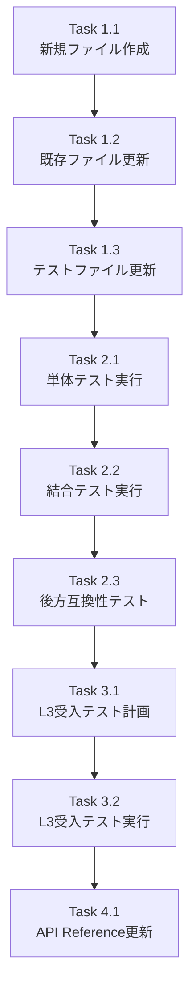

# Issue #393 作業計画書

**作成日**: 2026-01-22
**作成者**: Work Plan Agent

---

## Issue: Tech Debt: update_task_master_body_template_taskflow 関数の移動

**Issue番号**: #393
**サイズ**: S
**作業見積**: 2時間
**優先度**: Low
**依存Issue**: なし（Issue #361 Phase 2として）

---

## 1. 詳細タスク分解

### Phase 1: 実装タスク

#### Task 1.1: 新規ファイル作成
- `registration/task_master_utils.py` を作成
- 関数 `update_task_master_body_template_taskflow` を移動
- 必要な import を追加（`settings` モジュール含む）
- **見積**: 15分

#### Task 1.2: 既存ファイル更新
- `workflow_gen/workflow.py` の import パス更新
- `workflow_gen/workflow_registrar.py` に後方互換性の re-export 追加
- `registration/__init__.py` にエクスポート追加
- **見積**: 30分

#### Task 1.3: テストファイル更新
- `tests/unit/test_job_generator_v2/test_orchestrator_issue390.py` の import パス更新
- `tests/integration/test_issue390_integration.py` の import パス更新
- **見積**: 15分

### Phase 2: テストタスク（TDD - CI実行可能）

#### Task 2.1: 単体テスト実行
- 更新した単体テストの実行・確認
- **見積**: 15分

#### Task 2.2: 結合テスト実行
- 更新した結合テストの実行・確認
- **見積**: 15分

#### Task 2.3: 後方互換性テスト
- 旧 import パスでの動作確認（DeprecationWarning 確認）
- **見積**: 10分

### Phase 3: L3ローカル受入テスト

#### Task 3.1: L3受入テスト計画
- 移動後の関数が正しく動作することの確認計画
- **見積**: 10分

#### Task 3.2: L3受入テスト実行
- TaskFlow V2 ワークフローの実行確認
- **見積**: 20分

### Phase 4: ドキュメントタスク

#### Task 4.1: API Reference更新
- 必要に応じて API ドキュメントの更新
- **見積**: 10分

---

## 2. タスク依存関係



---

## 3. 作業スケジュール

| 時間 | タスク | 内容 |
|------|--------|------|
| 0:00-0:15 | Task 1.1 | 新規ファイル作成 |
| 0:15-0:45 | Task 1.2 | 既存ファイル更新 |
| 0:45-1:00 | Task 1.3 | テストファイル更新 |
| 1:00-1:15 | Task 2.1 | 単体テスト実行 |
| 1:15-1:30 | Task 2.2 | 結合テスト実行 |
| 1:30-1:40 | Task 2.3 | 後方互換性テスト |
| 1:40-1:50 | Task 3.1 | L3受入テスト計画 |
| 1:50-2:10 | Task 3.2 | L3受入テスト実行 |
| 2:10-2:20 | Task 4.1 | ドキュメント更新 |

---

## 4. チェックポイント

| タイミング | 確認事項 | 対応 |
|-----------|---------|------|
| Task 1.3 完了時 | すべての import パスが更新されているか | grep で確認 |
| Task 2.3 完了時 | すべてのテストがグリーンか | CI 結果確認 |
| Task 3.2 完了時 | ワークフロー実行が成功するか | ログ確認 |

---

## 5. リスクと対策

| リスク | 発生確率 | 影響 | 対策 |
|-------|---------|------|------|
| import パス更新漏れ | 中 | 中 | grep による網羅的確認 |
| 循環インポート | 低 | 高 | 事前に依存関係を確認 |
| 後方互換性の破壊 | 低 | 高 | re-export で対応済み |

---

## 6. 成果物チェックリスト

### コード
- [ ] `registration/task_master_utils.py` (新規)
- [ ] `workflow_gen/workflow.py` (更新)
- [ ] `workflow_gen/workflow_registrar.py` (更新)
- [ ] `registration/__init__.py` (更新)

### テスト
- [ ] `tests/unit/test_job_generator_v2/test_orchestrator_issue390.py` (更新)
- [ ] `tests/integration/test_issue390_integration.py` (更新)

### ドキュメント
- [ ] API Reference（必要に応じて）

---

## 7. L3受入テスト計画【必須セクション】

### テスト環境準備

```bash
# Platform層サービス起動（Docker）
./scripts/dev-hybrid.sh

# Agent層サービス起動確認
curl -sf http://localhost:8004/health && echo "✅ ExpertAgent healthy"
curl -sf http://localhost:8001/health && echo "✅ JobQueue healthy"
```

### 機能テスト

```bash
# TaskFlow V2 ワークフローでジョブ作成（update_task_master_body_template_taskflow を使用）
curl -s -X POST http://localhost:8004/v2/jobs \
  -H "Content-Type: application/json" \
  -d '{
    "task": "Gmail認証の実装",
    "project": "default_project",
    "execute": false,
    "mock": false
  }' | jq -r '.job_id' > job_id.txt

# ジョブステータス確認
JOB_ID=$(cat job_id.txt)
curl -s http://localhost:8004/v2/jobs/$JOB_ID/status | jq '.'

# TaskMaster の body_template が正しく更新されているか確認
curl -s http://localhost:8001/api/taskflow/master | jq '.[] | select(.workflow_name | contains("task_")) | .body_template'
```

### 後方互換性テスト

```python
# Python インタープリタで実行
import warnings

# 旧 import パス（DeprecationWarning が出るはず）
with warnings.catch_warnings(record=True) as w:
    warnings.simplefilter("always")
    from aiagent.langgraph.jobGeneratorV2.workflows.workflow_gen.workflow_registrar import (
        update_task_master_body_template_taskflow
    )
    assert len(w) == 1
    assert issubclass(w[-1].category, DeprecationWarning)
    print("✅ 後方互換性 re-export 動作確認")
```

---

## 8. Definition of Done

Issue #393 完了条件：
- [x] すべての実装タスクが完了
- [x] 単体テスト・結合テストがすべてパス
- [x] L3受入テストで TaskFlow V2 ワークフローが正常動作
- [x] 後方互換性が保たれている（DeprecationWarning 付き）
- [x] 静的解析エラーなし（Ruff、MyPy）
- [ ] コードレビュー承認
- [ ] PR マージ

---

## 9. 実装上の注意事項

### import 順序
`task_master_utils.py` での import 順序に注意：
```python
from aiagent.langgraph.jobGeneratorV2.workflows.common import settings  # 先
JOBQUEUE_API_URL = settings.JOBQUEUE_API_URL or "http://localhost:8001"
```

### ロガー名
ロガー名は自動的に変更されるため、必要に応じて明示的に指定：
```python
logger = logging.getLogger("aiagent.langgraph.jobGeneratorV2.workflows.task_master_utils")
```

### 後方互換性
`workflow_registrar.py` での re-export は一時的なもの。将来的に削除予定。

---

## 10. 参照ドキュメント

- [設計方針書](./design-policy.md)
- [アーキテクチャレビュー](./architecture-review.md)
- Issue #361: mySwiftAgentCore 統合
- Issue #390: E2E テストでの発見