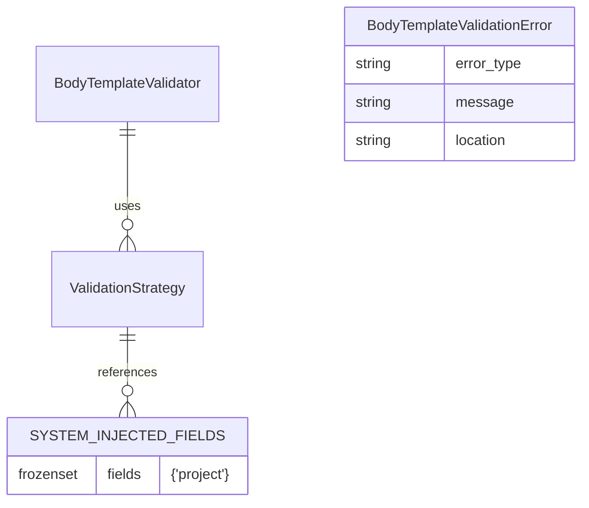

# 設計方針書: Issue #395 - BodyTemplateValidator システム注入フィールド除外機能

作成日: 2024-01-23
作成者: design-policy skill
Issue: [#395](https://github.com/Kewton/MySwiftAgent/issues/395)

---

## 1. 概要

### 1.1 背景

Job Generator V2 において、`BodyTemplateValidator` が全ての `{{job.body.X}}` 参照をタスクの `input_schema` で検証するため、システムが注入する `project` フィールドが検証エラーとなる問題が発生しています。

**エラー例:**
```
Body template validation failed for task 'ユーザー入力の受け取り':
MISSING_REFERENCE: Field 'project' not found in input_schema
```

### 1.2 目的

`BodyTemplateValidator` に「システム注入フィールド」の概念を導入し、これらのフィールドを検証対象から除外する機能を実装します。

### 1.3 参照ドキュメント

- `expertAgent/docs/API_REFERENCE.md` - Expert Agent API 仕様
- Issue #358 設計方針書 - BodyTemplateValidator の初期設計
- Issue #391 設計方針書 - project フィールド注入の経緯
- `CLAUDE.md` - 開発ガイドラインとコード品質原則

---

## 2. システムアーキテクチャ設計

### 2.1 システム構成図

```mermaid
graph TD
    subgraph "BodyTemplateValidator"
        A[validate()] --> B[extract_template_variables()]
        B --> C[TemplateVariableResult]

        C --> D{フィールド分類}
        D -->|job.body.X| E[validate_job_body_reference()]
        D -->|tasks[N]| F[validate_task_reference()]

        E --> G{システム注入?}
        G -->|Yes| H[検証スキップ]
        G -->|No| I[input_schema検証]

        I --> J[field_in_schema()]
        J -->|存在しない| K[MISSING_REFERENCE エラー]
        J -->|存在する| L[検証成功]
    end

    subgraph "Constants"
        M[SYSTEM_INJECTED_FIELDS]
        M --> G
    end
```

### 2.2 レイヤー構成

既存の `validators/` ディレクトリ構成に従い、以下のレイヤー構成を維持：

| レイヤー | 責務 | 対象コンポーネント |
|---------|------|-------------------|
| **Validator層** | body_template検証 | BodyTemplateValidator |
| **Strategy層** | エンジン別検証ロジック | TaskFlowValidationStrategy, GraphAIValidationStrategy |
| **Utility層** | 共通機能 | template_variable_extractor, schema_comparator |
| **Data層** | データ構造定義 | ValidationError, ValidationResult |

---

## 3. 技術選定

### 3.1 技術選定マトリクス

| カテゴリ | 選定技術 | 選定理由 | 既存との整合性 |
|---------|---------|---------|---------------|
| 定数定義 | `frozenset[str]` | 不変性保証、O(1)検索 | ✅ 既存バリデータの慣習に準拠 |
| 除外判定 | ホワイトリスト方式 | 明示的制御、安全性 | ✅ セキュリティ定数パターンと同様 |
| エラー処理 | 既存の ValidationError | 一貫性維持 | ✅ 完全互換 |
| テスト戦略 | パラメトリックテスト | 網羅的検証 | ✅ pytest 標準パターン |

### 3.2 代替案との比較

| 代替案 | メリット | デメリット | 不採用理由 |
|--------|--------|-----------|-----------|
| ブラックリスト方式 | 新フィールド自動許可 | 意図しない検証スキップ | セキュリティリスク |
| 正規表現パターン | 柔軟なマッチング | 複雑性増大、ReDoS リスク | KISS 原則違反 |
| 設定ファイル方式 | 外部設定可能 | 実行時依存、複雑性 | YAGNI 原則違反 |

---

## 4. 設計パターンと詳細設計

### 4.1 採用する設計パターン

#### 4.1.1 定数定義パターン（既存慣習準拠）

```python
# validators/body_template_validator.py のファイルトップに定義

# Issue #395: System-injected fields that should be excluded from validation
# These fields are injected by the system (not user input) and managed separately
SYSTEM_INJECTED_FIELDS: frozenset[str] = frozenset({
    "project",  # Issue #391: Used for secrets resolution, injected in JobMaster.body
})
```

#### 4.1.2 Strategy Pattern の拡張

既存の `ValidationStrategy` を拡張し、システムフィールド判定を組み込む：

```python
class TaskFlowValidationStrategy:
    """Validation strategy for TaskFlow engine."""

    def validate_job_body_reference(
        self,
        reference: str,
        input_schema: dict[str, Any],
    ) -> list[BodyTemplateValidationError]:
        """Validate job.body reference for TaskFlow."""
        errors: list[BodyTemplateValidationError] = []

        # {{job.body}} without field path is always valid
        if reference == "job.body":
            return errors

        # Extract field path from job.body.field
        if reference.startswith("job.body."):
            field_path = reference[9:]  # Remove "job.body."

            # Skip validation for system-injected fields
            if field_path in SYSTEM_INJECTED_FIELDS:
                logger.debug(
                    "Skipping validation for system-injected field: %s",
                    field_path
                )
                return errors

            # Validate user input fields against input_schema
            if not field_in_schema(field_path, input_schema):
                errors.append(
                    BodyTemplateValidationError(
                        error_type="MISSING_REFERENCE",
                        message=f"Field '{field_path}' not found in input_schema",
                        location=reference,
                    )
                )

        return errors
```

### 4.2 データモデル設計

既存のデータ構造を変更せず、定数追加のみ：



---

## 5. API 設計

既存の API インターフェースに変更なし。内部動作のみ修正。

### 5.1 影響を受ける API

なし（内部実装の変更のみ）

### 5.2 互換性

- 前方互換性: ✅ 完全維持
- 後方互換性: ✅ 完全維持

---

## 6. セキュリティ設計

### 6.1 セキュリティ考慮事項

| 項目 | リスク | 対策 |
|------|--------|------|
| 不正フィールドの注入 | 低 | ホワイトリストで明示的制御 |
| 定数の改ざん | なし | `frozenset` で不変性保証 |
| ReDoS 攻撃 | なし | 正規表現を使用しない |

### 6.2 セキュリティ原則の準拠

- **最小権限の原則**: 必要最小限のフィールドのみホワイトリスト化
- **明示的制御**: 暗黙的な除外ではなく、明示的なリスト管理
- **不変性**: `frozenset` による実行時改変の防止

---

## 7. パフォーマンス設計

### 7.1 パフォーマンス特性

| 操作 | 計算量 | 説明 |
|------|--------|------|
| フィールド判定 | O(1) | `frozenset` の in 演算子 |
| メモリ使用量 | O(1) | 定数サイズのセット |
| 全体の影響 | なし | 既存フローに 1 条件分岐追加のみ |

### 7.2 スケーラビリティ

- システムフィールド数が増えても、O(1) の判定時間を維持
- メモリ使用量は定数のフィールド数に比例（実質的に無視できる）

---

## 8. 設計上の決定事項とトレードオフ

### 8.1 採用した設計の理由

| 決定事項 | 理由 | トレードオフ |
|---------|------|-------------|
| ホワイトリスト方式 | 明示的制御、安全性 | 新フィールド追加時に定数更新必要 |
| `frozenset` 使用 | 不変性、O(1) 検索 | 実行時の動的変更不可 |
| TaskFlow のみ修正 | 影響範囲最小化 | GraphAI で同様の問題が発生した場合は追加修正必要 |

### 8.2 想定されるリスクと対策

| リスク | 影響度 | 発生確率 | 対策 |
|--------|-------|---------|------|
| 新システムフィールド追加忘れ | 中 | 低 | コードレビューで確認、ドキュメント化 |
| GraphAI での同様問題 | 低 | 低 | 発生時に GraphAIValidationStrategy も修正 |
| テスト漏れ | 高 | 低 | 単体テストで網羅的にカバー |

---

## 9. 実装計画

### 9.1 実装順序

1. **Phase 1**: 定数定義と基本実装（30分）
   - `SYSTEM_INJECTED_FIELDS` 定数追加
   - `TaskFlowValidationStrategy.validate_job_body_reference()` 修正

2. **Phase 2**: 単体テスト追加（45分）
   - システムフィールドスキップのテスト
   - ユーザーフィールド検証継続のテスト
   - エッジケースのテスト

3. **Phase 3**: 既存テスト修正（30分）
   - `test_registration_validation.py` のフィクスチャ修正
   - 不要な `project` フィールド除去

4. **Phase 4**: 統合テストと検証（30分）
   - E2E でのジョブ生成成功確認
   - CI/CD パイプライン通過確認

### 9.2 ファイル変更詳細

```
expertAgent/aiagent/langgraph/jobGeneratorV2/
├── validators/
│   └── body_template_validator.py          # 修正: 定数追加、ロジック修正
└── tests/
    ├── unit/langgraph/jobGeneratorV2/validators/
    │   └── test_body_template_validator.py # 修正: 新規テスト追加
    └── integration/
        └── test_registration_validation.py  # 修正: フィクスチャ簡素化
```

---

## 10. テスト戦略

### 10.1 単体テストケース

```python
class TestSystemInjectedFields:
    """Issue #395: System-injected field exclusion tests."""

    @pytest.mark.parametrize("field,should_skip", [
        ("project", True),      # システムフィールド
        ("user_input", False),  # ユーザーフィールド
        ("api_key", False),     # ユーザーフィールド
    ])
    def test_field_validation_behavior(self, field, should_skip):
        """各フィールドタイプの検証動作を確認"""

    def test_project_field_skipped_no_error(self):
        """project フィールドが検証エラーを起こさないことを確認"""

    def test_user_fields_still_validated(self):
        """ユーザーフィールドが引き続き検証されることを確認"""

    def test_system_fields_are_immutable(self):
        """SYSTEM_INJECTED_FIELDS が不変であることを確認"""
```

### 10.2 結合テストケース

- ジョブ生成フロー全体での `project` フィールド処理
- TaskMaster 作成時のバリデーション成功
- 実際の API 呼び出しでのエラーなし

---

## 11. 保守性とドキュメント

### 11.1 コード内ドキュメント

```python
# Issue #395: System-injected fields that should be excluded from validation
#
# These fields are automatically injected by the system during JobMaster creation
# and are not part of user input. They should not be validated against the task's
# input_schema as they are managed separately by the system.
#
# When adding new system fields:
# 1. Add the field name to this frozenset
# 2. Document the Issue number and purpose
# 3. Update tests to verify exclusion behavior
#
SYSTEM_INJECTED_FIELDS: frozenset[str] = frozenset({
    "project",  # Issue #391: Used for secrets resolution, injected in JobMaster.body
})
```

### 11.2 将来の拡張性

新しいシステムフィールド追加時の手順：

1. `SYSTEM_INJECTED_FIELDS` に追加
2. Issue 番号とコメントを記載
3. 単体テストに検証ケースを追加
4. 必要に応じて GraphAIValidationStrategy も更新

---

## 12. まとめ

本設計は、最小限の変更で Issue #395 を解決し、以下の利点を提供します：

- **影響範囲の最小化**: 1 ファイル + テストのみの変更
- **既存パターンの活用**: validators ディレクトリの慣習に準拠
- **保守性**: 明示的なホワイトリストで管理
- **パフォーマンス**: O(1) の判定で影響なし
- **セキュリティ**: 不変性と明示的制御

SOLID 原則、KISS 原則に従い、既存の Job Generator V2 アーキテクチャと完全に整合性を保ちながら、問題を根本的に解決します。