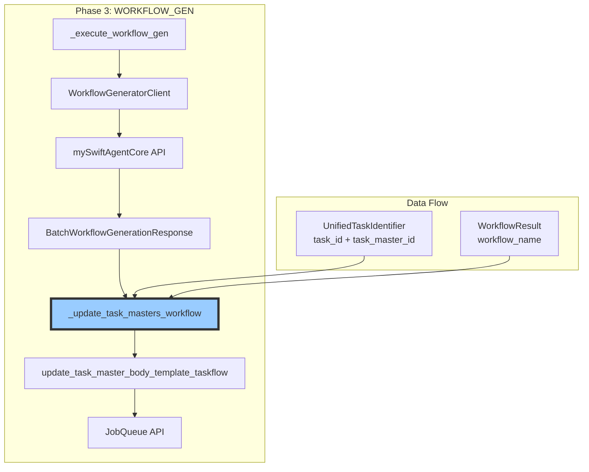
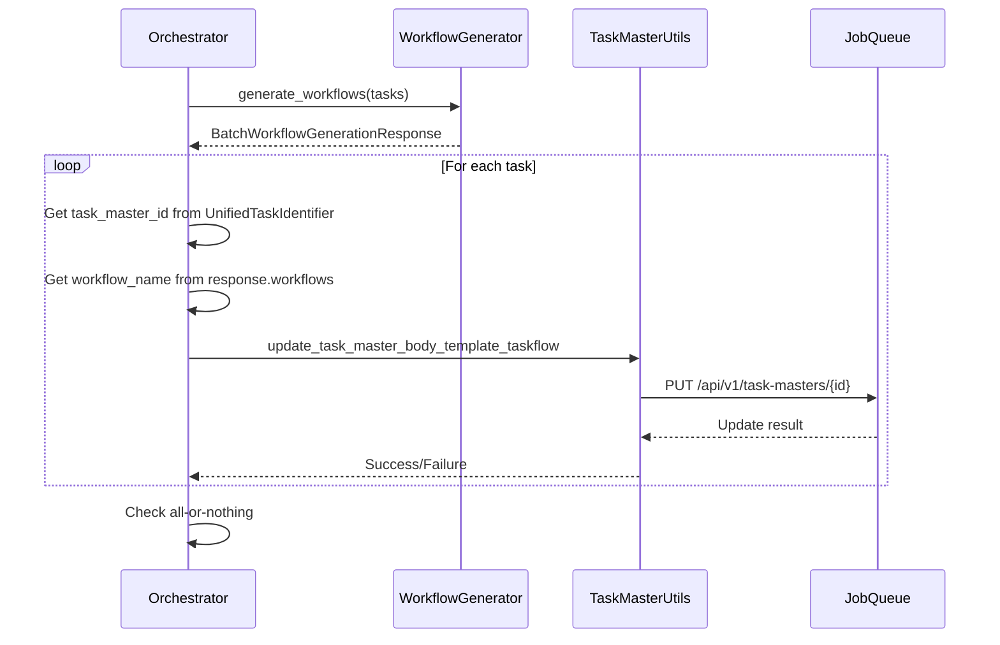

# Issue #396 設計方針書：TaskMaster Workflow更新機能実装

## 概要

Issue #390 で特定されたが未実装のままクローズされた問題#4（TaskMaster workflow更新の欠落）に対する実装設計方針。本設計は、Job Generator V2のPhase 3（WORKFLOW_GEN）完了後にTaskMasterの`body_template.workflow`フィールドを`__PENDING__`から実際のワークフロー名に更新する機能を実装する。

## 現状調査結果

### Issue #396 の内容

- **背景**: Issue #390 問題#4が未実装のままクローズ
- **問題**: mySwiftAgentCoreパスでワークフロー生成成功後、TaskMasterの更新が行われない
- **影響**: ジョブ実行時に `HTTP 404: Workflow '__PENDING__' not found` エラー
- **準備済みリソース**:
  - 単体テスト（skipマーク付き）
  - 結合テスト（skipマーク付き）
  - 更新関数（`update_task_master_body_template_taskflow`）

### 既存アーキテクチャの調査結果

#### orchestrator.py の現状実装

```python
# Phase 3実行フロー（現在）
async def _execute_workflow_gen(...) -> ParallelExecutionResult:
    # 1. TaskRequest構築
    # 2. 能力取得
    # 3. ワークフロー生成
    response = await c.generate_workflows(...)
    # 4. 結果変換
    return self._convert_to_parallel_result(response, task_identifiers)
    # ❌ TaskMaster更新が欠落
```

#### GraphAIパスとの比較

**GraphAIパス（workflow.py）**:
```python
# Phase 3b: 全TaskMasterを更新（Issue #360: all-or-nothing）
for task_master_id in task_master_ids:
    success = await update_task_master_body_template_taskflow(
        task_master_id=task_master_id,
        workflow_name=workflow_name,
    )
    if not success:
        raise WorkflowRegistrationError(...)
```

**mySwiftAgentCoreパス**: 更新処理が存在しない

### BatchWorkflowGenerationResponse 構造

```python
@dataclass
class BatchWorkflowGenerationResponse:
    status: BatchStatus                      # success/partial_success/failed
    workflows: dict[str, WorkflowResult]     # task_id → WorkflowResult
    failed_tasks: list[FailedTask] | None
    recovery_suggestion: RecoverySuggestion | None
```

## アーキテクチャ設計

### システム構成図



### レイヤー構成

| レイヤー | 責務 | 実装ファイル |
|---------|------|------------|
| オーケストレーション層 | Phase制御・TaskMaster更新呼び出し | `orchestrator.py` |
| ユーティリティ層 | 個別TaskMaster更新 | `task_master_utils.py` |
| クライアント層 | API通信 | `jobqueue_client.py` |

## 技術選定

| カテゴリ | 選定技術 | 選定理由 | 既存との整合性 |
|---------|---------|---------|---------------|
| 非同期処理 | asyncio.gather | 並列更新で高速化 | ✅ 既存パターン |
| エラーハンドリング | All-or-Nothing | Issue #360要件 | ✅ GraphAIパスと同様 |
| ロギング | Structured Logging | デバッグ容易性 | ✅ 既存と統一 |
| パッチパス | ローカルインポート | 循環参照回避 | ✅ テスト済み |

## 設計パターン

### 1. All-or-Nothing Pattern（Issue #360）

GraphAIパスの実装を参考に、厳格なall-or-nothing更新を実装：

```python
async def _update_task_masters_workflow(
    self,
    response: BatchWorkflowGenerationResponse,
    task_identifiers: list[UnifiedTaskIdentifier]
) -> None:
    """
    Update ALL TaskMasters or fail completely.
    Issue #360: No partial success allowed.
    """
    updated_count = 0
    errors = []

    for task in task_identifiers:
        if not task.task_master_id:
            continue

        workflow = response.workflows.get(task.task_id)
        if not workflow:
            continue

        try:
            success = await update_task_master_body_template_taskflow(
                task_master_id=task.task_master_id,
                workflow_name=workflow.workflow_name
            )
            if success:
                updated_count += 1
            else:
                errors.append(f"Failed to update {task.task_master_id}")
        except Exception as e:
            errors.append(f"Error updating {task.task_master_id}: {e}")

    # All-or-nothing check
    if errors:
        raise OrchestratorError(
            f"Failed to update all TaskMasters: {errors}",
            phase=Phase.WORKFLOW_GEN
        )
```

### 2. Fail-Fast Pattern

既存のオーケストレータパターンに従い、エラーは即座に上位に伝播：

```python
# orchestrator.py の既存パターン
if not capabilities:
    raise OrchestratorError(
        "Failed to fetch capabilities",
        phase=Phase.WORKFLOW_GEN
    )
```

### 3. Local Import Pattern（循環参照回避）

テストで確認されたパッチパスに従い、メソッド内でのインポート：

```python
async def _update_task_masters_workflow(...):
    # Import locally to avoid circular dependency
    from aiagent.langgraph.jobGeneratorV2.workflows.registration.task_master_utils import (
        update_task_master_body_template_taskflow,
    )
```

## データモデル設計

### データフロー図



### TaskMaster更新データ構造

```python
# 更新前（Phase 2で作成）
body_template = {
    "workflow": "__PENDING__",
    "inputs": "{{job.body}}" or "{{tasks[n-1].output_data}}",
    "project": "{{job.body.project}}",
    "job_params": "{{job.body}}"
}

# 更新後（Phase 3b）
body_template = {
    "workflow": "task_001_google_search",  # 実際のworkflow名
    "inputs": "{{job.body}}",              # 保持
    "project": "{{job.body.project}}",     # 保持
    "job_params": "{{job.body}}"           # 保持
}
```

## API設計

### 新規メソッド仕様

```python
async def _update_task_masters_workflow(
    self,
    response: BatchWorkflowGenerationResponse,
    task_identifiers: list[UnifiedTaskIdentifier]
) -> None:
    """
    Update TaskMasters with generated workflow names.

    Issue #396: Implementation of missing Phase 3b step.
    Issue #360: Strict all-or-nothing update requirement.

    Args:
        response: Batch workflow generation response containing workflow names
        task_identifiers: List of task identifiers with task_master_ids

    Raises:
        OrchestratorError: If any TaskMaster update fails (all-or-nothing)

    Note:
        - Imports update function locally to avoid circular dependency
        - Logs each update attempt for debugging
        - Validates all updates completed successfully
    """
```

### 統合ポイント

```python
# _execute_workflow_gen メソッドの修正
async def _execute_workflow_gen(...) -> ParallelExecutionResult:
    # ... 既存の処理 ...

    # Issue #396: Update TaskMasters before returning
    if response.status != BatchStatus.FAILED:
        await self._update_task_masters_workflow(response, task_identifiers)

    return self._convert_to_parallel_result(response, task_identifiers)
```

## セキュリティ設計

| 項目 | 対策 | 実装 |
|------|------|------|
| 認証 | JobQueue APIトークン | 既存のJobqueueClient使用 |
| 権限チェック | job_generator_v2として実行 | `updated_by`フィールド |
| 監査ログ | 更新理由記録 | `change_reason`フィールド |
| 入力検証 | task_master_id存在確認 | 更新前にチェック |

## パフォーマンス設計

### 並列更新戦略

```python
# 並列実行案（検討中）
update_tasks = []
for task in task_identifiers:
    if task.task_master_id and task.task_id in response.workflows:
        update_tasks.append(
            update_task_master_body_template_taskflow(
                task.task_master_id,
                response.workflows[task.task_id].workflow_name
            )
        )

results = await asyncio.gather(*update_tasks, return_exceptions=True)
```

ただし、Issue #360のall-or-nothing要件により、エラーハンドリングの複雑性とトレードオフ。

### スケーリング考慮

- 通常のジョブ: 1-10タスク（影響小）
- 大規模ジョブ: 50+タスク（並列化の恩恵大）
- タイムアウト: 既存の180秒で十分

## 設計上の決定事項とトレードオフ

### 1. エラーハンドリング戦略

| 選択肢 | 決定 | 理由 |
|--------|------|------|
| 部分的成功許可 | ❌ 不採用 | Issue #360で明確に禁止 |
| All-or-Nothing | ✅ 採用 | GraphAIパスとの一貫性 |
| ロールバック | ❌ 不採用 | 複雑性が高く、Phase再実行で対応可能 |

### 2. 更新方式

| 選択肢 | 決定 | 理由 |
|--------|------|------|
| 順次更新 | ✅ 採用（初期版） | 実装が単純、エラーハンドリング明確 |
| 並列更新 | 🔄 将来検討 | パフォーマンス改善余地あり |
| バッチAPI | ❌ 不採用 | JobQueue APIに存在しない |

### 3. インポート方式

| 選択肢 | 決定 | 理由 |
|--------|------|------|
| トップレベルインポート | ❌ 不採用 | 循環参照のリスク |
| メソッド内インポート | ✅ 採用 | テストで検証済みのパターン |
| 依存性注入 | ❌ 不採用 | 既存アーキテクチャとの不整合 |

### 4. ログレベル

| 選択肢 | 決定 | 理由 |
|--------|------|------|
| 全更新をINFO | ❌ 不採用 | ログ量過多 |
| 成功はDEBUG、失敗はERROR | ✅ 採用 | 適切な可視性 |
| サマリーのみ | ❌ 不採用 | デバッグ情報不足 |

## 制約条件への準拠

### SOLID原則
- **S**: `_update_task_masters_workflow`は単一責任（TaskMaster更新のみ）
- **O**: 既存の`_execute_workflow_gen`を拡張（破壊的変更なし）
- **L**: 適用なし
- **I**: 既存のprotocolを維持
- **D**: 抽象（BatchWorkflowGenerationResponse）に依存

### その他の原則
- **KISS**: 既存関数の再利用、単純な順次処理
- **YAGNI**: 並列化は将来の最適化として保留
- **DRY**: `update_task_master_body_template_taskflow`を再利用

### orchestrator.py の制約
- ✅ NO index-based lookups（task_idベースのマッピング使用）
- ✅ NO silent fallbacks（失敗時はOrchestratorError）
- ✅ 一貫したtask_id使用

## リスクと対策

| リスク | 影響度 | 発生確率 | 対策 |
|--------|--------|----------|------|
| 一部TaskMaster更新失敗 | 高 | 低 | All-or-Nothingで全体失敗、Phase再実行で回復 |
| JobQueue API応答遅延 | 中 | 低 | 既存の180秒タイムアウトで保護 |
| 循環参照 | 高 | 低 | ローカルインポートパターンで回避 |
| 大規模ジョブでの性能劣化 | 低 | 低 | 将来の並列化で対応可能 |

## テスト戦略

### 単体テスト（既存・skipマーク解除）

| テストケース | 検証内容 |
|-------------|---------|
| `test_update_task_masters_success` | 全TaskMaster更新成功 |
| `test_update_task_masters_partial_failure` | 部分失敗→全体失敗 |
| `test_update_task_masters_with_missing_ids` | master_id欠落時の処理 |
| `test_update_task_masters_empty_result` | 空の結果での動作 |

### 結合テスト（既存・skipマーク解除）

| テストケース | 検証内容 |
|-------------|---------|
| `test_orchestrator_calls_update_after_workflow_gen` | Phase 3後の呼び出し |
| `test_pending_workflow_replaced_with_actual_name` | `__PENDING__`の置換 |
| `test_job_execution_no_pending_error` | E2E動作確認 |

### 新規テスト追加

- パフォーマンステスト（50タスクでの実行時間）
- 障害注入テスト（JobQueue API障害時の挙動）

## 実装計画

### Phase 1: 基本実装（2日）
1. `_update_task_masters_workflow`メソッド実装
2. `_execute_workflow_gen`への統合
3. ユニットテストのskipマーク解除と実行

### Phase 2: 統合検証（1日）
1. 結合テストのskipマーク解除と実行
2. ローカルE2Eテスト実行
3. ログ出力の調整

### Phase 3: 最適化検討（将来）
1. 並列更新の実装
2. パフォーマンステスト
3. 大規模ジョブでの検証

## 参照ドキュメント

- Issue #390: Bug: JobGenerationOrchestrator - TaskMaster workflow field not updated
- Issue #396: 本実装Issue
- Issue #360: All-or-nothing TaskMaster update requirement
- `expertAgent/docs/API_REFERENCE.md`: ExpertAgent API仕様
- `docs/arch/service-dependencies.md`: サービス間依存関係
- `/dev-reports/feature/issue/390/design-policy.md`: Issue #390設計方針書

---

**作成日**: 2026-01-23
**作成者**: Claude Code (Design Policy Skill)
**対象Issue**: #396
**関連Issue**: #390（問題#4）