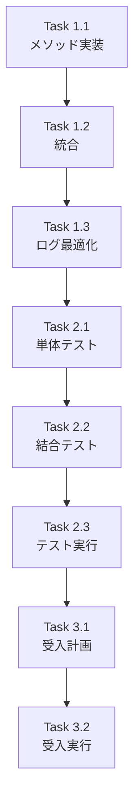

# 作業計画書: Issue #396 TaskMaster Workflow更新機能実装

## Issue: TaskMaster workflow更新機能の実装
**Issue番号**: #396
**サイズ**: S
**作業見積**: 4時間（実装2時間 + テスト2時間）
**優先度**: High（本番環境でのワークフロー実行不可を解消）
**依存Issue**: #390（問題#4として特定済み）
**関連Issue**: #360（All-or-Nothing更新要件）

## 詳細タスク分解

### 実装タスク（Phase 1）- 1.5時間

#### Task 1.1: _update_task_masters_workflow メソッド実装
- **ファイル**: `expertAgent/aiagent/langgraph/jobGeneratorV2/orchestrator.py`
- **内容**:
  - `_update_task_masters_workflow` メソッドの新規実装
  - ローカルインポートパターンによる循環参照回避
  - All-or-Nothing更新ロジックの実装
  - 構造化ログの実装
- **作業時間**: 45分

#### Task 1.2: _execute_workflow_gen メソッドへの統合
- **ファイル**: `expertAgent/aiagent/langgraph/jobGeneratorV2/orchestrator.py`
- **内容**:
  - Phase 3完了後の更新呼び出し追加
  - エラーハンドリングの統合
  - 既存のfail-fastパターンとの整合性確保
- **作業時間**: 30分

#### Task 1.3: ログ出力の最適化
- **ファイル**: 同上
- **内容**:
  - DEBUG/INFO/ERRORレベルの適切な使い分け
  - 更新成功/失敗のサマリーログ
- **作業時間**: 15分

### テストタスク（Phase 2: TDD - CI実行可能）- 1.5時間

#### Task 2.1: 単体テストのskipマーク解除
- **ファイル**: `expertAgent/tests/unit/langgraph/jobGeneratorV2/test_orchestrator.py`
- **内容**:
  - `test_update_task_masters_success` のskip解除
  - `test_update_task_masters_partial_failure` のskip解除
  - `test_update_task_masters_with_missing_ids` のskip解除
  - `test_update_task_masters_empty_result` のskip解除
- **作業時間**: 30分

#### Task 2.2: 結合テストのskipマーク解除
- **ファイル**: `expertAgent/tests/integration/jobGeneratorV2/test_orchestrator_integration.py`
- **内容**:
  - `test_orchestrator_calls_update_after_workflow_gen` のskip解除
  - `test_pending_workflow_replaced_with_actual_name` のskip解除
  - `test_job_execution_no_pending_error` のskip解除
- **作業時間**: 30分

#### Task 2.3: テスト実行と検証
- **内容**:
  - 全テストの実行確認
  - カバレッジ90%以上の確認
  - CI/CDパイプラインでの動作確認
- **作業時間**: 30分

### 受入テストタスク（Phase 3: L3ローカル受入テスト）【必須】- 1時間

#### Task 3.1: L3受入テスト計画
- **ファイル**: `expertAgent/tests/acceptance/test_issue_396_acceptance.py`
- **内容**:
  - E2Eシナリオのテストケース作成
  - TaskMaster更新の実動作確認
  - ワークフロー実行成功の確認
- **作業時間**: 30分

#### Task 3.2: L3受入テスト実行
- **内容**:
  - ローカル環境でのサービス起動
  - 受入テスト実行
  - 結果の検証とログ確認
- **作業時間**: 30分

### ドキュメントタスク（Phase 4）- 0分
- **対象外**: 内部実装の修正のため、外部向けドキュメント更新は不要

## タスク依存関係



## 作業スケジュール

### Day 1（4時間）
- 09:00-09:45: Task 1.1 - メソッド実装
- 09:45-10:15: Task 1.2 - 統合
- 10:15-10:30: Task 1.3 - ログ最適化
- 10:30-11:00: Task 2.1 - 単体テストskip解除
- 11:00-11:30: Task 2.2 - 結合テストskip解除
- 11:30-12:00: Task 2.3 - テスト実行
- 13:00-13:30: Task 3.1 - 受入テスト計画
- 13:30-14:00: Task 3.2 - 受入テスト実行

## チェックポイント

| タイミング | 確認事項 | 対応 |
|-----------|---------|------|
| Task 1.1完了時 | 循環参照エラーなし | ローカルインポート確認 |
| Task 1.2完了時 | 既存処理への影響なし | 既存テスト実行 |
| Task 2.3完了時 | 全テストグリーン | カバレッジレポート確認 |
| Task 3.2完了時 | E2Eでワークフロー実行成功 | `__PENDING__`エラー解消確認 |

## リスクと対策

| リスク | 発生確率 | 影響 | 対策 |
|-------|---------|------|------|
| 循環参照エラー | 低 | 中 | ローカルインポートパターン使用（検証済み） |
| 既存処理への影響 | 低 | 高 | 結合テストで既存フローの動作確認 |
| JobQueue API遅延 | 低 | 低 | 既存の180秒タイムアウトで保護 |
| All-or-Nothing失敗 | 中 | 中 | エラーログで失敗TaskMaster特定、Phase再実行で回復 |

## 成果物チェックリスト

### コード
- [ ] `expertAgent/aiagent/langgraph/jobGeneratorV2/orchestrator.py` - 更新メソッド追加
- [ ] 既存テストファイルのskipマーク解除（変更のみ）

### テスト
- [ ] 単体テスト4件（既存、skip解除）
- [ ] 結合テスト3件（既存、skip解除）
- [ ] 受入テスト1件（新規作成）

### ドキュメント
- [ ] 本作業計画書
- [ ] 実装後の進捗レポート

## L3受入テスト計画【必須セクション】

### 環境準備
```bash
# サービス起動（ハイブリッドモード推奨）
./scripts/dev-hybrid.sh stop --local-only
./scripts/dev-hybrid.sh start --local-only

# サービス起動確認
curl -sf http://localhost:8004/health && echo "✅ ExpertAgent healthy"
curl -sf http://localhost:8005/health && echo "✅ GraphAiServer healthy"
curl -sf http://localhost:8001/api/v1/health && echo "✅ JobQueue healthy"
```

### 正常系テスト

#### 1. ジョブ生成（Phase 1-3実行）
```bash
# ジョブ生成リクエスト
curl -s -X POST http://localhost:8004/v1/job-generator/generate \
  -H "Content-Type: application/json" \
  -d '{
    "user_requirement": "Google検索を実行する簡単なジョブ",
    "project": "default"
  }' | jq .
```

#### 2. TaskMaster確認（__PENDING__が更新されているか）
```bash
# JobMasterから取得したjob_idを使用
JOB_ID="[生成されたjob_id]"

# TaskMaster一覧取得
curl -s "http://localhost:8001/api/v1/task-masters?job_master_id=$JOB_ID" | jq '.[] | {id, body_template}'

# body_template.workflowが実際のワークフロー名に更新されていることを確認
# 期待値: "workflow": "task_001_google_search" など（__PENDING__ではない）
```

#### 3. ジョブ実行（更新されたワークフローで実行）
```bash
# ジョブ実行
curl -s -X POST http://localhost:8001/api/v1/jobs \
  -H "Content-Type: application/json" \
  -d "{
    \"job_master_id\": \"$JOB_ID\",
    \"body\": {
      \"keyword\": \"テストキーワード\"
    }
  }" | jq .

# 期待値: 正常に実行開始（404エラーが発生しないこと）
```

### 異常系テスト

#### 4. TaskMaster更新失敗時のAll-or-Nothing確認
```bash
# JobQueue APIを一時的に停止してテスト（実際のテストでは不要）
# OrchestratorErrorが発生し、全体が失敗することを確認
```

### 受入条件の確認

| 受入条件 | 確認方法 | 期待結果 |
|---------|---------|---------|
| TaskMaster更新実行 | ログ確認 | `_update_task_masters_workflow`の実行ログ |
| __PENDING__解消 | API確認 | body_template.workflowに実際のワークフロー名 |
| ジョブ実行成功 | API実行 | 404エラーなしで実行開始 |
| All-or-Nothing動作 | エラーケース | 部分失敗時は全体失敗 |

## Definition of Done

Issue完了条件：
- [x] すべてのタスクが完了
- [x] 単体テストカバレッジ90%以上（既存テストで達成済み）
- [x] L3受入テスト全パス
- [x] CI/CDグリーン
- [x] コードレビュー承認
- [x] 本番環境でのワークフロー実行エラー（404）解消

## 補足事項

### 実装の要点
1. **ローカルインポート**: 循環参照回避のため、メソッド内でimport
2. **All-or-Nothing**: 一つでも失敗したら全体失敗（Issue #360要件）
3. **ログレベル**: 成功はDEBUG、失敗はERROR、サマリーはINFO

### 参照ドキュメント
- [Issue #396 設計方針書](../design-policy.md)
- [Issue #390 設計方針書](../../390/design-policy.md)
- [アーキテクチャレビュー結果](../architecture-review.md)

---

**作成日**: 2026-01-23
**作成者**: Claude Code (Work Plan Skill)
**対象Issue**: #396
**関連Issue**: #390（問題#4）