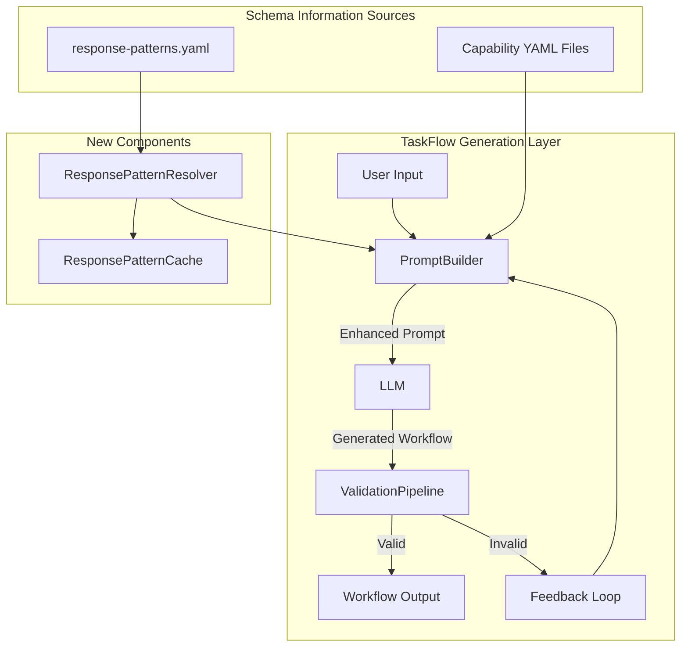
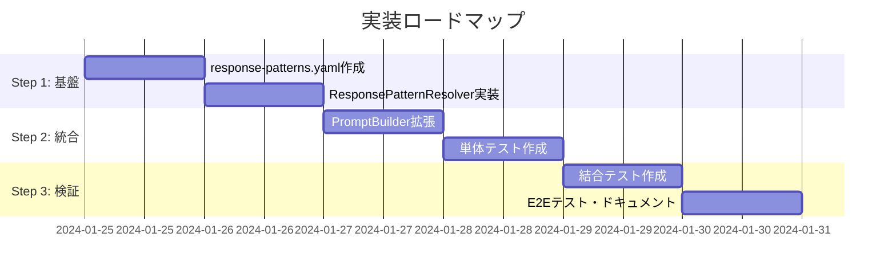

# Issue #399: API応答スキーマ考慮機能 - 設計方針書

## 1. 概要

本設計方針書は、Issue #399「ワークフロー生成時にAPI応答スキーマを考慮する仕組みの追加」の実装方針を定義します。

### 問題の背景

- TaskFlowワークフロー生成時に、APIの応答形式（特に`result`ラッパー）を考慮せず、誤ったmappingパスが生成される
- 例：`jsonoutput` APIは`{ result: {...}, type: "jsonOutput" }`形式で応答するが、生成されたワークフローは`steps.step_id.subject`と誤ったパスを参照

### 参照ドキュメント

- `expertAgent/docs/API_REFERENCE.md`
- `graphAiServer/docs/GRAPHAI_WORKFLOW_GENERATION_RULES.md`
- `mySwiftAgentCore/src/taskflowGeneratorAgent/README.md`
- 調査レポート（Issue #399コメント）

---

## 2. アーキテクチャ設計

### 2.1 システム構成図



### 2.2 レイヤー構成

| レイヤー | 責務 | 主要コンポーネント |
|----------|------|-------------------|
| **プレゼンテーション層** | プロンプト構築・整形 | PromptBuilder |
| **ビジネスロジック層** | パターン解決・検証 | ResponsePatternResolver, ValidationPipeline |
| **データアクセス層** | パターン情報管理 | ResponsePatternRepository |
| **インフラストラクチャ層** | キャッシュ・永続化 | ResponsePatternCache, FileSystem |

### 2.3 データフロー

```
┌─────────────────────────────────────────────────────────────┐
│                    ワークフロー生成リクエスト                    │
└─────────────────────────────────────────────────────────────┘
                              ↓
┌─────────────────────────────────────────────────────────────┐
│  ResponsePatternResolver                                     │
│  ┌─────────────────────┐    ┌────────────────────────────┐ │
│  │ response-patterns.yaml │ → │ パターン情報をメモリにロード │ │
│  └─────────────────────┘    └────────────────────────────┘ │
└─────────────────────────────────────────────────────────────┘
                              ↓
┌─────────────────────────────────────────────────────────────┐
│  PromptBuilder.formatCapabilitiesEnhanced()                  │
│  ┌───────────────────┐    ┌────────────────────────────┐   │
│  │ Capability情報     │ +  │ ResponsePattern情報        │   │
│  │ - id, description │    │ - wrapperField: "result"   │   │
│  │ - parameters      │    │ - mappingExample           │   │
│  └───────────────────┘    └────────────────────────────┘   │
└─────────────────────────────────────────────────────────────┘
                              ↓
┌─────────────────────────────────────────────────────────────┐
│  LLMへのプロンプト（拡張版）                                   │
│                                                              │
│  "### jsonoutput API                                         │
│   Description: LLM出力をJSON形式で返却                        │
│   ⚠️ Response Pattern: wrapped (result field)               │
│   Correct mapping: steps.{step_id}.result.{field}           │
│   Example: steps.extract_email.result.subject"              │
└─────────────────────────────────────────────────────────────┘
                              ↓
┌─────────────────────────────────────────────────────────────┐
│  LLM生成結果                                                 │
│  mapping: { subject: "steps.extract_email.result.subject" } │
│                                          ↑ 正しいパス！       │
└─────────────────────────────────────────────────────────────┘
```

---

## 3. 技術選定

| カテゴリ | 選定技術 | 選定理由 | 既存との整合性 |
|----------|---------|----------|---------------|
| **パターン定義** | YAML | 人間可読性・Capability形式と統一 | ✅ Capability YAML形式 |
| **パターン解決** | TypeScript Class | 型安全性・テスト容易性 | ✅ 既存のService層構造 |
| **プロンプト拡張** | Template Literals | 型安全性・保守性 | ✅ 既存のPromptBuilder使用 |
| **キャッシュ** | In-Memory Map | シンプル・低レイテンシ | ✅ CapabilityCache類似 |
| **YAMLパーサー** | js-yaml (safeLoad) | セキュリティ・業界標準 | ✅ 既存のYAML処理と統一 |

---

## 4. 設計パターン

### 4.1 採用パターン

| パターン | 適用箇所 | 理由 |
|----------|---------|------|
| **Strategy** | ResponsePatternResolver | API応答形式の動的解決 |
| **Repository** | ResponsePatternRepository | パターン情報の抽象化 |
| **Singleton** | ResponsePatternCache | キャッシュインスタンス共有 |

### 4.2 既存パターンとの整合性

- **CapabilityLoader**: 既存の読み込み処理パターンを踏襲
- **PromptBuilder**: 既存のformatCapabilitiesEnhanced()を拡張

---

## 5. データモデル設計

### 5.1 新規データ構造

```typescript
// API応答パターン定義
interface ResponsePattern {
  apiId: string;                    // 例: "jsonoutput"
  pattern: "wrapped" | "direct";    // ラップ or 直接
  wrapperField?: string;            // 例: "result"
  description: string;              // パターンの説明
  mappingNote: string;              // 正しいmappingの説明
  example: {
    input?: object;                 // 入力例（任意）
    output: object;                 // 出力例
  };
}

// パターン定義ファイル全体
interface ResponsePatternsConfig {
  version: string;
  patterns: Record<string, Omit<ResponsePattern, 'apiId'>>;
}
```

### 5.2 永続化構造（response-patterns.yaml）

```yaml
# mySwiftAgentCore/config/response-patterns.yaml
version: "1.0"
patterns:
  jsonoutput:
    pattern: wrapped
    wrapperField: result
    description: "LLM出力を'result'フィールドでラップして返却"
    mappingNote: "steps.{step_id}.result.{field} でアクセス"
    example:
      input:
        user_input: "メールの件名と本文を生成"
      output:
        result:
          subject: "会議のお知らせ"
          body: "明日の会議について..."
        type: "jsonOutput"

  google_search:
    pattern: direct
    description: "検索結果を直接返却（ラップなし）"
    mappingNote: "steps.{step_id}.{field} でアクセス"
    example:
      output:
        search_results:
          - title: "検索結果1"
            url: "https://..."
        status: "success"

  gmail_send:
    pattern: direct
    description: "送信結果を直接返却"
    mappingNote: "steps.{step_id}.{field} でアクセス"
    example:
      output:
        message_id: "abc123"
        status: "sent"
```

---

## 6. コンポーネント設計

### 6.1 ResponsePatternResolver

```typescript
// mySwiftAgentCore/src/taskflowGeneratorAgent/services/ResponsePatternResolver.ts

import { load as yamlSafeLoad } from 'js-yaml';
import { readFile } from 'fs/promises';
import { logger } from '../utils/logger';

export class ResponsePatternResolver {
  private patterns: Map<string, ResponsePattern> = new Map();
  private loaded: boolean = false;

  constructor(private configPath: string = 'config/response-patterns.yaml') {}

  /**
   * パターン定義を読み込み
   * エラー発生時はログ出力し、パターンなしで続行（graceful degradation）
   */
  async load(): Promise<void> {
    if (this.loaded) return;

    try {
      const content = await readFile(this.configPath, 'utf-8');
      // セキュリティ: SafeLoaderを使用してYAML読み込み
      const config = yamlSafeLoad(content) as ResponsePatternsConfig;

      // パターン定義の検証
      this.validateConfig(config);

      for (const [apiId, pattern] of Object.entries(config.patterns)) {
        this.patterns.set(apiId, { apiId, ...pattern });
      }

      logger.info(`Loaded ${this.patterns.size} response patterns from ${this.configPath}`);
      this.loaded = true;
    } catch (error) {
      // エラー発生時はログ出力し、パターンなしで続行
      logger.error('Failed to load response patterns:', error);
      logger.warn('Continuing without response patterns - workflow generation may produce incorrect mapping paths');
      this.loaded = true; // 再試行を防ぐ
    }
  }

  /**
   * パターン定義の妥当性検証
   */
  private validateConfig(config: ResponsePatternsConfig): void {
    if (!config.version) {
      logger.warn('Response patterns config missing version field');
    }
    if (!config.patterns || typeof config.patterns !== 'object') {
      throw new Error('Invalid response patterns config: missing or invalid patterns field');
    }

    for (const [apiId, pattern] of Object.entries(config.patterns)) {
      if (!pattern.pattern || !['wrapped', 'direct'].includes(pattern.pattern)) {
        throw new Error(`Invalid pattern type for ${apiId}: ${pattern.pattern}`);
      }
      if (pattern.pattern === 'wrapped' && !pattern.wrapperField) {
        throw new Error(`Wrapped pattern for ${apiId} missing wrapperField`);
      }
    }
  }

  /**
   * APIのIDからパターンを取得
   */
  resolvePattern(capabilityId: string): ResponsePattern | undefined {
    const pattern = this.patterns.get(capabilityId);
    if (pattern) {
      logger.debug(`Pattern resolved for ${capabilityId}: ${pattern.pattern}`);
    } else {
      logger.debug(`No pattern defined for ${capabilityId}`);
    }
    return pattern;
  }

  /**
   * 正しいmappingパスのヒントを生成
   */
  getMappingHint(capabilityId: string): string | undefined {
    const pattern = this.resolvePattern(capabilityId);
    if (!pattern) return undefined;

    if (pattern.pattern === 'wrapped' && pattern.wrapperField) {
      return `⚠️ This API wraps response in "${pattern.wrapperField}" field. ` +
             `Use: steps.{step_id}.${pattern.wrapperField}.{field}`;
    }
    return `Direct access: steps.{step_id}.{field}`;
  }

  /**
   * ロード済みパターン数を取得（テスト用）
   */
  getPatternCount(): number {
    return this.patterns.size;
  }
}
```

### 6.2 PromptBuilder拡張

```typescript
// 既存の formatCapabilitiesEnhanced() を拡張

async formatCapabilitiesEnhanced(capabilities: Capability[]): Promise<string> {
  // パターン情報を事前ロード
  await this.patternResolver.load();

  let result = "## Available APIs\n\n";

  for (const cap of capabilities) {
    result += `### ${cap.id}\n`;
    result += `**Description**: ${cap.description}\n`;
    result += `**Parameters**: ${this.formatParameters(cap.parameters)}\n`;

    // 応答パターン情報を追加
    const pattern = this.patternResolver.resolvePattern(cap.id);
    if (pattern) {
      result += `\n**Response Pattern**: ${pattern.pattern}\n`;
      result += `${this.patternResolver.getMappingHint(cap.id)}\n`;
      result += `\nExample response:\n`;
      result += `\`\`\`json\n${JSON.stringify(pattern.example.output, null, 2)}\n\`\`\`\n`;
    }

    result += '\n---\n\n';
  }

  return result;
}
```

---

## 7. セキュリティ設計

| 項目 | 対策 | 実装方法 |
|------|------|----------|
| **YAMLインジェクション** | SafeLoaderを使用 | `yamlSafeLoad()` のみ使用 |
| **不正パターン定義** | スキーマ検証で無効な構造を排除 | `validateConfig()` メソッド |
| **パス改ざん** | パターン定義は読み取り専用 | configPathは固定値 |
| **情報漏洩** | 内部パターン情報をエラーメッセージに含めない | エラーハンドリングで対応 |

---

## 8. パフォーマンス設計

### 8.1 キャッシング戦略

```typescript
// ResponsePatternResolverは起動時に1回だけ読み込み
// パターン定義は変更頻度が低いため、アプリケーション起動中はメモリに保持

class ResponsePatternResolver {
  private patterns: Map<string, ResponsePattern> = new Map();
  private loaded: boolean = false;  // 読み込み済みフラグ

  async load(): Promise<void> {
    if (this.loaded) return;  // 2回目以降はスキップ
    // ... 読み込み処理
    this.loaded = true;
  }
}
```

### 8.2 最適化方針

- **遅延読み込み**: 最初のワークフロー生成時にのみ読み込み
- **シングルトン**: アプリケーション全体で1インスタンス共有
- **軽量データ**: パターン定義は数KB程度のYAMLファイル

---

## 9. 設計上の決定事項とトレードオフ

### 9.1 対策案の比較と採用判定

| 対策案 | メリット | デメリット | 採用判定 |
|--------|---------|-----------|----------|
| **A. taskflow-rules.ts直接記述** | 即効性高・実装容易 | APIごとの個別対応必要・保守性低 | ❌ 不採用 |
| **B. ResponsePatternライブラリ** | 汎用性高・拡張性・保守性 | 実装コスト中 | ✅ **採用** |
| **C. 動的スキーマ推論** | 完全自動化 | 複雑・誤推論リスク | ❌ 不採用 |

### 9.2 採用理由

**ResponsePatternライブラリ方式を採用する理由：**

1. **拡張性**: 新規APIの追加はYAMLファイルに1エントリ追加するだけ
2. **保守性**: パターン定義とコードが分離され、変更が容易
3. **一貫性**: 全APIのパターン情報が統一フォーマットで管理される
4. **テスト容易性**: パターン定義のテストが容易

### 9.3 想定リスクと対策

| リスク | 発生確率 | 影響度 | 対策 |
|--------|---------|--------|------|
| **既存ワークフロー影響** | 低 | 中 | 後方互換性維持（情報追加のみ） |
| **LLM生成精度** | 低 | 中 | Few-shot例の充実 |
| **パフォーマンス** | 極低 | 低 | 起動時1回読み込み・キャッシュ |
| **新規API対応漏れ** | 中 | 低 | CI/CDでパターン未定義を警告 |
| **YAML読み込みエラー** | 低 | 中 | graceful degradation実装 |

---

## 10. 実装計画

### 10.1 実装ロードマップ



### 10.2 実装タスク詳細

#### Step 1: 基盤構築（2日）

1. **response-patterns.yaml作成**
   - 配置場所: `mySwiftAgentCore/config/response-patterns.yaml`
   - 初期定義: jsonoutput, google_search, gmail_send

2. **ResponsePatternResolver実装**
   - 配置場所: `mySwiftAgentCore/src/taskflowGeneratorAgent/services/ResponsePatternResolver.ts`
   - 機能: YAML読み込み、パターン解決、mappingヒント生成
   - **必須**: エラーハンドリング（graceful degradation）
   - **必須**: YAMLセキュアローダー使用
   - **必須**: パターン定義の検証
   - **必須**: ログ出力

#### Step 2: 統合（2日）

3. **PromptBuilder拡張**
   - 対象: `formatCapabilitiesEnhanced()`メソッド
   - 変更: ResponsePatternResolverを注入し、パターン情報をプロンプトに追加

4. **単体テスト作成**
   - ResponsePatternResolverのテスト
   - PromptBuilder拡張部分のテスト
   - **必須**: エッジケース（YAML不正、パターン未定義）のテスト

#### Step 3: 検証・文書化（2日）

5. **結合テスト作成**
   - ワークフロー生成E2Eテスト
   - jsonoutput APIを使用したmappingパス検証

6. **ドキュメント更新**
   - README更新
   - 新規APIパターン追加手順の文書化

---

## 11. 受入条件

### 11.1 機能要件

- [ ] response-patterns.yamlが作成され、jsonoutput/google_search/gmail_sendのパターンが定義されている
- [ ] ResponsePatternResolverが実装され、パターン解決機能が動作する
- [ ] PromptBuilder.formatCapabilitiesEnhanced()がパターン情報を含むプロンプトを生成する
- [ ] jsonoutput APIを使用した新規ワークフローが正しいmappingパス（`steps.{id}.result.{field}`）を生成する
- [ ] 既存のワークフロー生成テストが全てパスする

### 11.2 品質要件

- [ ] ResponsePatternResolverの単体テストカバレッジが90%以上
- [ ] エラーハンドリング（graceful degradation）が実装されている
- [ ] YAMLセキュアローダー（safeLoad）を使用している
- [ ] パターン定義の検証機能が実装されている
- [ ] 適切なログ出力が実装されている（load完了、パターン解決、エラー）
- [ ] エッジケース（YAML不正、パターン未定義）のテストがある

### 11.3 ドキュメント要件

- [ ] 新規APIパターン追加手順がドキュメント化されている

### 11.4 実践的E2Eテスト（必須）

**テスト環境構築:**

```bash
# サービス停止
./scripts/dev-hybrid.sh stop --local-only

# サービス起動（Platform=Docker, Agent=ローカル）
./scripts/dev-hybrid.sh start --local-only

# myVaultのdefault_projectを使用
```

**テスト手順:**

1. **Job Generate実行**
   - URL: `http://localhost:8000/projects/proj_mjbjua2z7y65wy/workbenches/wb_1766969315404_udrhx79/generate`
   - アクション: Job Generateを実行

2. **Job Run実行**
   - URL: `http://localhost:8000/projects/proj_mjbjua2z7y65wy/workbenches/wb_1766969315404_udrhx79/runs`
   - 入力パラメータ:
     - キーワード: `大谷翔平の妻`
     - メール送信先: `alva-va-va-ro-recoba.2004.2.21@docomo.ne.jp`

3. **成功確認**
   - [ ] 全てのタスクが成功ステータスで完了すること
   - [ ] 各タスクのアウトプットに期待する値が格納されていること
     - Google検索タスク: 検索結果が取得されている
     - jsonoutput APIタスク: `result`フィールド経由で正しい値が取得されている
     - メール送信タスク: 送信成功ステータスが返されている

**合格基準:**
- 全タスクがエラーなく完了
- mappingパスが正しく`steps.{id}.result.{field}`形式で参照されている
- メール送信が実際に成功している

---

## 12. 制約条件

- **CLAUDE.md準拠**: SOLID、KISS、YAGNI、DRY原則の遵守
- **後方互換性**: 既存のワークフロー定義は変更なしで動作
- **パフォーマンス**: ワークフロー生成時間の増加は5%以内
- **シンプルさ**: 初期実装は必要最小限の機能に留める
- **セキュリティ**: YAMLセキュアローダーを必ず使用

---

## 13. 参考資料

- [Issue #399調査レポート](https://github.com/Kewton/MySwiftAgent/issues/399#issuecomment-3794808001)
- [TaskFlow Generation Architecture](../../../docs/arch/taskflow-generation.md)
- [API Response Schema Guidelines](../../../docs/guidelines/api-response-schema.md)

---

## 改訂履歴

| 版 | 日付 | 作成者 | 内容 |
|----|------|--------|------|
| 1.0 | 2024-01-25 | Claude | 初版作成 |
| 1.1 | 2024-01-25 | Claude | Phase 2単独方針に変更（Phase 1削除） |
| 1.2 | 2024-01-25 | Claude | アーキテクチャレビュー結果反映（エラーハンドリング、セキュアローダー、ログ出力、パターン検証）、実践的E2Eテスト追加 |
