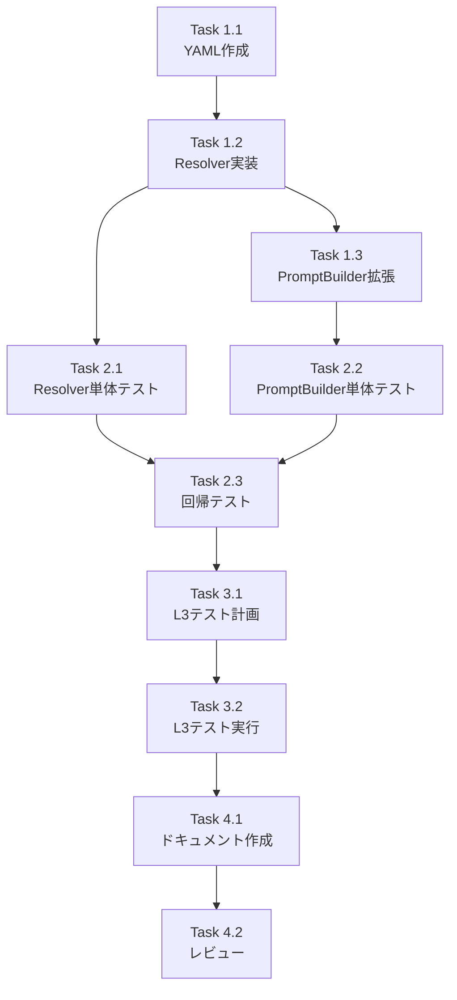

# 作業計画書

## Issue: ワークフロー生成時にAPI応答スキーマを考慮する仕組みの追加
**Issue番号**: #399
**サイズ**: M (Medium)
**作業見積**: 16時間（2人日）
**優先度**: Medium
**依存Issue**: なし

---

## 1. 詳細タスク分解

### Phase 1: 実装タスク（基盤構築）

#### Task 1.1: response-patterns.yaml作成
**作業時間**: 1時間
**内容**:
- `mySwiftAgentCore/config/response-patterns.yaml`の作成
- json_output_agent, google_search, gmail_sendのパターン定義
- スキーマ定義とサンプルデータの記述

**成果物**:
```yaml
# mySwiftAgentCore/config/response-patterns.yaml
version: "1.0"
patterns:
  json_output_agent:  # ID整合性: Capabilityと一致
    pattern: wrapped
    wrapperField: result
    description: "LLM出力を'result'フィールドでラップして返却"
    mappingNote: "steps.{step_id}.result.{field} でアクセス"
    example:
      output:
        result: { subject: "...", body: "..." }
        type: "jsonOutput"
```

#### Task 1.2: ResponsePatternResolver実装
**作業時間**: 3時間
**内容**:
- TypeScriptクラスの実装
- YAML読み込み（js-yaml safeLoad使用）
- パターン解決・検証ロジック
- graceful degradationの実装
- ログ出力の実装

**成果物**:
- `mySwiftAgentCore/src/taskflowGeneratorAgent/services/ResponsePatternResolver.ts`
- 必須メソッド: `load()`, `resolvePattern()`, `getMappingHint()`, `validateConfig()`

#### Task 1.3: PromptBuilder拡張
**作業時間**: 2時間
**内容**:
- `formatCapabilitiesEnhanced()`の拡張
- ResponsePatternResolverの注入
- パターン情報をプロンプトに追加
- ⚠️警告メッセージの生成

**成果物**:
- `mySwiftAgentCore/src/taskflowGeneratorAgent/prompts/PromptBuilder.ts`の変更

---

### Phase 2: テストタスク（TDD - CI実行可能）

#### Task 2.1: ResponsePatternResolver単体テスト
**作業時間**: 3時間
**内容**:
- 正常系: YAML読み込み、パターン解決、ヒント生成
- 異常系: 不正YAML、graceful degradation、バリデーションエラー
- キャッシング動作テスト
- セキュリティテスト（YAMLインジェクション）

**成果物**:
- `mySwiftAgentCore/tests/unit/taskflowGeneratorAgent/services/ResponsePatternResolver.test.ts`
- カバレッジ: 90%以上

**主要テストケース**:
```typescript
// TC-002: json_output_agentパターン定義検証
// TC-003: resolvePattern()テスト
// TC-003a: キャッシング動作テスト
// TC-004: getMappingHint()テスト
// TC-005: graceful degradationテスト
// TC-005a: validateConfig()エラーテスト
// TC-006: YAMLセキュアローダーテスト
```

#### Task 2.2: PromptBuilder拡張テスト
**作業時間**: 2時間
**内容**:
- パターン情報がプロンプトに含まれることを検証
- wrappedパターンの警告メッセージ検証
- ResponsePatternResolver注入テスト

**成果物**:
- `mySwiftAgentCore/tests/unit/taskflowGeneratorAgent/prompts/PromptBuilder.test.ts`（追加）

#### Task 2.3: 回帰テスト実行
**作業時間**: 1時間
**内容**:
- 既存のPromptBuilderテスト全実行
- taskflowGeneratorAgent結合テスト実行
- 破壊的変更の確認

**成果物**:
- 全既存テストがグリーン

---

### Phase 3: 受入テストタスク（L3ローカル受入テスト）【必須】

#### Task 3.1: L3受入テスト計画
**作業時間**: 1時間
**内容**:
- 受入テスト計画書のレビューと更新
- テスト環境準備手順の確認
- テストデータの準備

**成果物**:
- `dev-reports/feature/issue/399/acceptance-plan.md`（更新）

#### Task 3.2: L3受入テスト実行
**作業時間**: 2時間
**内容**:
- 静的検証（TC-001, TC-006, TC-010, TC-011）
- E2Eワークフロー生成テスト（TC-008）
- 実践的E2Eテスト（E2E-3）

**成果物**:
- `mySwiftAgentCore/tests/acceptance/test_issue_399_acceptance.ts`
- テスト実行結果レポート

**重要**: 具体的なcurlコマンドによる検証：
```bash
# サービス起動
./scripts/dev-hybrid.sh start --local-only

# ヘルスチェック
curl -sf http://localhost:8006/health && echo "✅ mySwiftAgentCore healthy"
curl -sf http://localhost:8004/health && echo "✅ expertAgent healthy"

# ワークフロー生成テスト（json_output_agent使用）
curl -s -X POST http://localhost:8006/api/v1/taskflow/generate \
  -H "Content-Type: application/json" \
  -d '{
    "task_id": "test_json_output",
    "name": "JSON Output Test",
    "description": "Test JSON output with result wrapper using json_output_agent",
    "interface": {
      "input": { "text": "string" },
      "output": { "subject": "string", "body": "string" }
    }
  }' | jq '.steps[] | select(.config.capability_id == "json_output_agent") | .output_mapping'

# 期待結果: mapping内のパスが "steps.{id}.result.{field}" 形式
```

---

### Phase 4: ドキュメントタスク

#### Task 4.1: APIパターン追加手順ドキュメント作成
**作業時間**: 1時間
**内容**:
- 新規APIパターン追加手順の文書化
- response-patterns.yamlの編集ガイド
- wrapped/directパターンの説明

**成果物**:
- `mySwiftAgentCore/README.md`への追記
- または`mySwiftAgentCore/docs/response-patterns.md`の新規作成

#### Task 4.2: 実装レビューとクリーンアップ
**作業時間**: 1時間
**内容**:
- コードレビュー
- TODO/FIXMEの除去
- デッドコード検証（TC-010）

---

## 2. タスク依存関係



---

## 3. 作業スケジュール

### Day 1（8時間）
- **午前（4時間）**:
  - Task 1.1: response-patterns.yaml作成（1時間）
  - Task 1.2: ResponsePatternResolver実装（3時間）
- **午後（4時間）**:
  - Task 1.3: PromptBuilder拡張（2時間）
  - Task 2.1: ResponsePatternResolver単体テスト開始（2時間）

### Day 2（8時間）
- **午前（4時間）**:
  - Task 2.1: ResponsePatternResolver単体テスト完了（1時間）
  - Task 2.2: PromptBuilder拡張テスト（2時間）
  - Task 2.3: 回帰テスト実行（1時間）
- **午後（4時間）**:
  - Task 3.1: L3受入テスト計画（1時間）
  - Task 3.2: L3受入テスト実行（2時間）
  - Task 4.1: ドキュメント作成（1時間）

### 予備時間
- Task 4.2: 実装レビューとクリーンアップ（1時間）

---

## 4. チェックポイント

| タイミング | 確認事項 | 対応 |
|-----------|---------|------|
| Task 1.2完了時 | ResponsePatternResolverのコンパイル成功 | 単体テスト実施 |
| Task 2.3完了時 | 全単体テスト・回帰テストがグリーン | 受入テスト準備 |
| Task 3.2完了時 | L3受入テスト全パス | ドキュメント作成 |
| Phase完了時 | カバレッジ90%達成、デッドコードなし | PRレビュー準備 |

---

## 5. リスクと対策

| リスク | 発生確率 | 影響 | 対策 |
|-------|---------|------|------|
| **既存テストの破損** | 低 | 高 | PromptBuilder変更は最小限に留め、追加のみ行う |
| **LLM生成精度の低下** | 中 | 中 | プロンプト変更前後で比較テスト実施 |
| **ID整合性の問題** | 中 | 低 | json_output_agentで統一、設計方針書の誤記は修正 |
| **E2Eテストの不安定** | 中 | 低 | リトライ機構実装、決定的なテストデータ使用 |
| **YAMLパースエラー** | 低 | 中 | graceful degradationで対応 |

---

## 6. 成果物チェックリスト

### コード
- [x] `mySwiftAgentCore/config/response-patterns.yaml`
- [x] `mySwiftAgentCore/src/taskflowGeneratorAgent/services/ResponsePatternResolver.ts`
- [x] `mySwiftAgentCore/src/taskflowGeneratorAgent/prompts/PromptBuilder.ts`（変更）

### テスト
- [x] `mySwiftAgentCore/tests/unit/taskflowGeneratorAgent/services/ResponsePatternResolver.test.ts`
- [x] `mySwiftAgentCore/tests/unit/taskflowGeneratorAgent/prompts/PromptBuilder.test.ts`（追加）
- [x] `mySwiftAgentCore/tests/acceptance/test_issue_399_acceptance.ts`

### ドキュメント
- [x] `mySwiftAgentCore/README.md`または`docs/response-patterns.md`
- [x] `dev-reports/feature/issue/399/work-plan.md`（本書）
- [x] `dev-reports/feature/issue/399/acceptance-plan.md`（更新済み）
- [x] `dev-reports/feature/issue/399/design-policy.md`（参照）

---

## 7. L3受入テスト計画【必須セクション】

### テスト環境準備
```bash
# 1. 既存サービス停止
./scripts/dev-hybrid.sh stop --local-only

# 2. サービス起動（Platform=Docker, Agent=ローカル）
./scripts/dev-hybrid.sh start --local-only

# 3. ヘルスチェック確認
curl -sf http://localhost:8006/health && echo "✅ mySwiftAgentCore healthy"
curl -sf http://localhost:8004/health && echo "✅ expertAgent healthy"
curl -sf http://localhost:8003/health && echo "✅ myVault healthy"
curl -sf http://localhost:8005/health && echo "✅ graphAiServer healthy"
```

### 正常系テスト
```bash
# TC-008: json_output_agent使用のワークフロー生成
curl -s -X POST http://localhost:8006/api/v1/taskflow/generate \
  -H "Content-Type: application/json" \
  -d '{
    "task_id": "test_json_output_399",
    "name": "JSON Output Test for Issue 399",
    "description": "Generate email subject and body using json_output_agent API",
    "interface": {
      "input": { "prompt": "string" },
      "output": { "subject": "string", "body": "string" }
    }
  }' > workflow_399.json

# 生成されたmappingパスの検証
jq '.steps[] | select(.config.capability_id == "json_output_agent") | .output_mapping' workflow_399.json

# 期待結果:
# {
#   "subject": "steps.{step_id}.result.subject",
#   "body": "steps.{step_id}.result.body"
# }
```

### 異常系テスト
```bash
# response-patterns.yamlが存在しない場合のテスト
mv mySwiftAgentCore/config/response-patterns.yaml mySwiftAgentCore/config/response-patterns.yaml.bak
curl -s -X POST http://localhost:8006/api/v1/taskflow/generate ... # 同じリクエスト
# 期待: エラーなく動作（graceful degradation）

# 復元
mv mySwiftAgentCore/config/response-patterns.yaml.bak mySwiftAgentCore/config/response-patterns.yaml
```

### E2E実践テスト（E2E-3）
```bash
# 設計方針書記載の実践的テスト
# 1. myAgentDesk経由でJob Generate
# 2. Job Run実行（キーワード: 大谷翔平の妻）
# 3. メール送信確認
```

---

## 8. Definition of Done

Issue完了条件：
- ✅ すべての実装タスクが完了
- ✅ 単体テストカバレッジ90%以上（ResponsePatternResolver）
- ✅ L3受入テスト全パス（TC-001〜TC-011）
- ✅ CI/CDグリーン（既存テスト全パス）
- ✅ コードレビュー承認
- ✅ ドキュメント更新完了
- ✅ デッドコードなし（TC-010検証済み）
- ✅ 実践的E2Eテスト成功（メール送信確認）

---

## 改訂履歴

| 版 | 日付 | 作成者 | 内容 |
|----|------|--------|------|
| 1.0 | 2026-01-25 | work-plan-agent | 初版作成 |